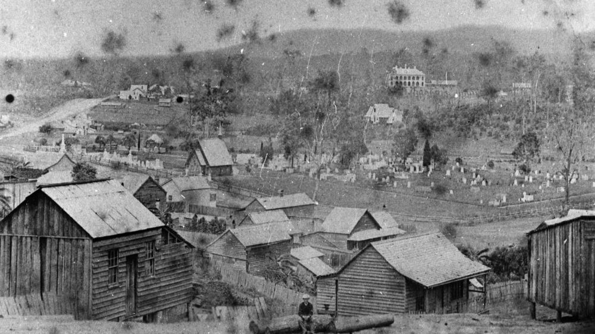

# Paddington Cemetery 

The North Brisbane Burial Grounds were also known as 'Paddington Cemetery' or 'Milton Cemetery'. The burial grounds opened in 1844 and closed in 1875. The burial grounds had seven distinct denominational sections: Episcopalian (Anglican), Presbyterian, Roman Catholic, Jewish, Wesleyan Methodist, Congregational, and Baptist.

*<small>[View of the Brisbane suburb of Milton, ca. 1870](http://onesearch.slq.qld.gov.au/permalink/f/1upgmng/slq_alma21219311070002061) Photograph taken in the vicinity of Caxton Street, Petrie Terrace, looking due west across the intersection of Judge and Hale Streets and across the Milton Cemetery. The mortuary chapel visible in the centre of the photograph was converted to a church in 1873, and was demolished when Christ Church (Milton) was constructed in 1874-76 — State Library of Queensland. Cropped.</small>*

{ width="70%"}

*<small>[Paddington Cemeteries Plans](https://www.brisbane.qld.gov.au/sites/default/files/Cemeteries_Visiting_our_Cemeteries_Plans_showing_the_old_Paddington_Cemeteries_and_the_present_reserves.pdf) from Appendix 8 in Volume 2 of the 1914 Parliamentary papers.</small>*

By 1907 there were calls to turn the neglected burial grounds into a park and sports field. In 1911 the Queensland Government passed the *[Paddington Cemetery Act][Paddington Cemetery Act]* allowing them to move the bodies to another location. Most were moved to Toowong Cemetery:

- 139 human remains and 105 memorials were moved to Toowong Cemetery.
- 505 memorials were moved to a reserved area at Paddington. These disappeared in the 1930's.
- ?? memorials have been discovered in [Archaeological digs at Toowong Cemetery](../headstones/archaeological-digs.md). ?? of these match memorials from the North Brisbane Burial Grounds.

[Paddington Cemetery Act]: http://classic.austlii.edu.au/au/legis/qld/hist_act/pcao19112gvn9298/ "Read the 1911 Paddington Cemetery Act"

{ width="70%"}  

*<small>[Paddington Cemetery ca. 1900's](https://library-brisbane.ent.sirsidynix.net.au/client/en_AU/search/asset/22186/1) — Brisbane City Council. Cropped. This photo is captioned 'Memorials standing in the reserved area' in Volume 2 of the 1914 Parliamentary papers.</small>*

{ width="70%"}

*<small>Toowong Cemetery Archaeological Dig finds</small>*

The table below combines data from multiple sources to track what happened to some of the remains and memorials originally placed in the North Brisbane Burial Grounds. The sources include: 

- [List of remains and memorials removed to Brisbane General Cemetery (Toowong)](https://www.brisbane.qld.gov.au/sites/default/files/Cemeteries_Visiting_our_Cemeteries_List_of_remains_and_memorials_removed_to_the_Brisbane_General_Cemetery_%28Toowong%29.pdf) - Volume 2 of the 1914 Parliamentary papers 
- [List of memorials now standing in reserved area at Paddington](https://www.brisbane.qld.gov.au/sites/default/files/Cemeteries_Visiting_our_Cemeteries_List_of_memorials_now_standing_on_the_reserved_area_at_Paddington.pdf) - Volume 2 of the 1914 Parliamentary papers
<!-- Toowong Cemetery Archaeological Digs -->

## Paddington Cemetery remains and memorial movement data

<!--
| Person | Given names | Last name | Monument | Remains moved from | Monument moved from | Remains moved to | Monument moved to | Monument discovered |
| -----: | ----------- | --------- | -------: | ------------------ | ------------------- | ---------------- | ----------------- | ------------------: |
| 001    | Fred        | Smith     | 001      |                    | Episcopalian        |                  | 10-12-23          |                     |
| 002    | Mary        | Smith     | 001      |                    | Episcopalian        |                  | 10-12-23          |                     |
| 003    | Frank Michael Francis | Johnstone-Fitzhenry | 002 | Heathen | Heathen         | 1-2-3            | 1-2-3             |                     |
| 004    | John        | Jones     | 003      |                    | Heathen             |                  | Paddington Reserved Area | 2014         |
--> 

## Sources 

- [Paddington Cemetery](https://www.brisbane.qld.gov.au/community-and-safety/community-support/cemeteries/historic-cemeteries/paddington-cemetery) - Brisbane City Council 
- [Paddington Cemetery](https://library-brisbane.ent.sirsidynix.net.au/client/en_AU/BrisbaneImages/mobile/assetdetail?rm=PUBLICATIONS+A0%7C%7C%7C1%7C%7C%7C0%7C%7C%7Ctrue&at=24749%3Atrue%3A0) - Brisbane Archives 
- [Paddington Cemetery](https://library-brisbane.ent.sirsidynix.net.au/client/en_AU/BrisbaneImages/?rm=PUBLICATIONS+A0%7C%7C%7C1%7C%7C%7C0%7C%7C%7Ctrue) - An overview of the History of Paddington Cemetery which operated as Brisbane's first major Cemetery between 1844 and 1875. Lang Park/ Suncorp Stadium is now on the site.

<!--
## Download the story index

The [Friends of Toowong Cemetery Story Index](find-a-story.md) by [Friends of Toowong Cemetery Association Inc.](../index.md), is licensed under [CC BY 4.0](https://creativecommons.org/licenses/by/4.0/). You must provide attribution if you reuse this work.

Download the Story Index as a <a href="../../assets/data/story-index.csv" download>Comma Separated Value file</a> (.csv) 

!!! warning "Excel does not process dates correctly"

    If you open the .csv file using Microsoft Excel, be aware that it tries to be helpful and automatically adjust the date formats - it doesn't do this well and can corrupt dates. It also doesn't handle characters like "ü" very well.
    
    We suggest you consider using another tool.
    
-->

<!--
## Richard Belford <small>(15‑11‑6)</small>

For many years Richard was connected with the colonial press in NSW, Victoria and Queensland. He was a native of Newtown, Limavady, in the county of Londonderry, Northern Ireland and came to NSW in 1838 with his parents, Richard (Snr) and Ann (née Linton). 

He was a partner in starting the *Ballarat Star* but after the partnership collapsed, moved to Brisbane and then to Ipswich where he took charge of the *North Australian* newspaper. Richard followed when that newspaper moved to Brisbane and died at the age of 42 from consumption on 28 April 1865. He was originally interred in the Roman Catholic burial ground at Milton but his remains and headstone were relocated to Toowong Cemetery in 1913.
-->
