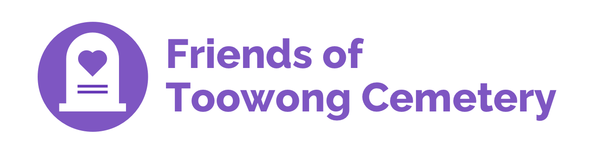

---
search:
  boost: 2  
---

# About Friends of Toowong Cemetery  

**Friends of Toowong Cemetery is a volunteer group that discover and share the history and stories of Toowong Cemetery.**

<!-- photo of members -->

## What we do 

The Friends of Toowong Cemetery:

- **research the history of Toowong Cemetery**, its [headstone designs](../headstones/symbolism.md), and the [biographies](../bios/bio-index.md) of the people interred there. 
- **share our discoveries** with the community through our publications, [guided heritage tours](../guided-tours.md), [self-guided walks](../walks/index.md), our [educational museum](../cemetery/museum.md), and contributions to other local history resources.
- **contribute stories** of individuals interred at the Toowong and [Paddington cemeteries](https://www.brisbane.qld.gov.au/community-and-safety/community-support/cemeteries/historic-cemeteries/paddington-cemetery) to publications and biographical databases.
- **clean and conserve headstones**.
- **search for buried headstones** in [archaeological digs](archaeological-digs.md) in the cemetery grounds. 
- **consult with the Brisbane City Council** on future plans, new initiatives, and the restoration of graves.
- **locate marked and unmarked graves**.

## What we've done

The Friends of Toowong Cemetery have:

- **established [Federation Pavilion](federation-pavilion.md)**, which commemorates the contribution of the delegates who attended the 1891 Federation that are buried at the Toowong Cemetery. It was officially opened on 3 March 2001.
- **celebrated the [140th Anniversary Commemoration of the cemetery](140-commemoration.md)**. We received a Silver Award in the 2012 National Trust of Queensland Heritage Awards for Volunteer Projects.
- provided **biographies for information signs** at significant grave sites.
- **renamed cemetery roads** after notable people buried nearby to make it easier to find your way around the cemetery.
- provided **[guided heritage tours](../guided-tours.md)** since 1996.
- published: 
    - **[Self‑guided walks](../walks/index.md)** 
    - **Toowong Cemetery resource manual : a guide for exploring the cemetery**, which is recommended for teachers of school groups visiting the cemetery. It is available at [Brisbane City Council Libraries](https://library-brisbane.ent.sirsidynix.net.au/client/en_AU/eLibCat/search/detailnonmodal/ent:$002f$002fSD_ILS$002f0$002fSD_ILS:71596/one), or for [purchase](mailto://inquiries@fotc.org.au) for $25. Invoices can be made to your school.
    <!-- Not in https://library-brisbane.ent.sirsidynix.net.au/client/en_AU/eLibCat -->
    <!-- Why not publish the resource for free? -->
    - **[Colonel Samuel Wensley Blackall : 1809-1871](https://catalogue.nla.gov.au/Record/5581999)** to celebrate the 140th anniversary of the first year of operation of the Brisbane General Cemetery, now known as the Toowong Cemetery and the internment of the first person buried there, Governor Samuel Wensley Blackall.
    - **Extraordinary Stories of Ordinary People**, a compilation of stories, submitted by the public, about people buried at Toowong Cemetery. 
    - **140th Anniversary Commemoration of the Toowong Cemetery** - DVD

{ loading=lazy }

## What we're working on

Currently we are: 

- creating a database of people who have served their nation in military uniform and now rest in Toowong Cemetery. These men and women will be recognised on an [honour board](https://youtu.be/mVfixEzUpwk) at the cemetery's main entrance.
- updating our website to include [even more content](https://github.com/Stephen-Gates/fotc/projects/1?fullscreen=true).
- updating the directions and maps for our [self‑guided walks](../walks/index.md). 
- encouraging the broader community to volunteer through a simple one-off interaction. On this site you'll find these opportunities shown in green Volunteer Opportunity boxes like the one below. 

!!! question "Volunteer opportunity"

    To update our maps we need:
    
    - access and a licence to the location data for the cemetery (boundaries, internal and surrounding roads, portions, sections and graves, building outlines, monuments, waterways, taps). Ideally this would be released as Open Data.
    - access and a licence to the [grave data](https://www.brisbane.qld.gov.au/community-and-safety/community-support/cemeteries/grave-location-search). Ideally this would be released as Open Data.
    - someone skilled in making maps. **Can you help?** 

## What have we got planned? 

With the **150th Anniversary** of the opening of Toowong Cemetery on **Saturday 5 July 2025** we're planning a very special event. More will be revealed closer to the day.

<!--
We've got some [other ideas](ideas.md)
-->

## Join us 

The Friends of Toowong Cemetery meet at **[Mt Coot-tha Botanical Gardens Auditorium](https://www.brisbane.qld.gov.au/things-to-see-and-do/council-venues-and-precincts/parks/botanic-gardens-in-brisbane/brisbane-botanic-gardens-mt-coot-tha)** on the **[last Wednesday of the month](https://www.timeanddate.com/calendar/custom.html?year=2022&y2=2023&months=24&country=29&typ=3&display=3&cols=0&fdow=7&hol=0&ctf=5&ctc=2&holmark=2&hod=1&hcl=1&cdt=7&cwd=___1___&cwf=______&holm=1&df=1)** (except December) at 6pm.

{ loading=lazy }

<!-- convert to google form --> 
**Anyone can join** by completing an [Application form](http://www.fotc.org.au/subset/membership.pdf) and paying the Annual Membership Subscription (inc. GST):

- $11 Individual
- $5.50 Students / Pensioners

## Contact us 

Email: **[inquiries@fotc.org.au](mailto://inquiries@fotc.org.au)**

Call: **[0439998053](tel: 0439998053)**

Facebook: **[@1871fotc](https://www.facebook.com/1871fotc/)**

Write: 

**Friends of Toowong Cemetery Association Inc.**  
**PO Box 808**  
**Toowong QLD 4066**

## Important numbers

The Friends of Toowong Cemetery Association Incorporated is a:

- Queensland Incorporated Association: **[IA17170](https://www.qld.gov.au/law/laws-regulated-industries-and-accountability/queensland-laws-and-regulations/check-a-licence-association-charity-or-register/check-a-charity-or-association)**
- **[Registered Charity](https://www.acnc.gov.au/charity/43eddd5b304a9f6e10eced63db189d47)** with the Australian Charities and Not-for-profits Commission (ACNC)
- Registered Australian Business, ABN: **[12868524011](https://abr.business.gov.au/ABN/View?id=12868524011)**

Our Bank details: 

- Branch: **NAB Toowong**
- BSB: **084-424** 
- Account Number: **67-601-3012**

Please include your Surname as a reference if paying a membership subscription by direct deposit. 

<!--
## Your consent 

When you visited this site for the first time, we asked for your consent to use cookies to recognise your repeated visits, determine if you find what you're searching for, and measure if you find this site helpful. With your consent you're helping us to make this site better. 

You can change your cookie settings at any time. 

[Change cookie settings](#__consent){ .md-button }
-->
