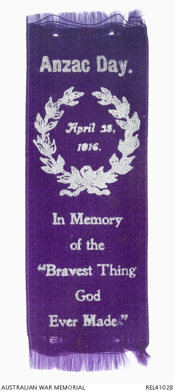

---
hide:
  - toc
  - navigation
---

# David John Garland 

Lived: **4 October 1864 — 11 October 1939**

--8<-- "snippets/david-john-garland.md"

{ width="27%" } { width="20%" }

<small>[Canon David John Garland - in uniform](https://commons.wikimedia.org/w/index.php?curid=47014045) by Unknown author, John Oxley Library, State Library of Queensland, Public Domain</small>*

<small>[Anzac Day 1916 fundraising ribbon](https://www.awm.gov.au/collection/C1244262), Australian War Memorial, used under the [CC BY-NC AU 3.0](https://creativecommons.org/licenses/by-nc/3.0/au/) licence</small>*
 
Learn more: 

- [Garland, David John (1864–1939)](https://adb.anu.edu.au/biography/garland-david-john-6278) by Australian Dictionary of Biography
- [The Architect of ANZAC Day](https://garlandmemorial.com/about-garland/) by Canon Garland Memorial Society
- [Memorial Ribbons, ANZAC Day](https://www.slq.qld.gov.au/blog/memorial-ribbons-anzac-day) by John Oxley Library, State Library of Queensland
