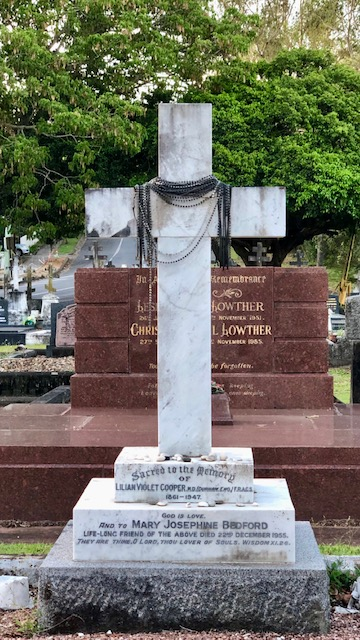
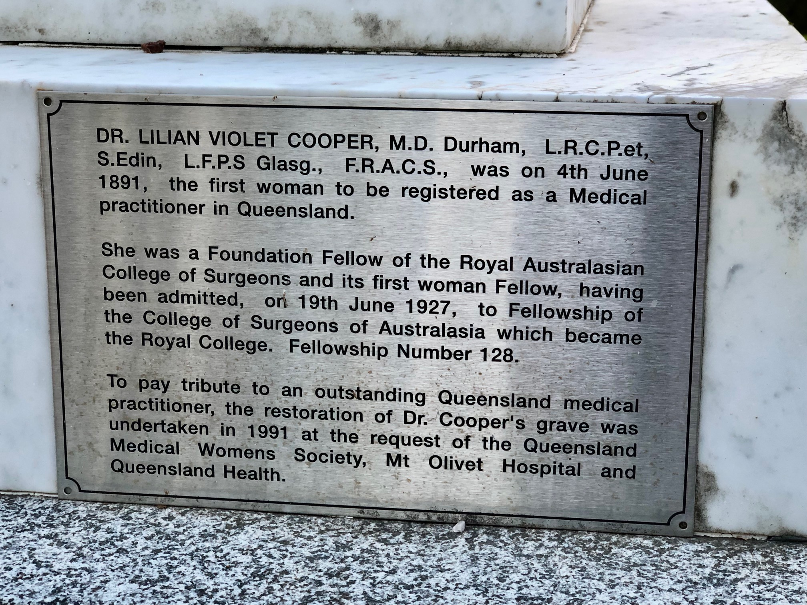

---
hide:
  - toc
  - navigation
---

# Dr Lilian Voilet Cooper

Lived: **11 August 1861 — 18 August 1947**

--8<-- "snippets/lilian-cooper.md"

{ width="49%" } 

{ width="49%" }

## Learn more 

<iframe width="100%" height="166" scrolling="no" frameborder="no" allow="autoplay" src="https://w.soundcloud.com/player/?url=https%3A//api.soundcloud.com/tracks/894179215&color=ff5500"></iframe>
<a href="https://soundcloud.com/user-421634801" title="State Library of Queensland" target="_blank" style="color: #cccccc; text-decoration: none;">State Library of Queensland</a> · <a href="https://soundcloud.com/user-421634801/dangerouswomen-liliancooper-episode3" title="Episode 3: Dr Lilian Cooper" target="_blank" style="color: #cccccc; text-decoration: none;">Episode 3: Dr Lilian Cooper</a>

Explore digitised newspaper articles about [Lilian Cooper](https://trove.nla.gov.au/list/146250) and [Josephine Bedford](https://trove.nla.gov.au/list/117121) on Trove.

Discover [related John Oxley Library collections](http://onesearch.slq.qld.gov.au/primo-explore/search?query=usertag,contains,dr%20lilian%20violet%20cooper&amp;vid=SLQ&amp;lang=en_US") 
