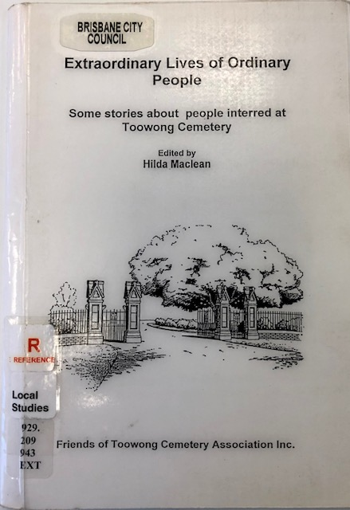

# Research Resources

<!--
## Our Research 

In 1999, the Friend of Toowong Cemetery published *Extraordinary Stories of Ordinary People* containing stories about people interred at Toowong Cemetery contributed by their descendants. It can be found in the Local History Reference section at the Toowong Library. 

{ width="32%" }

We plan to expand and re-issue this publication.

!!! question "Volunteer opportunity"

    If you would like your family's story to be considered for adding to the next edition, please fill in the [Biographical Details Form](http://www.fotc.org.au/subset/Toowong_Cemetery_Biographical_Details.doc).
    
-->

## Toowong Cemetery Monumental Inscriptions

In 1988, as a Bicentennial project, the [Queensland Family History Society](https://www.qfhs.org.au) published five volumes of Toowong Cemetery Monumental Inscriptions. They can be found in the Local History Reference section at the Toowong Library. 

{ width="62%" } { width="31.4%" }

<!--
!!! question "Volunteer opportunity"

    We'd like to explore digitising this historic record and creating a linked database to other historic resources. Do you know an efficient way to scan and OCR large books? 
--> 

## Trove

Search [Trove](https://trove.nla.gov.au) to read obituaries of people interred in Toowong Cemetery. Obituaries have been extracted from the newspaper holdings of the National Library of Australia. Each list item will give you a direct link to the newspaper article as well as the grave number.

- [Obituaries A - E](http://trove.nla.gov.au/list?id=4457)
- [Obituaries F - J](http://trove.nla.gov.au/list?id=4461)
- [Obituaries K - N](http://trove.nla.gov.au/list?id=4454)
- [Obituaries O - R](http://trove.nla.gov.au/list?id=4453)
- [Obituaries S - Z](http://trove.nla.gov.au/list?id=4430)

## Australian Dictionary of Biography

The [Australian Dictionary of Biography](http://adb.anu.edu.au/) is Australia's pre-eminent dictionary of national biography. In it you will find concise, informative and fascinating descriptions of the lives of significant and representative persons in Australian history.

[Search for "Toowong Cemetery"](https://adb.anu.edu.au/biographies/search/?scope=all&query=Toowong+Cemetery+&x=55&y=11&rs=) for the biographies of 190 of the most prominent people buried at Toowong Cemetery.

## Obituaries Australia

[Obituaries Australia](https://oa.anu.edu.au) is a digital repository of obituaries published in newspapers, journals, magazines and bulletins. [View Obituaries of people interred at Toowong Cemetery](https://oa.anu.edu.au/obituaries/search/?scope=all&query=Toowong+Cemetery+&x=85&y=18&rs=)

<!--
Obituaries Australia is a new initiative of the National Centre of Biography at the Australian National University. Enter "Toowong Cemetery" in the text search box at http://oa.anu.edu.au/ for the obituaries of people buried at Toowong Cemetery who formed Brisbane's social fabric.
-->

## Under the Lino 

The [Under the Lino](http://www.underthelino.com.au) community have a [catalogue of research resources](http://www.underthelino.com.au/resources/)

## Other Resources

- [Research Guide to cemetery records at Queensland State Archives](https://www.publications.qld.gov.au/ckan-publications-attachments-prod/resources/3b2f93a8-3229-4739-bae5-a130fb199cf9/research-guide-to-cemetery-records.pdf)
