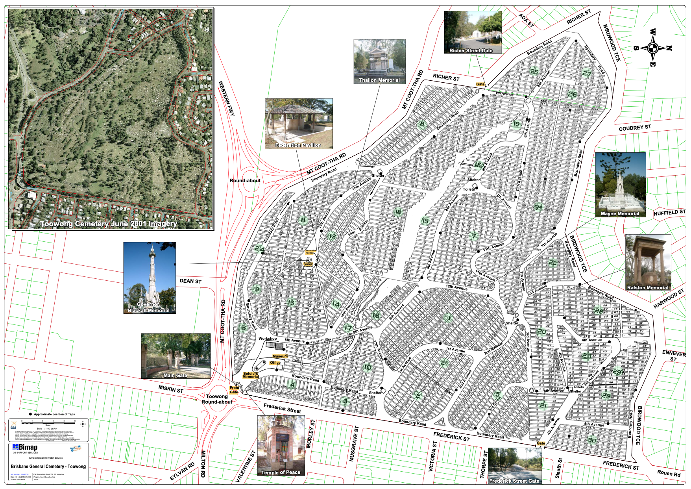

---
search:
  boost: 2  
---

#  Discover Toowong Cemetery

![][main-entrance]

*<small>Toowong Cemetery Main Entrance off Frederick Street</small>*

## Getting here

### Driving

If you're driving to the cemetery, it has two entrances:

- The main entrance (above), at **[Frederick Street, Toowong](https://www.google.com/maps/place/Toowong+Cemetery/@-27.4772749,152.9818283,17z/data=!3m1!4b1!4m5!3m4!1s0x6b9150c2f0f2e23f:0xf02a35bd720a310!8m2!3d-27.4772714!4d152.9839608)**,  can only be entered via a slip road beside the roundabout, approaching from the west.
- The back entrance, **[opposite 26 Richer Street, Toowong](https://www.google.com/maps/place/25+Richer+St,+Toowong+QLD+4066/@-27.4737507,152.9767263,17z/data=!3m1!4b1!4m5!3m4!1s0x6b9150dd31b12cc5:0xc3a1deb2fe09484!8m2!3d-27.4737555!4d152.978915)** is much easier to access. 

Parking is available inside the cemetery along the roads. Please park on the left side of two‑way roads where possible.

### Walking

If you're walking, in addition to the entries above, you can enter via:

- the pedestrian ramp from Mt Coot-tha Road, opposite the **[Mt Coot-tha Botanic Gardens](https://www.brisbane.qld.gov.au/things-to-see-and-do/council-venues-and-precincts/parks/botanic-gardens-in-brisbane/brisbane-botanic-gardens-mt-coot-tha)**. Turn right at the top of the ramp and walk downhill to go to Canon Garland Place.
- Frederick Street gate (opposite Sleath Street) that leads onto Steel Rudd Avenue (previously 4th Avenue).
- the many informal entries off Birdwood Terrace.

*<small>Toowong Cemetery Pedestrian Entrance off Mt Coot-tha Road. <b>[Bus stop 17, Mt Coot-tha Rd](https://jp.translink.com.au/plan-your-journey/stops/001403/timetable/2021-11-27?dateRedirect=False)</b> is nearby.</small>*

### Public Transport

If you're using public transport to get here, use the **[TransLink Journey Planner](https://jp.translink.com.au/plan-your-journey/journey-planner)** to plan your trip. Be aware some results tell you to walk across the road at the Toowong roundabout - this is not safe and you may need to walk a long way to find a safe place to cross Milton Road or the Western Freeway. Options are: 

- cross Milton Road at its intersection with Morley Street
- cross the Western Freeway using the [Canon Garland Overpass](https://garlandmemorial.com/2019/10/09/canon-garland-overpass/), a bike and walking bridge accessed from Anzac Park
- choose a bus the avoids the need to cross (e.g. Routes [471](https://jp.translink.com.au/plan-your-journey/timetables/bus/t/471/outbound/), [598](https://jp.translink.com.au/plan-your-journey/timetables/bus/t/598), [599](https://jp.translink.com.au/plan-your-journey/timetables/bus/t/599))

## When you arrive

If you enter main entrance through the front gates, you'll find: 

- Canon Garland Place named after **[Canon David John Garland](https://adb.anu.edu.au/biography/garland-david-john-6278)**. The Flagpole here is the departure point for **[guided heritage tours](../guided-tours.md)** and most **[self-guided walks](../walks/index.md)**.
- the **[Office](https://www.brisbane.qld.gov.au/community-and-safety/community-support/cemeteries/toowong-cemetery)** - staff can answer your enquiries and help to locate graves and ashes memorial sites.
- a **[Museum](museum.md)** operated by the Friends of Toowong Cemetery. 
- toilets, the only ones available in the cemetery.

*<small>The Stone of Remembrance, Cross of Sacrifice, and Flagpole in Canon Garland Place</small>*

If you enter via the Richer Street back gate, to get to Canon Garland Place:

- turn right into Dr. Lillian Cooper Drive (previously Boundary Road) and continue to the Shelter Shed 
- veer left at the Shelter Shed down the one‑way William Brown Avenue (previously 14th Avenue) 
- at the end, turn right into Emma Miller Avenue (previously 8th Avenue) to arrive behind Canon Garland Place, where you can park on the side of the road. 

## Map

Inside the cemetery you can get around by driving, walking, riding a bike or scooter. Some roads in the cemetery are very steep. Before you start, review the map.

<!-- Map -->
[][map]

*<small>[Toowong Cemetery](https://graves.brisbane.qld.gov.au) © Brisbane City Council 2016, used under [CC BY 4.0][map-cc-by]. Highlights added. Note: The map shows old Road names.</small>*

<!-- Map links -->

[map]: ../assets/toowong-cemetery-map.png "Click to expand the map. Use Back to return to this page"
[map-cc-by]: https://creativecommons.org/licenses/by/4.0/  "Creative Commons Attribution 4.0 Licence"

<!-- Add a mobility map eg https://www.brisbane.qld.gov.au/sites/default/files/brisbane_botanic_gardens_mobility_map.pdf -->

## Road name changes

Some road names have recently been changed to the names of notable people interred nearby. Not all maps and signs in the Cemetery have been updated to reflect these changes: 

| New Road Name                              | Old Road Name | Notes                                                                |
| :----------                                | :--------     | :---------                                                           |
| **[Walter Hill][Walter Hill]** Drive       | Boundary Road | running parallel to Mt Coot-tha Road                                 |
| **[Dr Lillian Cooper][Cooper]** Drive      | Boundary Road | running parallel to Richer Street                                    |
| Pride of Erin Drive                        | Boundary Road | running parallel to Birdwood Terrace                                 |
| Francis Forde Avenue                       | Boundary Road | running parallel to Birdwood Terrace closest to Frederick Street     |
| Peter Jackson Parade                       | Boundary Road | running parallel to Frederick Street furthest from the main entrance |
| Soldiers Parade                            | Boundary Road | running parallel to Frederick Street closest to the main entrance    |
| Steele Rudd Avenue                         | 4^th^ Avenue  |                                                                      |
| Walter Ralstone Avenue                     | 7^th^ Avenue  |                                                                      |
| **[Emma Miller][Miller]** Avenue           | 8^th^ Avenue  | behind Canon Garland Place                                           |
| **[Charles Heaphy][Heaphy]** Drive         | 8^th^ Avenue  | from the Shelter Shed to Emma Miller Avenue                          |
| **[Pat Hill][Pat Hill]** Drive             | 8^th^ Avenue  | from the Richer Street end to the Shelter Shed                       |
| O'Doherty Avenue                           | 11^th^ Avenue |                                                                      |
| Elizabeth Dale Walk                        | 12^th^ Avenue |                                                                      |
| **[Garland][Garland]** Avenue              | 13^th^ Avenue |                                                                      |
| **[William Browne][Browne]** Avenue        | 14^th^ Avenue |                                                                      |
| Federation Avenue                          | 15^th^ Avenue |                                                                      |

!!! question "Volunteer"

    Unfortunately signs are often vandalised in the cemetery. If you find a damaged or missing sign, please take a photo and **[report damaged signs to the Brisbane City Council](https://forms.brisbane.qld.gov.au/report-it-missing-damaged-or-faded-traffic-signs)**

## Attractions nearby

- [Mt Coot-tha Botanic Gardens](https://www.brisbane.qld.gov.au/things-to-see-and-do/council-venues-and-precincts/parks/botanic-gardens-in-brisbane/brisbane-botanic-gardens-mt-coot-tha) - walking distance
- [Sir Thomas Brisbane Planetarium](https://www.brisbane.qld.gov.au/things-to-see-and-do/council-venues-and-precincts/sir-thomas-brisbane-planetarium) - walking distance
- [Anzac Park](https://www.brisbane.qld.gov.au/things-to-see-and-do/council-venues-and-precincts/parks/parks-by-suburb/toowong-parks) a long walk via the Mt Coot-tha Botanic Gardens, then across [Canon Garland Overpass](https://garlandmemorial.com/2019/10/09/canon-garland-overpass/) into Anzac Park
- [Mt Coot-tha Lookout](https://www.brisbane.qld.gov.au/things-to-see-and-do/council-venues-and-precincts/mt-coot-tha-precinct/mt-coot-tha-attractions/mt-coot-tha-lookout) - catch the [471 bus](https://jp.translink.com.au/plan-your-journey/timetables/bus/t/471/outbound/) from the Mt Coot-tha Botanic Gardens
- [Mt Coot-tha Reserve](https://www.brisbane.qld.gov.au/things-to-see-and-do/council-venues-and-precincts/mt-coot-tha-precinct/mt-coot-tha-reserve) - drive to picnic areas, bush walks, or mountain bike riding. J. C. Slaughter Falls and Simpson Falls are our favourites
- [Mt Coot-tha Events](https://www.brisbane.qld.gov.au/things-to-see-and-do/council-venues-and-precincts/mt-coot-tha-precinct/mt-coot-tha-precinct-events) - there's always something happening around Mt Coot-tha

## Need Coffee?

Here are some of our favourites:

- [Botanic Gardens Cafe](https://www.botanicgardenscafe.net) - walking distance
- [The Summit Cafe](http://www.summitbrisbane.com.au)  - catch the [471 bus](https://jp.translink.com.au/plan-your-journey/timetables/bus/t/471/outbound/) from the Mt Coot-tha Botanic Gardens to the Mt Coot-tha Lookout
- [Sweetshop Specialty Coffee](https://sweetshopspecialtycoffee.com.au) - 1A Stuartholme Road, Bardon
- [Bardon Thyme](https://www.facebook.com/bardonthyme) - 5 Morgan Terrace, Bardon
- [Good Folk Cafe](https://goodfolkcafe.com.au) - 58 Rainworth Road, Bardon
- [Via Retro](https://viaretrocafe.com.au) - look for the cute retro caravan at J.C Slaughter Falls on weekends

<!-- Links -->

[main-entrance]: ../assets/main-entrance.jpg "Toowong Cemetery Main Entrance"
[Walter Hill]: ../bios/walter-hill.md "Read Walter's Biography"
[Cooper]: ../bios/lilian-cooper.md "Read Lilian's Biography"
[Forde]: ../bios/francis-forde.md "Read Francis' Biography"
[Jackson]: ../bios/peter-jackson.md "Read Peter's Biography"
[Rudd]: ../bios/steel-rudd.md "Read Steel Rudd's (Arthur Hoey Davis) Biography"
[Ralstone]: ../bios/walter-ralstone.md "Read Walter's Biography"
[Miller]: ../bios/emma-miller.md "Read Emma's Biography"
[Heaphy]: ../bios/charles-heaphy.md "Read Charles' Biography"
[Pat Hill]: ../bios/pat-hill.md "Read Pat's Biography"
[Dale]: ../bios/elizabeth-dale.md "Read Elizabeth's Biography"
[Garland]: ../bios/david-john-garland.md "Read David Garland's Biography"
[Browne]: ../bios/william-henry-browne.md "Read William's Biography"

<!-- include site-wide abbreviations -->

--8<-- "snippets/abbreviations.md"
