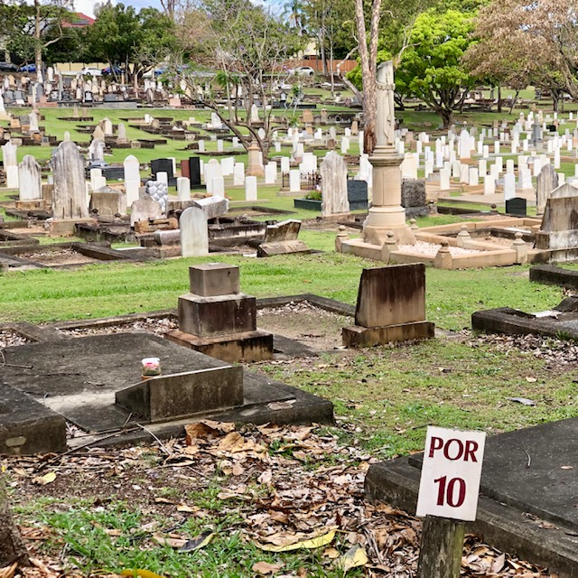
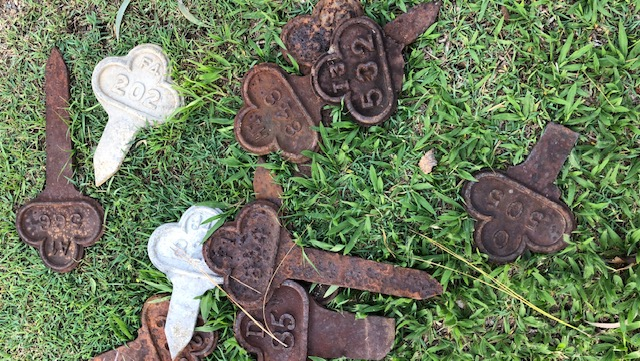
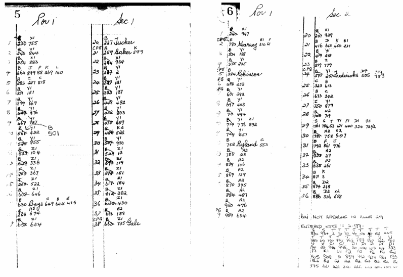

# Finding Graves at Toowong Cemetery

## Portions, Sections and Graves

Graves are located using 3 numbers, *Portion*-*Section*-*Grave*. For example, Peter Jackson's grave is located at Portion 5, Section 28, Grave 1 or (5-28-1). 

See if you can locate Peter Jackson's grave using the Portion and Section numbers in the map below.

<!-- Map -->
[{ width="100%" }][map]

*<small>Toowong Cemetery Map showing Portions (the large numbers) and Sections (the numbers inside the white rectangles).</small>*

<!-- Map links -->
[map]: http://www.fotc.org.au/toowong_map.jpg "Click to expand the map. Use Back to return to this page"

Portion numbers are shown on signs throughout the cemetery.

{ width="100%" }

*<small>Portion 10 sign post.</small>*

!!! question "Volunteer opportunity"

    Unfortunately Portion signs are often vandalised in the cemetery. If you find a damaged of missing sign, please take a photo and [report it to the Brisbane City Council](https://forms.brisbane.qld.gov.au/report-it-missing-damaged-or-faded-traffic-signs)

## Search for a grave

Use the Brisbane City Council [Grave location search](https://www.brisbane.qld.gov.au/community-and-safety/community-support/cemeteries/grave-location-search) to look up a person's name and find the grave location and other details. 

## Update burial records

To request an update to the official burial records, [email Cemeteries Administration](mailto://CB-Cemeteries@brisbane.qld.gov.au) and include, either:

- a death certificate 
- a photograph of the headstone where the information on the headstone can be clearly read

Information on the official burial records that can be updated, includes:

- name
- date of birth
- date of death
- age
- cause of death
- photograph of headstone or grave

!!! question "Volunteer opportunity"

    Consider contributing a photograph of a headstone to improve the Council database to help others discover the history and stories of Toowong Cemetery.

## Markers

Markers can be seen on, or embedded into, graves. They represent a person buried in the grave. There is no simple way to link a person's marker to the appropriate grave. 

{ width="100%" }

*<small>Grave markers found on the grass, separated from their grave.</small>*

To map a marker to a grave, you need to look up old portion books. For example Portion 1, Section 1, Grave 1 maps to Marker XI 755. 

{ width="100%" }

*<small>Sample Portion Book page. © Brisbane City Council</small>*

## Need help locating a grave? 

You can **[ask the Toowong Cemetery Office for assistance finding graves](https://www.brisbane.qld.gov.au/community-and-safety/community-support/cemeteries/toowong-cemetery#locating-graves-and-ashes-memorial-sites)**.

**Friends of Toowong Cemetery can also assist finding graves. [Contact us](../about/index.md#contact-us)** to ask us to:

  - mark the side of the road with the section number relating to your search to help you to find it easily when you visit.
  - outline an unmarked grave using a surface spray if the grave is unmarked. The spray does no harm and two mowings later it will disappear. 
  - take digital photographs of a grave and email it to you.
