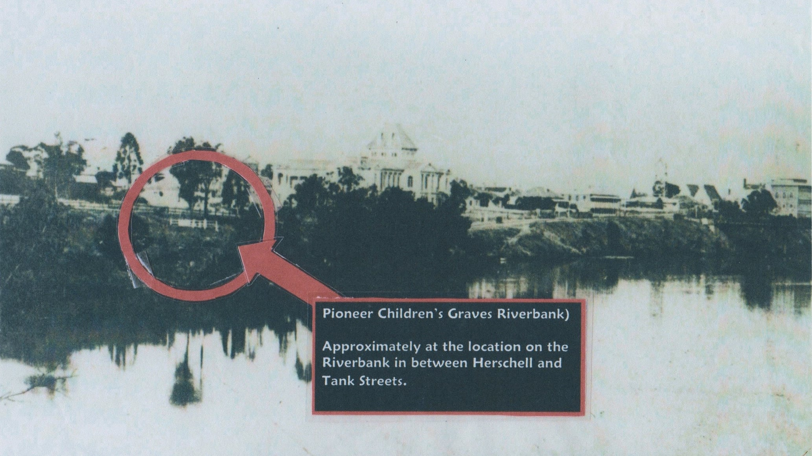
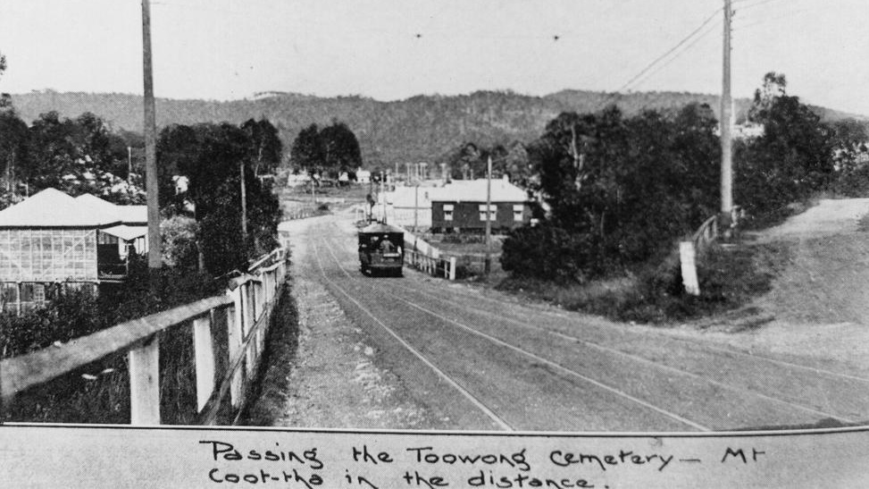
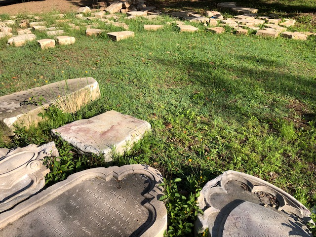

# Toowong Cemetery History

## Traditional Owners

Prior to ca.1875, the flat area where the entrance of Toowoong Cemetery now stands was an [Aboriginal Corroboree Ground][Corroboree]. "Toowong" is a corruption of "[Tu-wong][tu-wong]", purportedly the aboriginal name for the river bend near the Indooroopilly Bridge, named for a local bird (probably the [Koel](https://ebird.org/species/asikoe3)). 

[Corroboree]: https://mappingbrisbanehistory.com.au/history-location/toowong-cemetery-aboriginal-corroboree-ground-232/ "From 'Aboriginal Campsites of Greater Brisbane' by Ray Kerkhove, 2015"

[tu-wong]: http://www.toowong.org.au/books_for_sale.htm "From 'Aboriginal people of Toowong' by Arthur Beau Palmer, in 'Toowong: A community's history' by West Toowong Community Association Inc."

## 1871 Governor Blackall buried

The land for the cemetery was first reserved in 1866. The reserve of 250 acres 1 rood, and an extension of 53 acres were [gazetted][gazette-93], and [Cemetery Trustees appointed][gazette-94] on 7 October 1870.

[gazette-93]: ../assets/documents/Queensland_Gov_Gazette_8_October_1870_v11_93.pdf "Read the Queensland Government Gazetter No. 93"
[gazette-94]: ../assets/documents/Queensland_Gov_Gazette_10_October_1870_v11_94.pdf "Read the Queensland Government Gazetter No. 94"

**[Colonel Samuel Wensley Blackall][Blackall]**, the second Governor of Queensland, was the first person buried in Toowong Cemetery on 3 January 1871. 

[Blackall]: ../bios/samuel-wensley-blackall.md "Read Colonel Samuel Wensley Blackall's Biography"

## 1875 Toowong Cemetery opened

The Toowong Cemetery, previously known as the Brisbane General Cemetery, is the largest cemetery in Queensland at 44 Hectares and is an important record of the history of Brisbane and Queensland. It was officially opened on 5 July 1875 and over 119,000 people are buried in approximately 46,000 graves.

<!--
<iframe src="https://www.youtube.com/embed/jJ3oK4nwNbA" title="YouTube video player" frameborder="0" allow="accelerometer; clipboard-write; encrypted-media; gyroscope; picture-in-picture" allowfullscreen></iframe>
-->

<iframe src="https://www.youtube.com/embed/jJ3oK4nwNbA" title="YouTube video player" frameborder="0" allow="accelerometer; clipboard-write; encrypted-media; gyroscope; picture-in-picture" allowfullscreen></iframe>

*<small>[Toowong Cemetery: Resting place of Governor Samuel Blackall (One Minute Archive)](https://www.youtube.com/watch?v=jJ3oK4nwNbA) — [Queensland State Archives](https://www.qld.gov.au/recreation/arts/heritage/archives)*</small>

{ width="96%" }  

*<small>[Toowong Cemetery, Brisbane, ca. 1890](http://onesearch.slq.qld.gov.au/permalink/f/1upgmng/slq_alma21272130100002061), — [State Library of Queensland](https://www.slq.qld.gov.au).</small>*

[![Map and aerial photo of Toowong Cemetery][map-photo]{ width="96%" }][aerial-photo]  

[map-photo]: ../assets/Toowong-cemetery-map-photo.jpg "Click to view full aerial photo (1.9MB)"
[aerial-photo]: ../assets/BCC000234691.JPG

*<small>[Brisbane General Cemetery (Toowong) - General Plan, 8 July 1909](https://www.archivessearch.qld.gov.au/items/ITM1624111) — [Queensland State Archives](https://www.qld.gov.au/recreation/arts/heritage/archives).</small>*  
*<small>Series 46 Film BCC2 Frame 34691, 31 May 1946 — Brisbane City Council, via [QImagery](https://qimagery.information.qld.gov.au). Frederick St is the straight road on the right, running top to bottom.</small>*

## 1881 Queensland's oldest surviving tombstones

Three children originally [interred on the banks of the Brisbane River](http://onesearch.slq.qld.gov.au/permalink/f/1upgmng/slq_digitool119348), were re‑interred at Toowong Cemetery in October 1881. 

{ width="96%" }  

*<small>Pioneer Children's Graves (Riverbank). Approximately at the location on the Riverbank in-between Herschell and Tank Streets. Source unknown.</small>*

Esther Roberts, mother of **William Henry Roberts**, was the first teacher of girls in the Moreton Bay settlement. His father, Charles Roberts was transferred to Dunwich to take charge of the government store in August 1828. William was born on 15 September 1828 and died of illness on 15 November 1831. The tomb lid originally had a bible verse inscribed on it based on Matthew 19:14:

>***Suffer the little children, and forbid them not, to come unto me: for of such belongeth the Kingdom of God.***

It has since been lost to weathering. After the death of their son, the Roberts family returned to Sydney in 1834.

**Peter McCauley** was born in Sydney on 17 April 1826, the son of Private Peter McCauley, a member of the 17^th^ Regiment. His monther, Mary, was appointed as matron of the Brisbane Town Female Factory in June 1831. On 5 January 1832, young Peter wandered away from his brothers on an outing and drowned in the Brisbane River near the present Botanical Gardens. The  family returned to Sydney in 1832.

**Jane Pittard** was the infant daughter of John Pittard, late Color Sergeant of the 57^th^ Regiment. He had drowned in Vann Diemen's Land on 23 July 1831, shortly before his daughter's birth. Jane's mother, Margaret, remarried and came to Moreton Bay with Color Sergeant David Collins in August 1832. On 23 January 1833, Jane died and her family returned to Sydney the following year.

These children's tombstones are the oldest surviving tombstones in Queensland.
{ width="96%" }  
*<small>Pioneer Children's Graves (13-10-4). </small>*

<!--
Brisbane, 1844 (after a drawing by Carl Friedrich Gerler)

https://www.flickr.com/photos/queenslandstatearchives/42971363315/in/album-72157710041752261/

View the original record at the Queensland State Archives:
Series ID 189
 
Map of Brisbane drawn by C. F. Gerler (this version has been updated with the location of modern day Brisbane streets). This basic map has a numbered list of forty-eight locations in the bottom right corner. The list corresponds to places and residences on the map. The locations are represented by hand drawings of houses and other buildings with the numbers next to them. Trees, roads, and rivers are have also been included as a decorative flourish.
 
Map legend :
1. Andrew Petrie, 2, Handel, cattle drover, 3. Savory (the only baker), 4. Bensteads, sawyers, 5. T. Richardtson (the only general store), 6. Convict Barracks, 7. W. Kent (druggist shop), 8. Fitzpatrick (the first Chief Constable), 9. The Lock-up, 10. The Constable's place (only two in all), 11. Slade's Post Office (old), 12. Slade's Pineapple Garden, 13. Church of England, 14. The Hospital, 15. Mort, milkman.
 
16. Wright's Hotel, 17. General Cemetery, 18. Tread and Windmill, 19. Edmonston.s Paddock, 20. Old R. Jones, 21. Dr. Simpson (the first Commissioner), 22. Old Major Prior, 23. The Gaol, 24. Skyring's Beehives (soft goods shop), 25. Hayes, milkman, 26. Brothers Fraser (first houses), 27. Catholic Church, 28. McLean's Blacksmith's Shop, 29. Edmonston's butcher, 30. Bow's Hotel.
 
31. Taylor Shappart, 32. Montifeur (a financier), 33. W. Pickering, 34. Sergeant Jones, 35. Soldiers' Barracks, 36. Officer de Winton, 37. Commission Stores, 38. Queen's Wharf, 39. Captain Wickham's office, 40. Commissioner T. Kent, 41. Commissioner's Garden, 42. Captain Coley, 43. Government Gardens, 44. Father Hanley (the only priest), 45. Saw Pits, 46. Queen Street, 47. The Boat House and Boatman's House, 48. The First Tombstone (two graves). (Description supplied with photograph.)
 
The Postmaster in 1844 was George M. Slade.
-->

## 1911 Paddington Cemetery Act

Opened in 1844 and closed in 1875, by 1907 there were calls to turn the neglected North Brisbane Burial Grounds (also known as [Paddington Cemetery][Paddington Cemetery]) into a park and sports field. 

[Paddington Cemetery]: https://www.brisbane.qld.gov.au/community-and-safety/community-support/cemeteries/historic-cemeteries/paddington-cemetery "Read more about Paddington Cemetery"

{ width="70%" } 

*<small>[Paddington Cemetery 1910](https://www.flickr.com/photos/queenslandstatearchives/30299711162/in/photolist-2joySJt-NatWv9-KCpMLU) — Queensland State Archives.</small>*

In 1911 the Queensland Government passed the *[Paddington Cemetery Act][Paddington Cemetery Act]* allowing them to move the bodies to another location.

[Paddington Cemetery Act]: http://classic.austlii.edu.au/au/legis/qld/hist_act/pcao19112gvn9298/ "Read the 1911 Paddington Cemetery Act"

<!--

There were approximately 4,600 grave in the Paddington Cemetery. Five Hundred memorials and headstones were moved to a small reserve at Christ Church, Milton, and 186 bodies relocated at the request of the families. The parkland was established and named Lang Park after John Dunmore Lang. 

During the redevelopment of Suncorp Stadium in 2001/02 part of the former cemetery was excavated by archaeologists from the University of Queensland and they excavated 394 graves. All remains were taken to Toowong Cemetery and interred in two vaults under a specially commissioned monument in July 2003 (located at Portion 17 Section 1).

--> 

{ width="70%" } 

*<small>Paddington Memorial, Portion 17 Section 1.</small>*

The Paddington Memorial commemorates people originally buried in the North Brisbane Burial Grounds, now interred at Toowong Cemetery. The Paddington Memorial plaque reads:

>***The North Brisbane Burial Grounds at Paddington were opened by 1844 and became the final resting place for thousands of Brisbane's inhabitants over the ensuing decades. Following the opening of the Brisbane General Cemetery of Toowong in 1875, the seven sectarian cemeteries were gradually abandoned. By the end of the 19^th^ century, the site had fallen into a state of disrepair. A decision was made in 1911 to have the Paddington Cemetery converted to public parklands. The memorials were subsequently removed and the opportunity was provided to relatives to relocate the remains and or memorials to other cemeteries including Toowong. Only a few hundred bodies were removed leaving several thousand on the site that became known as Lang Park.***

 

>***Lang Park evolved into an iconic inner-city sports ground, with a major redevelopment of the stadium from 2001 to 2003. This resulted in the necessary excavation of sections of the former burial grounds that would be disturbed by construction. A methodical archaeological investigation was undertaken, and the fragmentary remains of 394 unidentified individuals were exhumed from the Episopalian (Anglican), Roman Catholic, and Presbyterian cemeteries. The remains were interred in this memorial in July 2003.***

## 1921 New Neighbours

Allotments on Heussler Terrace (renamed Birdwood Terrace) on the North boundary of the cemetery were sold by auction in 1921. "*Convenient to the Toowong Tram Line*" was a selling point. The Toowong Tram stopped near the main cemetery gates.

(Scroll back to the 1946 aerial photo to see how few allotments were built on 25 years later.)

{ width="96%" }  

*<small>[Chermside Park, second section : Auchenflower](http://onesearch.slq.qld.gov.au/permalink/f/1upgmng/slq_alma21190073930002061), 1921 — [State Library of Queensland](https://www.slq.qld.gov.au). Note in the Inset how the tram stopped at the Toowong Cemetery gates. Third Avenue is now named Couldrey St. </small>*

{ width="96%" }  

*<small>[Tram passing the Toowong Cemetery with Mt Coot-tha in the distance, Queensland, 1921](http://onesearch.slq.qld.gov.au/permalink/f/fhnkog/slq_digitool542430) — [State Library of Queensland](https://www.slq.qld.gov.au). </small>*

## 1924 Remembering the Anzacs

With Australia and New Zealand at war with the German Empire, in 1915 David Garland was tasked with providing and coordinating chaplaincy and welfare services at Enoggera Army Base to thousands of fresh recruits. 

In the wake of climbing casualty lists and community grief, he urged legislators to establish a framework to enable the nation to publicly honour the service and sacrifice of Australian and New Zealand troops killed in the Gallipoli Peninsula landings of 25 April 1915. This movement culminated in a public meeting on 10 January 1916 at Brisbane's Exhibition Hall which voted to establish the Anzac Day Commemoration Committee of Queensland, with chaplain Lieutenant-Colonel Garland its secretary. 

Garland's contribution to Anzac Day tradition was to devise ecumenical or secular rituals for public commemoration of those who died in battle and and to comfort the bereaved. Because his format was non-denominational, everyone could participate, regardless of their faith tradition. The minute's silence provided a space for all Australian's and New Zealanders to demonstrate respect for The Fallen of the Great War. 

In 1916 Garland initiated a trust to receive money raised from the sale of silk, lavender-coloured badges embossed with gold leaf with the lion of St Mark and the motto "Their Name Liveth for Evermore". These became the first Anzac Day badges, initially earmarked to pay for the upkeep of soldiers' graves at home and abroad. The appeal eventually helped fund soldier respite hostels and memorials to be established. 

On the morning of Anzac Day 1920, the first since his return from war service, Garland visited "Soldiers' Corner" at Toowong Cemetery and found friends and families of the deceased paying their respects. Noting people of all religions were present, he asked all to observe a minutes' silence rather than offer up prayers during an impromptu commemoration service. 

Under the guidance of Garland the Anzac Day service at Toowong Cemetery grew in size and significance as did the badge-selling campaign which supported the Lady Mayoress's committee. The campaign's success helped fund the establishment of the "Cross of Sacrifice" and "The Stone of Rememberance" which were erected and unveiled in 1924 near the entrance to Toowong Cemetery immediately adjacent to Canon Garland Place. Anzac Day commemoration's in Brisbane where held here until the Anzac Memorial - Shrine of Rememberance - in Anzac Square, was completed in 1930.

Garland, aged 75, died at Red Hill on 11 October 1939. His grave is located at Portion 1, Section 50A, Grave 9, overlooking "Soldiers' Corner".

{ width="96%" }  

*<small>[Official unveiling of the Cross of Sacrifice on Anzac Day at Toowong Cemetery, Brisbane, 1924](https://digital.slq.qld.gov.au/delivery/DeliveryManagerServlet?dps_pid=IE1400763&change_lng=) — [State Library of Queensland](https://www.slq.qld.gov.au). <!-- The Union Jack flag was placed on the building to mask the fact that it was the amenities. --> </small>*

<!--
{ width="96%" }  

*<small>[Cross of Sacrifice and Stone of Remembrance memorials at Toowong Cemetery, Brisbane, 1924](https://digital.slq.qld.gov.au/delivery/DeliveryManagerServlet?change_lng=en&dps_pid=IE1400772) — [State Library of Queensland](https://www.slq.qld.gov.au).</small>*

-->

{ width="96%" }  

*<small>[Small children looking at wreaths laid at the memorial on Anzac Day, Toowong Cemetery, Brisbane, 1924](http://onesearch.slq.qld.gov.au/permalink/f/1upgmng/slq_alma21271931300002061) — [State Library of Queensland](https://www.slq.qld.gov.au).</small>*

## 1962 Trams Terminated

[Trams in Brisbane](https://en.wikipedia.org/wiki/Trams_in_Brisbane) changed over time. In 1962 the [Paddington Tram Depot was destroyed by fire](https://trove.nla.gov.au/newspaper/article/104296116) and 65 trams were lost. The Rainworth and Toowong [tram services were withdrawn](https://youtu.be/yD8thm6MECU) and replaced with buses.

--8<-- "snippets/toowong-cemetery-tram.md"

The [heritage-listed Paddington Tramways Substation](https://apps.des.qld.gov.au/heritage-register/detail/?id=601198) can still be found at 150 Enoggera Terrace, Paddington. [Trammies Corner Park](https://brismania.com/day-93-paddington-bare/) can be visited at	74 Prince Street, Paddington.

## 1970's "Beautification Scheme"

By April 1975 the Cemetery was full with all plots sold. The Brisbane City Council Health Dept was ordered by the then Mayor to start a project to remove hundreds of family owned headstones and grave surrounds in Toowong, Lutwyche, South Brisbane, Balmoral, and God's Acre Pioneer cemetery. Headstones (most of them just needing weeding) were removed from these cemeteries with the aim to make open parklands.

Mayors, soldiers, politicians all fell victim to the clearance. At Toowong Cemetery, headstones were demolished and buried in the canal. The [Toowong Cemetery heritage listing](https://apps.des.qld.gov.au/heritage-register/detail/?id=601773) suggests, "approximately 1,000 memorials were removed from Toowong". Intervention in 1979 saw an end to the organised vandalism. The Cemetery reopened in 1998 with approximately 450 plots for sale. 

--8<-- "snippets/dilapidated-graves.md"

<!-- Photo of a Council letter? -->

In 1978 construction started on the Toowong Cemetery Roundabout which, when completed, made entry via the main gates difficult.

--8<-- "snippets/toowong-roundabout-construction-1978.md"

## 1988 Mission Impossible

In 1988 the first season of [Mission Impossible](https://en.wikipedia.org/wiki/Mission:_Impossible_(1988_TV_series)) was filmed in Queensland. Some scenes where filmed in Toowong Cemetery.

--8<-- "snippets/mission-impossible.md"

## 1992 Friends of Toowong Cemetery formed 

Cr. Judy Magub was the first President of the Friends of Toowong Cemetery. Judy was the councillor for the Toowong ward since it was formed in 1994 until she retired in 2007.

Learn more about **[Friends of Toowong Cemetery](../about/index.md)** - what we do, what we've done, and how to join in. 

## 2001 Federation Pavilion

The **[Federation Pavilion][Federation Pavilion]** commemorates the contribution of the delegates who attended the 1891 Federation that are buried at the Toowong Cemetery. It was officially opened on 3 March 2001.

{ width="96%" }  

[Federation Pavilion]: ../about/federation-pavilion.md "Read about Federation Pavilion, created by the Friends of Toowong Cemetery"

## 2006 Archaeological Digs

In 2006, in conjunction with the University of Queensland Archaeology Department, Friends of Toowong Cemetery started **[searching for demolished headstones][digs]** buried in the cemetery grounds.

[digs]: ../headstones/archaeological-digs.md "Read about our archaeological digs"

In 2011, while staff prepared a new grave, the headstone of a John Peel was discovered. Brisbane City Council had no record of John Pell and asked Friends of Toowong Cemetery for help. It was discovered that the headstone was one of 504 missing headstones from the North Brisbane Burial Grounds (also known as the Paddington Cemetery). In 1913 the headstones had been stored in good order behind Christ Church in Paddington. In 1930 they suddenly disappeared. The Authorities claimed it was rubble, unreadable and used for roadbase. This was not entirely true as many headstones have been found in archaeological digs between 2011-2016. 

{ width="96%" }  

## 2009 Vandalism law changes

In 2009, over 80 gravestones were damaged at Toowong Cemetery. Following a police investigation, four people were charged with wilful damage however at the defendants’ committal hearing in April 2010, the charges were dismissed due to a "loop-hole" in the law. **[Friends of Toowong Cemetery successfully partitioned for changes to be made to the law][Vandalism of Cemeteries]**.

[Vandalism of Cemeteries]: ../assets/documents/2010-vandalism.pdf "Read the 'Vandalism of Cemeteries: Criminal Code and Other Legislation Amendment Bill 2010 (Qld)''"

## 2011 Governor Blackall's funeral re-enactment

On 24 July 2011, 140 years after Governor Blackall was buried, a **[re-enactment of the funeral][re-enactment]** was performed.

[re-enactment]: ../about/140-commemoration.md "Read about our awarding winning event."

{ width="96%" }  

## Today

Today, the Friends of Toowong Cemetery and the Brisbane City Council work together to maintain and improve Toowong Cemetery. Together we have delivered improvements including:

- The **[Federation Pavilion](../about/federation-pavilion.md)**
- **[Renaming the Cemetery Roads](../visit/#road-name-changes)** after notable people buried nearby
- Reusing the old Sexton's office as the **[Toowong Cemetery Museum](museum.md)**
- The Paddington Memorial, and **[Headstone Symbology](../headstones/index.md)** display
- The **[Toowong Cemetery Remembrance Walk](https://vimeo.com/540501732)** that allows you to explore the lives of Queensland's volunteer troops and learn about the Anzac Legend

**Toowong Cemetery is enjoyed by those who come to remember loved ones, exercise, walk their dog, or discover the history and stories inside.**

<!-- 

## Portion History

The grounds at the Cemetery were laid out by the prominent surveyor, George Phillips and a set of books drawn up by the Government Printer.

{ width="49%" }  { width="49%" } 

*<small>Brisbane General Cemetery (Toowong) - General Plan, 8 July 1909 - Queensland State Archives.</small>*  
*<small>Toowong Cemetery aerial photo, 1934. Frederick St is the straight road on the right, running top to bottom.</small>*

The topography provides the social division of the cemetery 

- private graves occupying the highest ground in each portion
- public graves along the lower sections 
- paupers and criminals occupying the low-lying, water logged ground along the creek. 

The contrast is stark between elaborate monuments built by the elite on the highest ground in an attempt to cheat death through immortality, compared to the unmarked graves of anonymous paupers on low lying water logged ground. With two exceptions, the Presbyterians in Portion 24 and the Primitive Methodists mostly in Portion 6, the creek serves to separate the general ground to the south from the ground occupied by religious denominations to the north.

The Cemetery Trustees received numerous requests for separate burial sections from churches and other like minded group to ensure that religious and social class distinctions within society were perpetuated in mortality.

- **Portion 1** was allocated to the **Church of England** with still born babies occupying the northern area of this Portion. 
- **Portion 2** which was originally allocated to the **Wesleyan Methodists**. **Portion 2A** contains the graves of more than 10,000 still born babies and other hospital burials. 
- **Portion 3** was allocated to the **Hebrews**.
- **Portion 4** appears to be a **general area** and contains the [Temple of Peace](https://apps.des.qld.gov.au/heritage-register/detail/?id=600334) and the [Caskey Memorial](https://apps.des.qld.gov.au/heritage-register/detail/?id=600335). 
- **Portion 5** contains **public ground**. 
- **Portion 6** contains **Primitive Methodists** and also a substantial number of the reinterments from the old **Milton/Paddington Cemetery**. 
- **Portion 7** contains **Irish Catholics** and **Portion 7A** the **Roman Catholics**. The small subdivision of 7A to the west of Portion 7 contains early Roman Catholic graves. 
- **Portion 8 and 18** contain general ground with **Greek and Russian Orthodox** at the western ends of both.
- **Portions 9, 11, 12, 13 and 14** surround the Blackall Monument located on the highest knoll in the Cemetery. The upper reaches of these portions contain **Queensland's most prominent political, legal, arts, religious and business figures**. 
- **Portion 10** contains the **administrative buildings** for the site - the Sexton's office, the Museum (former Sexton's office) and storage shed spanning the open drain, the Amenities block with a storage and workshop adjacent. The **Shrine of Remembrance** and **Cross of Sacrifice** occupy the southern end of this Portion and are prominently centred on an axis from the main entry gates. 
- **Portions 15 and 15A** contain public **Catholic graves**. Part of Portion 15 was originally allocated to the burial of criminals and was later resold as Catholic ground. 
- **Portion 16**, in the low-lying area, contain the **pauper grounds**. 
- **Portion 19** contains **Chinese graves**. These graves where relocated from portion 2, to Portion 7, before being re-interred to Portion 19. Most of the early Chinese graves were exhumed and returned to China.
- **Portions 20, 21, 22, 23, 29 and 29A** in the northern corner of the Cemetery were laid out after the turn of the century. Part of Portions 21 and 22 contain **hospital and Department of Native Affairs graves**. Portion 22 contains Italian graves and also the grave of former **Prime Minister Francis Forde**.
- **Portions 25, 26 and 27** laid out in the western corner of the site contain **Catholic graves** and occupy the land purchased in 1916 from Ned Alexander. 
- **Portion 30** was the last ground to be laid out in 1930 and contains, amongst others, graves for **Dunwich and Goodna Asylum patients** in its south-eastern corner. An avenue of oleanders marks the boundary between Portions 29 and 30.

A survey of the layout of graves, reveal differences between many of the portions with some aligned to magnetic north, some to true north, and others at varying degrees from North. The sections in the Church of England section are laid out at 45 degrees east of true north. In August 1875, the Church of England requested that graves be laid east-west.

-->

## Learn more about Toowong Cemetery's history

<!--
- **[Historic photos](http://onesearch.slq.qld.gov.au/primo-explore/search?query=any,contains,Toowong%20cemetery&tab=dt&search_scope=DT&vid=SLQ&mfacet=tlevel,include,online_resources,1)** from the State Library of Queensland.
-->
- **[Toowong Cemetery heritage listing](https://apps.des.qld.gov.au/heritage-register/results/?q=Toowong+Cemetery)** in the Queensland Heritage Register.
- **[Toowong Cemetery citation](https://www.ww2places.qld.gov.au/place?id=2064)** on Queensland WWII Historic Places website.
- **[Books about Toowong Cemetery](https://library-brisbane.ent.sirsidynix.net.au/client/en_AU/eLibCat/search/results?qu=Toowong+Cemetery&qf=-ITYPE%09Item+Type%091%3AARCHIVES%09City+Archives+Collection&ac=ITYPE%09Item+Type%091%3ALOC-ST-REF%09Local+Studies+Reference+%7C%7C+1%3AREFERENCE%09Reference+Collection+%7C%7C+1%3ALOCSTUDIES%09Local+Studies+%7C%7C+1%3AARCHIVES%09City+Archives+Collection+%7C%7C+1%3ANONFICTION%09Non-Fiction&ac=ITYPE%09Item+Type%091%3ALOC-ST-REF%09Local+Studies+Reference+%7C%7C+1%3AREFERENCE%09Reference+Collection+%7C%7C+1%3ALOCSTUDIES%09Local+Studies+%7C%7C+1%3AARCHIVES%09City+Archives+Collection+%7C%7C+1%3ANONFICTION%09Non-Fiction)** in Brisbane City Council Libraries
- **[Graveyard Games – Lang Park Cemetery](https://blogs.archives.qld.gov.au/2021/11/24/graveyard-games-lang-park-cemetery/)** by the Queensland State Archives
- Watch **[Dying Out](https://youtu.be/r8b_DA_BkNs)** shown in 1986 on the ABC's Weekend Magazine
- Watch Hilda MacLean, our second President, discuss Toowong Cemetery on **[Between the Lines](https://vimeo.com/7935322)**
- Watch Darcy Maddock, our current President, **[Talk History](https://www.youtube.com/playlist?list=PLv0V6xrruq2kcliEjK1Kus3O4gFPthNKz)**
- Read our **[stories of the people remembered at Toowong Cemetery](../bios/index.md)**

<!--

- [Toowong Cemetery](https://en.wikipedia.org/wiki/Toowong_Cemetery) on Wikipedia
- [Burials at Toowong Cemetery](https://en.wikipedia.org/wiki/Category:Burials_at_Toowong_Cemetery)

### Copyright

The Portion History section is derived from [Toowong Cemetery](https://apps.des.qld.gov.au/heritage-register/results/?q=Toowong+Cemetery) © The State of Queensland 1995–2021, used under [CC BY 4.0][cc-by] 

--> 

<!-- Links -->

[cc-by]: https://creativecommons.org/licenses/by/4.0/  "Creative Commons Attribution 4.0 Licence"

*[Birdwood Terrace]: Field Marshal William Riddell Birdwood commanded the Australian Corps for much of the First World War. 

*[Heussler Terrace]: Johann (John) Christian Heussler (1820–1907) was a Member of Queensland's Upper House (1866-1907)
