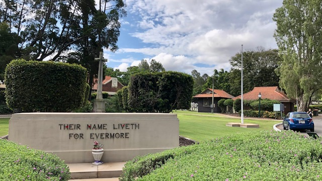

---

search:
  boost: 2  
---

#  Discover Toowong Cemetery

## Getting here

### Driving

If you're driving to the cemetery, it has two entrances:

- The main entrance (above), on the **[corner on Frederick Street and Mt Coot-tha Road, Toowong](https://www.google.com/maps/place/Toowong+Cemetery/@-27.4772749,152.9818283,17z/data=!3m1!4b1!4m5!3m4!1s0x6b9150c2f0f2e23f:0xf02a35bd720a310!8m2!3d-27.4772714!4d152.9839608)** can only be entered via a slip road approaching from the west.
- The back gate entrance, **[opposite 26 Richer St, Toowong](https://www.google.com/maps/place/25+Richer+St,+Toowong+QLD+4066/@-27.4737507,152.9767263,17z/data=!3m1!4b1!4m5!3m4!1s0x6b9150dd31b12cc5:0xc3a1deb2fe09484!8m2!3d-27.4737555!4d152.978915)** is much easier to access. 

Parking is available inside the cemetery along the roads. Please park on the left side of two‑way roads where possible.

### Walking

If you're walking, in addition to the entries above, you can enter via:

- the pedestrian ramp from Mt Coot-tha Road, opposite the Brisbane Botanic Gardens Mt Coot-tha
- Frederick Street gate that leads onto Steel Rudd Avenue (previously 4th Avenue)
- the many informal entries off Birdwood Terrance

### Public Transport

If you're using public transport to get here, use the [TransLink Journey Planner](https://jp.translink.com.au/plan-your-journey/journey-planner) to plan your trip.

## When you arrive

If you enter main entrance through the front gates, you'll find: 

- Canon Garland Place named after [Canon David John Garland](https://adb.anu.edu.au/biography/garland-david-john-6278). The Flagpole here is the departure point for [guided heritage tours](../guided-tours.md) and most [self-guided walks](../walks/index.md)
- the [Office](https://www.brisbane.qld.gov.au/community-and-safety/community-support/cemeteries/toowong-cemetery) - open from 9am-1pm Monday to Friday. Staff can answer your enquiries, including helping to locate graves and ashes memorial sites.
- an [Educational Museum](museum.md) operated by the Friends of Toowong Cemetery. 
- toilets, the only ones open in the cemetery.

If you enter via the Richer Street back gate, to get to Canon Garland Place:

- turn right into Dr. Lillian Cooper Drive (previously Boundary Road) and continue to the Shelter Shed 
- veer left at the Shelter Shed down the one‑way William Brown Avenue (previously 14th Avenue) 
- at the end, turn right into Emma Miller Avenue (previously 8th Avenue) to arrive behind Canon Garland Place, where you can park on the side of the road. 

## Map

Inside the cemetery you can get around by driving, walking, riding a bike or scooter. Some roads in the cemetery are very steep. 

Before you start, review the map.

<!-- Map -->
[][map]
<figcaption>[Toowong Cemetery](https://graves.brisbane.qld.gov.au) © Brisbane City Council 2016, used under [CC BY 4.0][map-cc-by]. Highlights added. Note: Old Road names shown.</figcaption>
<!-- Map links -->
[map]: ../assets/toowong-cemetery-map.png "Click to expand the map. Use Back to return to this page"
[map-cc-by]: https://creativecommons.org/licenses/by/4.0/  "Creative Commons Attribution 4.0 Licence"

### Road name changes

Some road names have recently been changed to the names of notable people interred on the road. Not all signs in the Cemetery have been updated to reflect these changes: 

- **Walter Hill Drive** was part of **Boundary Road** running parallel to Mt Coot-tha Road
- **Dr Lillian Cooper Drive** was part of **Boundary Road** running parallel to Richer Street
- **Pride of Erin Drive** was part of **Boundary Road** running parallel to Birdwood Terrace
- **Francis Forde** was part of **Boundary Road** running parallel to Birdwood Terrace closest to Frederick Street
- **Peter Jackson** was part of **Boundary Road** running parallel to Frederick Street furthest from the Front Gate
- **Soldiers Parade** was part of **Boundary Road** running parallel to Frederick Street closest to the Front Gate
- **Steele Rudd Avenue** was **4th Avenue**
- **Emma Miller Avenue** was the part of **8th Avenue** behind Canon Garland Place
- **Charles Heaphy Drive** was part of **8th Avenue** from the Shelter Shed to Emma Miller Avenue 
- **Pat Hill Drive** was part of **8th Avenue** from the Richer Street end to the Shelter Shed
- **O'Doherty Ave** was **11th Avenue**
- **Elizabeth Dale Walk** was **12th Avenue**
- **Canon Garland Avenue** was **13th Avenue**
- **William Brown Avenue** was **14th Avenue**
- **Federation Avenue** was **15th Avenue**

<!--
- **1st Avenue** unchanged
- **2nd Avenue** unchanged
- **3rd Avenue** unchanged
-->

<!--
- **5th Avenue** unchanged
- **6th Avenue** unchanged
- **7th Avenue** unchanged
-->

<!--
- **9th Avenue** unchanged. 
- **10th Avenue** unchanged
-->

!!! warning "Volunteer"

    Unfortunately signs are often vandalised in the cemetery. If you find a damaged of missing sign, please take a photo and [report it to the Brisbane City Council](https://forms.brisbane.qld.gov.au/report-it-missing-damaged-or-faded-traffic-signs)

<!--
Points to note: 

- Some roads are one way but not marked on the map.
- There is a large difference in height between the main entrance and Birdwood Terrace which runs parallel to the edge of the cemetery. 
- Fifth Avenue is especially steep.
- Fifteenth Avenue is a dead end but one of the highlights of the cemetery.
-->
