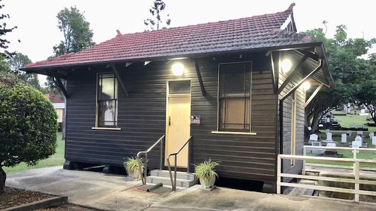

#  Toowong Cemetery Museum

<!-- photographs -->

A Museum is operated by the Friends of Toowong Cemetery. The Museum is open before and after our [guided heritage tours](../guided-tours.md). 
<!--
If you visit at other times, staff at the Office will be pleased to open the Museum for you. 
--> 

*<small>The Toowong Cemetery Museum is the former Sexton's office.</small>*

## The Museum's History

The Museum building, located over the open drain, was formerly the Sexton's office and was built at the turn of the century. It is a single storey, single skin timber framed building with terracotta tile roof. The two room structure is located above the floor of an earlier structure identified as the flower shed which was associated with the cultivation and selling of flowers from Portion 10. The internal partition wall was reconstructed, windows replaced and an adjoining store room was demolished as part of the museum conversion project carried out by the Brisbane City Council Heritage Unit in 1991. 
 
### Copyright

The Museum's History section is from [Toowong Cemetery](https://apps.des.qld.gov.au/heritage-register/detail/?id=601773) © The State of Queensland 1995–2021, used under [CC BY 4.0][cc-by].

<!-- Links -->

[cc-by]: https://creativecommons.org/licenses/by/4.0/  "Creative Commons Attribution 4.0 Licence"
