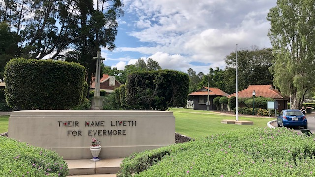

<!-- doesn't work on mobile 

--> 

<!-- Guests will be required to use the **[Check In Qld](https://www.covid19.qld.gov.au/check-in-qld)** App to check in. -->

# Guided Tours

!!! warning "COVID-19 Restrictions" 

    - Due to COVID-19 our guided tours are **limited to 15 guests** to enable social distancing to be maintained. 
    - Unfortunately we don't have a booking system, so guests will be invited to join us on a "first come, first served" basis. 
    - We apologise in advance if you come to the cemetery but are unable to join the tour due to it being over-subscribed. There are many **[self-guided walks](../walks/)** you can do as an alternative.

Friends of Toowong Cemetery volunteers guide you on 10 different heritage walks each year. 

![][image11]{ width="32%" } ![][image9]{ width="32%" } ![][image8]{ width="32%" }

Every walk is different and this drives our research and the creation of more **[Biographies](bios/index.md)**.

The **[Toowong Cemetery Museum](cemetery/museum.md)** will be open before and after the walk.

There's **no need to book**, just **meet under the flagpole, in Canon Garland Place at the Toowong Cemetery**. There is plenty of parking available inside the cemetery.

**Guided  tours are free** but a small donation is appreciated to help us continue **[our work](about/index.md)**. 

Wear a hat, enclosed shoes, and bring a water bottle.

{ width="97%" } 

*<small>The Flagpole in Canon Garland Place</small>*

## 6 March 2022

Our first heritage walking tour for 2022 will be guided by **Lyn** and **Darcy**. The tour is from **10:30 to 12:00 on Sunday 6 March 2022**. 

:fontawesome-regular-calendar-plus: **[Add to Calendar](../assets/calendar/fotc-tour-20220306.ics)**

## 3 April 2022

Our April heritage walking tour is from **10:30 to 12:00 on Sunday 3 April 2022**. 

:fontawesome-regular-calendar-plus: **[Add to Calendar](../assets/calendar/fotc-tour-20220403.ics)**

## 1 May 2022

Our May heritage walking tour is from **10:30 to 12:00 on Sunday 1 May 2022**. 

:fontawesome-regular-calendar-plus: **[Add to Calendar](../assets/calendar/fotc-tour-20220501.ics)**

## 5 June 2022

Our June heritage walking tour is from **10:30 to 12:00 on Sunday 5 June 2022**. 

:fontawesome-regular-calendar-plus: **[Add to Calendar](../assets/calendar/fotc-tour-20220605.ics)**

## 3 July 2022

Our July heritage walking tour is from **10:30 to 12:00 on Sunday 3 July 2022**. 

:fontawesome-regular-calendar-plus: **[Add to Calendar](../assets/calendar/fotc-tour-20220703.ics)**

## 7 August 2022

Our August heritage walking tour is from **10:30 to 12:00 on Sunday 7 August 2022**. 

:fontawesome-regular-calendar-plus: **[Add to Calendar](../assets/calendar/fotc-tour-20220807.ics)**

## 4 September 2022

Our September heritage walking tour is from **10:30 to 12:00 on Sunday 4 September 2022**.  

:fontawesome-regular-calendar-plus: **[Add to Calendar](../assets/calendar/fotc-tour-20220904.ics)**

## 2 October 2022

Our October heritage walking tour is from **10:30 to 12:00 on Sunday 2 October 2022**. 

:fontawesome-regular-calendar-plus: **[Add to Calendar](../assets/calendar/fotc-tour-20221002.ics)**

## 6 November 2022

Our November  heritage walking tour is from **10:30 to 12:00 on Sunday 6 November 2022**. 

:fontawesome-regular-calendar-plus: **[Add to Calendar](../assets/calendar/fotc-tour-20221106.ics)**

## 4 December 2022

Our last heritage walking tour for 2022 is from **10:30 to 12:00 on Sunday 4 December 2022**. 

:fontawesome-regular-calendar-plus: **[Add to Calendar](../assets/calendar/fotc-tour-20221204.ics)**

<!--

## 5 March 2023

Our first heritage walking tour for 2023 will be guided by **Lyn** and **Darcy**. The tour is from **10:30 to 12:00 on Sunday 5 March 2023**. 

:fontawesome-regular-calendar-plus: **[Add to Calendar](../assets/calendar/fotc-tour-20230305.ics)**

-->

<!--

## Private Guided Tours

We offer private guided heritage tours tailored to your needs. [Contact us](../about/#contact-us) to discuss your requirements. Price on Application. 

--> 

<!--
## Other Tours

Other volunteer groups and commercial operators run tours in the cemetery under licence from the Council. These tours are not associated with the Friends of Toowong Cemetery.

- **[Tragic Tales of Toowong Cemetery](https://www.fosbc.com/tours/tragic-tales-toowong-tour/)** is a unique night tour that focusses on some of the ghost stories, cemetery folklore and the horrible history surrounding this priceless heritage-listed site. Hear amazing true stories of the Moreton Bay Penal Settlement, Brisbane’s lost graveyard, horrific hangings, bloody murders, and, in among this horrible history, be prepared for some spine-tingling tales of the ghosts that are said to reside within Toowong Cemetery.

- **[Toowong Cemetery Ghost Tours](https://ghosttoursaustralia.com.au/brisbane-ghost-tours/toowong-cemetery-original/)** is a commercial tour run in the cemetery at night. 
-->

[image4]: assets/140-commemoration-sml.png
[image5]: assets/museum.jpg
[image6]: assets/federation-pavilion.jpg
[image7]: assets/peter-jackson.jpg "Peter Jackson's Headstone"
[image8]: assets/cherub.jpg "Cherub Headstone"
[image9]: assets/harry-potter-16x9.jpg 
[image10]: assets/clasped-hands.jpg "We Part To Meet Again"
[image11]: assets/pat-hill-headstone.jpg 
