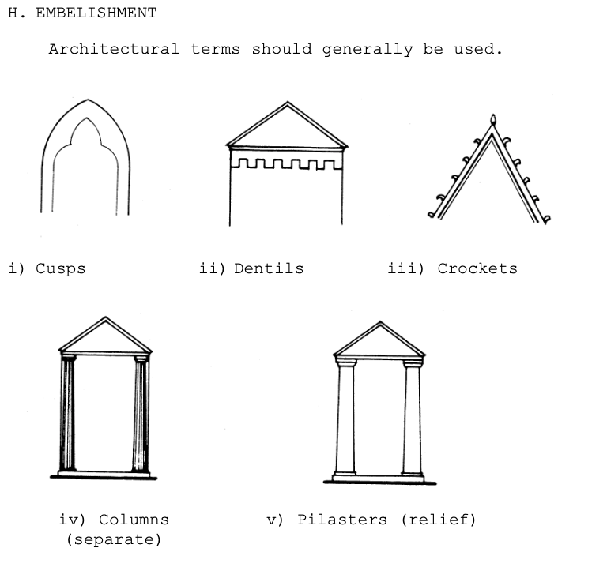

---
search:
  boost: 2  
---

#  Headstones

You will find many different types of headstones in Toowong Cemetery. Examples of each style are shown below. **[Read more about the meaning of the shapes and the symbols on headstones](headstone-symbology.md)**.

## Upright Slabs / Stelae

{ width="49%" } { width="49%" }

1. Rectangular
2. Cambered
3. Semicircular
4. Semicircular with shoulders
5. Semicircular with acroteria
6. Semicircular with cut away shoulders
7. Gothic
8. Gothic with shoulders
9. Gothic with acroteria
10. Ogee
11. Anthropomorphic
12. Anthropomorphic with peaked shoulders
13. Gabled 
14. Pedimented
15. Gabled with shoulders
16. Gabled with peaked 
17. Stepped shoulders
18. Cruciform
19. Cross surmount with shoulders
20. Circular surmount with shoulders
21. Diamond
22. Double
23. Stylised double 
24. Miscellaneous e.g. Heart

## Crosses

{ width="49%" }

1. Circular Latin
2. Rustic Latin
3. Roman/Latin (with 3 steps - Calvary)
4. Celtic
5. Saxon
6. Cornish
7. Eastern/Russian Orthodox
8. Lorrain

## Pillars

{ width="49%" } 

1. Pedestal (Champhered base)
2. Obelisk (Stepped base)
3. Column
4. Broken Column

## Sculptures

1. Urn
2. Draped Urn
3. Angel
4. Composite - Angel and Cross

## Horizontal Slabs

{ width="49%" }

1. Table
3. Altar
2. Table
4. Sarcophagus
5. Coffin
6. Slab and desk

## Desk Decoration

1. Tablet
2. Book
3. Scroll

## Miscellaneous

{ width="49%" }

1. Iron ‘Etna’ 
2. Cairn 
3. Rustic pedestal
4. Pyramid 
5. Stepped Pyramid

## Surrounds

These are usually distinguished by material and motif. Examples: 

Materials: 

- Cast iron 
- Wrought iron
- Stone
- Wood
- Concrete
- Brick
 
 Motifs: 
 
- Arrowheads
- Fler de Lys
- Floral Motif

Examples: 

- Timber Picket
- Iron Picket
- Stone

## Embelishment

{ width="49%" }

Architectural terms should generally be used.

1. Cusps
2. Dentils 
3. Crockets
4. Columns (separate)
5. Pilasters (relief) 

## Acknowledgements

[Guidelines for Cemetery Conservation](https://www.nationaltrust.org.au/services/cemetery-conservation/), Second Edition 2009, The National Trust (New South Wales)

  
