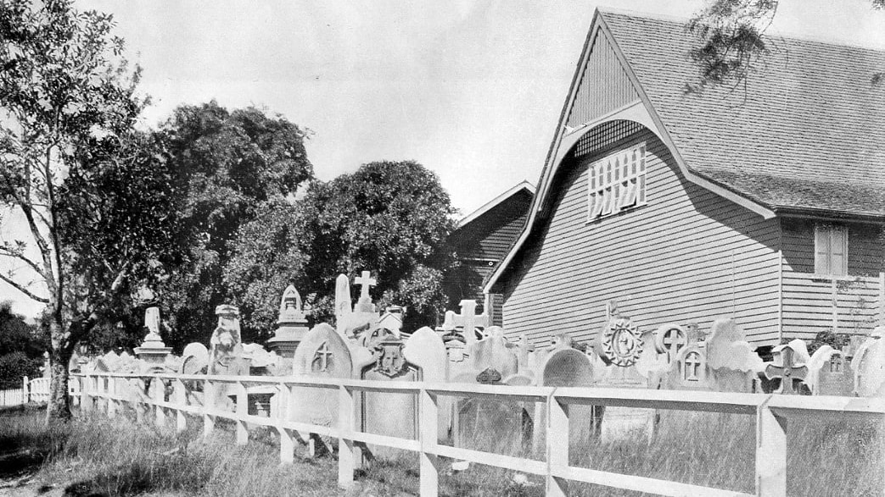

# Lost Paddington Cemetery Headstones 

By 1914, headstones from the closed Paddington Cemetery that hadn't been relocated to other cemeteries were placed in a reserved area beside [Christ Church Milton](https://apps.des.qld.gov.au/heritage-register/detail/?id=600252). 

In the 1930's these headstones disappeared. Some of the headstones have been found buried in Toowong Cemetery.

*<small>[Paddington Cemetery ca. 1900's](https://library-brisbane.ent.sirsidynix.net.au/client/en_AU/search/asset/22186/1) — Brisbane City Council. Cropped. This photo is captioned 'Memorials standing in the reserved area' in Volume 2 of the 1914 Parliamentary papers.</small>*

## Paddington Cemetery Headstones moved to the Reserved Area 

The table below lists Paddington Cemetery headstones that were placed in the reserved area.

??? warning "Work in progress"

    - Appendix 1 in Volume 2 of the 1914 Parliamentary papers, states 505 headstones were placed in the reserved area:
        - 278 Episcopalian (Anglican)
        - 78 Roman Catholic
        - 80 Presbyterian
        - 43 Congregational and Wesleyan-Methodist
        - 26 Baptist
        - 0 Jewish
    - There are 504 unique entries in the table below.    
    - an entry has been made for each person listed against a headstone so details about each person can be annotated separately.
    - There are 13 'same as' entries. 'same as' entries in the source are shown under a different headstones identifier. These may refer to the same headstone but were listed separately to create an alphabetic index by surname.
    - Headstone numbers have been prefixed to make them unique:
        - Roman Catholic prefixed with '3'
        - Presbyterian prefixed with '4'
        - Wesleyan-Methodist and Congregational prefixed with '5'
        - Baptist prefixed with '6'
    - If a link is shown on an entry, the headstone has been found at Toowong Cemetery. The link goes to a page describing the headstone.    

--8<-- "snippets/paddington-cemetery-reserved-area-memorials.html"

*<small>Source: [Paddington Cemetery](https://library-brisbane.ent.sirsidynix.net.au/client/en_AU/search/asset/24749/0). Appendix No.7 in Volume 2 of the 1914 Parliamentary papers - Brisbane City Council Archives. Edits shown in *italics*</small>*

## Abbreviations

Abbreviations used in the list of memorials above, are shown in the table below. 

| Abbreviation | Name or Honorific Prefix |
| -----------  | ----------- |
| Alf.         | Alfred      |
| Capt.        | Captain     |
| Chas.        | Charles     |
| Ed.          | Edward      |
| Eliz.        | Elizabeth   |
| Fredk.       | Frederick   |
| Geo.         | George      |
| Hy.          | Henry       |
| Jcs. perhaps Jos.? |        | 
| Jos.         | Joseph      |
| Margt.       | Margaret    |
| Rev.         | Reverend    |
| Rich.        | Richard     |
| Robt.        | Robert      |
| Thos.        | Thomas      | 
| Theop.       | Theophillus | 
| Wm.          | William     |

It is not known if these abbreviations were used on the headstones. Monument 107 recorded as 'E. Hartnoll' has the inscription 'Eliza' on the  headstone.

{ width="100%" }

*<small>Eliza Hartnoll's headstone discovered in a Toowong Cemetery Archaeological Dig.</small>*

## Download the data

The [Paddington Cemetery Reserved Area Headstones](lost-paddington-headstones.md) by [Friends of Toowong Cemetery Association Inc.](../index.md), is licensed under [CC BY 4.0](https://creativecommons.org/licenses/by/4.0/). You must provide attribution if you reuse this work.

Download the Paddington Cemetery Reserved Area Headstones as a <a href="../../assets/data/lost-paddington-cemetery-headstones.csv" download>Comma Separated Value file</a> (.csv) 
