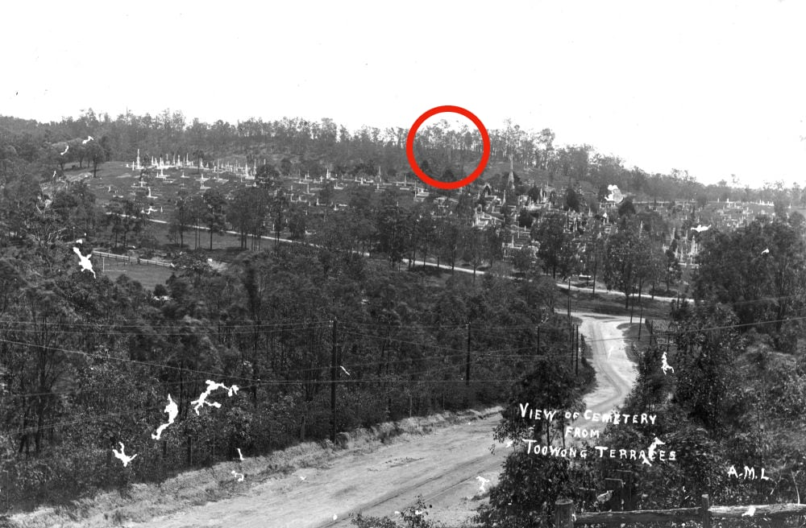
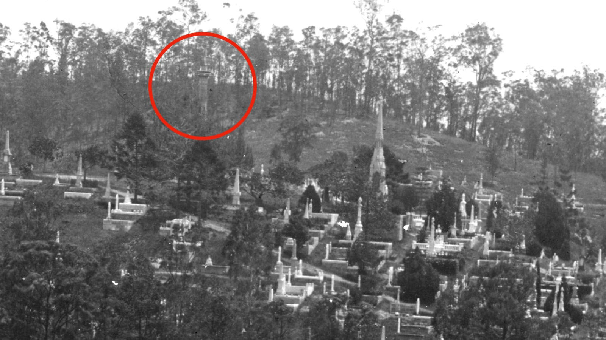

---
hide:
  toc
search:
  boost: 1
---

#  History Mystery 

In the photo below is a mysterious structure that we haven't been able to explain.

{ width="100%" }  

*<small>[View of the Toowong Cemetery, Brisbane, ca. 1895](http://onesearch.slq.qld.gov.au/permalink/f/1upgmng/slq_alma21220036030002061) — [State Library of Queensland](https://www.slq.qld.gov.au). Annotation added</small>*

Look closer and let us know if you have any clues on what this mysterious structure might be. 

{ width="100%" }  

*<small>[View of the Toowong Cemetery, Brisbane, ca. 1895](http://onesearch.slq.qld.gov.au/permalink/f/1upgmng/slq_alma21220036030002061) — [State Library of Queensland](https://www.slq.qld.gov.au). Cropped and annotated added.</small>*
