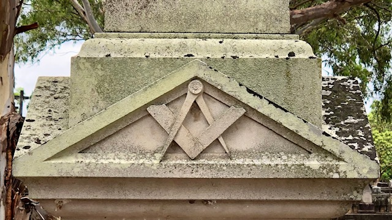
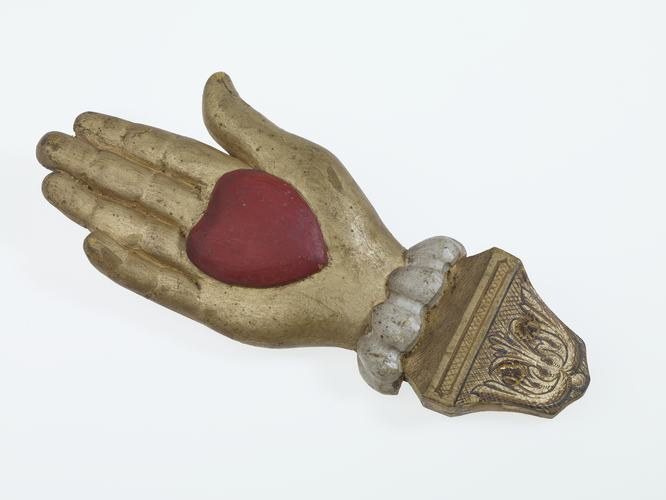

---
search:
  boost: 1
---

#  Headstone Signs

Freed from the restrictions of parish churchyards, municipal cemeteries provided an outlet for expression of individualism which reached its zenith in the mid to late Victorian Era. The headstone reflected the deceased's cultural identity by its inscription, material, shape, symbol, or sign. These headstones are a reminder of how varied Brisbane society was from the late 1870s to the outbreak of World War One.

## Friendly Societies

Friendly societies were mutual aid organisations designed to help predominately working-class people insure themselves against destitution caused by death and illness. Many operated funeral clubs which for a few pence a month protected the contributors from the perceived disgrace of a pauper's grave.

{ width="45%" }  { width="49%" }  

*<small>[Members of the Ancient Order of Forester, Court Brunswick, Brisbane, 1922](http://onesearch.slq.qld.gov.au/primo-explore/fulldisplay?docid=slq_alma21218746750002061&context=L&vid=SLQ&lang=en_US&search_scope=DT&adaptor=Local%20Search%20Engine&tab=dt&query=any,contains,Ancient%20Order%20of%20Foresters&offset=0), State Library of Queensland</small>*  
*<small>[Australian Natives' Association's allegorial display, Brisbane, 1901](http://onesearch.slq.qld.gov.au/primo-explore/fulldisplay?docid=slq_digitool125779&context=L&vid=SLQ&lang=en_US&search_scope=DT&adaptor=Local%20Search%20Engine&tab=dt&query=any,contains,Australian%20Natives%20Association&offset=0), State Library of Queensland</small>*

Most organisations had rules, ranks and rites and developed a symbolic language which identified its members either by acronym or sign. Members were expected to turn out at funerals of the brethren or close relatives.

## Masonic Orders

Most cemetery visitors are familiar with the compass and square, the working tools of the Masonic orders, but these have variations which inform the knowledgable passer-by the rank held by the deceased in the organisation, such as the number of dots on the square. The "G" in the centre may be interpreted as "God" by speculative Masons, and as "Geometry" by operative Masons. 

{ width="50%" }  

## Odd Fellows

The Odd Fellows were so named because they were originally drawn together from an odd variety of trades with insufficient numbers to form their own trade guilds. Their three-link chain stands for Friendship, Love and Truth. A variation is a monogram consisting of the letters F, C and B for friendship, charity and benevolence. Charity is also represented by a hand holding a heart and is most often associated with the Manchester Unity Independent Order of Odd Fellows (MUIOOF).

{ width="47%" }  { width="49%" }  

*<small>[Wooden Hand - Heart in Hand](https://collections.museumsvictoria.com.au/items/251958), Museums Victoria </small>*  
*<small>[Manchester Unity Independent Order of Odd Fellows, ca. 1910](https://digital.slq.qld.gov.au/delivery/DeliveryManagerServlet?change_lng=en&dps_pid=IE1413410), State Library of Queensland</small>*

<!-- 
## Design elements

Some design elements...

### Columns

A common indicator of a life has been cut off short is...

### Paving

According to the Masonic tradition…

### Crown

To lay down th cross and pick up the crown of glory...

### Time Flies

The winged hourglasses reminds us how quickly our life passes and...

### Plants

Plants both living and carved are replete with symbolism...

--> 

## Acronyms

These acronyms can be found on headstones in Toowong Cemetery.

??? example "Usage Tips" 

    - Click a column name to sort the table.
    - An example of where the acronym can be found is shown in the Plot-Section-Grave column
        - Where a Plot number is unknown, a placeholder value of "pp" is used
        - Where a Section number is unknown, a placeholder value of "ss" is used
        - Where a Grave number is unknown, a placeholder value of "gg" is used. Learn more about [finding graves at Toowong Cemetery](../cemetery/finding-graves.md).

| Acronym | Meaning                                                      | Organisation     | Plot-Section-Grave |
|     --: | :--                                                          | :--              | :--                |
| AHCG    | [Australasian Holy Catholic Guild][AHCG]                     | Friendly Society | pp-ss-gg           |
| AOOF    | Ancient Order of Odd Fellows                                 | Friendly Society | pp-ss-gg           |
| ANA     | [Australian Natives Association][ANA]                        | Friendly Society | pp-ss-gg           |
| AOF     | Ancient Order of Foresters                                   | Friendly Society | 1-29-8             |
| EC      | English Constitution                                         | Freemasonry      | pp-ss-gg           |
| GUOOF   | Grand United Order of Odd Fellows                            | Friendly Society | pp-ss-gg           |
| HACBS   | Hibernian Australia Catholic Benefit Society                 | Friendly Society | pp-ss-gg           |
| IC      | Irish Constitution                                           | Freemasonry      | pp-ss-gg           |
| INF     | Irish National Foresters                                     | Friendly Society | pp-ss-gg           |
| IOGT    | [Independent Order of Good Templars][IOGT]                   | Temperance       | pp-ss-gg           |
| IOOF    | Independent Order of Odd Fellows                             | Friendly Society | pp-ss-gg           |
| IOR     | Independent Order of Rechabites                              | Temperance       | pp-ss-gg           |
| LOI     | [Loyal Orange Institute][LOI]                                |                  | pp-ss-gg           |
| MUIOOF  | [Manchester Unity Independent Order of Odd Fellows][MUIOOF]  | Friendly Society | 9-16-9           |
| NIOOF   | National Independent Order of Odd Fellows                    | Friendly Society | pp-ss-gg           |
| ODT     | Order of the Daughters of Temperance                         | Temperance       | pp-ss-gg           |
| OES     | Order of the Eastern Star                                    | Friendly Society | pp-ss-gg           |
| OST     | Order of the Sons of Temperance                              | Temperance       | pp-ss-gg           |
| PAFS    | Protestant Alliance Friendly Society                         | Friendly Society | pp-ss-gg           |
| RA      | [Royal Arch][RA]                                             | Friendly Society | pp-ss-gg           |
| RAOB    | Royal Antediluvian Order of Buffaloes                        | Friendly Society | pp-ss-gg           |
| RBP     | [Royal Black Preceptory][RBP] [^1]                           |                  | pp-ss-gg           |
| SC      | Scottish Constitution                                        | Freemasonry      | pp-ss-gg           |
| UAOD    | [United Ancient Order of Druids][UAOD]                       | Friendly Society | pp-ss-gg           |
| UGL     | [United Grand Lodge of Ancient, Free and Accepted][UGL]      | Freemasonry      | pp-ss-gg           |

!!! question "Volunteer opportunity"

    Have you found the location of an Acronym? [Contact us](../about/index.md#contact-us) with a photo and the details. 

![William Wayte Headstone 1-29-8][1-29-8]{ width="32%" }  ![The Eye of Providence 9-16-9][eye-of-providence]{ width="32%" } [![William Thomas Birkbeck 9-16-9][9-16-9]{ width="32%" }](https://trove.nla.gov.au/newspaper/article/186543823)

<!-- PPCM Permanent President Courts Martial https://www.awm.gov.au/learn/glossary/p -->

## Today

Some of these organisations have evolved to become financial services companies, such as: 

- The Independent Order of Odd Fellows became [IOOF](https://www.ioof.com.au/about-us/about-ioof), who in late 2021 decided to rebrand as Insignia Finance. 
- The Ancient Order of Foresters evolved into [Foresters Financial](https://forestersfinancial.com.au/about-us/our-history/).
- In 1993, the Australian Natives Association merged with Manchester Unity Independent Order of Odd Fellows to become [Australian Unity](https://www.australianunity.com.au/about-us/our-story).

You can find signs of Friendly Societies in the local area such as: 

- [Foresters Hall](https://apps.des.qld.gov.au/heritage-register/detail/?id=601662) 16 Latrobe Terrace, Paddington.
- [Baroona Hall](https://www.qld.gov.au/recreation/arts/heritage/experience/music-trail/baroona-hall) in Caxton St, Milton, built for the United Brothers Lodge of the Order of Odd Fellows.
- [Royal Antediluvian Order of Buffaloes Lodge Hall](https://heritage.brisbane.qld.gov.au/heritage-places/1827) in Woolloongabba.

## Further Reading

Harwood, J. *The Freemasons* London, Hermes House, 2006

[^1]: An extension of the Loyal Orange Institute

<!-- links -->

[AHCG]: https://trove.nla.gov.au/newspaper/article/261238209?searchTerm=Australasian%20Holy%20Catholic%20Guild "AHCG on Trove"
[ANA]: https://www.nma.gov.au/defining-moments/resources/australian-natives-association
[IOGT]: https://movendi.ngo/about-movendi/the-movendi-way/who-we-are/the-history/
[LOI]: https://www.facebook.com/pages/category/Religious-Organization/Loyal-Orange-Institution-of-Queensland-895315537148498/ "Loyal Orange Institute Queensland on Facebook"
[MUIOOF]: https://www.facebook.com/groups/535759726633938/?ref=share
[RA]: https://www.royalarch.org.au
[RBP]: http://royalblack.org/mission-statement/our-history/
[UAOD]: https://en.wikipedia.org/wiki/United_Ancient_Order_of_Druids "UAOD on Wikipedia"
[UGL]: https://uglq.org.au

[1-29-8]: ../assets/sign-aof.jpg "William Wayte Headstone - Ancient Order of Foresters (1-29-8)"
[eye-of-providence]: ../assets/eye-of-providence.jpg "The Eye of Providence (9-16-9)"
[9-16-9]: ../assets/muioof-william-thomas-birkbeck-ppcm.jpg "William Thomas Birkbeck - Manchester Unity Independent Order of Odd Fellows (9-16-9)"
