---
search:
  boost: 2  
---

#  Headstone Symbolism

The Toowong Cemetery is a Brisbane icon and was once the city's main cemetery. Toowong Cemetery officially opened in July 1875, however burials took place from 1871 (most notably Queensland's second governor, Colonel Samual Blackall in 1871).

Toowong Cemetery opened during Queen Victoria's life (1819 - 1901) and you'll see the traditions and symbols from her reign throughout the cemetery.

In section 2 of the cemetery, at the intersection of Soldiers Parade and Garland Avenue, you'll find a display of symbols on headstones from the old Paddington Cemetery which closed in 1914. 

<!-- link to map --> 

Headstones within the Cemetery come in many shapes and sizes. Throughout the first half of the 19th Century headstones featuring bust of heads and shoulders were very popular. However by the 1880's angels, messengers of God and pillars had become fashionable. Most of these were placed on a three-tiered base, to represent faith, hope and charity. 

## The Cross

The cross comes in a variety of shapes. The Celtic cross (with its arms enclosed in a circle) was used mostly by those of Irish origin prior to the end of the 19th Century before they became a popular choice (regardless to national heritage). The unadorned cross was known as the Calvary cross, representing Christ's crucification. The Orthodox cross with three bars symbolises the cross Christ was crucified on, with the title board (top bar), the bar on which the Lord's hands were nailed (middle bar) and the footrest (bottom bar).

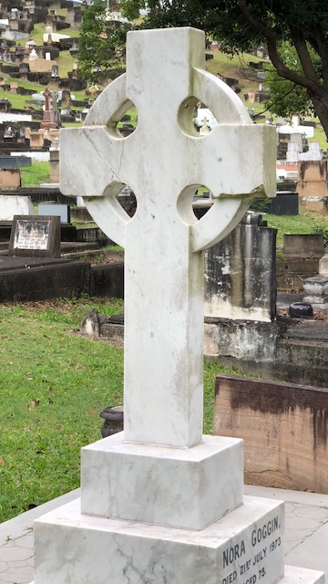{ width="30%" } 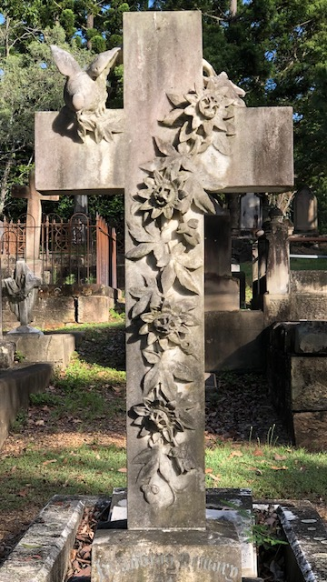{ width="30%" } 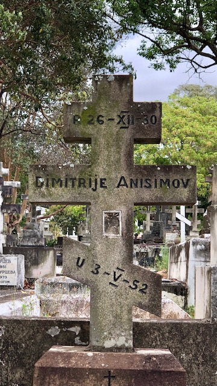{ width="30%" }

## Columns

Columns are indicative of heaven and their height implies the social status of the person buried. A broken column represents the break between life on earth and in heaven, and also a life cut short. Columns were also used to represent the loss of the head of family.

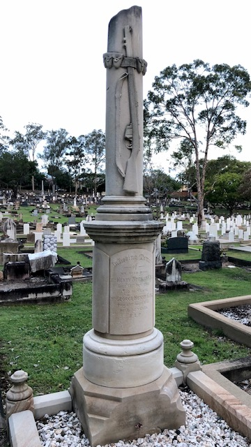

## Crown

A crown was often used to represent the "sovereignty of the Lord".

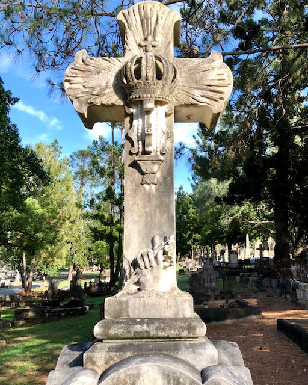
<!-- add caption and plot id -->

## Harp or Lyre

A harp or lyre symbolises hope, joy and music. It was the symbol of St. Cecila, the Patron Saint of Musicians, and is often associated with worship in heaven. This can be seen on the grave of Joseph Phillips (10-8-12).

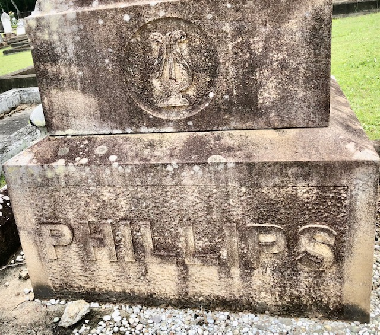

## Ship's Anchor

A ship's anchor was commonly used to commemorate the life of a sailor or someone with a maritime career. 

<!-- add caption and plot id -->

## Obelisk

An obelisk is defined as a thin, four-sided tapering monument ending in a pyramid at the top. The height of the obelisk also indicates the importance of the deceased. 

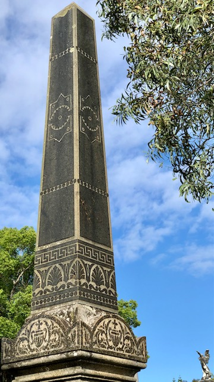
<!-- add caption and plot id -->

## Clasped hands

Clasped hands symbolise the belief Victorians held that they would be reunited with their loved ones after death. If you look carefully at the cuffs of those shaking hands, you can often see that they are male and female. This can be seen are the grave of Herman Wuiski and his wife Emily (1-50A-10).

<!-- add caption and plot id -->
<!-- get photo of of Herman Wuiski and his wife Emily (1-50A-10) -->

## Plants

Plants can represent a person's birthplace (such as thistles from Scotland) and also reflect religious meanings. See the grave of Michael McCormack and his wife Elizabeth (1-20-9) where ivy symbolises hope and mortality. Roses are another symbol that has multiple interpretations (including beauty, hope and love) and they are often associated with the Virgin Mary. The age of the deceased can also be revealed by the size of the flower or plant - a bud represents a child, and a full flower represents an adult. 

{ width="30%" }  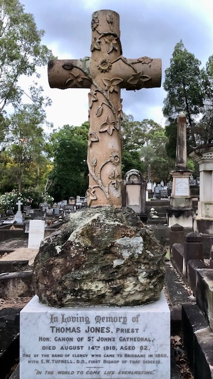{ width="30%" }  { width="30%" } 

<!-- add caption and plot id -->
<!-- Get photo of Michael McCormack and his wife Elizabeth (1-20-9) -->

!!! question "Volunteer opportunity"

    Contribute a photo of a headstone with a thistle, rose or other plant on it. Tell us where you found it. 

## Urns

Urns are a Greek symbol of mourning and represent the process of death, where the body becomes dust while the spirit rests with God. When the urn is draped it becomes a symbol of the house mourning.

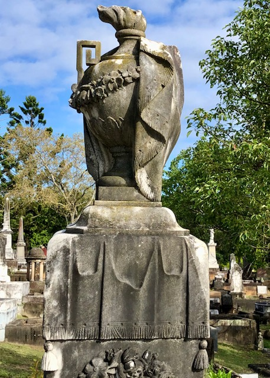
<!-- add caption and plot id -->

## Animals

Animals symbolise the character of the deceased. Lambs were often used as a symbol of innocence and found on the graves of children, while lions were used as a symbol of courage. Visit the grave of heavyweight boxing champion Peter Jackson (5-28-1) which is adorned with a lion.

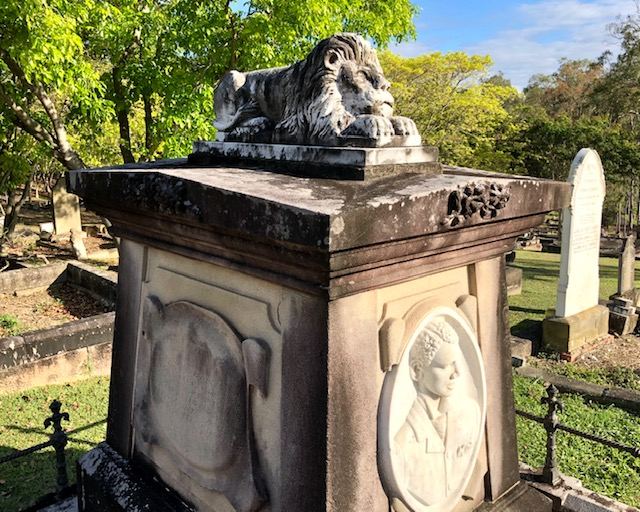
<!-- add caption and plot id -->

## IHS Emblem

The IHS Emblem is from the Greek alphabet, (I) Iota, (H) Eta, and (Σ) Sigma and represents the first Greek word for Jesus or Christ. 

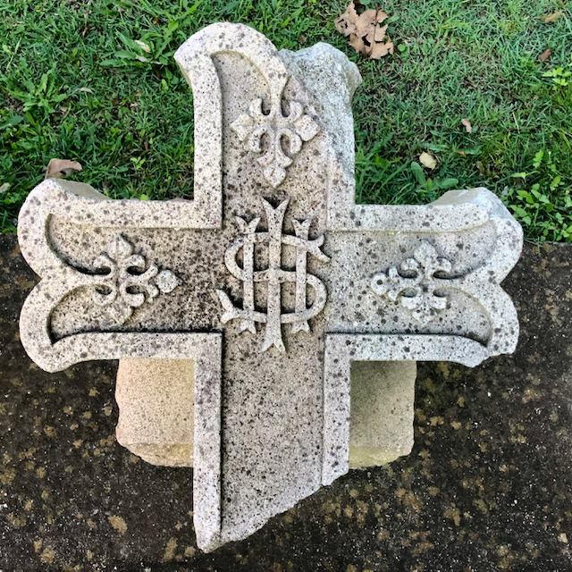
<!-- add caption and plot id -->

## Books

Books often symbolise the Bible and the faith of its reader. An open book has also been associated with the human heart.

<!-- photos --> 
<!-- add caption and plot id -->

## Lost and Found

In Steele Rudd Avenue you'll find a collection of broken headstones. [Where did they come from?](../about/archaeological-digs.md) Why are they here? What is planned? 

<!-- add caption and plot id -->

## Source

Gillon, E. (1972). [Victorian Cemetery Art][Victorian Cemetery Art]. New York: Dover Publications 

## Further Reading

The National Trust of Australia (New South Wales) [Guidelines for Cemetery Conservation](https://www.nationaltrust.org.au/services/cemetery-conservation/) has further information on headstone and monument conservation, terminology and symbology. 

### Copyright

Toowong Cemetery Symbolism © [Brisbane City Council](https://www.brisbane.qld.gov.au) 2016, used under [CC BY 4.0][cc-by]. Minor formatting changes, Lost and Found section, photos and links added.

Toowong Cemetery Headstone Symbolism photographs © 2021 by Stephen Gates is licensed under [CC BY 4.0][cc-by].

<!-- Links -->

[cc-by]: https://creativecommons.org/licenses/by/4.0/  "Creative Commons Attribution 4.0 Licence"
[Victorian Cemetery Art]: http://onesearch.slq.qld.gov.au/primo-explore/fulldisplay?docid=slq_alma21121028210002061&context=L&vid=SLQ&lang=en_US&search_scope=SLQ_PCI_EBSCO&adaptor=Local%20Search%20Engine&tab=all&query=any,contains,Victorian%20Cemetery%20Art "Victorian Cemetery Art in the State Library of Queensland Catalogue"
