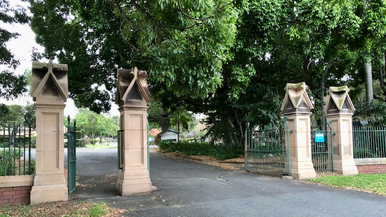

#  Friends of Toowong Cemetery

**Friends of Toowong Cemetery is a volunteer group that discover and share the history and stories of Toowong Cemetery.**

{ width="200" } { width="200" } { width="200" } { width="200" } 

The heritage‑listed Toowong Cemetery is the largest cemetery in Queensland and over 190,000 people are buried there. It was established in 1866 and officially opened on 5 July 1875.

<!-- What is planned for the 150th commemoration? -->

On this site you'll find information about:

- visiting **[the cemetery](cemetery.md)**, exploring its history, and a map to guide you
- monthly **[guided heritage tours](guided-tours.md)** and **[self‑guided walks](walks/index.md)** 
- the symbology of the **[headstones](headstones.md)**
- the **[biographies](bios/index.md)** of people interred at the cemetery
- **[Friends of Toowong Cemetery](about/index.md)** - what we do, how to join in, and contact details

<!-- insert photos and map -->
<!--
Tagline: 

- Rediscovering local stories
- Discovering and sharing Brisbane's history
- Discovering and sharing our local history
- Retelling local history
- Sharing our local history
- Rediscovering Brisbane's history
- Sharing local stories
- Discovering and sharing local history
-->
