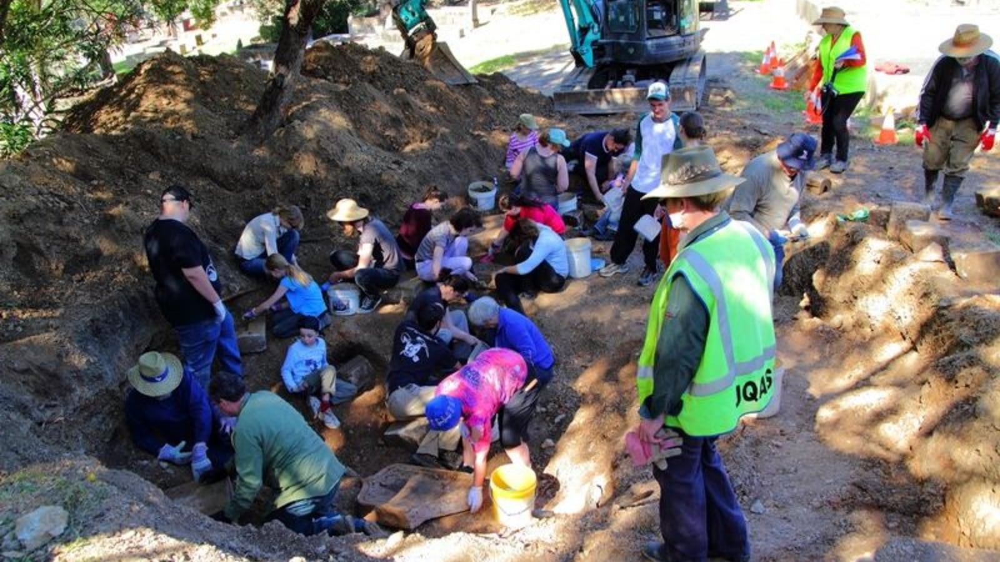

---
search:
  boost: 1  
---

# News 2022 

---

## Guided Tour <small>6 Feb 2022</small>

Our first guided heritage walking tour for 2022 will be hosted by **Lyn** and **Darcy**. The tour is from **10:30 to 12:00 on Sunday 6 February 2022**. 

There is **no need to book**, just **meet under the flagpole, in Canon Garland Place at the Toowong Cemetery**. There is plenty of parking available inside the cemetery.

{ width="97%" } 

*<small>The Flagpole in Canon Garland Place</small>*

**Wear a hat, enclosed shoes, and bring a water bottle.**

**Guided tours are free but a small donation is appreciated to help us continue [our work](about/index.md)**. 

--- 

## Meeting <small>23 Feb 2022</small>

The Friends of Toowong Cemetery will meet for the first time in 2022 on **Wednesday 23 Feb at 6pm**.

Join us at [Mt Coot-tha Botanical Gardens Auditorium](https://www.brisbane.qld.gov.au/things-to-see-and-do/council-venues-and-precincts/parks/botanic-gardens-in-brisbane/brisbane-botanic-gardens-mt-coot-tha). There is plenty of parking available. 

If you're not a member, come along and meet the team. If you'd like to get involved, you can [join the Friends of Toowong Cemetery](../about/#join-us).

{ width="98%" }   

<!-- picture of members -->

---

## Archaeological Dig <small>May 2022</small>

Watch the **[Archaeology Week](https://archaeologyweek.org/events-list?category=Qld
)** website for confirmation of the date of the next dig in Toowong Cemetery.

{ width="98%" }   

---
