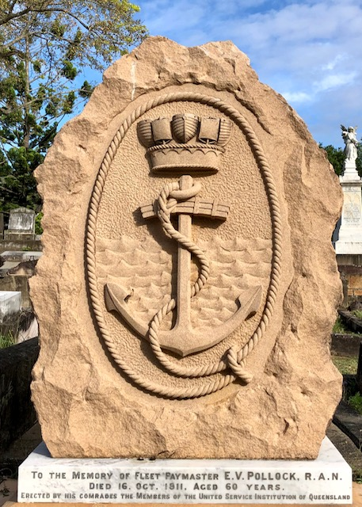

# Anchors Aweigh! 

**Maritime stories from Toowong Cemetery**

The anchor is a symbol found on many Christian graves but it does not necessarily point to a maritime career. The source for the symbol is Hebrews 6:19, 

>Which hope we have as an anchor of the soul, both sure and steadfast.

The allegorical figure, Hope, is often shown holding an anchor. Anchors may be shown with its rope crudely cut or a broken chain link to indicate the deceased has been removed from the land of the living, often prematurely.

{ width="40%" }   

--8<-- "snippets/william-john-harrhy.md"

## Prentice Family <small>(9‑41‑1)</small>

Jessie Blanche Prentice, the daughter of George (Jun.) and Jessie Lacy Prentice, was lost with her grandfather, George Prentice, in the wreck S.S. Quetta in Torres Strait on 28 February 1890. The steamship struck an uncharted rock and sank in three minutes claiming 134 lives, mostly women and children. Many victims were prominent Queensland citizens, bound for London, including Toowong resident, Alexander Archer, manager of the Bank of New South Wales. There were 158 survivors.

--8<-- "snippets/henry-lander-pethebridge.md" 

## George Davidson <small>(13‑7‑1)</small>

George was for many years the Superintendent Engineer to the Australasian Steam Navigation Company, Sydney. He died on 29 February 1888 aged 47. He was the son of Archibald Davidson and Janet Fyfe. His memorial is a distinctive ship’s boiler plate set in the ground.

--8<-- "snippets/william-smith.md"

--8<-- "snippets/charles-stewart-thow.md"

--8<-- "snippets/david-muir.md"

--8<-- "snippets/tom-george-johnson.md"

--8<-- "snippets/william-collin.md"

## Able Seaman Archibald Edward Bartsch <small>(10‑44‑20)</small>
## Warrant Officer Henry Theeman <small>(10‑41‑21)</small>
## Steward Eric Ross Harrison <small>(10‑43‑7)</small>

On the 4^th^ of March 1942, the auxiliary minesweeper HMAS Tambar was fired on by the Examination Battery at Fort Cowan Cowan on Moreton Island. The military covered up the incident so as not to affect morale. The Tambar’s crew was dispersed throughout the RAN immediately after the men’s joint funeral two days later. The ship was temporarily paid off and the Captain given another command. The service was conducted by the Rev. H. H. Trigge of the Methodist Church and the Church of England’s Rev. F. R. C. Birch. Cannon and Cripps arranged the funeral.

There was a mix up in the identification code signal of the ship and the battery was ordered to fire across the bow of the unidentified vessel. The 6‑inch shell struck the ship’s forecastle killing Able Seaman Archibald Bartsch, a member of the anchor party, instantly. The shell skidded across the deck into the Captain’s cabin killing Steward Eric Harrison. It then passed through the radio room critically injuring Warrant Officer Henry Theeman. Both of his legs were severed and his succumbed to his injuries soon after. Other crew received injuries to various degrees. London‑born Theeman was aged 47. Bartsch, son of 3^rd^ Light horseman William Henry Bartsch, was an employee if the Australasian United Paint Company of Port Augusta, South Australia prior to his enlistment in the navy. He was aged 20. Western Australian‑born Harrison was the son of William Ross and Rebecca Harrison. He was aged 33 from Melbourne.

--8<-- "snippets/john-burke.md"

## Further Reading 

- Broomham, Rosemary Steady Revolutions: The Australian Institution of Marine and Power Engineers 1881-1990 New South Wales University Press, 1991
- Hempel, J. A. ‘Collin, William (1834-1914)’, Australian Dictionary of Biography, Vol. 3 Melbourne University Press, 1969, p. 441

## Acknowledgements

- Compiled by Hilda Maclean
- Captain John Burke research by David Larkin

<!--

## Brochure

**[Download this walk](../assets/guides/anchors-aweigh.pdf)** - designed to be printed and folded in half to make an A5 brochure.

-->
