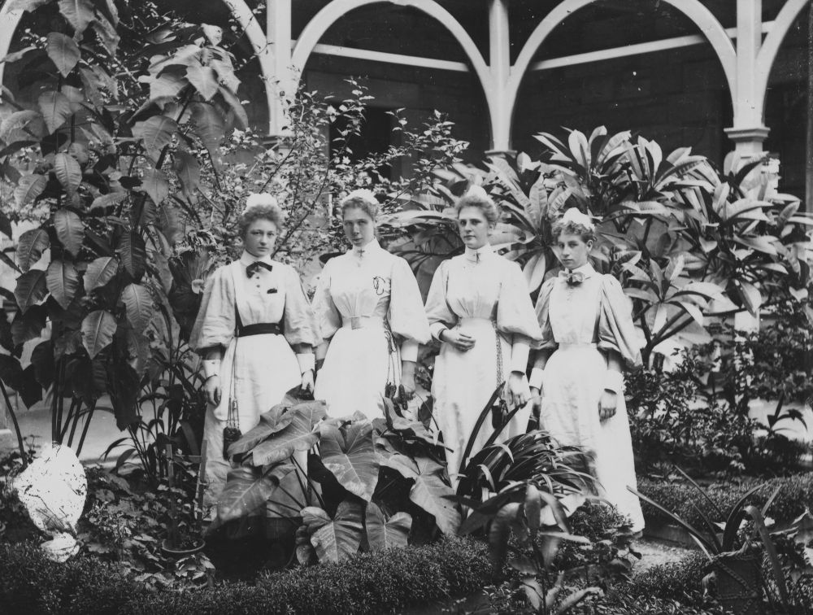
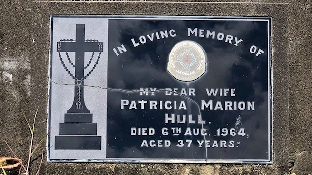
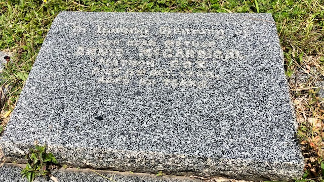
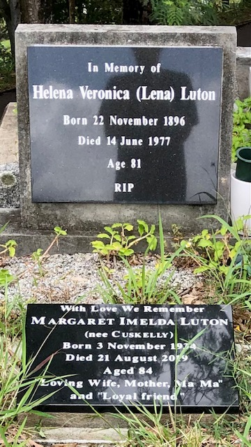
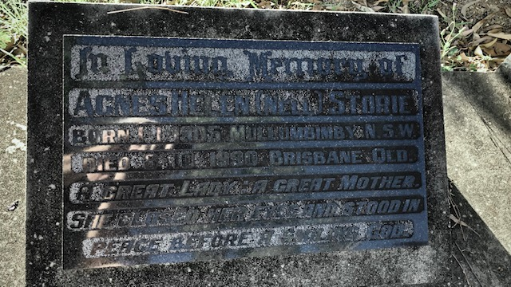

# In their caring hands  

**Commemorating the role of nurses, doctors and other health professionals**

At Toowong Cemetery are many health professionals; nurses, doctors, dispensers and others, some of whom gave their lives in the course of their duties. This is just a small number of those people who spent their working lives caring for others.

<!-- 

-->

## Mary Elizabeth Weedon and Annie Griffiths <small>(4‑3‑20)</small>

Mary Weedon, who trained at London’s Charing Cross Hospital, was the first head nurse of the Brisbane Hospital, holding the position for five years from 1885. She was the Vice‑President of the Australasian Trained Nurses’ Association (ATNA), Queensland Branch from 1904 to 1905 and a councillor from 1905 to 1906. She and her friend, Annie Griffiths, shared a house called *Garton* in Terrace Street, Toowong for many years. They were also members of the congregation of St Thomas Anglican Church. They died within eighteen months of each other; Mary in March 1942 and Annie in July 1943.

{ width="70%" }  

*<small>[Royal Brisbane Hospital, ca. 1885](http://onesearch.slq.qld.gov.au/permalink/f/1upgmng/slq_alma21271923160002061) — State Library of Queensland.</small>*

--8<-- "snippets/edith-harriett-rennie.md"

--8<-- "snippets/nina-robertson-mcdonald.md"

--8<-- "snippets/elsie-muriel-jones.md"

--8<-- "snippets/julia-harriett-blaycock.md"

--8<-- "snippets/alice-maud-mary-le-bas.md"

--8<-- "snippets/emily-owen.md"

<!-- page -->

--8<-- "snippets/mary-constance-crosse.md"

--8<-- "snippets/james-gray.md"

--8<-- "snippets/florence-truelove.md"

--8<-- "snippets/rose-jane-walker.md"

--8<-- "snippets/sarah-stevens-lygo.md"

--8<-- "snippets/arthur-charles-frederick-halford.md"

--8<-- "snippets/vera-evelyn-james.md"

## Mary Jane Brown <small>(5‑63‑24)</small>

Mary Jane Brown, born ca 1861, was working as a nurse when she was widowed in 1916. She died on 18 August 1939 aged 78.

## Nora Halford and Catherine Fitzgerald <small>(7A‑102‑23A)</small>

Nora and Catherine were the daughters of Cornelius and Catherine Fitzgerald. They had emigrated from Ireland in the late 19^th^ century. Nora received her Brisbane Hospital Certificate in 1894 and remained on the staff. Nora was a charge nurse from 1897 to 20 February 1899 when she left to marry Dr Arthur Halford (see above). Nora died on 9 August 1932 aged 63. She is buried with her sister Catherine Fitzgerald who was also trained nurse. 

Catherine received her Brisbane Hospital Certificate in 1896 and remained on staff as a ward nurse until 1898. Catherine was one of the first councillors of ATNA, Queensland Branch that was formed in 1904. She remained a councillor until 1918 when she became Vice‑President (1918‑1921). Catherine was Matron of the Alexandra Private Hospital, located in Wickham Terrace, from 1904, later becoming the owner. She was also a member of the ANTA Nurses’ Rest Home Committee. In her retirement Catherine lived at Craigston, Wickham Terrace, until her death. She died on 23 January 1931 aged 63.

{ width="40%" }  

*<small>[Windmill and Craigston apartments, in Wickham Terrace ca. 1934](http://onesearch.slq.qld.gov.au/permalink/f/1upgmng/slq_alma21218889220002061) — State Library of Queensland.</small>*

--8<-- "snippets/agnes-kathrine-isambert.md"

## Ellen Margaret Kavanagh <small>(7A‑29‑14A)</small>

Sister Ellen Kavanagh died, unmarried, while nursing at the Rosemount Military Hospital, Lutwyche Road, on 5 November 1944 aged 59. She was attached to the 1^st^ Australian Infantry Force. Her headstone was erected by the Hospital’s patients.

## Zita Stella Lyons <small>(7A‑164‑18)</small>

Zita was born in Rockhampton and trained at the Brisbane General Hospital. She sailed on the hospital ship Kyarra on 21 November 1914. She saw service with the Australian Army Nursing Service in Persia, Palestine, Egypt and aboard hospital ships off Gallipoli. After the war, Zita was in charge of Queensland’s first radium clinic.

## Gertrude Daly <small>(7A‑171‑1)</small>

Miss Daly worked mainly as a ‘Children’s Nurse’ at the Hospital for Sick Children (HSC), Herston. She was appointed as a registered nurse at the HSC on 22 July 192?. While at the Brisbane Hospital in 1926 she was appointed a sister on 28 September 1926. In October 1926 she returned to the HSC and was appointed a senior sister there on 1 July 1928. 

In the 1930s Gertrude was in charge of the outpatient’s department at the HSC. In 1938 she was granted leave to undertake a four‑month course in child welfare training. She then became Matron of the Metropolitan Hospital for Infectious Diseases from the late 1940s to the early 1950s. On 1 January 1952 she was appointed Matron of the Brisbane Children’s Hospital. After a long illness she died while still in service on 30 October 1961.

{ width="70%" }  

*<small>[Nursing staff in the grounds of the Hospital for Sick Children, Brisbane](http://onesearch.slq.qld.gov.au/permalink/f/1upgmng/slq_alma21218954550002061) — State Library of Queensland.</small>*

## Susannah Josephine McGann <small>(15‑31‑16)</small>

Sister Susannah McGann, daughter of John and Susannah McGann, was a member of the New Zealand Army Nursing Service. She had trained in Maryborough, obtaining both General Nursing and Obstetric Certificates. Susannah was on the staff of the Diamantina Hospital in 1908 and was on the ANTA register in 1923. She died on 10 June 1925 aged 46.

{ width="70%" }  

*<small>[Open air pavilions at Brisbane's Diamantina Hospital, 1920s](http://onesearch.slq.qld.gov.au/permalink/f/1upgmng/slq_alma21218621420002061) — State Library of Queensland.</small>*

## Elizabeth Margaret Hulett <small>(15A‑9‑16)</small>

Elizabeth Hulett completed her general training at the Royal Children’s Hospital, Brisbane in 1922, and her midwifery training at the Royal Women’s Hospital in 1938 after the premature death of her husband, John Hulett. She was appointed to the staff of the Women’s Hospital in December 1943 and was promoted to Senior Sister in 1946. After 18 years service she retired from the staff of the Women’s Hospital in January 1961 to join the staff of the new Mater Mothers’ Hospital. She taught midwifery for many years, affectionately known to her students as “Granny Hulett”. Sister Hulett died in 1986 aged 87.

## Ethel Ivy Ellen Amess <small>(25‑29‑16)</small>

Nurse Ivy Amess received her training at the Bundaberg General Hospital where she was extremely popular with the staff and patients. After graduation she moved to Brisbane where she contracted a fatal illness. She died aged 24 on 31 October 1927.

<!--
>In loving memory of sister Ethel Ivy Ellen AMESS   
>died 31st Oct 1927 aged 24 years.   
>At Rest
-->

## Katherine Glasson Taylor <small>(8‑71‑37)</small>

Dying aged 104 on 14 May 1998, Sister Taylor had seen service at the 5^th^ Australian General Hospital which was a Victoria‑based unit.

## Lilian Violet Cooper and Mary Josephine Bedford <small>(8‑69‑13/14)</small>

Dr Lilian Cooper was the first woman to practise medicine in Queensland. She studied medicine at the London School of Medicine for Women and obtained an MD from Durham. While studying there, Lillian met and shared lodgings with Mary Bedford who was to become her lifelong companion. 

Dr Cooper commenced private practise in Brisbane in 1891 at The Mansions, in George Street. She was a great advocate of sterilization and the use of protective clothing during surgery. Lilian died on 19 August 1947 aged 86. Mary Bedford died in 1955. Mt Olivet Hospital stands on the site of their Main St home at Kangaroo Point.

## Lillian Leitch <small>(8‑40‑30/31)</small>

World War One army nurse, Sister Lillian Leitch was honoured with an OBE in 1965. She served at the No.3 Australian General Hospital in Egypt before being transferred to Lemos, a Greek Island in the Aegean Sea, arriving there on 5 August 1915. She died on 9 July 1967 aged 80.

## Isabella Jane Mason <small>(18‑120‑8)</small>

Nurse Isabella Mason, daughter of Thomas and Elizabeth Mason, died on 17 October 1930 aged 54.

## Lilian Gertrude Ramsay <small>(11‑71‑2)</small>

Lilian Ramsay was a staff nurse with the Australian Army Nursing Service having received a Brisbane General Hospital Certificate in 1914. She died on 5 June 1960 aged 69.

<!--
!!! Warning "Nurses buried in Portion 22" 

    Portion 22 is steep in parts. These graves are best approached from Francis Forde Avenue, which runs parallel to Birdwood Terrace. These graves are not included on the walk.    
-->

## Mary Hogan <small>(22‑16‑18)</small>

Mary Hogan (née Wells) was born in 1923 in Euroa, Victoria and completed her education at Star of the Sea Convent, Melbourne before training as a nurse at Wangaratta Base Hospital. Mary next completed her midwifery training before marrying John Hogan in Brisbane in 1949 and having four children. She worked in various Brisbane hospitals including St. Helen's and Mt. Olivet, and then trained as a Maternal and Child Welfare Sister. 

As the result of an accident, Mary was widowed in 1962. She then worked full time as a clinic sister in the Inala, Darra, and Wacol areas while raising her 4 children alone. Her final working position as a nursing sister was at Canossa Hospital, where Mary herself died from multiple myeloma in May 2002, aged 78. After 40 years as a widow, Mary Hogan was buried in Toowong Cemetery alongside her beloved husband John in the grave she purchased in 1962. She was a mother, grandmother, nurse and friend to many.

{ width="70%" }  

## Patricia Marion Hull <small>(22‑17‑25)</small>

Patricia Hull’s qualifications were recognised by the Nurses and Masseurs Registration Board of Queensland. She died aged 37 in 1964, leaving behind a husband and three children.

{ width="70%" }  

## Annie McGarrigal <small>(22‑22‑23)</small>

Annie McGarrigal was better known as Matron Cox. She trained at the Brisbane Children’s Hospital in 1922 and was on the ANTA Register in 1923. Annie died on 11 October 1964 aged 82.

{ width="70%" }  

## Helena Veronica Luton <small>(22‑30‑11)</small>

Helena (known as Lena) Luton was with the Australian Army Nursing Service attached to the 1^st^ Australian Infantry Force. She died on 14 June 1977 aged 83.

{ width="40%" }  

<!--
!!! Warning "Portion 30" 

    This grave is not included on the walk.
-->    
    
## Agnes Helen (Nell) Storie <small>(30‑36‑31)</small>

A former Bardon resident, Nell worked with the St Lukes Nursing Service. She was born in Mullumbimby, NSW in 1905 to William and Agnes Bassett. She married Victor Storie in Brisbane on 16 December 1930 and had three children. Nell died on 8 October 1990.

{ width="70%" }  

>In loving memory of  
>Agnes Helen (Nell) Storie  
>Born 1. 1. 1905 Mullumbimby N.S.W.  
>Died 8. 10. 1990 Brisbane Qld.  
>A Great Lady : A Great Mother  
>She closed her eyes and stood in  
>peace before a smiling God

## Further Reading  

- Goodman, R. *Our War Nurses: The History of the Royal Australian Army Nursing Corps 1902 - 1988*, Brisbane: Boolarong, 1988
- Goodman, R. *Queensland Nurses: Boer War to Vietnam*, Brisbane: Boolarong with Returned Sisters Sub‑Branch of the Returned Services League (Queensland), 1985
- Gregory, H. *A tradition of care: a history of nursing at the Royal Brisbane Hospital*, Brisbane: Boolarong, on behalf of the Graduate Nurses Association, Royal Brisbane Hospital, 1988
- Gregory, H. and Brazil, C. *Bearers of the tradition: nurses of the Royal Brisbane Hospital 1888-1993*, Brisbane: Boolarong with Royal Brisbane Hospital Graduate Nurses Association, 1993
- Patrick, R. *The Royal Women’s Hospital, Brisbane - the first fifty years*, Brisbane: Boolarong with Royal Women’s Hospital Board, 1988 Schultz, B. *A tapestry of service: the evolution of nursing in Australia*, Melbourne: Churchill Livingstone, 1991
- Strachan, G. *Labour of Love: The History of the Nurses’ Association in Queensland 1860 - 1950*, St Leonards: Allen & Unwin, 1996
- Tyrer, J. *History of the Brisbane Hospital and its affiliates: a pilgrims progress*, Brisbane: Boolarong with Royal Brisbane Hospital, 1993

## Acknowledgements

- Additional information provided by Cecilia Brazil, Curator, [Museum of Nursing History](https://metronorth.health.qld.gov.au/rbwh/about-us/museum-of-nursing-history), Lady Lamington Nurses’ Home, Royal Brisbane Hospital.
- Information of Mary Hogan provided by Ray and Lizzie Sergeant.
- Compiled by Hilda Maclean, assisted by Margaret Graham and Margaret Campbell.

<!--

## Brochure

**[Download this walk](../assets/guides/in-their-caring-hands.pdf)** - designed to be printed and folded in half to make an A5 brochure.

-->
