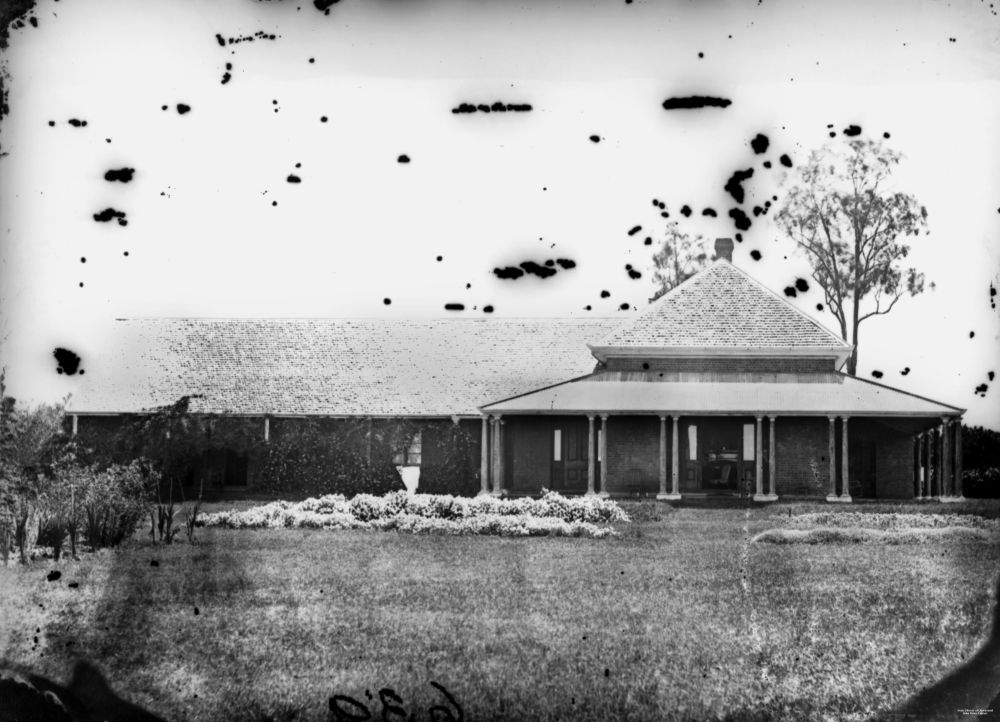
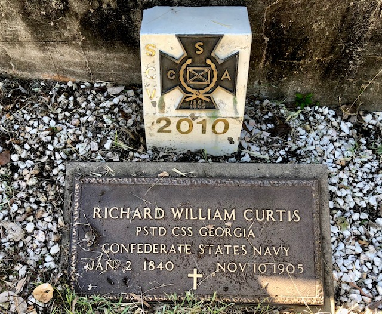

# Stories from Portion 5 (part 2)  

## Daniel George Bloomfield <small>(5‑101‑11)</small>

Daniel Bloomfield (1858-1915) was, for many years, a well known bandmaster and popular cornet soloist in Brisbane. His in career in music began at the age of ten as a drummer in the Royal Marines in England. He settled in Brisbane in 1883 and soon became deeply involved in the local music scene as a performer and conducting various local bands, including the Naval Brigade Band, for many years. 

{ width="40%" }  

*<small>[D. G. Bloomfield](http://onesearch.slq.qld.gov.au/permalink/f/1upgmng/slq_alma21218822040002061) — State Library of Queensland.</small>*

## The Hon. Hereward Humfy Henchman <small>(5‑101‑18/19)</small>

The Hon. H.H. Henchman (1874-1939), barrister and Judge, was the third son of William Henchman, a foundry proprietor and his wife Jane Mcllwraith (née Wallace). He arrived in Rockhampton with his family as a young child in 1878. He was the first judge of the Queensland Supreme Court to hold a university degree in law.

## The Harding Family <small>(5‑101‑30)</small>

George Rogers Harding (1868-1940), grazier and Walter Charles Harding (1870-1939), solicitor, were the sons of the Hon. George Rogers Harding, a senior Puisne Judge of the Queensland Supreme Court in the 19^th^ century. George's son, also named George Rogers Harding (1905-1937) and his brother, Christopher Winter Harding (1913-1982) were the founders of Harding Brothers, a wholesale merchandising business at Toowong.

{ width="40%" } <!-- { width="52.6%" } -->

*<small>[Justice George Rogers Harding, 1879](http://onesearch.slq.qld.gov.au/permalink/f/1upgmng/slq_alma21218166050002061) — State Library of Queensland.</small>* <!--  
*<small>[People outside the residence and store of T. Harding at Toowong](http://onesearch.slq.qld.gov.au/permalink/f/1upgmng/slq_alma21289902580002061) — State Library of Queensland.</small>* -->

<!-- also http://onesearch.slq.qld.gov.au/permalink/f/1upgmng/slq_digitool66263 -->

## Atwill Buxton Kenrick <small>(5‑71‑2)</small>

Atwill Buxton Kenrick (1863-1922), station manager and grazier, was born in Newcastle NSW the son of Atwill Kenrick and his wife Hannah (née Brookes). In February 1917, Mr. Kenrick married Miss Vans Macartney, the youngest daughter of John Arthur Macartney, of Ormiston House, Ormiston, Brisbane.

## Adolph Frederick Milford Feez <small>(5‑68‑3)</small>

Brisbane-born [Adolph Feez](https://adb.anu.edu.au/biography/feez-adolph-frederick-6150) (1858-1944) was a surveyor for a number of years before studying for the legal profession. He was admitted as a solicitor in December 1885 and commenced practice as a partner in MacPherson, Miskin & Feez. Later he was in partnership with Mr A.F.T. Ruthning. Feez Ruthning & Co operated until 1996.

## John Henry Flower <small>(5‑69‑2)</small>

John Henry Flower (1852- 1918) was a senior partner in the long established law firm of Flower & Hart. He was born in Port Fairy, Victoria but educated in England where he studied law. In 1886 he married Dora Kirk in Victoria. Their hilltop home at Windsor is now [heritage-listed](https://apps.des.qld.gov.au/heritage-register/detail/?id=600351).

## John Arthur Macartney <small>(5‑62‑16)</small>

John Arthur Macartney (1834-1917) was the eldest son of the Very Rev Hussey Burgh Macartney, the First Dean of Melbourne and his wife Jane (née Hardman). He studied law but resigned after 18 months to take up his first station property in Victoria. Over time he owned 25 stations and other properties in Qld and NT. He died at his home, [Ormiston House](https://ormistonhouse.org.au/the-house/) near Cleveland.

{ width="70%" }  

*<small>[Captain Louis Hope's residence, Ormiston House, Cleveland district, ca.1871](http://onesearch.slq.qld.gov.au/permalink/f/1upgmng/slq_alma21249909850002061) — State Library of Queensland.</small>*

## Edward Vincent Pollock <small>(5‑62‑12)</small>

Irish-born Edward Vincent Pollock (1851-1911) was attached to the Admiralty branch of the British Civil Service. Later he and his wife Elizabeth migrated to Queensland arriving in Mackay in 1884. In 1889 he became Staff Paymaster-in-Charge and Secretary to Senior Naval Officer, Queensland Naval Defence Force and Fleet Paymaster and Secretary to the Naval Commandant of the Commonwealth Naval Force on 2 February 1904.

 

## Richard William Curtis <small>(5‑61‑22)</small>

Englishman Richard William Curtis (1840-1905) is one of six proven veterans of the American Civil War buried in Toowong Cemetery. He joined the Confederate States Navy and is recorded as being Assistant Paymaster on the CSS *Georgia* in 1863 and later Paymaster on CSS *Stonewall*. After the conclusion of the Civil War he came to Brisbane where he worked for the Government and in private enterprise.

 

## Richard Langler Drew <small>(5‑43‑2)</small>

[Richard Langler Drew](https://adb.anu.edu.au/biography/drew-richard-langler-13302) (1823-1869) served with the Royal Navy before migrating from England to Victoria with his wife [Ann](https://adb.anu.edu.au/biography/drew-ann-anne-12893) c 1858. In 1861 they [moved to Brisbane](https://trove.nla.gov.au/newspaper/article/50044315) where he was appointed shipping master and secretary to the Marine Board. He donated land in Curlew Street Toowong overlooking the Burns Road cutting, for the first Church of St Thomas the Apostle, and was one of its original trustees.

## William Atwell <small>(5‑38‑17)</small>

[William Atwell](https://trove.nla.gov.au/newspaper/article/175911907) (1843-1913) began work as an excavator in railway construction in England and came to Queensland to work for the contractor constructing the railway line over the Main Range to Toowoomba. He joined the Queensland Railways Department in 1867 and eventually rose to the position of Chief Inspector of Railways.

## Acknowledgements

Compiled and presented by Darcy and Lyn Maddock

## Sources

- [Family History Research](https://www.familyhistory.bdm.qld.gov.au) - The State of Queensland
- [Trove](https://trove.nla.gov.au) - National Library of Australia
- BDM Queensland Index Search', The State of Queensland (Department of Justice and Attorney-General), 2015
- [The Honourable Hereward Henchman](https://www.sclqld.org.au/judicial-papers/judicial-profiles/profiles/hhhenchman) - Supreme Court Library Queensland
- Who's Who in Australia, 1921-1950 
-  http://archival-classic.sl.nsw.gov.au/item/itemDetailPaged.aspx?itemID=886767 *(broken)*
- [Brisbane Lawyers – Splendid Men of the Old School](http://www.brisbanehistory.com/brisbane_lawyers.html) - www.brisbanehistory.com
- American Civil War Round Table Queensland 
- http://www.sampfordarundel.org.uk/sampage60.php *(broken)*

<!--

## Brochure

**[Download this walk](../assets/guides/portion5-part2.pdf)** - designed to be printed and folded in half to make an A5 brochure.

-->
