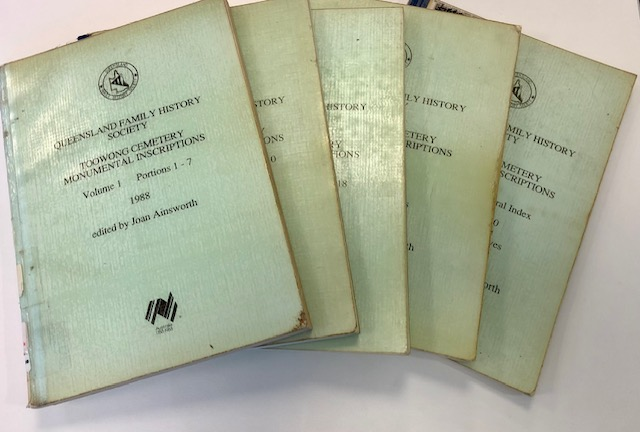
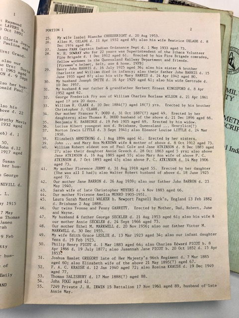

# Research Resources

## Toowong Cemetery Monumental Inscriptions

In 1988, as a Bicentennial project, the [Queensland Family History Society](https://www.qfhs.org.au) published five volumes of Toowong Cemetery Monumental Inscriptions. They can be found in the Local History Reference section at the Toowong Library. 

{ width="62%" } { width="31.4%" }

<!--
!!! question "Volunteer - help us digitise content"

    We'd like to explore digitising this historic record and creating a linked database to other historic resources. Do you know an efficient way to scan and OCR large books? 
--> 

## Trove

Search [Trove](https://trove.nla.gov.au) to read obituaries of people interred in Toowong Cemetery. Obituaries have been extracted from the newspaper holdings of the National Library of Australia. Each list item will give you a direct link to the newspaper article as well as the grave number.

- [Obituaries A - E](https://trove.nla.gov.au/list?id=4457)
- [Obituaries F - J](https://trove.nla.gov.au/list?id=4461)
- [Obituaries K - N](https://trove.nla.gov.au/list?id=4454)
- [Obituaries O - R](https://trove.nla.gov.au/list?id=4453)
- [Obituaries S - Z](https://trove.nla.gov.au/list?id=4430)

## Australian Dictionary of Biography

The [Australian Dictionary of Biography](https://adb.anu.edu.au/) is Australia's pre-eminent dictionary of national biography. In it you will find concise, informative and fascinating descriptions of the lives of significant and representative persons in Australian history.

[Search for "Toowong Cemetery"](https://adb.anu.edu.au/biographies/search/?scope=all&query=Toowong+Cemetery+&x=55&y=11&rs=) for the biographies of 190 of the most prominent people buried at Toowong Cemetery.

## Obituaries Australia

[Obituaries Australia](https://oa.anu.edu.au) is a digital repository of obituaries published in newspapers, journals, magazines and bulletins. [View Obituaries of people interred at Toowong Cemetery](https://oa.anu.edu.au/obituaries/search/?scope=all&query=Toowong+Cemetery+&x=85&y=18&rs=)

<!--
Obituaries Australia is a new initiative of the National Centre of Biography at the Australian National University. Enter "Toowong Cemetery" in the text search box at http://oa.anu.edu.au/ for the obituaries of people buried at Toowong Cemetery who formed Brisbane's social fabric.
-->

## Other Resources

- [Grave location search](https://www.brisbane.qld.gov.au/community-and-safety/community-support/cemeteries/grave-location-search) - Brisbane City Council
- [Research Guide to cemetery records at Queensland State Archives](https://www.publications.qld.gov.au/ckan-publications-attachments-prod/resources/3b2f93a8-3229-4739-bae5-a130fb199cf9/research-guide-to-cemetery-records.pdf)
- [Hong Kong to Toowong - Chinese burials in the Brisbane General Cemetery](https://library-brisbane.ent.sirsidynix.net.au/client/en_AU/eLibCat/search/detailnonmodal/ent:$002f$002fSD_ILS$002f0$002fSD_ILS:632325/one). Leonie Gane, 2008.
- [Baptist Church Archives Queensland](https://www.bhsq.org/barq/)
- [Online History and Genealogy](https://library-brisbane.ent.sirsidynix.net.au/client/en_AU/eLibCat/?rm=ONLINE+RESOURC0%7C%7C%7C1%7C%7C%7C0%7C%7C%7Ctrue&dt=list#History) resources available at Brisbane City Council Libraries
- [Family History](https://www.slq.qld.gov.au/research-collections/family-history) resources from the State Library of Queensland
- [Useful websites for family historians](https://www.slq.qld.gov.au/research-collections/family-history/useful-websites-family-historians) - State Library of Queensland
- The [Under the Lino](http://www.underthelino.com.au) community have a [catalogue of research resources](http://www.underthelino.com.au/resources/)
- [Virtual War Memorial Australia](https://vwma.org.au/explore/cemeteries/1788)
- [Date Calculator: Add to or Subtract From a Date](https://www.timeanddate.com/date/dateadded.html) helps you work out an approimate birth date if you only have the date and age of death
