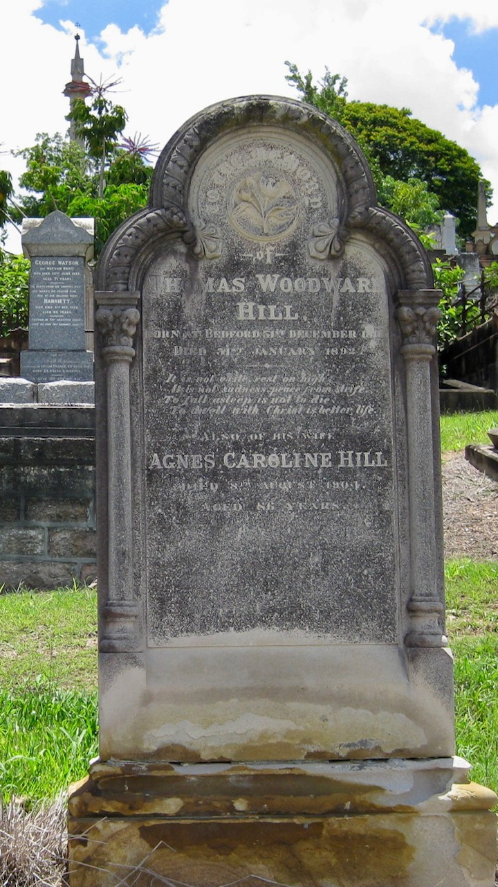

---
hide:
  - toc
  - navigation 
---

# Thomas Woodward Hill

**31 December 1816 — 31 January 1892**

--8<-- "snippets/thomas-woodward-hill.md"

{ width="26%" } { width="34.05%" }

<small>Thomas Woodward Hill and Agnes Caroline Rains' headstone - © Cameron Davidson. Used with permission.</small>  
<small>Thomas and Agnes Hill - Used with the permission of Tom Kirkby and Robina Laughlin Rains. Tom is a great grandson of Agnes Caroline Rains.</small>

>To the memory of   
Thomas Woodward Hill   
Born at Bedford 31^st^ December 1816   
Died 31^st^ January 1892   
It is not exile rest on high   
It is not sadness peace from strife   
To fall asleep is not to die   
To dwell with Christ is better life   
>    
>Also his wife    
Agnes Caroline Hill   
Died 9^th^ August 1904   
Aged 86 years   

### Acknowledgement

Information provided by Jenny Davidson, Thomas Woodward Hill's wife's great-great-granddaughter.

### Further Reading 

- [Extra, Extra Read All About It](../assets/documents/extra-extra-read-all-about-it-thomas-woodward-hill.pdf) - Jenny Davidson
