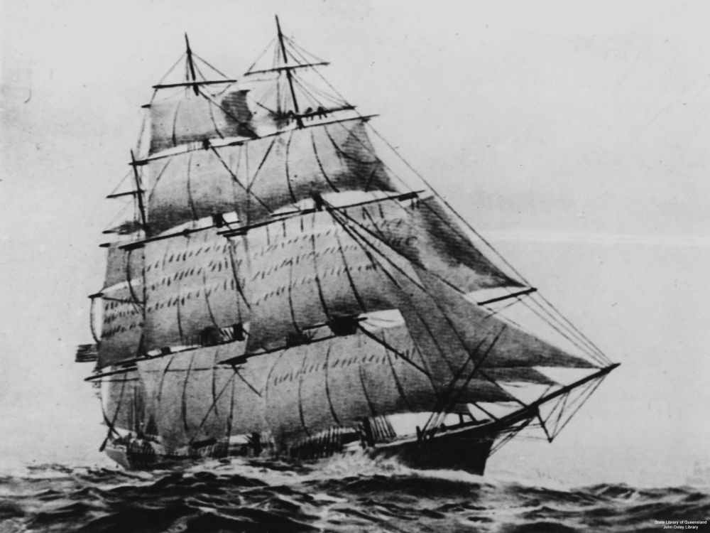
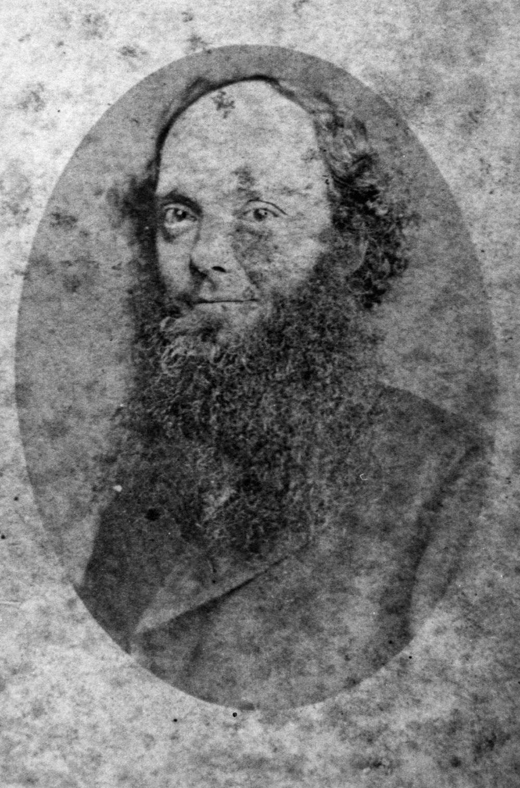
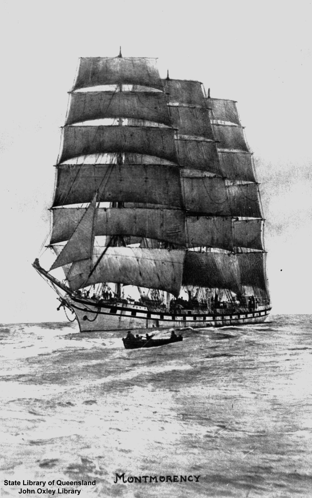
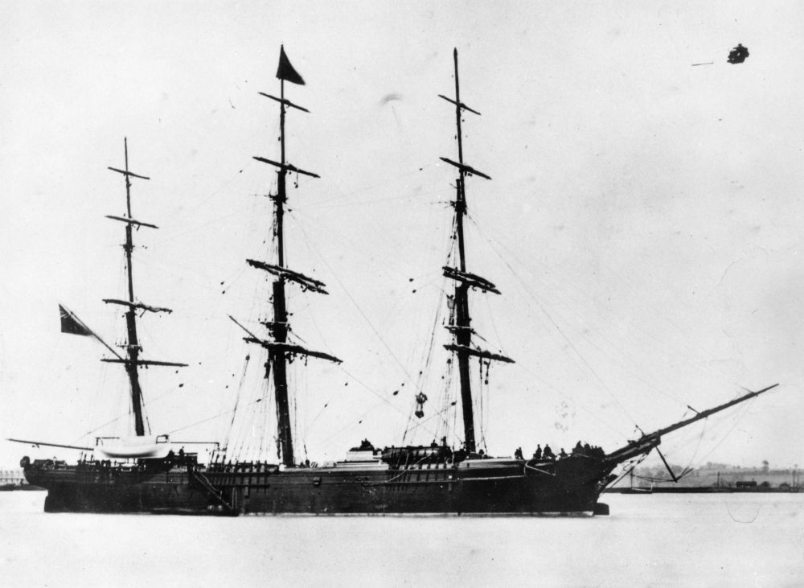

# 2020 Vision 

<!-- 

{ width="70%" }  

*<small>[Devoy residence in Ashgrove, Brisbane, ca. 1908](http://onesearch.slq.qld.gov.au/permalink/f/1upgmng/slq_alma21218171470002061). The Devoy residence was in Three Mile Scrub Road (now Ashgrove Avenue), off Waterworks Road. John Devoy was the manager of Castlemaine Perkins. — State Library of Queensland.</small>*

-->

<!-- 

???+ Example "Directions" 

    Starting point
    Walking directions to first headstone... is the grave of...
    
    { width="15%" }

-->

## William James Sluce <small>(2‑6‑21)</small>

A son of William Sluce and Mary Ann (née French), William James Sluce was born on 25 March 1832, in Bethnal Green, Middlesex.
Susannah Cox married William in Hackney, London between July and September 1854. 

William sailed to Brisbane aboard the *Flying Cloud* in 1862 with his wife and two children. They returned to Brisbane aboard the *Golden City* on 3 January 1865.

William, an engineer by trade, was a watchmaker, jeweller and gun maker in Brisbane. In 1868, WJ Sluce & Co advertised locations near the Town Hall 66-76 Queen Street, opposite Harris' Terrace, 68 George Street, Brisbane plus 21 Bethnal Green Road and 14 Leyton Road, Stratford, London. In 1874 William opened the Brisbane Rifle Shooting Gallery on Queen Street, next to his business.

William drowned in Breakfast Creek on 1 February 1879.

{ width="60%" }  { width="29.75%" }  

*<small>[Flying Cloud (ship)](http://onesearch.slq.qld.gov.au/permalink/f/1upgmng/slq_alma21220145060002061). Holds the world's record for passages from New York to San Francisco, and made many fast passages from Britain to Moreton Bay with immigrants. — State Library of Queensland.</small>*  
*<small>[William James Sluce, 1876](http://onesearch.slq.qld.gov.au/permalink/f/1upgmng/slq_alma21220151590002061) — State Library of Queensland.</small>*

<!-- 

??? Example "Directions" 

    
    Walking directions to next headstone... is the grave of...
    
    { width="15%" }
    
-->

## John and Mary Ann Ogle  <small>(1‑113‑3/4)</small>

John, a son of John Ogle and Isabella (née Swan), was born in Northumberland, England c. 1824. Mary Ann Scott, a daughter of Robert Scott and Mary (née Frater), was born c. 1823.

Mary Ann and John, with their three daughters, arrived in Brisbane aboard the *Montmorency* on 16 October 1860.

The Ogles were early settlers at Pullenvale, where John farmed. Part of their property (portions 222 & 229, county of Stanley, parish of Moggill, consisting of 173 acres) included the site of the [Pullenvale Hall](https://g.page/thepullenvalehall) at the corner of Grandview and Pullenvale Roads, which became known as Ogle's Corner.

John died on the 26 October 1890. Mary Ann died on the 24 August 1907.

{ width="40%" }  

*<small>[Montmorency (ship)](http://onesearch.slq.qld.gov.au/permalink/f/1upgmng/slq_alma21220157310002061) — State Library of Queensland.</small>*

## George Loesch, and Frederick Losch <small>(7‑49‑12)</small>

<!-- Why the different surnames? -->

George was born in Baden, Grand Duchy of Baden, to George Loesch on the 12 May 1829. Maria Anna Eberhardt married George. George worked as a cabman. George Loesch, who resided in Hartley Street, Spring Hill, died on 21 October 1887.

Frederick was a son of George and Maria. Flora Murphy married Frederick on 10 October 1882 in St Stephen's Cathedral, Brisbane. Frederick Losch resided with his daughter in Fortescue Street, Spring Hill, when he died on 3 February 1929 aged 69.

## Iris Elizabeth Carson <small>(15‑31‑9)</small>

Iris Elizabeth Carson, a daughter of Robert James (Bob) Carson and Elizabeth Mary (née Real), was born in Brisbane on 24 September 1916. Iris resided at *Ryecroft*, Augustus Street, Toowong when she died on 25 March 1918. 

## James Porter Fry <small>(8‑31‑31/32)</small>

James Porter Fry was born in West End, South Brisbane on 10 March 1880, to Charles Fry and Caroline (née Davies). James was educated at West End State School. James joined the Queensland Rifles in July 1897.

On 3 September 1902 Sarah Chegwin married James in Brisbane. They had one son and one daughter. James was South Brisbane City Council's Chief Inspector when he volunteered for World War I on 1 October 1914, being assigned to the Naval and Military Forces' Special Tropical Forces. Repeat bouts of malarial fever brought James back to Australia.

From 1918 James was registered as an optometrist, serving at times as President of the Australian Optometrist's Association and the Institute of Ophthalmic Opticians Inc., plus Chairman of the Queensland Board of Optical Registration.

Running a campaign based on his military service, James became MLA for Kurilpa on 16 March 1918 and represented the seat until 11 June 1932. James served as Opposition Whip from 11 July 1923 until 9 April 1929. 

James resided at 96 Dornoch Terrace, Highgate Hill, but died at his weekend home in Griffiths Road, Queen's Beach, Redcliffe on 7 February 1948.

## Constance Campbell <small>(8‑19‑16)</small>

Constance Campbell Petrie was born in Brisbane on 16 December 1872 to Thomas Petrie and Elizabeth (née Campbell). A series of reminiscences based on Tom Petrie's life first appeared in *The Queenslander*, followed by a book, first printed in 1904, called *[Tom Petrie's reminiscences of early Queensland](http://onesearch.slq.qld.gov.au/permalink/f/6ia4ku/slq_alma21136083760002061)*.

George Philip Stuart married Constance in Brisbane on 31 July 1918. Constance Stuart resided at *Dundalli*, Old Sandgate Road, Clayfield when she died on 4 July 1926.

## Charles Joseph Gall <small>(14‑15‑11/12/13)</small>

Born in Hampstead c. 1835, Charles Joseph Gall was a son of Thomas Gall. Elizabeth Long married Charles in Sydney in 1862. Their son, born in Sydney on 15 December 1862 died the same day. The couple had three daughters; Eva, Gertrude & Elizabeth (Lilly).

The partnership of Gall & Inglis, with William Inglis, was dissolved by mutual consent on 25 January 1875. Charles was declared insolvent in 1878. Dess & Gall, drapers and general outfitters, run in partnership with Edward Dess, was dissolved by mutual consent on 5 May 1882.

Charles entered into partnership with his son-in-law, Thomas William Johnson, to form Gall and Johnson, fancy goods sellers.
Charles, a resident of Lisson Grove, Wooloowin, died of heart disease at his Queen Street shop on 30 November 1895.

## William Thomas Birkbeck <small>(9‑16‑8/9)</small>

William was born in St Pancras, Middlesex to George Henry Birkbeck, mechanical engineer, and Elizabeth (née Christmas) on 30 January 1848. William sailed to Brisbane aboard the *Young Australia*, arriving on 13 July 1869. Kate Jackson married William in Brisbane on 2 March 1876. 

William was involved in the Gympie and Palmer River gold rushes and the timber trade around Noosa.

William was the publican of the Commercial Hotel, Tewantin for approximately four years until mid 1885. The 19 September 1892 supplementary electoral roll listed William as a bookkeeper residing in *San Jacinto*, Quay Street, Brisbane, aged 44 years. William held the publican's licence for Lennons for three months in 1903 before applying for that licence again in April 1905, when he and his wife and ten children resided at "Bankside" North Quay, Brisbane. He proposed to transfer the licence in 1 July 1905, but was still in charge on 3 September 1905.

In June 1907, now with 11 children. William applied to transfer the licence for the Queensland Club Hotel, Mary Street, Brisbane.
On 19 March 1909 William, late of Quay Street, North Quay, died in the Friendly Societies Hospital, Wickham Terrace, Brisbane, aged 61 years leaving his widow and 11 children. 

{ width="70%" }  

*<small>[Young Australia](http://onesearch.slq.qld.gov.au/permalink/f/1upgmng/slq_alma21219330430002061) — State Library of Queensland.</small>*

## Sources

- [Australian Dictionary of Biography](https://adb.anu.edu.au) - Australian National University
- [Grave Location Search](http://graves.brisbane.qld.gov.au) - Brisbane City Council
- [Family History Research](https://www.familyhistory.bdm.qld.gov.au) - The State of Queensland
- [Search the Records](https://www.qld.gov.au/recreation/arts/heritage/archives/search-the-records) - The State of Queensland (Queensland State Archives)
- [Trove](https://trove.nla.gov.au) - National Library of Australia

## Brochure

**[Download this walk](../assets/guides/2020-vision.pdf)** - designed to be printed and folded in half to make an A5 brochure.

