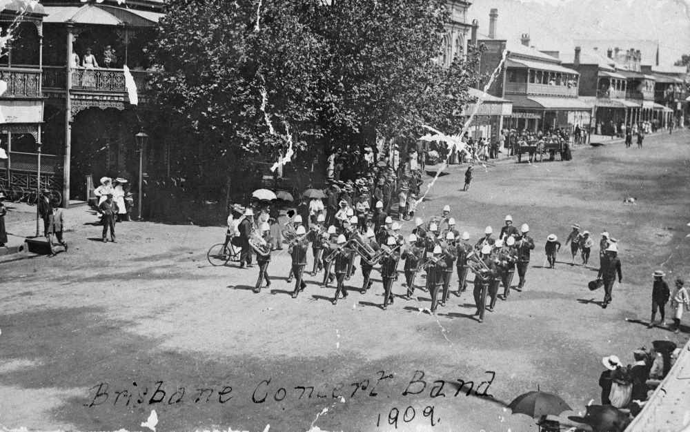
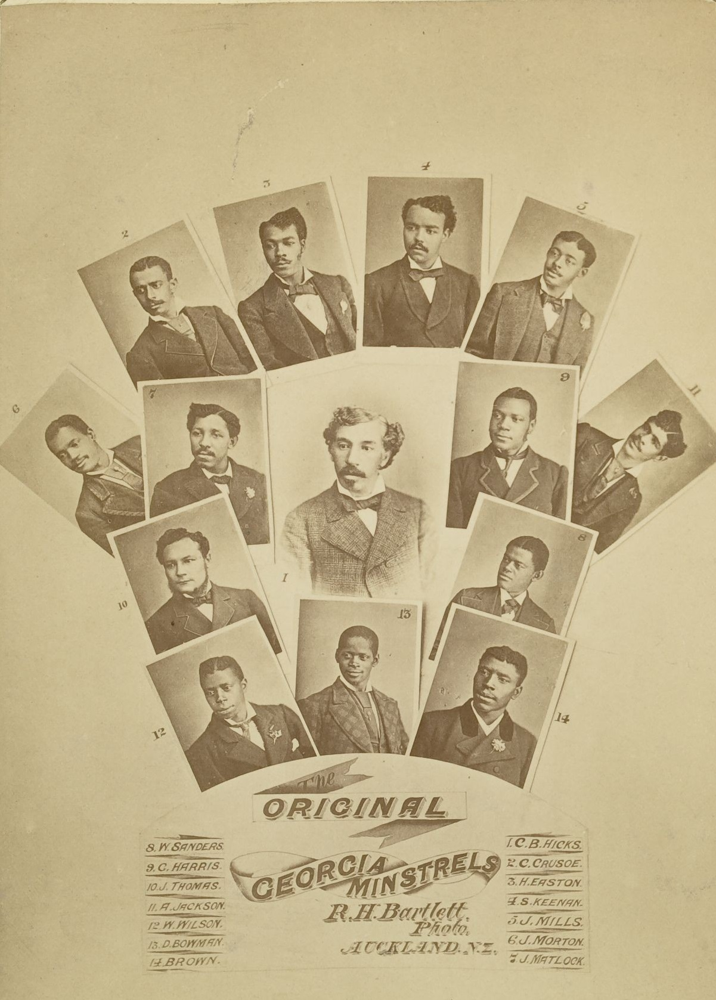

---
hide:
  - navigation
---

# All the world’s a stage 

**Actors and performers buried in Toowong Cemetery**

<!-- IMAGE AND caption
Samuel Keenan, Member of the Original Georgia Minstrels
-->

<!--

??? Warning "To Do" 

    - Add cover image
    - Check walking order
    - Create and insert map with link to portion-section-plot explanation
    - Add directions
    - Add headstone photos
    - Create Bio pages
    - Add Bios to [Index](../bios/bio-index.md)
    
-->

<!-- 

???+ Example "Directions" 

    - walking directions
    
     
    
-->

--8<-- "snippets/edward-mcgregor.md"

{ width="70%" }  

*<small>[Brisbane Municipal Concert Band marching in Brisbane, Queensland, 1909](http://onesearch.slq.qld.gov.au/permalink/f/1upgmng/slq_alma21220219350002061) - State Library of Queensland </small>* 

<!-- 

??? Example "Directions" 

    - walking directions
    
        

-->

--8<-- "snippets/sidney-cook.md"

<!-- 

??? Example "Directions" 

    - walking directions
    
        
    
-->

--8<-- "snippets/samuel-keenan.md"

{ width="40%" }  

*<small>["Original Georgia Minstrels" composite image with founder Charles Hicks at center](https://en.wikipedia.org/wiki/Brooker_and_Clayton%27s_Georgia_Minstrels) - State Library of Queensland </small>* 

<!-- 

??? Example "Directions" 

    - walking directions
    
        

-->

--8<-- "snippets/henry-william-mobsby.md"

{ width="40%" }  

*<small>[Photographer Henry William Mobsby, Barcaldine, ca. 1905](http://onesearch.slq.qld.gov.au/permalink/f/1upgmng/slq_alma21250438610002061) - State Library of Queensland </small>* 

<!-- 

??? Example "Directions" 

    - walking directions
    
        
    
-->

--8<-- "snippets/karoly-pulszky.md"

<!-- 

??? Example "Directions" 

    - walking directions
    
       

-->

--8<-- "snippets/thomas-macer.md"

<!-- 

??? Example "Directions" 

    - walking directions
    
        

-->

--8<-- "snippets/arthur-aldridge.md"

<!-- 

??? Example "Directions" 

    - walking directions
    
    
    
-->
    
## Sources

- Creswell, Jane Arthur Aldridge family history
- Gerard, Patrick *[Picturing Queensland: The Local, the National and the Global in Early Queensland Film](http://www98.griffith.edu.au/dspace/bitstream/10072/2428/1/28898_1.pdf)*, Griffith Film School, http://www98.griffith.edu.au/dspace/bitstream/10072/2428/1/28898_1.pdf Keenan, Tracy Samuel Keenan family history
- Laughren, Pat *[Mobsby, Henry William (1860 - 1933)](https://adb.anu.edu.au/biography/mobsby-henry-william-13104)*, Australian Dictionary of Biography, Online Edition, Copyright 2006, updated continuously, ISSN 1833-7538, published by Australian National University http://www.adb.online.anu.edu.au/biogs/AS10346b.htm

## Brochure

**[Download this walk](../assets/guides/actors.pdf)** - designed to be printed and folded in half to make an A5 brochure.

