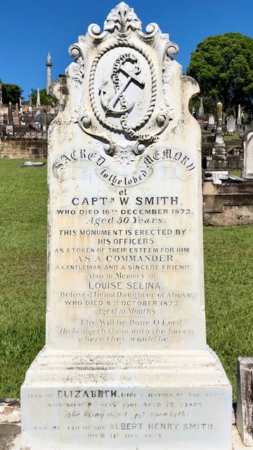
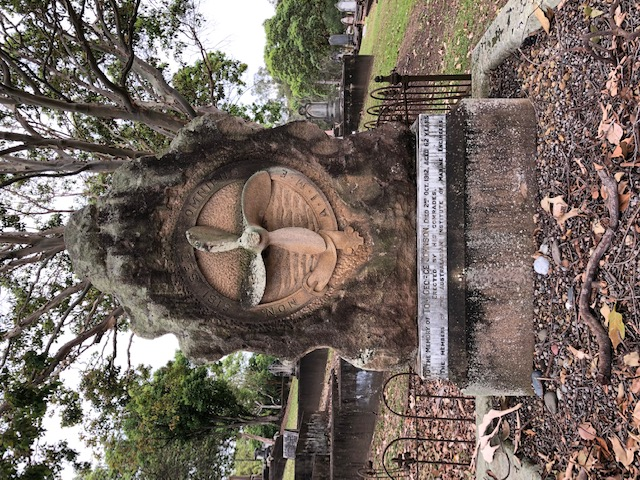
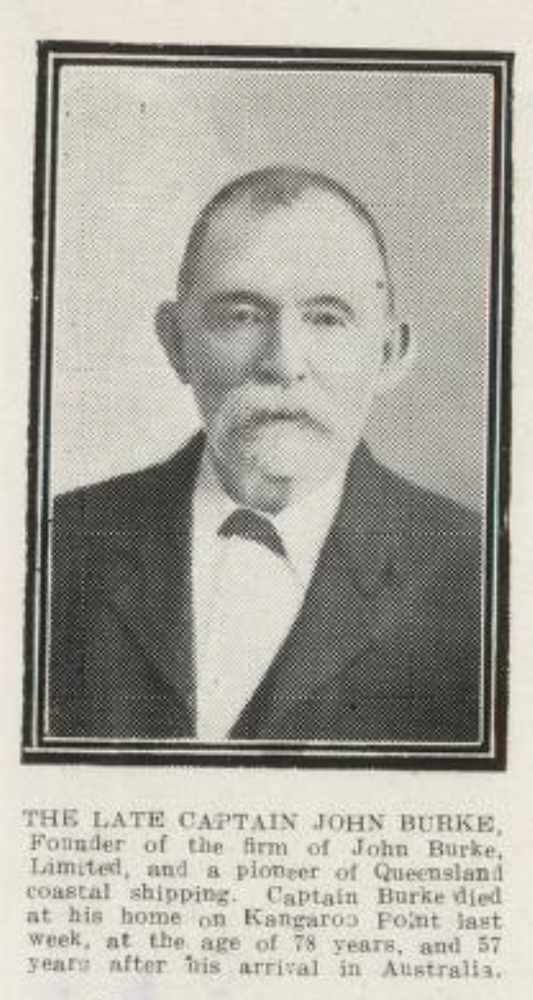

# Anchors Aweigh! 

**A Maritime Walk through Toowong Cemetery.**

The anchor is a symbol found on many Christian graves but it does not necessarily point to a maritime career. The source for the symbol is Hebrews 6:19, 

>Which hope we have as an anchor of the soul, both sure and steadfast.

The allegorical figure, Hope, is often shown holding an anchor. Anchors may be shown with its rope crudely cut or a broken chain link to indicate the deceased has been removed from the land of the living, often prematurely.

{ width="40%" }   

<!--

???+ directions "Directions" 

    - walking directions
    
       

--> 

## Able Seaman W. J. Harrhy <small>(4-16-4)</small>

William John Harrhy, aged 31, a sailor on HMS Dauntless, drowned in the Brisbane River on Good Friday, 1924 when ship was on a goodwill visit. The officers organised a dance aboard the Dauntless in aid of his dependents. William was born in Cardiff, Wales and had been in the Navy for over fifteen years.

<!--

??? directions "Directions" 

    - walking directions
    
        

--> 

## Prentice Family <small>(9-41-1)</small>

Jessie Blanche Prentice, the daughter of George (Jun.) and Jessie Lacy Prentice, was lost with her grandfather, George Prentice, in the wreck S.S. Quetta in Torres Strait on 28 February 1890. The steamship struck an uncharted rock and sank in three minutes claiming 134 lives, mostly women and children. Many victims were prominent Queensland citizens, bound for London, including Toowong resident, Alexander Archer, manager of the Bank of New South Wales. There were 158 survivors.

<!--

??? directions "Directions" 

    - walking directions
    
        

--> 

## Henry Lander Pethebridge <small>(13-4-7)</small>

Henry Pethebridge, the son of William Pethebridge and Maria Lander, was the Inspector of Works of the Marine Department of Queensland. Born in Torquay, Devon about 1835, he died in Brisbane on 13 June 1910.

<!--

??? directions "Directions" 

    - walking directions
    
        

--> 

## George Davidson <small>(13-7-1)</small>

George was for many years the Superintendent Engineer to the Australasian Steam Navigation Company, Sydney. He died on 29 April 1888 aged 47. He was the son of Archibald Davidson and Janet Fyfe. His memorial is a distinctive ship’s boiler plate set in the ground.

<!--

??? directions "Directions" 

    - walking directions
    
        

--> 

## Captain William Smith <small>(13-6-21)</small>

William Smith and his ten-month old daughter died within two months of each other in 1872 and were interred at the Paddington Cemetery. Their remains and headstone were relocated to Toowong Cemetery in June 1881. Since then, another four family members have been buried in the grave.

{ width="30%" }   

<!--

??? directions "Directions" 

    - walking directions
    
        

--> 

## Captain C. S. Thow <small>(13-16-10)</small>

Charles Stewart Thow was the son of Alexander Thow and Elizabeth Smith. He died on the 2 June 1883 aged 43 and was buried on the same day.

<!--

??? directions "Directions" 

    - walking directions
    
    

-->

## David Muir <small>(13-16-12)</small>

Three generations of David Muirs are buried in this grave. David was a shipwright born on Burnt Island near Edinburgh about 1824. He was the son of James Muir and Margaret Black. David married Margaret George in 1854. His son married Lucy Kornner in Brisbane in 1887. Sadly, their infant son David died in 1889.

<!--

??? directions "Directions" 

    - walking directions
    
    { width="100" }    

-->

## Tom George Johnson <small>(14-18-4)</small>

Tom, the son of John Johnson and Mary Huet, died on 2 October 1912. He was the first General Secretary of the Australian Institute of Marine Engineers. In August 1880, he was authorised to form a branch of the AIME in New Zealand. He was instrumental in instituting minimum qualifications, wages and working conditions for Marine Engineers. Until the year of his death, Tom was the Brisbane District Secretary of the AIME, a position he had held since 1883.

<!--

??? directions "Directions" 

    - walking directions
    
        

-->

## William Collin <small>(12-56-22)</small>

William, a master mariner, was born on 30 August 1834 at Great Wakering, Essex, the ninth of thirteen children of John Collin, a Suffolk farmer and his wife Sarah, née Viner. After only a basic education, fourteen-year-old William was working in the coastal coal trade and later on barges in the Thames. He left for Australia via Panama in 1854. Surviving a shipwreck 800 km off the Queensland coast, he eventually arrived in Sydney, via Calcutta! 

He married Eliza Baker of Newton on Christmas Day 1857 at Stephen’s, Camperdown. He worked on the Sydney waterfront until he could afford to purchase and refit a 25-ton vessel. He sailed this ship to Brisbane, where he settled with his family (which would eventually comprise thirteen children), and commenced a freight service to near-by coastal ports. William's other interest was the salvaging and breaking of ships. He was also engaged by the Queensland Government to lay submarine cables. 

William’s son and namesake was said to be the first Queensland-born sailor to receive his master’s certificate.

<!--

??? directions "Directions" 

    - walking directions
    
        

-->

## Able Seaman Archibald Edward Bartsch <small>(10-44-20)</small>, Warrant Officer Henry Theeman <small>(10-41-21)</small>, Steward Eric Ross Harrison <small>(10-43-7)</small>

On the 4th of March 1942, the auxiliary minesweeper HMAS Tambar was fired on by the Examination Battery at Fort Cowan Cowan on Moreton Island. The military covered up the incident so as not to affect morale. The Tambar’s crew was dispersed throughout the RAN immediately after the men’s joint funeral two days later. The ship was temporarily paid off and the Captain given another command. The service was conducted by the Rev. H. H. Trigge of the Methodist Church and the Church of England’s Rev. F. R. C. Birch. Cannon and Cripps arranged the funeral.

There was a mix up in the identification code signal of the ship and the battery was ordered to fire across the bow of the unidentified vessel. The 6-inch shell struck the ship’s forecastle killing Able Seaman Archibald Bartsch, a member of the anchor party, instantly. The shell skidded across the deck into the Captain’s cabin killing Steward Eric Harrison. It then passed through the radio room critically injuring Warrant Officer Henry Theeman. Both of his legs were severed and his succumbed to his injuries soon after. Other crew received injuries to various degrees. London-born Theeman was aged 47. Bartsch, son of 3^rd^ Light horseman William Henry Bartsch, was an employee if the Australasian United Paint Company of Port Augusta, South Australia prior to his enlistment in the navy. He was aged 20. Western Australian-born Harrison was the son of William Ross and Rebecca Harrison. He was aged 33 from Melbourne.

<!--

??? directions "Directions" 

    - walking directions
    
        

-->

## Captain John Burke <small>(7-19-1)</small>

John was born at Kinsale, Cork the son of fisherman Denis Burke and his wife Ellen. He was a seaman on ships to the USA until the outbreak of the Civil War when he returned to Ireland and signed on with the crew of the Erin Go Bragh which arrived in Brisbane in August 1862. He deserted and worked as a pilot for the Australian Steam Navigation Company sailing the Queensland and the Telegraph. He married Alicia Swords from the Erin Go Bragh, and settled on the Logan River. 

He held a Masters Licence and worked on bay and river ships commanding the Fanny on the Albert and Logan rivers. He established the John Burke Shipping Line in 1887 and bought the Louisa and traded from Ipswich to Logan and later on Moreton Bay. By his death in 1919, he had nineteen ships, although he had retired in 1915 staying only as the Director. Captain Burke Park at Kangaroo Point is named in honour of him. His company was sold by his grandson in 1968. 

{ width="30%" }  

*<small>[Page 27 of the Queenslander Pictorial, supplement to The Queenslander, 14 June, 1919.](http://onesearch.slq.qld.gov.au/permalink/f/1upgmng/slq_digitool1045834) - State Library of Queensland </small>* 

<!--

??? directions "Directions" 

    - walking directions
    
    

-->

## Further Reading 

- Broomham, Rosemary Steady Revolutions: The Australian Institution of Marine and Power Engineers 1881-1990 New South Wales University Press, 1991
- Hempel, J. A. ‘Collin, William (1834-1914)’, Australian Dictionary of Biography, Vol. 3 Melbourne University Press, 1969, p. 441

## Acknowledgements

- Compiled by Hilda Maclean
- Captain John Burke research by David Larkin

## Brochure

**[Download this walk](../assets/guides/anchors-aweigh.pdf)** - designed to be printed and folded in half to make an A5 brochure.

