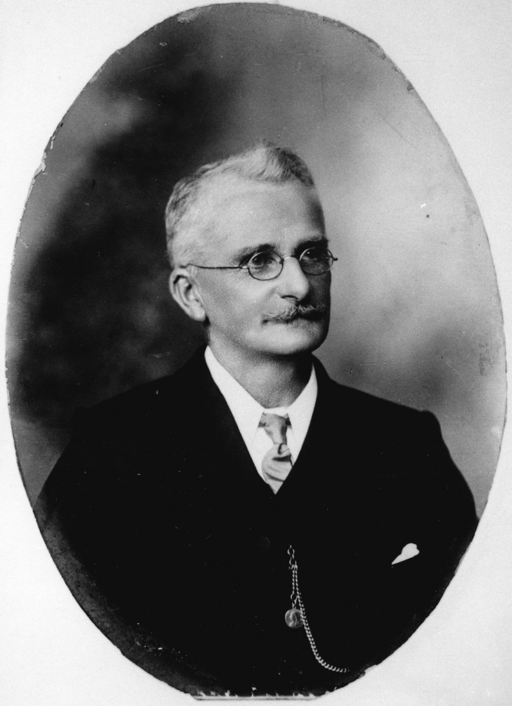

# Brisbane Mayors  

On this trail you'll visit many of the early Mayors of the **Town of Brisbane**: 

- **John Petrie**, the first mayor of the Town of Brisbane 1859—1862
- **George Edmondstone**, the third mayor, 1863
- **Joshua Jeays**, 1864
- **Richard Symes Warry**, 1866
- **John Hardgrave**, 1868—1869
- **William Pettigrew**, 1870
- **James Swan**, 1873—1875
- **John Daniel Heal**, 1879
- **John Sinclair**, 1880—1881
- **Richard Southall**, 1888
- **William McNaughton Galloway**, 1889
- **Thomas Proe**, 1901

The **City of Brisbane** replaced the Town of Brisbane in 1903. Mayors you'll visit are: 

- **Thomas Proe**, (second term), 1905
- **Alfred John Raymond**, 1912

The **new City of Brisbane**, established in 1925, replaced the former City of Brisbane. You'll visit the Lord Mayor: 

- **Archibald Watson**, the second Lord Mayor of the City of Brisbane, 1931

<!--

???+ Example "Directions" 

    - Start behind Canon Garland Place in Emma Miller Avenue. 
    - walking directions
              
    { width="100" }

-->

--8<-- "snippets/john-petrie.md"

<!--

??? Example "Directions" 

    - walking directions 
              
    { width="100" }

-->

--8<-- "snippets/george-edmondstone.md"

<!--
??? Example "Directions" 

    - walking directions
              
    { width="100" }

-->

--8<-- "snippets/thomas-proe.md"

<!--

??? Example "Directions" 

    - walking directions
              
    { width="100" }

-->

--8<-- "snippets/john-daniel-heal.md"

<!--

??? Example "Directions" 

    - walking directions
              
    { width="100" }

-->

--8<-- "snippets/john-sinclair.md"

<!--

??? Example "Directions" 

    - walking directions
              
    { width="100" }

-->

--8<-- "snippets/alfred-john-raymond.md"

<!--

??? Example "Directions" 

    - walking directions
              
    { width="100" }

-->

--8<-- "snippets/james-swan.md"

<!--

??? Example "Directions" 

    - walking directions
              
    { width="100" }

-->

--8<-- "snippets/richard-symes-warry.md"

<!--

??? Example "Directions" 

    - walking directions
              
    { width="100" }

-->

--8<-- "snippets/richard-southall.md"

<!--

??? Example "Directions" 

    - walking directions
              
    { width="100" }

-->

--8<-- "snippets/john-hardgrave.md"

<!--

??? Example "Directions" 

    - walking directions
              
    { width="100" }

-->

--8<-- "snippets/joshua-jeays.md"

<!--

??? Example "Directions" 

    - walking directions
              
    { width="100" }

-->

--8<-- "snippets/william-pettigrew.md"

<!--

??? Example "Directions" 

    - needs picture
              
    { width="100" }
    
-->

--8<-- "snippets/archibald-watson.md"

<!--

??? Example "Directions" 

    At this point you can either: 
    
    - end the walk by continuing down the hill to the starting point.
    - visit William MacNaughton Galloway's grave in Portion 7a. To do this: 
      - Walk along Emma Miller Avenue to Charles Heaphy Drive.
      - Continue down Charles Heaphy Drive to the Shelter Shed.
      - Walk towards O'Doherty Avenue (previously 11th Avenue) and four graves along you'll find Ned Hanlon. 
      - Walk into Portion 7a about 4 sections, and you'll find...

    { width="100" }
    
-->

--8<-- "snippets/william-macnaughton-galloway.md"

<!--
??? Example "Directions" 

    - Retrace your steps back to the starting point

-->

## Further Reading

- [Brisbane's Lord Mayors](https://www.brisbane.qld.gov.au/about-council/council-information-and-rates/council-history/brisbanes-lord-mayors)
- [List of mayors and lord mayors of Brisbane](https://en.wikipedia.org/wiki/List_of_mayors_and_lord_mayors_of_Brisbane)

## Brochure

**[Download this walk](../assets/guides/brisbane-mayors.pdf)** - designed to be printed and folded in half to make an A5 brochure.

