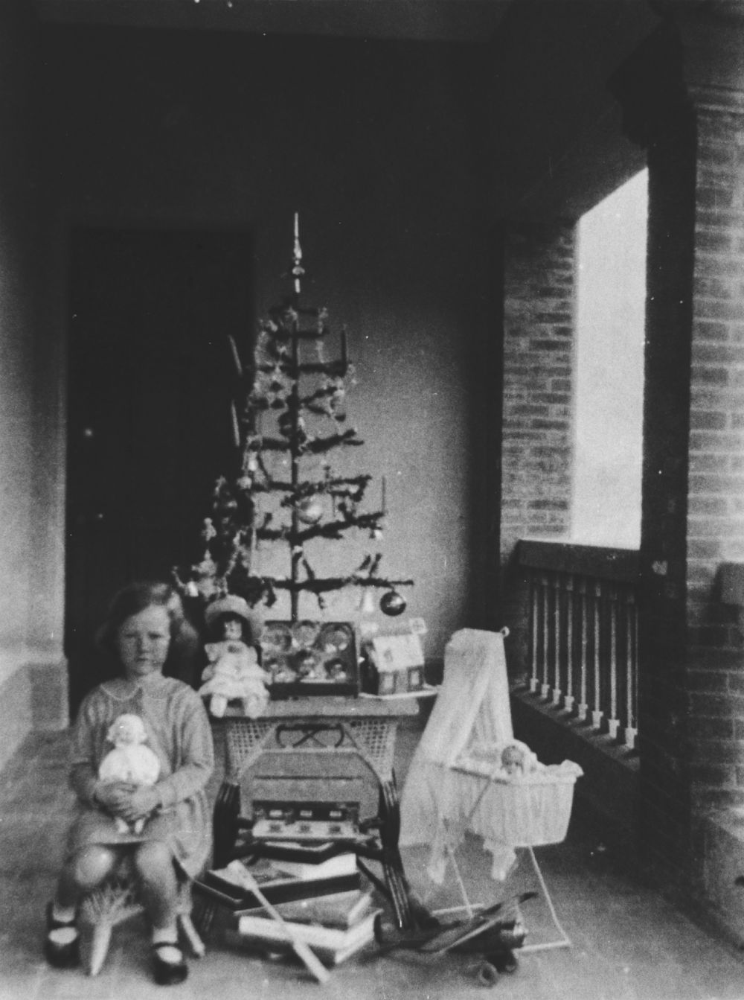

# Christmas

{ width="40%" }  

*<small>[Christmas morning under the Christmas tree, ca. 1935](http://onesearch.slq.qld.gov.au/permalink/f/1upgmng/slq_alma21220399300002061) — State Library of Queensland.</small>*

<!--

???+ directions "Directions" 

    Starting point
    Walking directions to first headstone... is the grave of...
    
    { width="15%" }

-->

## Joseph Robert Abbott <small>(10‑80‑45)</small>

5227 / Q54752

A son of Joseph Abbott and Rose Ann (née Napier), Joseph was born on 30 May 1899 in Gympie. Joseph, a greaser, enlisted on 22 November 1917 and was assigned to the 31^st^ Battalion AIF. Private Abbott was gassed in France on 30 September 1918 and was medically discharged in 1919.

Ellen Mary Clegg married Joseph in Brisbane on 16 February 1921. In May 1928, J R Abbott was listed as a successful candidate of an locomotive and traction engine driver certificate in Mackay.

Joseph enlisted in Mackay on 10 December 1940 and was assigned to the 15 Garrison Battalion. Private Abbott transferred to 1 Garrison Battalion at the end of August 1941 and was promoted on 22 November 1941. On duty in Landsborough at 4:14am on Christmas Day 1941, Lance Corporal Abbott was shot near his right eye. The shot killed Joseph within a few minutes. His body was transferred to Nambour for a post-mortem examination before his Boxing Day funeral.

<!--

??? directions "Directions" 

    Walking directions to next headstone... is the grave of...
    
    { width="15%" }
    
-->

## George Hansford <small>(10‑17‑30/31)</small>

George was born on Christmas Day 1840 at St Helier, Jersey to John Hansford and Julia (née Goillon). He was baptised on 10 January 1841. Jane Blackmore Hue married George in St Saviours, Jersey on 18 August 1864. 

George and his extended family, boarded the *Gauntlet*, which sailed from London on 4 October 1874, arriving in Maryborough on January 01 1875.

In April 1887 Hansford's, Saddler was located at the corner of George and Ann Streets. By July 1889 he's listed as being in Roma Street and then the business is listed as next to the Market Gate, Ann Street from November 1910. George also operated a boarding-house in Ann Street.

The saddlery business continued through his son, Reginald, in Makerston Street. 

George died on Tuesday 13 October 1925 at the residence of his daughter, Mrs Harrison, Cribb Street, Milton. Three sons, two daughters, 30 grandchildren and eight great-grandchildren survived George. George was buried with his wife, who predeceased him by seven years.

## Victor Cyril Button <small>(10‑53‑14)</small>

H.1870

Cyril Claude Button and Jessie Elizabeth (née Wood)'s eldest son, Victor Cyril Button, was born on 1 January 1924 in Hobart, Tasmania.

Victor reported for duty on 19 November 1941. He trained at *HMAS Cerberus*, Victoria and *HMAS Lonsdale*, Victoria, before transferring to *HMAS Penguin*, New South Wales for sea service aboard *HMAS Australia (II)*.

About 11pm on Friday 25 December 1942, Stoker II V C Button RANR, aged 18 years, fell overboard from *HMAS Moreton (Kinchela)*. His drowned body was retrieved from the Brisbane River about noon two days later. Victor was buried with full naval honours on 28 December 1942. Victor is memorialised on the Stanley War Memorial, Tasmania, which is his family's hometown.

## Joseph Cossart <small>(13‑18‑16)</small>

Joseph Cossart was born on 14 November 1843 (± 3 years) in County Antrim, Ireland to Henry Cossart and Mary (née Walker). The family sailed from London to Moreton Bay aboard the *Flying Cloud*, arriving on 19 February 1864. The family settled in the Perseverance Creek district. 

Annie Bidgood married Joseph in Pipe Clay, Perseverance near Crow's Nest, Queensland on 4 August 1874. They had nine children.
In 1890 Joseph moved his family to the Dugandan district near Boonah, where they lived until moving to Brisbane in 1899.

In 1901, Joseph and Sydney, his second son, started a saw milling business in Gatton. Ultimately Joseph's other sons joined the business.
Joseph died at his residence, *Babbiloora*, Browne Street, New Farm on the evening of 25 December 1911 leaving his widow, four sons and four daughters.

## Edward Arthur Gordon <small>(6‑7‑18)</small>

Edward Arthur Gordon, born around 1893, was a son of Charles Horsfall Bankart Gordon and Mary (née Clough). Edward worked as a finisher at Morris' Boot Factory and resided at Ross Street, Paddington. On Christmas Eve, Edward and some friends camped at Stanley Bridge, near Woodford. On Christmas Day 1912, at about 9am the friends started hunting wallabies. Shot, Edward was conveyed by buggy to Woodford then train to Caboolture. After attendance in Caboolture by their ambulance bearer, Edward was taken to the Brisbane General Hospital.
Edward died in hospital on 26 January 1913 from an accidental bullet wound to the right thigh, haemorrhage, sepsis and exhaustion.

## Joseph McNamara <small>(10‑71‑26A)</small>

Q875  <!-- What is this number -->

Joseph McNamara, a son of Roger and Jane (née Addison), was born in Sydney's Woollahra district on 23 May 1916. On 22 January 1941, Joseph, a labourer residing at 29 Prospect Terrace, Highgate Hill, enlisted at Lytton. Signalman McNamara <!-- (Q875) --> was assigned to the Australian Citizen Military Forces, New Guinea Area Signals, Australian Corps of Signals.

Joseph died in Brisbane on 25 December 1941 of injuries accidentally received, aged 25 years.

## Sources

- [Assisted Immigration](https://www.qld.gov.au/recreation/arts/heritage/archives/collection/immigration) - The State of Queensland (Queensland State Archives)
- [Australian Dictionary of Biography](https://adb.anu.edu.au)
- [Brisbane City Council Grave Location Search](http://graves.brisbane.qld.gov.au)
- [Family History Research](https://www.familyhistory.bdm.qld.gov.au) - The State of Queensland
- [One Search](http://onesearch.slq.qld.gov.au/primo-explore/search?vid=SLQ) - State Library of Queensland
- [Trove](https://trove.nla.gov.au)

## Brochure

**[Download this walk](../assets/guides/one-day-christmas.pdf)** - designed to be printed and folded in half to make an A5 brochure.

