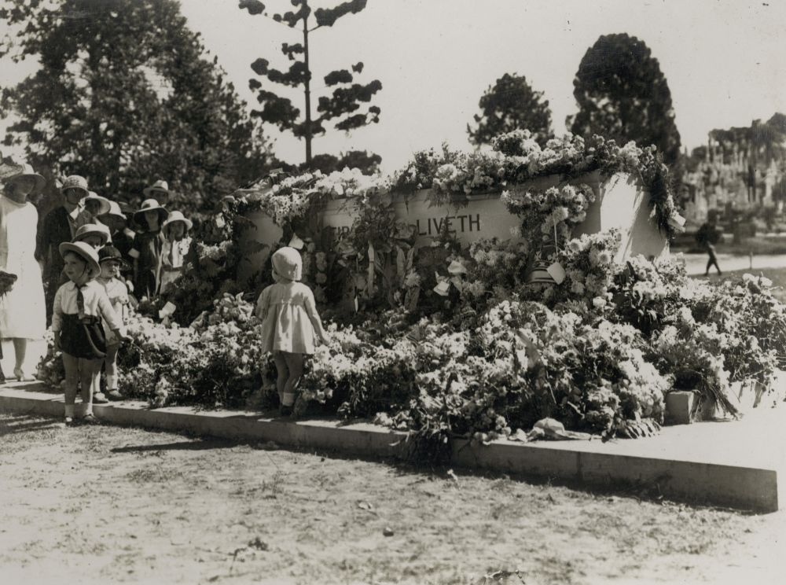

---
hide:
  - navigation
---

# Colonial Conflicts   

**A Remembrance Day Service and Guided Walk conducted at Toowong Cemetery on the 4^th^ November 2012.**

    
[Portion 10](../assets/toowong_map.jpg) contains numerous Commonwealth War Graves and received military burials between 1917 and 1942 until they were re-directed to [Lutwyche Cemetery](https://www.brisbane.qld.gov.au/community-and-safety/community-support/cemeteries/lutwyche-cemetery). Flowers were cultivated and sold at the Cemetery from Portion 10 until the 1930s. In 1934 the area set apart for soldiers’ graves within Portion 10 was extended to incorporate the flower gardens and the wooden pavilion was demolished. As the military graves were interspersed amongst civilian burials, this portion lacks the familiar formality of a [Commonwealth War Cemetery](https://www.cwgc.org).

## Soldiers’ Memorial

The Cross of Sacrifice and Stone of Remembrance were unveiled on Anzac Day, 1924, by the Governor‑General, Lord Forster. The Stone of Remembrance is a solid block of Helidon sandstone weighing ten tons. The unveiling ceremony was attended by several thousand people, including relatives of soldiers killed overseas and many dignitaries. 

{ width="70%" }  

*<small>[Official unveiling of the Cross of Sacrifice on Anzac Day at Toowong Cemetery, Brisbane, 1924](https://digital.slq.qld.gov.au/delivery/DeliveryManagerServlet?dps_pid=IE1400763&change_lng=), — [State Library of Queensland](https://www.slq.qld.gov.au).</small>*

The Citizens’ Band provided music as the public laid wreaths at the Stone. So many floral tributes were deposited, that the stone was completely covered. One was even dropped from a plane circling above. The inscription THEIR NAME LIVETH EVERMORE was chosen by Rudyard Kipling and is found on the Stone of Remembrance in every Commonwealth War Cemetery.

{ width="70%" }  

*<small>[Small children looking at wreaths laid at the memorial on Anzac Day, Toowong Cemetery, Brisbane, 1924](http://onesearch.slq.qld.gov.au/permalink/f/1upgmng/slq_alma21271931300002061) — [State Library of Queensland](https://www.slq.qld.gov.au).</small>*

## ‘A’ Battery Memorial

Prior to Federation each of the Australian colonies maintained its own defence force. These forces were largely comprised of part‑time volunteers and a small number of permanent officers and men. This memorial is to the men of Queensland’s permanent force ‘A’ Battery, Queensland Artillery. All of those named on the memorial died while serving in the Battery, but only one, Driver Sydney Walker, died while on active service. Walker was serving on the 1^st^ Queensland Contingent to the South African War when he died of enteric fever at Bloemfontein. This [monument](https://placesofpride.awm.gov.au/memorials/240931) was established in April 1886. A number of soldiers named on the memorial are buried nearby.

## Caskey Memorial

Unveiled in May 1902, this is the first known [monument](https://placesofpride.awm.gov.au/memorials/118226) to the South African War to be erected in Queensland. Lieutenant John Caskey of the Fifth Queensland Imperial Bushmen was killed in action on 27 September 1901 at the Mokari Drift on the Caledon River. The obelisk, made of white Helidon sandstone and draped by a shroud, features emblems of Caskey’s teaching career at Leichhardt Street School, Brisbane and Spring Creek and his sporting interests. A rare memorial to the Anglo‑Boer conflict, this monument is a significant reminder of emerging nationalism and contemporary attitudes to war. Other monuments to him can be found at Clifton RSL and the [Allora State School](https://placesofpride.awm.gov.au/memorials/116791).

{ width="40%" }  

*<small>[Lieutenant Lachlan J. Caskey of the 5^th^ Queensland Contingent](http://onesearch.slq.qld.gov.au/permalink/f/1upgmng/slq_digitool105672) — [State Library of Queensland](https://www.slq.qld.gov.au).</small>*

## John Wyndon Lyon <small>(10‑65‑30)</small>

Lyon was a member of the 2^nd^ Battalion, Natal Contingent and saw action at the Battle of Isandhlwana, Rorke's Drift, Gingalore, the relief of Ekouso and was awarded South African Medal. On 22 January 1879, the 1^st^ Battalion, 24^th^ Regiment of Foot was attacked by Zulus and decimated, with some 858 members killed. A few soldiers were able to escape to the mission station at Rorke’s Drift. The Battle of Rorke’s Drift was depicted in the [1964 movie Zulu](https://en.wikipedia.org/wiki/Zulu_(1964_film)). Eight officers and 135 men successfully defended the station. Eleven Victoria Crosses were later issued, the most in any British battle. Lyon [died](https://trove.nla.gov.au/newspaper/article/1193194) on 21 April 1934 aged 81.

--8<-- "snippets/charles-heaphy.md"

## John Jennings Imrie, MD <small>(1‑85‑9)</small>

Imrie was born in Ayr, Scotland, on 1 June 1813, where he was educated at the local Academy, Braisemere College, Oxford, then Edinburgh Royal College of Surgeons but did not graduate. He received a commission in the army, and went out as medical officer with the 42^nd^ Highlanders to India where he remained in active service for six years. He was severely wounded in India when taking the lead in a charge. With all the other officers were either killed or wounded, he led on and gained a victory, for which he may have been awarded a medal for bravery. His obituary published in the Brisbane Courier (25 May 1901) stated this was the Victoria Cross but his name does not appear on any lists of recipients. He was then invalided to England; afterwards sold his commission. 

He then emigrated to New Zealand was just at that time proclaimed a British colony with his family and settled in Nelson in 1842. Stories of Imrie’s dramatic escape from the Wairau Affray, in which 22 settlers were killed, are embroidered. Imrie and his family left in an orderly fashion aboard the Sisters for Hobart in September 1843. He then started practice of his profession in Hobart, and in January 1845 was appointed medical officer for the convicts at Maria Island, where he resided for many years with his family, until the settlement was wound down. Then he was transferred to the penal settlement at Ross, where he remained until transportation ceased. He farmed for a period, before moving to Queensland with his family in 1864, and shortly after joined the civil service where he remained until retiring in 1894. He died aged 88 on 23 March 1901.

## Lieutenant John Higson <small>(2A‑31‑16)</small>

[Higson](https://www.awm.gov.au/collection/R1446575) went to the Boer War with the 4^th^ Contingent. Prior to embarkation, he had been a school teacher at South Brisbane. While on service, Higson was shot through the head. After regaining consciousness, he was helped off the battlefield and eventually returned to Queensland little worse for wear. After recuperating, he returned to South Africa, intending to return to the conflict just as the contingent was ordered back. He returned to teaching and was active in musical and masonic activities. 

His death on the 13 November 1902 aged 38 was unexpected. He was afforded a military funeral. The coffin, covered by the Union Jack, left his residence at Taringa on a gun carriage. At the corner of Jephson Street and Sylvan Road, a military cortege consisting of soldiers, sailors, band and firing party from the South Brisbane State School joined in the procession to the cemetery.

## Robert Orton <small>(5‑66‑4)</small>

Orton served with the 9^th^ Lancers for twelve years including service in the second Afghanistan War from 1878 to 1880. He resigned from the army in 1885 and worked briefly for Queensland railways before making his application to be a police constable in October that year. He was stationed at South Brisbane in October 1899 when he wrote a letter seeking permission to join A Company, 1^st^ Queensland Mounted Infantry. Some of the officers he had served under in Afghanistan were at the Boer War and he was keen to join them. He was granted six months leave without pay. So he was one of ‘the first of the first’ Queenslanders to go to the Boer War. 

When Orton returned to Brisbane after his Boer War service on the 19 November 1900, the police band was there to meet him at Central Station. He had been repatriated home as he was injured when a horse fell on him. He rejoined the police force however it was not easy for him and in January 1901 he is seeking 19 pounds from the force to top up an allowance he should have received to make up the difference between his soldiers pay and his police pay. He pointed out that he was the only married police officer to join the Boer War campaign. Orton died in August 1929 aged 69.

## George Vowles <small>(2‑49‑35)</small>

Vowles, born ca. 1846 in Ipswich, claimed to be the first Queensland‑born soldier to serve overseas for the Empire. As a seventeen year old, he participated in the Invasion of Waikato which was a campaign during the middle stages of the New Zealand Wars, fought in the North Island from July 1863 to April 1864. The conflict was between the military forces of the Colonial Government and a federation of rebel Māori tribes known as the Kingitanga Movement. 

On his return he joined the Public Instruction Department in 1869, and spent six years as head master of the Allenstown School (in Rockhampton), six years at North Ipswich and nearly 29 years at Petrie Terrace Brisbane. He retired in 1917. He attained the highest possible rank in the teaching profession, being in class 1, division 1. He was the author of [a small book of poems](https://www.oldqldpoetry.com/chubb-and-vowles-two-ipswich-originals), [Sunbeams in Queensland](http://onesearch.slq.qld.gov.au/permalink/f/1oppkg1/slq_alma21120418090002061). 

In 1921, Vowles was elected the president of the Imperial Navy and Army Veterans' Association of Queensland. He died on the 28 November 1928 aged 82.

## Acknowledgements

<!-- The Remembrance Day Service was arranged by Gavin Stoneley, Metropolitan Funerals -->
- The Remembrance Day Service Address was given by Judy Magub
- Additional Research by Paul Seto

## Brochure

**[Download this walk](../assets/guides/colonial-conflicts.pdf)** - designed to be printed and folded in half to make an A5 brochure.

