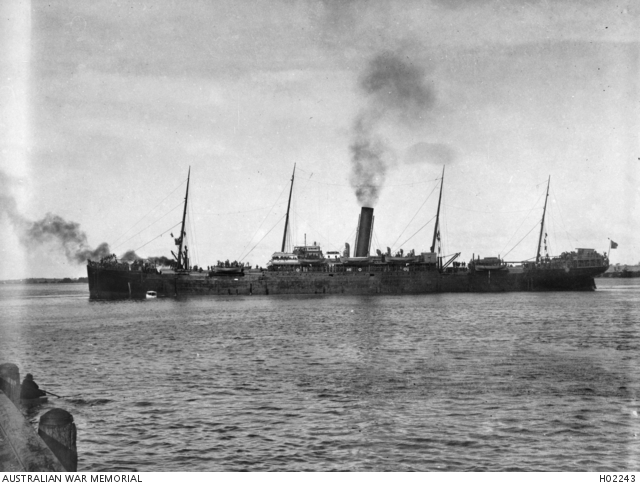

# Conflict and Compassion 

<!--
???+ directions "Directions" 

    Starting point
    Walking directions to first headstone... is the grave of...
    
    { width="15%" }
-->

## Private Albert Williams Gyler  <small>(2‑41‑65)</small>

3^rd^ Depot Battlion

Born in Newcastle 1892, enlisted Gin Gin Queensland at 23 year of age. Records say he was a labourer. Next of Kin was his Mother, Sarah Elizebeth Gyler née Holden.

<!--
??? directions "Directions" 

    Walking directions to next headstone... is the grave of...
    
    { width="15%" }
-->

## Private James Sanford M.M. <small>(2A‑24‑1/2)</small>

'5753' 9^th^ Battalion 

James was born on 9 September 1888 nearby at Redhill to James and Emily Ann (née Andrews). He enlisted 10 February 1916 in Cairns and after training, embarked on HMAT SEANG CHOON (A49) on 4 May 1916.

{ width="70%" }  

*<small>[Troopship SEANG CHOON (A49) shortly after leaving Pinkenba Wharf. ](https://www.awm.gov.au/collection/H02243) Brisbane, Queensland. ca. 1915. This ship was later torpedoed and sunk off the Irish coast, near Fastnet, on 1917-07-10. — Australian War Memorial - Public Domain</small>*

## Corporal Henry Townsend Wilkins <small>(2A‑22‑11)</small>

'783' 41^st^ AIF 

Henry was born in Brisbane 1895 to Joseph Bakes Wilkins and Eleanor Fowdry Townsend. His father passed away 1907. He enlisted 20/9/1915 and embarked 18/5/1916 and Killed in Action (KIA) on 31/7/1917 at 22 years of age. There is no known resting place but he is memorialised here on the family grave and on the Menin Gate, Belgium. One of the 6178 inscribed Australians who served in the Ypres campaign who have no known grave.

## Private Jack Bannister <small>(2A‑25A‑18/19)</small>

'3782' 49^th^ Battalion

Jack was born in Brisbane in 1895 to Walter William Bannister and Margaret Jane Henson. He married Annie Kelly in 1911 and had two children at the time of enlistment. He enlisted 7/9/1915 and after training embarked 31/1/1916 on A62 HMAT Wandilla. 

Jack embarked for Australia per SS Berrima on 2/1/1919 and landed in Melbourne 17/2/1919 and was discharged 18/4/1919 in Brisbane and was laid to rest here 6/10/1964 with his parents.

## Private Joseph George Barnes <small>(2‑43‑14)</small>

'1104' 9^th^ Battalion 

Joseph was born in Brisbane to Thomas Barnes and Elizabeth Louisa Blacker in 1887. He enlisted 11/9/1914 at Enoggera and embarked from Melbourne 22/12/1914 per HMAT Themistocles A32. He was KIA 2/5/1915 on the attack on Gaba Tepe and buried at Lone Pine Cemetery.

## Private Louis Walter Barnes <small>(2‑43‑14)</small>

'1822' 25^th^ Battalion
 
Louis was a brother of Joseph and enlisted 25/2/1915 and embarked from Sydney on 20/8/1915 on HMAT Shropshire A9. He survived Gallipoli and arrived in France 19/3/1916 and was KIA on 3/8/1916. No record exists of burial.

## Private John James Bennett <small>(2‑43‑13)</small>

'2327' 49^th^ Battalion 

John was born in Brisbane to James Bennett and Elizabeth Guilfoyle in 1897. He enlisted 28/5/1915 and embarked 20/8/1915 on A9 HMAT Shropshire. He returned to Australia per 'Margha' arriving 8/2/1919 and passed away 1967 and was laid to rest by himself.

## Private Norman Lister Freeman <small>(2‑43‑24/25)</small>

'3051' 55^th^ AIF 

Norman was born in Townsville to Walter Alfred Freeman and Emma Tomkins in 1891. He enlisted on 13/8/1915 at Warwick Farm NSW and embarked on 8/10/1915 on A69 HMAT Warilda and taken on strength Tel el Kebir 5/2/1916. Arrived France 29/6/1916, head wound and captured 20/7/1916 and died as POW 24/7/1916 and buried Haubourdin Cemetery. After the war exhumed and laid to rest plot 16 row C grave 8 Cabaret Rouge British Cemetery France.

## Driver James Archibald Henry Bennett <small>(2‑24‑29/30)</small>

'9' 41^st^ Battalion 

Born in Brisbane to Henry Bennett and Euphemia Archibald 18/10/1892. He enlisted 22/11/1915 in Brisbane and embarked 18/5/1916 from Sydney on HMAT Demosthenes A64, arrived England 20/7/1916 and in France 24/11/1916. He died of "Broncho Pneumonia" on 29/11/1918 and laid to rest Abbeville Cemetery.

## Private Roy Nestor Sinclair Brown <small>(2A‑22‑11)</small>

'4984' 49^th^ Battalion 

Born to Charles Allen Brown and Louisa Coomber in 1890. One of 12 children. Enlisted 24/11/1915 Embarked 4/5/1916 HMAT Seang Choon A49.
Badly wounded 11/10/1917 GSW head and died of wounds 21/10/1917 at 27 years of age France. Laid to rest 22/10/1917 British Military Cemetery, Etaples, Nord Pas de Calais, France plot v.483

## Driver George Lewis Brown <small>(2‑44‑26/27/28)</small>

'27' 1^st^ Light Horse Brigade 

Enlisted 20/8/1914 Brisbane Embarked 2417/9/1914 HMAT Omrah A5. Returned to Australia on the Kyarra and discharged on medical grounds 4/4/1915 and passed away 5.50AM on 12/7/1920 and laid to rest 13/7/1920 in family grave in Toowong cemetery.

## Lieutenant Francis Leofric Armstrong  <small>(2‑45‑16/17)</small>

15^th^ Battalion

Born 25/10/1880 Mt Perry to Octavious Armstrong and Jessie Augusta Frances. Saw service in South Africa Boer War. 6 months in the Prince of Wales Light Horse and 7 months with the 3^rd^ NSW Imperial Bushmen. Awarded the Queens Medal for that war. WWI enlisting details along with some other pages are missing from his NAA service records. KIA 10/5/1915 at Quinn's Post and laid to rest the same day at Quinn's Post Cemetery

## Private Algernon Cedric Francis <small>(2‑37‑31/32)</small>

'4435' 25^th^ Battalion 

Algernon was born in Cunnamulla to Christopher Francis and Emilie Jane Everett in 1896. He enlisted 30/11/1915 and embarked 31/3/1916 from Sydney on HMAT Star of Victoria A16. He arrived in France 27/7/1916 and was KIA 18/11/1916 aged 20 years and 11 months. He is buried in Warlencourt British Cemetery p3, r F g 6

## Private William Rich Saile <small>(2A‑22‑11)</small>

'3930' 1^st^ Pioneers 9^th^ Battalion 

Born Annandale NSW to Richard Saile and Annie M 1893. He enlisted Brisbane 16/8/1915 and embarked 30/10/1915 on HMAT Itonus A50 from Brisbane. KIA 25/7/1916 France and laid to rest Villers-Bretonneux

## Sapper Norman Kinamond Harvey <small>(2‑47‑38)</small>

'4439' 2^nd^ Division Signals Company 

Born in Fitzroy to John Henry Harvey and Henrietta Kinamond Fairbairn. Enlisted 23/11/1915. Embarked at Sydney on HMAT Nestor A71 on 9/4/1916 and coincidentally returned to Australia via the same ship 1/11/1919.

## Private John Thomas Moores <small>(2‑47‑16)</small>

11^th^ Light Horse 

Born in Blackall to John Thomas Moores and Mary Alice Robinson 1891. Enlisted 18/12/1916 in Rockhampton. He embarked 9/5/1917 on HMAT Port Sydney A15 from Sydney and arrived Suez 20/6/1917. He returned to Australia on the Morvada 28/8/1919. Despite illness he lived to 77 years of age and was laid to rest 27/6/1969.

<!--
{ width="70%" }  

*<small>[Devoy residence in Ashgrove, Brisbane, ca. 1908](http://onesearch.slq.qld.gov.au/permalink/f/1upgmng/slq_alma21218171470002061). The Devoy residence was in Three Mile Scrub Road (now Ashgrove Avenue), off Waterworks Road. John Devoy was the manager of Castlemaine Perkins. — State Library of Queensland.</small>*
-->

## Acknowledgements

Compiled and presented by Darcy Maddock

## Sources

- [Grave Location Search](https://graves.brisbane.qld.gov.au) - Brisbane City Council
- [Trove](https://trove.nla.gov.au) - National Library of Australia
- [National Archives Service Records WW1 and Boer War](https://www.naa.gov.au/explore-collection/defence-and-war-service-records)
- [Australian War Graves](https://www.dva.gov.au/wargraves)
- BDM Queensland Index Search - State of Queensland, 2015. Now [Family history research service](https://www.familyhistory.bdm.qld.gov.au)

<!--

## Brochure

**[Download this walk](../assets/guides/printers.pdf)** - designed to be printed and folded in half to make an A5 brochure.

-->
