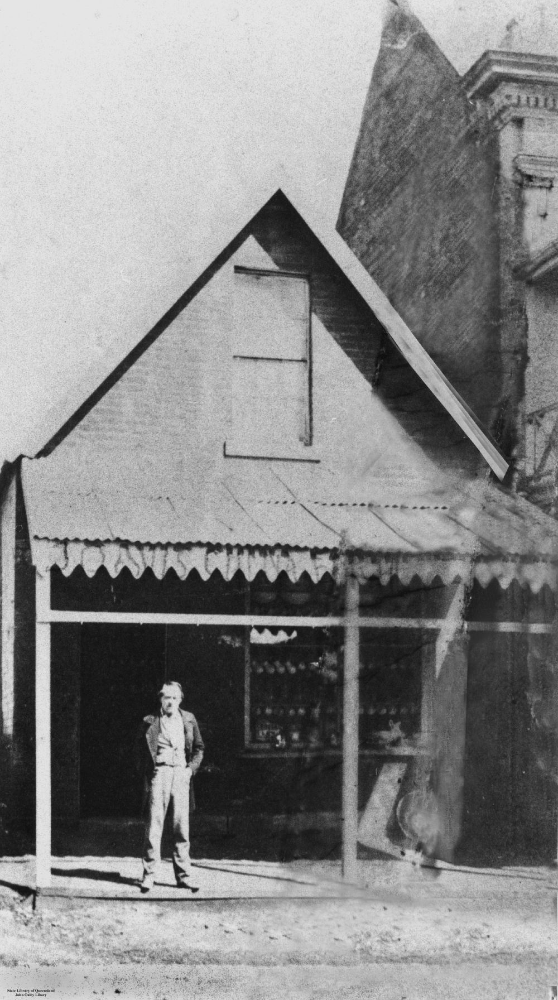

# The Convicts  

**Connections to our Convict past**

## Convict settlement children

### Peter McCauley <small>(13‑10‑4)</small>

Peter McCauley was born in Sydney on the 17^th^ of April 1826, the son of Private Peter McCauley, a member of the 17^th^ Regiment. His mother, Mary, was appointed as matron of the Brisbane Town Female Factory in June 1831. On the 5^th^ of January 1832, young Peter wandered away from his brothers on an outing and drowned in the Brisbane River near the present Botanical Gardens. The family returned to Sydney in 1832.

### William Henry Roberts <small>(13‑10‑4)</small>

William Roberts was the son of Charles Roberts, a store keeper with the Commissariat Department, and Esther Dale, the first teacher of girls in the Moreton Bay settlement. On 11^th^ of June 1829 he was christened by the Reverend John Vincent, who resided at the Moreton Bay Settlement from late March to December 1829. This baptism was the third of only six Vincent conducted during his short tenure. The entry indicated that William Henry Roberts had been born on the 15^th^ of September 1828. The inscription on the top of the chest tomb memorial originally intimated that he had died of illness on 15^th^ of November 1831 aged just three years and two months. The tomb lid originally had a bible verse inscribed on it based on Matthew 19:14

>Suffer the little children, and forbid them not, to come unto me: for of such belongeth the Kingdom of God. 

It has since been lost to weathering. After the death of their son, the Roberts family returned to Sydney in 1834. 

### Jane Pittard <small>(13‑10‑4)</small>

Jane Pittard was the daughter of the late Colour Sergeant John Pittard and his wife Mary. Jane was born in Sydney on the 10^th^ of January 1832. John died in Tasmania in 1831 a little more than four months before Jane’s birth. Shortly after Margaret Pittard was remarried to David Collins of the 17^th^ Regiment and they moved, with Margaret’s two daughters, to Moreton Bay. Jane died just five months later no cause of death is known.

## Thomas Dowse <small>(13‑58‑22)</small>

Thomas Dowse was born at Hackney, London. Aged 15, he was accused of theft by his mother, tried at Middlesex on 16 September 1824, convicted and sentenced to life imprisonment. He was transported to New South Wales in the *Florentia* which arrived in January 1828. At St John's, Parramatta, in 19 November 1832 he married Ann Kelly. Only three of their seven children survived infancy. In 1836, Dowse was granted a ticket‑of‑leave and a conditional pardon in 1839. When the Moreton Bay District was opened for free settlement he decided to go there to see what opportunity awaited a man who was in good health and not afraid of hard work. 

The family arrived aboard the *Falcon* on 9 July 1842. Noticing the need of a ferry across the river, he bought a skiff which by 1843 had earned three times its value. By 1846 he was established as an auctioneer and commission agent, and also had the agency for the Sydney Morning Herald. At his premises in Queen Street he sold almost anything from shirts, frock coats, cutlery, looking‑glasses and books to livestock. His auction mart also became a centre for discussion of social reform, for perhaps no one then had a greater horror of the degrading convict system or worked harder to end it. 

A widower at 47, in Brisbane in 1856 he married Sarah Ann Fairfax; they had three sons and two daughters. Because of his work for separation and contributions to the press under the pseudonym of Old Tom, he was appointed with Walter Hill, director of the Botanic Gardens, to arrange the Queensland exhibit at the London Exhibition in 1862. In this task they were successful and received a public testimonial in 1864. When the first town clerk of Brisbane retired, Dowse was elected in January 1862. He retired from office in 1869 but continued in business until he died aged 75 at his home, *Hillside*, Milton, on 9 November 1885.

{ width="40%" }

*<small>[Thomas Dowse](http://onesearch.slq.qld.gov.au/permalink/f/1upgmng/slq_alma21218687340002061) Brisbane Town Clerk 1862-1868 — State Library of Queensland.</small>*

## Agnes Susan Maclean <small>(5‑107‑19)</small>

Agnes Susan Maclean was christened Susannah Agnes Kable, the grand‑daughter of First Fleet Convicts Henry Kable and Susannah Holmes and Second Fleet Marine William Charlton and Convict Mary Gittos. Born in Windsor, NSW; Susannah was the eldest of 6 children. Susannah's father William Nathaniel Kable died when she was 11. 

When Susannah was 19, she married John Shand Maclean, the son of an Equity Court Clerk from Jamaica at St Mary's Cathedral in Sydney. The first of Susannah's 10 children was born in 1847. Susannah followed her husband around his various interests. John attempted farming and for a time taught at a gentlemen's academy in the Richmond area of New South Wales. By 1856, the ever growing family had settled in the Burnett region. Susannah's final four children were born on various cattle properties in the region. 

Tragedy struck in November 1862 when John fell off a horse and died on Gyranda Station near Cracow. Susannah buried her husband between the homestead and the river the assistance of her brother and brother‑in‑law. Susannah was left with 10 children under the age of 15 and a cattle property to manage. She suffered another setback in the 1870s when a fire tore through Gyranda, destroying all her photographs and heirlooms. Susannah brought up her large family with the assistance of her brother and sister‑in‑law on a nearby property. 

Agnes Susannah, as she was now known, claimed the right to vote in 1905, in her 80^th^ year. She is then registered on the electoral roll living with her youngest daughter Elvina and her school‑master husband Charles Marshall at the Nerang State Schoolhouse. Agnes died of nephritis at the Brisbane General Hospital on the 20^th^ of January 1911. She was buried next to her sister‑in‑law Mary Ann Kable.

## Edward Mott <small>(7‑44‑22)</small>

Edward Mott was born ca. 1807. He was convicted on the 18^th^ of January 1828 at Gloucester City Assizes for stealing a gun and was sentenced seven years transportation. He arrived in New South Wales on 8 September 1828 aboard the Countess of Harcourt. Edward was sent to Moreton Bay in June 1832 and his ticket‑of‑leave was issued on 9^th^ February 1844. 

Before 1859 he owned a large dairy on the land bounded by what is now George and Adelaide Streets. His cows watered at a big waterhole where City Hall now stands. After selling up, he moved to the sparsely settled Enoggera District. Late one August evening 1875, Edward was driving back from the city when he was dragged from his dray and his throat was slashed. He was left for dead and bore the scars for the rest of his life. No motive for the crime was ever discovered. 

Edward lived in Grovely for forty‑five years and after he died on the 28^th^ of August 1900, he was buried at St Matthew's Anglican churchyard in Grovely, but was moved to Toowong Cemetery in 1939. At the time of his death he was described as being in very comfortable circumstances.

## Kevin Izod O’Doherty <small>(7‑58‑27)</small>

Kevin O’Doherty was born in Dublin, son of solicitor William Dougherty and Anne McEvoy. He studied at the Catholic School of Medicine in 1844. He was convicted as a ‘Young Irelander’ and transported to Sydney in 1848 on the Mt Stewart Elphinstone and then on the Emma to Tasmania with fellow conspirators where he served time at Port Arthur. After five years he was given a conditional pardon (not allowed to return to Ireland) and went to Paris before marrying, in London, in 1855 writer Mary Eva Kelly of Galway (Eva of The Nation). In 1856 O’Doherty received a full pardon and went to Dublin to get his Medical Degree from 1857 to 1859.

They then migrated to Victoria in 1860 and to Brisbane where he set up practice in the Forbes Building at Ipswich in 1862. By 1866, he was the leading medical practitioner in George Street, Brisbane, and personal physician to Bishop Quinn. He was also the first President of the Queensland Medical Board. He was an MLA in 1867 and MLC 1877 - 1885 and also returned to Ireland as the Nationalist Member for Meath 1885 - 1888. As a founding member of the Queensland Hibernian Society and the Queensland Irish Association, O’Doherty was well respected and presided over the St. Patrick’s Day Committee in the 1860s. The Queensland Irish Association raised this monument over his grave.

## James Davis (Duramboi) <small>(7‑5‑15)</small>

James Davis was born in Broomielaw, Scotland, and at 14 was apprenticed to his father as a blacksmith at Old Wynd, Glasgow. Convicted two years later for stealing 2s. 6d. from a church box in Surrey, he was sentenced to be transported for seven years, and in August 1825 arrived in New South Wales in the *Norfolk*. His next appearance in court was at Patrick's Plains, where in 1828 he was charged with robbery and sentenced to three years at Moreton Bay as a doubly convicted felon. He arrived there on 18 February 1829 and absconded six weeks later. The escapees soon met a party of Aboriginals whose chief, Pamby‑Pamby, claimed Davis as his dead son returned to life as a white man. As Duramboi, Davis took easily to tribal life. An honoured guest, he was allowed to move freely from one tribe to another, his travels taking him hundreds of miles from Brisbane. He had learnt the languages and customs of many tribes before he was found at Wide Bay in 1842 by Andrew Petrie and with difficulty assured that he could return safely to Brisbane as the convict settlement had ended.

He had to relearn the English language and accustom himself again to work and clothes. He was employed at first by Dr Stephen Simpson, the land commissioner in Moreton Bay; later he set up as a blacksmith at Kangaroo Point. In 1864 he opened a crockery shop in George Street, Brisbane, where he made money, although literate enough only to sign his name. He had married Annie Shea on 3 November 1846. After her death in 1882, he married on 28 July 1883 Irish‑born widow, Bridget Hayes. He died on 7 May 1889.

His rehabilitation into acquisitive society included reform; from his accumulated estate the Brisbane General Hospital received £750 in 1889 and another £1100 in 1911. He guided settlers to good land in the Wide Bay area, and some public benefit came from his thirteen years with the Aboriginals. He was occasionally employed as a court interpreter, and in 1866 petitioned the governor to raise his salary to the £20 paid to Chinese and German interpreters, but his request was refused.

{ width="40%" }  

*<small>[James Davis poses in front of his crockery store, George Street, Brisbane, ca. 1872](http://onesearch.slq.qld.gov.au/permalink/f/1upgmng/slq_alma21218687340002061) — State Library of Queensland.</small>*

## Sources

- Gunthorpe, S. G. 'Dowse, Thomas (1809 ‑ 1885)', Australian Dictionary of Biography, Volume 4, Melbourne University Press, 1972, pp 101‑102
- Laurie, A. ’Davis, James (1808 ‑ 1889)', Australian Dictionary of Biography, Volume 1, Melbourne University Press, 1966, pp 294-295.
- Patrick, Ross and Heather Exiles Undaunted. St. Lucia : University of Queensland Press, 1989 [Kevin and Mary O’Doherty]
- ‘Death of Old Colonist’ [E. Mott] The Queenslander, 8 September 1900, pp.542-543.

## Brochure

**[Download this walk](../assets/guides/convicts.pdf)** - designed to be printed and folded in half to make an A5 brochure.

