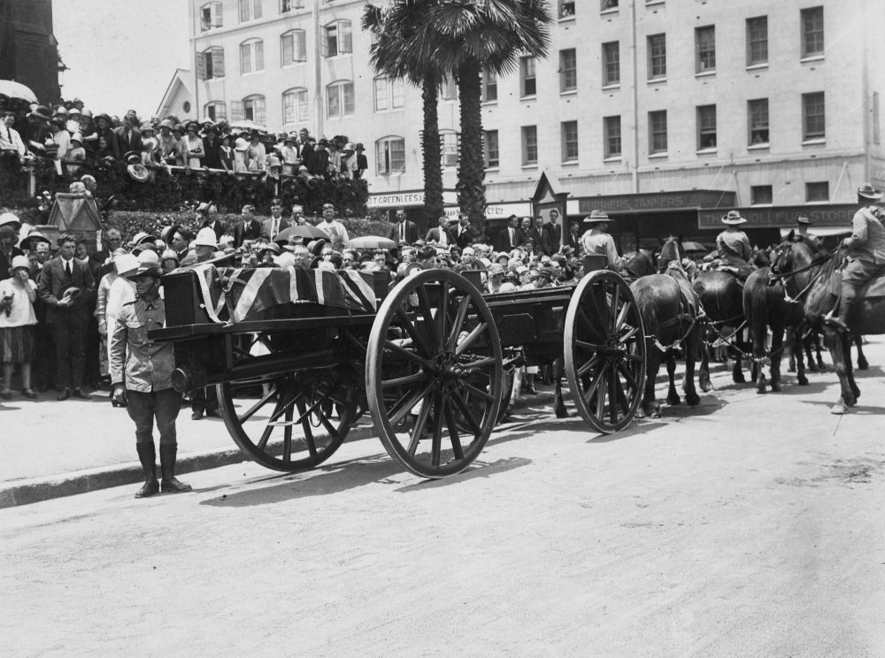

# Erected by Friends and Family

<!-- 

{ width="70%" }  

*<small>[Devoy residence in Ashgrove, Brisbane, ca. 1908](http://onesearch.slq.qld.gov.au/permalink/f/1upgmng/slq_alma21218171470002061). The Devoy residence was in Three Mile Scrub Road (now Ashgrove Avenue), off Waterworks Road. John Devoy was the manager of Castlemaine Perkins. — State Library of Queensland.</small>*

-->

<!--
???+ directions "Directions" 

    Starting point
    Walking directions to first headstone... is the grave of...
    
    { width="15%" }
-->

## William Robert Colledge <small>(4‑15‑9/10)</small>

William was born about 1842 in Gateshead, Durham, England,the son of a coal miner. He became a pharmaceutical chemist in the seaside town of Newbigginin Northumberland before migrating to Australia with his mother and sister in 1884. He registered to practise as a pharmacist in Brisbane in the same year. 

William was appointed the first general manager of the Brisbane Associated Friendly Societies (BAFS) Dispensary on 1 January 1885, and held that position up until his death on 26 August 1928. He served on the Pharmacy Board of Queensland from its commencement in 1918.

After his death, a memorial tablet to William was unveiled in the BAFS dispensary building on the corner of George and Turbot Streets, Brisbane.

<!--
??? directions "Directions" 

    Walking directions to next headstone... is the grave of...
    
    { width="15%" }
-->

## Rev Dr George Edwards Rowe <small>(10‑48‑4)</small>

[George Edwards Rowe](https://vwma.org.au/explore/people/310401) was born in Redruth, Cornwall on 26 August 1858. He trained for the ministry in the Wesleyan Theological College at Richmond in southwest London. He arrived in South Australia in 1881 where he won great popularity as a pastor and preacher and was an advocate for social and economic reform. He was appointed to the position of Superintendent of Wesley Church in Perth in the early 1890's, a position which carried with it chairmanship of the whole colony of W.A. 

In 1906 Rev George Rowe was transferred to Brisbane where he was instrumental in implementing social service programs and promoting the work of the Central Methodist Mission (now the Wesley Mission) based at the Albert Street Methodist Church. In Western Australia and in Queensland George Rowe was responsible for instituting the order of the Sisters of the People, to give help and relief to countless numbers of poor, starving and destitute people. 

After Dr Rowe's sudden death on 27 October 1926, a marble tablet was erected by his family in the Albert Street Methodist (now Uniting) Church in his memory.

{ width="70%" } 

*<small>[Funeral procession of Rev. G. E. Rowe, Brisbane, 1926](http://onesearch.slq.qld.gov.au/permalink/f/1upgmng/slq_alma21218456030002061) - State Library of Queensland </small>*

## Mary Elizabeth Briscoe (Sister Lily) <small>(10‑31‑25)</small>

In 1906 Sister Lily was the third Sister of the People appointed in Brisbane by Dr George Rowe. She was born in England about 1868 and was a nursing sister. She later nursed at Lyndhurst Private Hospital in Ipswich. After her death on 26 June 1935, her friends erected a memorial headstone headstone on her grave.

## Percy Lionel Benjamin <small>(3‑12‑7/8)</small>

Percy Benjamin was the Queensland manager for Messrs S Hoffnung & Co, general merchants, wholesalers and importers. Born in Fitzroy in Melbourne he was the third son of Sir Benjamin Benjamin, a former Mayor of Melbourne and Lady Benjamin. After Percy's death at the age of 38 years on 3 March 1903, the directors of S Hoffnung & Co erected a monument over his grave as a mark of their esteem.

## David Thomas Newitt <small>(10‑26‑4/5)</small>

Tom Newitt was born in Queensland on 30 June 1890. He was competing in a cycling race at the Brisbane Cricket Ground on 2 September 1922 when he collided with another competitor and fell onto the track fracturing his skull. He died later the same evening. He was one of the most respected and deeply admired members of the Hamilton Wheelers Club. The headstone over his grave was erected by his wife in conjunction with the Queensland Amateur Cyclists Union.

## Joseph Letcher Phillips <small>(10‑8‑12)</small>

Joseph Phillips was born in St Agnes Cornwall in 1849. He was a graduate of the Royal Academy of Music in London. He migrated to Australia In 1904 with his teenage children. He conducted the Blackstone and Ipswich Cambrian Choir in 1904/05 leading this choir to victory in the 1905 Austral Festival in Toowoomba and also conducted the Brisbane Philharmonic Society's inaugural concert when they performed Faust in the Exhibition Concert Hall (the old Museum building on Gregory Terrace) in Brisbane. 

In 1908 Joseph Phillips was appointed conductor of the Brisbane Austral Choir which later amalgamated with the Brisbane Music Union to become the Queensland State and Municipal Choir, now the Queensland Choir. 

Joseph died on 5 May 1910 in South Brisbane. The Blackstone & Ipswich Cambrian Choir and the Brisbane Austral Choir combined in a choral concert to raise funds for a memorial over Joseph Phillips grave, with the remaining funds raised by public subscription. On 11 August 1912 the graceful draped shaft of brown Helidon freestone, resting on a base in which was carved a lyre was unveiled.

## William Henry Sowray <small>(1‑50A‑1)</small>

William Sowray was born in Staveley, in Derbyshire in England on 22 February 1851. William, a blacksmith by trade, was employed by the Railway Department and was vice-president of the Queensland Railway Union. He was also a member of the Ithaca Volunteer Fire Brigade for 23 years and was a superintendent at that organisation. 

On 1 December 1912 William was walking along Elizabeth Street, Paddington when he collapsed and died in the street. A monument over his grave erected by his fire brigade and railway comrades and friends was publicly unveiled by Hon. A. G. C. Hawthorn, M.L.C. on Sunday, April 12, 1914.

## Peter Jackson <small>(5‑28‑1)</small>

Peter was born on 3 July 1861 at Christiansted, St Croix in what was then the Danish West Indies. He was the son of Peter Jackson, a warehouseman and his wife, and grandson of a freed slave who had been owned by a planter with the surname of Jackson. 

Arriving in Sydney about 1880, he worked on the waterfront and in hotels before drifting into boxing in 1882 under the tuition of Larry Foley. In April 1888 he left for the United States and Britain, where he fought twenty-eight of the best boxers of England and America between 1888 and 1892, losing to none. He was one of the finest boxers never to fight for a world championship. Racial prejudice prevented him from being given the chance to win the world heavyweight crown. 

He died of tuberculosis at Roma in Queensland on 13 July 1901. £130 was raised by public subscription for a memorial over his grave. The unveiling ceremony performed by the Hon E B Forrest, MLA for North Brisbane took place on 12 May 1903 in the presence of most of those in the athletic and sporting world of southeast Queensland.

{ width="26%" }  { width="66.3%" }

*<small>[Boxer Peter Jackson who came to live in Queensland from the West Indies, ca. 1880s](http://onesearch.slq.qld.gov.au/permalink/f/1upgmng/slq_digitool116252) - State Library of Queensland </small>*

## Stephen Alonzo Spragg <small>(5‑15‑26)</small>

"Lonnie" or "Lonzie" Spragg was born on 2 October 1879 at Redfern, Sydney. His elusiveness and goal-kicking prowess won him a place in Australia's first full international Rugby Union team against Great Britain in Sydney on 24 June 1899. In January 1900 he moved to Rockhampton and then to Brisbane where he settled in May 1900. He helped Queensland to five successive wins over NSW in Brisbane. In twenty-one international and interstate matches he scored 104 points. He was also prominent in rowing, cricket and table tennis. 

He died from peritonitis following an appendectomy in Brisbane General Hospital on 12 February 1904. On 24 July 1904 a monument over his grave was unveiled by the then-president of the Queensland Rugby Union.

## Walter Thorpe Olding <small>(5‑42‑7)</small>

Walter Thorpe Olding was born in Queensland on 25 September 1888. When fire broke out in a city building on 30 April 1912 he was one of a party of sailors from the HMAS *Gayundah* who came to assist. [Walter was killed by falling masonry](https://trove.nla.gov.au/newspaper/article/175235017) from the burning building. He was accorded a Naval funeral. The officers and men of the *Gayundah* erected a memorial over his grave.

## Edward Vincent Pollock <small>(5‑62‑12)</small>

Edward Pollock was born in Ireland on 12 June 1851. He was Fleet Paymaster and Secretary to the Naval Commandant of the Commonwealth Naval Force in Brisbane. Tragically, Fleet Paymaster Pollock died on 16 October 1911 from injuries he received through falling from a tram at East Brisbane. 

The funeral was marked by the naval honours due to Fleet Paymaster Pollock's rank. A monument over his grave erected by the members of the United Services Institute was officially unveiled on Sunday 19 May 1912 in front of a large gathering of officers and men of both services as well as civilians.

{ width="40%" }

## Acknowledgements

Compiled and presented by Lyn Maddock

## Sources

- [Family history research service](https://www.familyhistory.bdm.qld.gov.au), The State of Queensland 
- [Wesley Mission Brisbane](https://www.wmq.org.au) 
- Smith, F.R., [The Church on the Square](https://library-brisbane.ent.sirsidynix.net.au/client/en_AU/eLibCat/search/detailnonmodal/ent:$002f$002fSD_ILS$002f0$002fSD_ILS:23307/one), Uniting Church Print Shop, Brisbane, pp.82-83.
- [Trove](https://www.trove.nla.gov.au/), Digitised Newspapers and More 
- Your Brisbane: Past and Present, http://www.yourbrisbanepastandpresent.com/2010/03/bafs-buildinggeorge-st.html *(broken)*
- [Brisbane City Council Cemetery Search](https://graves.brisbane.qld.gov.au)
- Richard Broome, [Jackson, Peter (1861-1901)](https://adb.anu.edu.au/biography/jackson-peter-6814), Australian Dictionary of Biography, National Centre of Biography, Australian National - University, 
- Don Wilkey, [Spragg, Alonzo Stephen (Lonnie) (1879-1904)](https://adb.anu.edu.au/biography/spragg-alonzo-stephen-lonnie-8609), Australian Dictionary of Biography, National Centre of Biography, Australian National University, 
- [Padd Paddo Paddington: An Oral And Visual History Of Early Paddington: Living Memories From The Heart Of Brisbane](https://library-brisbane.ent.sirsidynix.net.au/client/en_AU/eLibCat/search/detailnonmodal/ent:$002f$002fSD_ILS$002f0$002fSD_ILS:130801/one), Red Hill Paddington Community Centre (Inc) and the Paddington History Group, 1999

## Brochure

**[Download this walk](../assets/guides/erected-by-friends.pdf)** - designed to be printed and folded in half to make an A5 brochure.

