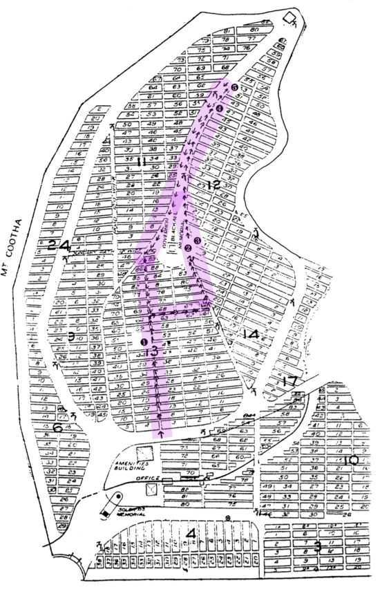

# The Federation Trail 

??? Warning "To Do" 

    - Check walking order
    - Create and insert map with link to portion-section-plot explanation
    - Add directions
    - Add headstone photos
    - Convert Bios to Snippets
    - Create Bio pages
    - Add Bios to [Index](../bios/bio-index.md)
    - Decide if link is needed to [Notes](http://www.fotc.org.au/subset/Federation_Trail.pdf)

The Federation Trail was produced by the Friends of Toowong Cemetery as a Centenary of Federation project to commemorate the role of the four Queensland delegates to the National Australasian Convention of 1891 who are interred at Toowong Cemetery.

The National Australasian Convention was held in Sydney from the 2nd of March to the 9th of April 1891. The convention was attended by seven delegates from each of the six colonies and three delegates from New Zealand. The Queensland delegates were John Donaldson, Sir Samuel Griffith, John Macrossan, Thomas Macdonald- Paterson, Thomas McIlwraith, Arthur Rutledge and Andrew Thynne. Significant outcomes from this convention included agreement of the name Commonwealth of Australia and more importantly, the production of a draft constitution. Sir Samuel Griffith was Chairman of the committee responsible for writing the draft constitution.

This convention marked Queensland’s greatest role in the path towards Federation as Queensland was not represented at later conventions. For Queenslanders, the Depression, droughts, floods, industrial upheavals such as the Shearers Strikes and financial collapses were higher priorities.

Other Queensland issues in the federation debate included Queensland’s use of indentured Melanesian labour that was in contrast the federation movement’s White Australia policy and the possible division of Queensland into two or three separate colonies. 

Despite many arguments against federation, the Federal Referendum on the 2nd of September 1899 narrowly voted in favour of Queensland's joining the new nation.  Interestingly, the south-east corner of the colony was against Federation.

???+ Example "Directions" 

    From the amenities building, cross the road and head straight up the hill towards Governor Blackall’s monument. Enter the portion on the path between the graves of Pethebridge and Thurlow. Rutledge is half way up and just off to the left (Map Number 1.)
    
    { width="100" } { width="100" } 

## Sir Arthur Rutledge KCMG, QC, MLA  <small><(13‑49‑15)</small>

{ width="50%" } 

*<small>Sir Arthur Rutledge 1843-1917</small>*

Rutledge was born in New South Wales and came to Queensland as a Wesleyan Minister. From 1878 to 1893 and 1899 to 1904 he was a member of the Legislative Assembly. He served five years as Queensland’s Attorney General from 1883. Rutledge was admitted as a barrister in 1878 and became a QC in 1899 and later a district court judge. He was also the chairman of the Land Appeal Court. He was knighted in 1902. At the convention he was a member of the Judiciary Committee. He was a supporter of Griffith and the liberal franchise. Rutledge was also a strong supporter of the federation of the colonies and an opponent of the Northern Separatist movement.

??? Example "Directions" 

    Continue up the hill until you reach the Uhl family monument. Turn right and follow the path until you reach a wide path sloping from the top. Turn left and walk directly towards the Blackall Monument. Here you will find the Federation Pavilion (Map Number 2.)

## The Federation Pavilion

The Commonwealth of Australia was inaugurated under a pavilion erected for the occasion in Sydney’s Centennial Park. [Our pavilion](../about/federation-pavilion.md), designed by Brisbane architect Ian Sinnamon, honours the Queensland delegates to the 1891 National Australasian Convention who are interred nearby. It was funded by the Federation Community Projects Program and construction was arranged by the Brisbane City Council Cemeteries Division.

??? Example "Directions" 

    The pavilion is adjacent to the grave of Sir Samuel Griffith. (Map Number 3.)
    
    { width="180" } 

## Sir Samuel Walker Griffith KCMG, QC, MLA <small>(12‑11‑6/7)</small> 

{ width="50%" }

*<small>Sir Samuel Walker Griffith 1845-1920</small>*

Griffith was born in Merthyr Tydfil, Wales and migrated to Australia as a child. He graduated from Sydney University in 1862 with Honours in maths and classics and commenced practising law in Brisbane. Griffith, considered by many a Liberal, was elected to the Legislative Assembly in 1872. He was Attorney General and twice premier of Queensland. 

Griffith was a delegate at the Intercolonial Convention 1883. Subsequently, Griffith was Vice‑President of the National Australasian Convention of 1891 and Chairman of the Drafting Committee which prepared the draft constitution. Griffith was president of the Queensland Federation League from 1898. He was knighted in 1886.

In 1893 Griffith left government to become Chief Justice of Queensland and from 1903 to 1919 was the first Chief Justice of the High Court of Australia. During this period he translated Dante’s Divine Comedy from Italian, which was published by Oxford University Press in 1911. 

He died on the 9th of August 1920 at his grand home Merthyr which gave its name to a locality in New Farm. The funeral cortege was described by the Daily Mail as the largest ever seen in Brisbane.

??? Example "Directions" 

    Map Number 3

    Proceed along the bitumen road. The next two graves are located on the right.
    
    { width="100" } 

## John Donaldson MLA <small>(12‑47‑13)</small> 1841-1896

{ width="50%" } 

*<small>John Donaldson 1841-1896</small>*

Victorian‑born Donaldson became a pastoralist in Queensland. He was a manager and director of a mortgage agency and a bank. He was also President of the Queensland branch of the Australian Natives’ Association. Donaldson was a member of the Legislative Assembly from 1883 to 1893 and served as Post Master General and Colonial Treasurer. At the convention he sought free‑trade colonies conservative constitution.

??? Example "Directions" 

    Map Number 4
    
    { width="100" } 

## Thomas Macdonald‑Paterson MLC <small>(12‑53-10)</small> 1844-1906

{ width="50%" } 

*<small>Thomas Macdonald‑Paterson 1844-1906</small>*

Macdonald‑Paterson arrived in Rockhampton from Scotland in 1861. He worked at a butchery before moving to Brisbane, where he qualified as a solicitor. He was a member for the Queensland Central Separation League and National Association. Macdonald‑Paterson served as mayor of Rockhampton in 1870. He was a member of the Legislative Assembly from 1878 to 1885 and again from 1896 to 1901. He was a member of the Legislative Council from 1885 to 1896. He served in three tiers of government as he was the Brisbane Federal Member of the House of Representatives from 1901 to 1903. His main claims at the convention were for uniform financial legislation and the abolition of the right to appeal to the Judicial Committee of the Privy Council.

??? Example "Directions" 

    Map Number 5 
    
    { width="100" } 

## Further Reading

- Irving, H. (ed) *The Centenary Companion to Australian Federation*, Cambridge University Press, 1999
- Kerr, J. (ed) *Griffith, the Law and the Australian Constitution*, Royal Historical Society of Queensland, 1998
- Waterson, D. B. *Biographical Register of the Queensland Parliament*, Australian National University Press, 1972

## Acknowledgements

<!-- logo --> 

Research: Sally McGrath

Layout and map: Hilda Maclean 

Cover drawing: Jeff Turner

Photographs reproduced with permission of [John Oxley Library](https://www.slq.qld.gov.au/plan-my-visit/spaces-visit/john-oxley-library). 

Federation Pavilion funded by Federation Community Projects Program

- Architect: Ian Sinnamon
- Construction facilitated by the Brisbane City Council Cemeteries Division

Restoration of the graves of Griffith, Rutledge, Macdonald‑Paterson and Donaldson funded by the Centenary of Federation Queensland
