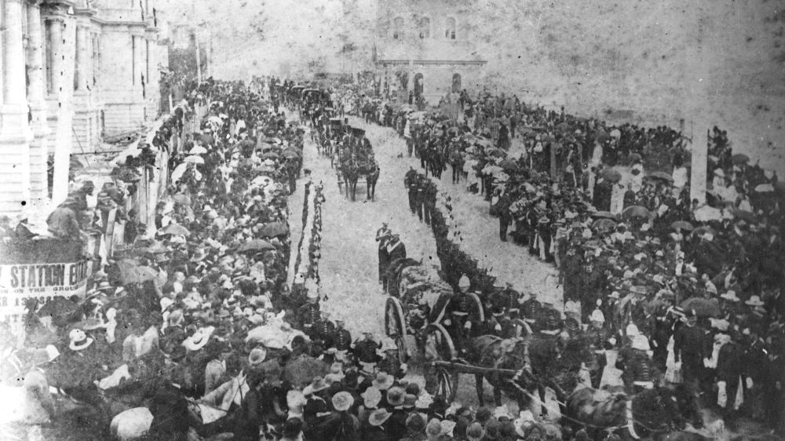

# Governors Past Trail

<!--

??? Warning "To Do" 

    - Cover image
    - Check walking order
    - Create and insert map with link to portion-section-plot explanation
    - Add directions
    - Add headstone photos
    - Convert Bios to Snippets
    - Create Bio pages
    - Add Bios to [Index](../bios/bio-index.md)
    - Decide if link is needed to [notes](http://www.fotc.org.au/subset/governors_past.pdf)
    
-->

## Colonel Samuel Wensley Blackall <small>(Mount Blackall)</small>

Governor - 14 August 1868 to 2 January 1871

Blackall was born on 1 May 1809 in Dublin, son of Major Robert Blackall of the East India Company Army, and his wife Catherine, née Lewis. A member of a prosperous Irish family, he was educated by a private tutor and at fifteen went to Trinity College, Dublin, but did not graduate. After a military career, Blackall became Lieutenant-Governor of Dominica in 1851‑57; Governor of Sierra Leone in 1862, and in 1865 became Governor‑in‑chief of the West African Settlements. 

In 1868 he was appointed Governor of Queensland. On arrival Blackall was met by a tremendous popular welcome, but at once was plunged into a constitutional crisis, which had been temporarily held in check by the Administrator, Sir Maurice O'Connell. After a deadlock in the Legislative Assembly the Liberals had been defeated in an election but were petitioning the Governor to dissolve the assembly on the ground that it did not properly represent the colony. Blackall pursued a strictly constitutional course and refused to intervene directly. Despite the bitterness of the constitutional battle Blackall made no personal enemies. Willing to assist any genuine public cause, he made frequent appearances at public events, often accompanied by Mrs Terry, the wife of his private secretary Lieutenant Frederick Terry. 

By October 1870 Blackall's health was deteriorating. He requested that his funeral be such “as could be attended by even the humblest”. On 2 January 1871, he died and was buried the next day with as much pomp and ceremony as could be mustered at such short notice.

{ width="76%" }

*<small>[Colonel Blackall, Governor of Queensland, with his family](http://onesearch.slq.qld.gov.au/permalink/f/1upgmng/slq_alma21218698200002061) - State Library of Queensland </small>*

## Colonel Sir Maurice Charles O’Connell Kt. <small>(13‑83‑4)</small>

Administrator:

  - 4 January 1868 to 14 August 1868
  - 2 January 1871 to 12 August 1871
  - 12 November 1874 to 23 January 1875 
  - 14 March 1877 to 10 April 1877

O’Connell was born on 13 January 1812 in Sydney, son of Maurice Charles Philip O'Connell and his wife Mary, daughter of Governor William Bligh. He left for Ceylon with his parents in 1814 and in 1819 was sent to Europe for schooling. In 1828 he joined the 73rd Regiment at Gibraltar but in 1835 raised and led a regiment of Irish volunteers in the Spanish Carlist wars, rising to general of brigade in the British Auxiliary Legion. Before embarking for Spain he married Eliza Emily le Geyt on Jersey. On disbandment, O'Connell returned to England and in June 1838 purchased a captaincy in the 28th Regiment. That year his father was appointed to command the troops in New South Wales. After the regiment sailed to India in 1842 he stayed in New South Wales and sold his commission in 1844. He represented Port Phillip from August 1845 to June 1848 and then became Commissioner of Crown Lands for the Burnett District. Early in 1854 O'Connell became government Resident at the new Port Curtis settlement where he acquired several squatting properties. In 1859 O'Connell was given command of the volunteers. He was also nominated to the Legislative Council and acted as Minister without portfolio in the first Herbert ministry. When Sir Charles Nicholson resigned in August 1860 O'Connell became President of the Council. He held the post until 1879 and acted ex officio as deputy to the governor four times. O'Connell was knighted in 1868. He died of cancer at Parliament House on 23 March 1879.

{ width="40%" }

*<small>[Sir Maurice Charles O'Connell](http://onesearch.slq.qld.gov.au/permalink/f/1upgmng/slq_alma21251755050002061) - State Library of Queensland </small>*

## Hon. Joshua Peter Bell <small>(13‑84‑8)</small>

Administrator – 19 March 1880 to 22 November 1880

Bell was born on 19 January 1827 in Kildare, Ireland, the eldest son of Thomas Bell and his wife Sarah, née Alexander. When aged about three, his parents migrated to Australia. He was educated in Sydney then entering the office of a Sydney solicitor. In 1843 his father took over the pastoral lease of Jimbour near Dalby which Bell took control aged 21. 

In 1859 was invited to stand for West Moreton. On 19 February 1861 at Ipswich he married Margaret Dorsey. In December 1862 he was returned with a large majority. In June 1863 after the dissolution of the first parliament he was returned for the same electorate. In December 1864 he became treasurer in the Herbert ministry. On Herbert's temporary retirement in 1865 Bell retained office in the Macalister ministry, being Treasurer when the financial crisis of 1866 struck the colony. In 1866 Bell became acting Minister for Lands and in 1867 acting Minister for Works. 

In 1868 he was returned for Northern Downs and held the seat until he was appointed President of the Legislative Council in 1879. From 19 March to 20 December 1880 he acted as Administrator of the colony when Governor Sir Arthur Kennedy was on leave. On 20 December 1881, while returning from a business appointment in a cab, he died unexpectedly.

{ width="40%" }

*<small>[Sir Joshua Peter Bell](http://onesearch.slq.qld.gov.au/permalink/f/1upgmng/slq_alma21219246370002061) - State Library of Queensland </small>*

## Sir Anthony Musgrave G.C.M.G. <small>(14‑23‑7)</small>

Governor – 6 November 1883 to 9 October 1888

Musgrave was born on 17 November 1828 at Antigua, West Indies, son of Dr Anthony Musgrave and his wife Mary, née Sheriff. Educated in the West Indies, he became private secretary at 21 to the Governor of the Leeward Islands. In 1851 he was admitted to the Inner Temple, London, but returned to Antigua where he served as Colonial Secretary from 1854‑60. In 1853 he had married Christiana Elizabeth Byam who died in 1858. Musgrave was Administrator of Nevis from October 1860 to April 1861, then of St Vincent and in May 1862 became Lieutenant‑governor. In 1864‑69 he governed Newfoundland. At San Francisco en route to a new post in British Columbia he married Jeannie Lucinda Field by whom he had three sons. He was transferred to Natal in 1872.

On 6 March 1873 Musgrave became Governor of South Australia suffering a personal tragedy when his young daughter died of burns shortly afterwards. In 1877 he was appointed Governor of Jamaica. After six years, he became governor of Queensland on 21 July 1883. He visited England in 1886 and planned to retire but in June 1888 Sir Thomas McIlwraith, whom he detested, became premier. The two soon clashed over the governor's right to exercise of the prerogative of mercy. Musgrave appealed to the Colonial Office, McIlwraith defied him. A few weeks later Musgrave died on 9 October 1888.

{ width="70%" }

*<small>[Funeral of Sir Anthony Musgrave, Brisbane, 1888](http://onesearch.slq.qld.gov.au/permalink/f/1upgmng/slq_alma21218493890002061) - State Library of Queensland </small>*

## Hon. Sir Arthur Hunter Palmer K.C.M.G. <small>(13‑88‑7)</small>

Administrator:

  - 2 May 1883 to 6 Nov 1883
  - 20 April 1886 to 13 December 1886
  - 9 October 1888 to 1 May 1889
  - 16 Nov. 1890 to 6 May 1891 

Lieutenant Governor - 15 Nov. 1895 to 9 April 1896 

Palmer was born on 28 December 1819 in Armagh, Ireland, son of Arthur Palmer, naval lieutenant, and his wife Emily, née Hunter. Educated in Dublin, Palmer arrived in Sydney in 1838. In 1840 became manager pastoral holdings of Henry Dangar leaving after fifteen years to set up on his own. Once established, Palmer took an active part in local politics. He married, on 8 June 1865 in Sydney, Cecilia Mosman. 

In 1866 Palmer was elected for Port Curtis to the Legislative Assembly. After the Macalister government fell in 1867, Palmer became Colonial Secretary and Secretary for Public Works under Mackenzie. The ministry fell in November 1868 and Palmer joined the Opposition. When Lilley's ministry fell in May 1870 Governor Blackall appointed Palmer as Colonial Secretary and Premier, holding office until January 1874 when he became leader of the Opposition. In 1878 he retired as leader of the Opposition in favour of McIlwraith and was elected for North Brisbane. 

In January 1879 Palmer was appointed Colonial Secretary and president of the Executive Council. For a time in 1879‑80 Palmer acted as Premier while McIlwraith was in England. Palmer was appointed K.C.M.G. In December he resigned from the assembly and was called to the Legislative Council. From 2 May to 6 November 1883 and from 9 October 1888 to 1 May 1889 he acted as Administrator of the colony in the absence of the governor and from 15 November 1895 to 9 April 1896 was the first Lieutenant‑Governor of the colony. 

In 1885 his wife had died, leaving three sons and two of their four daughters. Palmer died on 20 March 1898 at his home at Toowong.

{ width="40%" }

*<small>[Sir Arthur Hunter Palmer as the Colonial Secretary](http://onesearch.slq.qld.gov.au/permalink/f/1upgmng/slq_alma21218625050002061) - State Library of Queensland </small>*

## Rt. Hon. Sir Samuel Walker Griffith <small>(12‑11‑6/7)</small>

Lieutenant Governor - 21 December 1901 to 24 March 1902

Griffith was born on 21 June 1845 at Merthyr Tydfil, Wales, son of Rev. Edward Griffith a Congregational minister, and his wife Mary, née Walker. He earned first-class honours in classics and mathematics from the University of Sydney. He also studied law and on 11 May 1863 became an articled clerk at Ipswich. In 1866 he was awarded Mort travelling fellowship and undertook a 'grand tour' of Europe. 

Back in Queensland Griffith completed his articles in September 1867, immediately passed the Bar examinations. He first appeared in a Supreme Court action in 1867 and took silk in 1876. He married Julia Janet Thomson at East Maitland, on 5 July 1870. Griffith then entered politics winning the seat of East Moreton in 1872. Griffith became Liberal party leader in May 1879. Griffith was Premier from 10 November 1883 to 13 June 1888, and was appointed K.C.M.G. in 1886. After his government's defeat in 1888, Griffith spent twenty‑two months in Opposition. He was Premier again in August 1890.

Griffith served as Queensland's chief justice from 13 March 1893 to 6 October 1903, during which he was appointed G.C.M.G. in 1895 and to the Privy Council in 1901. Griffith served several times as Deputy and Lieutenant‑governor. In 1903 Griffith was chosen as the first Chief Justice. 

On 16 March 1917 Griffith suffered a stroke while on the bench and was temporarily retired. His mortgage forced him, aged 72, to return to work. He eventually retired to Brisbane where he died at Merthyr on 9 August 1920.

{ width="70%" }

*<small>[Sir Samuel Walker Griffith and family](http://onesearch.slq.qld.gov.au/permalink/f/1upgmng/slq_alma21218185350002061) - State Library of Queensland </small>*

## Hon. Sir Arthur Morgan <small>(12‑15‑12)</small>

Lieutenant Governor:

  - 27 May 1909 to 2 Dec 1909
  - 16 July 1914 to 15 March 1915

Morgan was born on 19 September 1856 near Warwick, son of James Morgan and his wife Kate, née Barton. Morgan’s schooling was curtailed when his father bought the Warwick Argus in June 1868. By 18 he was manager and he became editor and proprietor of the Argus a few months before his father died in 1878. On 26 July 1880 Morgan married Alice Clinton at Warwick. 

Morgan entered local politics in 1885 when elected to the Warwick Municipal Council; he served as Mayor in 1886‑90 and 1898. On 18 July 1887 he was elected to the Legislative Assembly for Warwick and represented this electorate until 4 April 1896 when he stood aside to allow T. J. Byrnes to pursue the premiership via the seat. Morgan regained Warwick on 2 October 1898 at the by‑election after Byrnes's death and served the assembly as Queensland's first native‑born Speaker from May 1899 until September 1903. He resigned after a series of dramatic political events surrounding the defeat of the Philp government. Labor leader W. H. Browne, unable to form a government, recommended that the Governor send for Morgan. The Morgan‑Browne coalition ministry was sworn in on 17 September 1903. The coalition was returned overwhelmingly in 1904. It introduced the franchise for women in State elections. Morgan relinquished the premiership, accepting the presidency of the Legislative Council from 19 January 1906 after the death of Sir Hugh Nelson. 

In 1907 the Governor Lord Chelmsford reluctantly appointed Morgan lieutenant‑governor, by‑passing Sir Pope Cooper. Morgan deputised in 1907 and 1908 during Chelmsford's absences and, in 1909 and 1914, was Lieutenant‑governor on the retirement of Governors Chelmsford and Sir William MacGregor. He was still President of the Legislative Council when he died on 20 December 1916 after a long illness. He was buried here after a state funeral at St John's Cathedral.

{ width="70%" }

*<small>[Sir Arthur and Lady Morgan on board the S.S. Mourilyan, Queensland, 1910](http://onesearch.slq.qld.gov.au/permalink/f/1upgmng/slq_alma21256749450002061) - State Library of Queensland </small>*

## Sir Pope Alexander Cooper <small>(13‑37‑1)</small>

Deputy Governor for short periods in 1917 to 1919

Cooper was born on 12 May 1846 at Lake George, New South Wales, son of Francis Cooper, a wealthy squatter, and his wife Sarah, née Jenkins. After graduating from the University of Sydney in 1868, he went to London to study law and was called to the Bar on 6 June 1872. Cooper returned in 1874 and was admitted to the Queensland Bar. He became Crown Prosecutor in the northern district Supreme Court in 1878. After the death of Henry Beor, McIlwraith appointed Cooper his Attorney‑general. The appointment was ratified on 24 January 1881 when he won Beor's Bowen seat. Cooper held his office and seat until 5 January 1883 when he was appointed to the northern bench of the Supreme Court. He was elevated in October 1895 to senior puisne judge in Brisbane. 

When Griffith became Chief Justice of the High Court of Australia, the Morgan ministry appointed Cooper Chief Justice of Queensland on 21 October 1903. Cooper was knighted in 1904. Although Cooper had temporarily deputised for the Governor in 1906, when the need to appoint a Lieutenant‑governor to succeed Sir Hugh Nelson arose in 1907, Lord Chelmsford could not ignore the objections of Premier William Kidston and he was passed over. Since Cooper had publicly censured the Ryan ministry in November 1915 and had publicly objected to its socialism, he was still regarded as unsatisfactory for the Lieutenant‑governorship; but with no alternative, Governor Sir Hamilton Goold‑Adams had to appoint him as Deputy for short periods in 1917‑19. 

In November 1919, the Theodore ministry decided to appoint William Lennon as Lieutenant‑governor to which Cooper objected bitterly. Early in January he appealed for support from the governor‑general, and refused to admit the validity of a commission for Lennon drafted locally on telegraphic instructions from London; he deputised himself from 27 January to 3 February 1920 until Lennon's commission as Lieutenant‑governor arrived. That year while Lennon was on diplomatic sick leave in New South Wales, Cooper again became Lieutenant‑governor under his dormant commission. When asked, he refused to sign the executive council minute appointing Lennon president of the Legislative Council; he argued that the council was already over strength. On his return, Lennon was forced to appoint himself to the Council and to its presidency. Cooper died at his Chelmer home on 30 August 1923.

{ width="40%" }

*<small>[Hon. Sir Pope Alexander Cooper, Chief Justice of Queensland, 1880](http://onesearch.slq.qld.gov.au/permalink/f/1upgmng/slq_alma21218934570002061) - State Library of Queensland </small>*

## Further Reading
 
Forrest, Peter and Sheila Forrest, *[All for Queensland: The Governors and the People](http://onesearch.slq.qld.gov.au/permalink/f/1oppkg1/slq_alma21131046020002061)*, Darwin, Shady Tree, 2009

## Brochure

**[Download this walk](../assets/guides/governors-past.pdf)** - designed to be printed and folded in half to make an A5 brochure.

