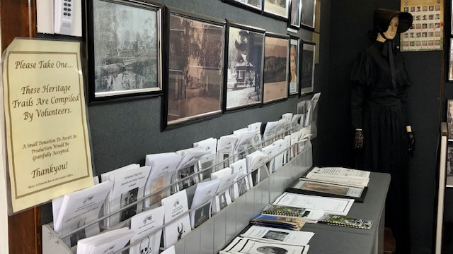

---
hide:
  - navigation

search:
  boost: 2  
---

# Self-Guided Walks

The Friends of Toowong Cemetery have researched and published a large collection of themed self-guided walks. Choose a walk from the list below.

???+ example "Format improvements" 

    We're improving the self-guided walks  by converting them to a mobile-friendly format, adding maps, walking instructions, and photos. Mobile-friendly walks are shown in **bold**.

    Walks marked with an :octicons-pencil-24: are work in progress. 
    
    All walks include an A4 pdf file, designed to be printed and folded in half to make an A5 brochure. 

<!-- 

{ width="50%" } 

*<small>Self-guided walk brochures are available in the [Museum](../cemetery/museum.md)</small>*

-->

## Politics

- **[The Federation Trail][federation-trail]** - commemorating four Queensland delegates to the 1891 National Australasian Convention
- **[Governors][governors-past]** - visit some of Queensland's earliest Governors
- **[Brisbane Mayors][brisbane-mayors]** - learn about 14 Brisbane Mayors from 1859 to 1931
- **[Labor Luminaries][labor-luminaries]** - recognising people involved in the Labor movement 

## Military 

- **[Colonial Conflicts][colonial-conflicts]**
- **[Lest We Forget][lest-we-forget]** - remembering the men and women who gave their lives in service to their country
- **[Lest We Forget: Naval][lest-we-forget-navy]** - commemorating the centenary of the Royal Australian Navy, 1911—2011
- **[Men of the Royal Navy][rn]** 
- **[Scots in the Australian Imperial Force in World War One][scots-ww1]** :octicons-pencil-24:
- **[1919 Soldiers][1919-soldiers]**  :octicons-pencil-24:

<!-- - **[Toowong Cemetery Remembrance Walk][remembrance-walk]** - explore the lives of Queensland's volunteer troops and take a moment to reflect on the service and sacrifice for which the Anzac Legend is known. -->

## Professions

- **[Artists][artists]**
- [Health Professionals][nurses] - commemorating Nurses, Doctors and other health professionals 
- **[Judiciary][judiciary]** - Early Judiciary buried in Toowong Cemetery :octicons-pencil-24:
- **[Mariners][mariners]** - Anchors Aweigh!
- **[Performers][actors]** - Actors and Performers buried in Toowong Cemetery
- **[Police][thin-blue-line]** - remembering Queensland Colonial Police
- **[Print Media Identities of Early Brisbane][printers]** :octicons-pencil-24:
- **[Sporting Personalities][sporting-personalities]** :octicons-pencil-24:
- **[Undertakers][undertakers]**

## Local Identities

- **[Founding Fathers][founding-fathers]** - members of the first Brisbane General Cemetery Trust
- **[Notable Women][notable-women]** - Women who shaped Queensland
- **[Toowong Identities 1][toowong-identities-1]** - commemorating the Centenary of the Proclamation of the Town of Toowong in 1903
- **[Toowong Identities 2][toowong-identities-2]** - commemorating the Centenary of the Proclamation of the Town of Toowong in 1903

## Birds of a feather 

- **[The Children][children]** - tragic stories of lives cut short
- **[The Convicts][convicts]** - connections to our convict past
- **[The Irish][irish-trail]** - a historic Pub crawl around Brisbane
- **[The Jewish][jewish-trail]**  :octicons-pencil-24:
- **[The Lutheran][lutheran-trail]** 

## Other walks :octicons-pencil-24:

- **[20/20 Vision](2020-vision.md)** :octicons-pencil-24: 
- Brisbane City Council Trail 1 <!-- [Brisbane City Council Trail 1][bcc-walk-1] - A tour of the southern corner portion of Toowong Cemetery. -->
- Brisbane City Council Trail 2 <!-- [Brisbane City Council Trail 2][bcc-walk-2] -->
- [Brisbane Open House](../assets/guides/boh.pdf) <!-- [Brisbane Open House][brisbane-open-house] -->
- Conflict and Compassion
- [Erected by their Family, Friends and Colleagues](../assets/guides/erected-by-friends.pdf)
- [Propectors](../assets/guides/prospectors.pdf) - 'ey you!
- [One Adult, One Vote](../assets/guides/sufferage.pdf) - Queenslands' own Suffrage story
- **[One Day: Christmas](christmas.md)** :octicons-pencil-24:
- One Day: New Years' Day
- [Mothers](../assets/guides/mothers.pdf)
- [Portion 5 - part 1](../assets/guides/portion5-part1.pdf) - A ramble through Portion 5 - part 1
- [Portion 5 - part 2](../assets/guides/portion5-part2.pdf) - A ramble through Portion 5 - part 2
- [Portions 6 and 24](../assets/guides/portion6-and-24.pdf) - A walk through Portions 6 and 24
- [Portions 15 and 16](../assets/guides/portion15-and-16.pdf) - A wander through Portions 15 and 16
- Rich man, Poor man <!-- [Rich man, Poor man](../assets/guides/rich-man-poor-man.pdf) -->
- [Steam](../assets/guides/steam.pdf)
- [Taken before their time](../assets/guides/taken-before-their-time.pdf)

<!-- links to pages or pdfs -->

[federation-trail]: federation-trail.md
[governors-past]: governors-past.md
[brisbane-mayors]: brisbane-mayors.md
[labor-luminaries]: labor-luminaries.md

[lest-we-forget]: lest-we-forget.md
[lest-we-forget-navy]: lest-we-forget-navy.md
[rn]: men-of-the-royal-navy.md
[remembrance-walk]: remembrance-walk.md
[scots-ww1]: scots-in-the-aif-ww1.md
[1919-soldiers]: 1919-soldiers.md
[colonial-conflicts]: colonial-conflicts.md

[actors]: all-the-worlds-a-stage.md 
[artists]: artists.md
[mariners]: anchors-aweigh.md
[judiciary]: judiciary.md
[printers]: printers.md
[thin-blue-line]: thin-blue-line.md
[sporting-personalities]: sporting-personalities.md
[undertakers]: undertakers.md 
[nurses]: ../assets/guides/in-their-caring-hands.pdf
[nursesx]: in-their-caring-hands.md

[founding-fathers]: founding-fathers.md
[notable-women]: notable-women.md
[toowong-identities-1]: toowong-identities-1.md
[toowong-identities-2]: toowong-identities-2.md

[convicts]: convict-connections.md
[irish-trail]: irish-trail.md
[jewish-trail]: jewish-trail.md
[lutheran-trail]: lutheran-trail.md
[children]: children.md

[bcc-walk-1]: bcc-walk-1.md
[bcc-walk-2]: bcc-walk-2.md
