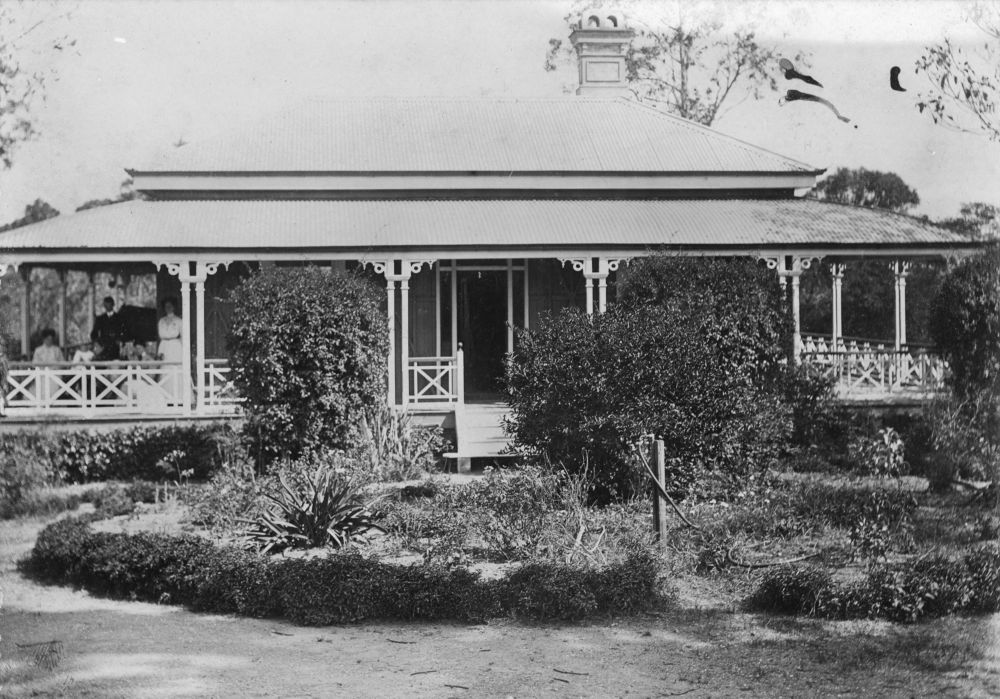
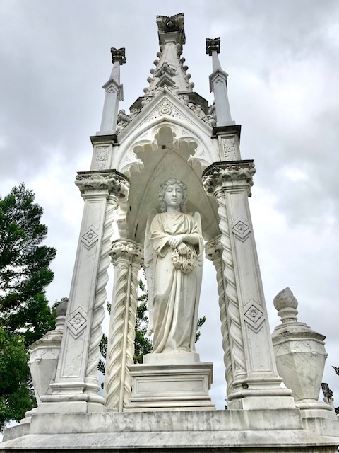
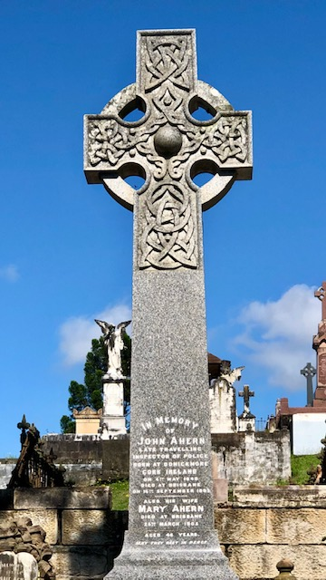
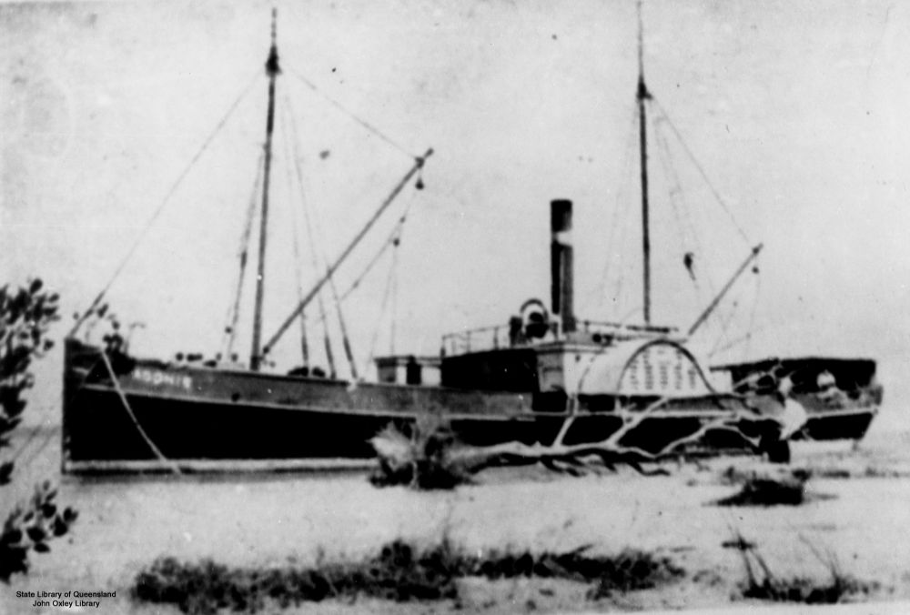

# The Irish  

The original Irish tour occurred in 1988 during the Bi-Centennial Celebrations, under the auspices of the Genealogical Society of Queensland Irish Group with Chair man and Researcher David Larkin as tour guide. That tour took in 31 monuments across a number of portions of the cemetery. Some of the more important figures on Mt Blackall are included on other Friends of Toowong Cemetery walks and so this tour is confined to the Roman Catholic Portions 7, 7A and 15 with 17 memorials to visit. The walk takes approximately one hour and 30 minutes. The walk was revised and corrected early 2014 by Darcy Maddock.

## Anne Devoy <small>(7‑7‑34)</small>

1817 ‑[1908](https://trove.nla.gov.au/newspaper/article/19550487?searchTerm=anne%20Devoy) 

Born at Donadea near Hodgetown Co. Kildare, Devoy was the daughter of James and Honor Reilly. Her mother was the daughter of the Countess de Farnton, who escaped the guillotine in the French Revolution, and fled to Ireland to take up refuge with her friend, the Earl of Kildare at Castle Kilkea. 

Anne married Patrick Devoy and with the union came the “curse of the Devoys”. This had been placed on a Devoy of Huguenot stock who turned in a Catholic priest to Cromwell’s men. As he was taken away, the priest blessed all the Devoy women and cursed the men so that no male Devoy would live to see his son in manhood. 

The Devoys arrived in Queensland in 1864 on the *Landsborough* after selling their land in Ireland to the Ursuline nuns. They brought a young family with them; John (later Managing Director of Castlemaine Perkins), Marguerite and Annie. In the tradition of the curse [Pat was killed the same year by a landslide](https://trove.nla.gov.au/newspaper/article/123149288?searchTerm=Patrick%20Devoy) while selecting land near Toowoomba.

{ width="70%" }  

*<small>[Devoy residence in Ashgrove, Brisbane, ca. 1908](http://onesearch.slq.qld.gov.au/permalink/f/1upgmng/slq_alma21218171470002061). The Devoy residence was in Three Mile Scrub Road (now Ashgrove Avenue), off Waterworks Road. John Devoy was the manager of Castlemaine Perkins. — State Library of Queensland.</small>*

??? directions "Directions" 

    Return to the road proceeding about halfway up to Elizabeth Dale Walk (previously 12^th^ Avenue) to see on the left

## Joseph Darragh <small>(7‑27‑11)</small> 

1828 ‑ 1902  

Born in Tyrone, the son of Joseph and Ann (1803‑1883), Darragh arrived in Sydney on 29 April 1850 with his wife, Eliza Grimes They moved to Brisbane where he was a butcher at Kangaroo Point from 1853 to 1902. Darragh Street was named for the family before 1874, and when he died, Darragh was ‘of Independent Means’. 

Darragh’s brothers were also businessmen in Brisbane. James (1831‑1905) was a publican of the Logan Hotel, Main St, Kangaroo Point and the Sportsman’s Arms in Queen St, while Hugh (1839—1916) was also a butcher.

{ width="70%" }  

*<small>[Sportsman's Arms Hotel, Brisbane, ca. 1874](http://onesearch.slq.qld.gov.au/permalink/f/1upgmng/slq_alma21257614520002061) — State Library of Queensland.</small>*

??? directions "Directions" 

    Just past the three Darragh graves in the row behind is…

## William Grene Power <small>(7‑45‑18)</small> 

1835 ‑ 1903  

Born at Clonmel, Tipperary the son of Edward Power and Mary Ann Grene, Power was educated at Carlow by the Christian Brothers. Power arrived in Victoria in 1857 and was a miner and brewer on the goldfields at Bendigo and Ballarat. He served as Mayor of Jamiestown in 1866. 

He arrived in Queensland 1869 at the request of his old friends Perkins and Gooley to manage Browns Brewery (Perkins & Co.) and married Perkins’s sister Mary Therese and settled in Brisbane 1873. William was a Member of the Legislative Council from 1883 until his death. He died at Nundah 14 August 1903 and was buried the next day at Toowong by Rev Fr. Byrne.

{ width="70%" }  

*<small>[City Brewery, owned by Perkins & Co., Brisbane, 1872-1882](http://onesearch.slq.qld.gov.au/permalink/f/1upgmng/slq_alma21220040770002061) — State Library of Queensland.</small>*

{ width="70%" }  

*<small>[View of the Castlemaine Perkins Brewery in Milton, ca. 1929](http://onesearch.slq.qld.gov.au/permalink/f/1upgmng/slq_alma21218338590002061). The brewery, located in Milton Road, was established in 1878 by Fitzgerald, Quinlan and Co. and called the Castlemaine Brewery. The brewery merged with Perkins and Company in 1928. — State Library of Queensland.</small>*

??? directions "Directions" 

    Next is the grave of the Mooney family…

## James Thomas Mooney <small>(7‑45‑10)</small> 

1855 ‑ 1877 

Mooney was born in New York, the son of Joseph and Rosa Mooney, natives of Co. Cavan. They arrived in Sydney 1857 on the *FitzJames*. Mooney was a volunteer fireman who was fatally burned by an exploding cask of spirits during a fire at Hughes’ grocery store in Queen St. His mother was publican of the Royal Exchange Hotel in Albert Street from where his funeral procession left. His monument was financed by public subscription. His father’s sister was Mary, wife of James Mayne, hide merchant in Tyrone and brother of Patrick Mayne.

{ width="40%" }  

*<small>[Royal Exchange Hotel and Perry House on Elizabeth Street looking north, ca. 1924](http://onesearch.slq.qld.gov.au/permalink/f/1upgmng/slq_alma21271909090002061) — State Library of Queensland.</small>*

## Patrick Mayne <small>(7‑49‑9)</small> 

1825 ‑ 1865  

The large white monument to this family and the story of how Mayne gained his wealth is the subject of a book by Rosamond Siemon, *The Mayne Inheritance*. Mayne was born at Cookstown, Tyrone, the son of Isaac Mayne and Rose Mullin. He arrived in Brisbane in 1849 after marrying in Sydney, Mary McIntosh from Ennis, Co. Clare. 

Mayne gained his wealth by the reputed murder of a cedar cutter and established his butcher business in Queen St where the present Brisbane Arcade stands. He was an Alderman of the Brisbane City Council 1853 to 1865, the year he died of a heart attack. His rumoured death‑bed confession extracted a promise from his children that they would not continue the family line. The family’s finances eventually benefited many public institutions especially The University of Queensland.

{ width="40%" }  

??? directions "Directions" 

    At the end of the Ave on the left is the grey celtic cross of…

## John Ahern <small>(7‑51‑4)</small> 

1838 ‑ 1893 
 
Ahern was born at Donickmore, Cork son of Denis Ahern and Honoria O’Mahoney. He was a Catholic farmer when he joined the Queensland Police Force in September 1864. He was sent to Springsure in October and promoted to Senior Constable/Acting Sergeant in July 1868. He became Inspector of Slaughterhouses in the Mitchell district in February 1870 and received the substantial reward of £15 in September 1872 for *"energetic perseverance in suppressing cattle‑stealers in the Barcoo and Walgett districts"*. 

Ahern was promoted to Senior Sergeant in January 1874 and Sub‑Inspector 2^nd^ class in 1877. He served at Blackall in 1880 where he became Sub‑Inspector 1^st^ class. Ahern married in 1883 Mary, sister of Andrew Joseph Thynne from Clare. By 1890, he had been promoted to Inspector 1^st^ class in charge of all brands throughout the colony. Ahern was a most respected and energetic policeman.

{ width="40%" }  

??? directions "Directions" 

    Around the corner into O'Doherty Avenue (previously 11^th^ Avenue) we find on the left…

## Andrew Purcell <small>(7‑50‑1)</small> 

1811 ‑ 1888  

Born at Drumcliff, Ennis, Co. Clare, Purcell was the son of Thomas Purcell and Mary Flannery. This well‑to‑do grazier arrived in Brisbane 19 June 1853 with wife and 4 children on the John Fielden. He married Bridget Scanlan (1827‑1913) and had 10 children. His son Thomas, a grazier of Rockhampton, was partner in the Rockhampton Newspaper The Daily Record with the Hon. T. J. Ryan in 1912. Purcell, a man of independent means, was buried by Hislops in March 1888 with Fr. Canali officiating.

??? directions "Directions" 

    To the right of this monument
  
## Thomas Joseph Byrnes <small>(7‑47‑5)</small>  

1860 ‑ 1898 

Byrnes was born in Brisbane the son of Patrick Byrnes and Anna Tighe from Sligo. The family had settled first in Bowen. Byrnes was educated at Brisbane Grammar and Melbourne University. Byrnes taught at Xavier College, Kew, Melbourne from 1882‑83 before being admitted to the Victoria Bar in 1884. He established a legal firm in Brisbane 1885 and became a Supreme Court barrister in due course. 

He entered politics as an MLC and served as Attorney‑General in 1893 and MLA from 1893‑98. Byrnes was the Colonial Prime Minister (Premier) of Queensland in 1898 but his promising life was cut short at the early age of 38 in September 1898. His State Funeral was attended by all the government and was one of the largest Brisbane had ever seen. His funeral was officiated by Archbishop Dunne and to his memory are memorials in Centennial Park, Brisbane and in the main street of Warwick, his electorate.

{ width="40%" }  

*<small>[Thomas Joseph Byrnes Memorial, Centenary Place, Brisbane, 2020](https://commons.wikimedia.org/wiki/File:Thomas_Joseph_Byrnes_Memorial,_Centenary_Place,_Brisbane,_2020.jpg) — Kgbo, [CC BY-SA 4.0](https://creativecommons.org/licenses/by-sa/4.0/), via Wikimedia Commons.</small>*

??? directions "Directions" 

    Pause here for a moment and look across the road to the right to view…

## John Leahy <small>(7A‑4‑3)</small> 

1854 ‑ 1909 

Leahy was born at Schull, Cork, the son of Patrick Leahy, a farmer, and Mary Coghlan. He arrived in Brisbane 1874 and was appointed Post Master at Windorah before settling at Thargomindah in 1883. Leahy married Annie Colbert in 1886. He was a member of the Bulloo Divisional Board 1889‑1893. A successful grazier, Leahy was President of the Woolbrokers’ Association. He was part owner of the Thargomindah Herald established by his younger brother Patrick James Leahy, and proprietor of the Royal Hotel 1886-1889. 

Leahy’s political career as member for Bulloo 1893 to 1909 saw him as Secretary for the Railways and Public Works 1907‑09. He held many directorships including the Queensland Meat Export Co., Estate and Mortgage Co., and the National Agricultural Association of Queensland. He was also a member of Brisbane Chamber of Commerce and on the executive of the Queensland Irish Association. Leahy died at his home in New Farm in 1909 and was buried after a state funeral.

## Thomas Joseph Ryan <small>(7A‑3A‑1)</small>  

1875 ‑ 1921 

Ryan was born at Boothapool near Port Fairy (also known as Belfast), the son of Timothy Joseph Ryan and Jane Cullen. The family arrived from Ireland in 1860. Ryan began his education at Melbourne University and studied law while teaching classics at Church Grammar, Launceston, Tasmania. He obtained his degree in 1899. 

Ryan was second master at Rockhampton Grammar 1901—1903 and was admitted to the Queensland Bar in December 1901. In 1903 he was President of the Rockhampton Branch of the Australian Natives Association. He joined the Labor Party in 1904 and won the seat of Barcoo in 1909. He owned the Rockhampton Daily Record newspaper from 1910. In July 1912 he became deputy‑leader, and by December was leader of the Labor Party. Winning the elections in 1915, he became Premier of Queensland, Chief Secretary and Attorney General until 1919 when he entered Federal politics. With John Fihelly, he drafted the Workers Compensation Bill and created the State Government Insurance Office and set up the Public Curators Office and the Golden Casket Agency. In 1916 he visited the troops at the front and also defended Home Rule in Ireland, meeting with Eamonn de Valera in 1919 and chaired the Irish Race Convention in Melbourne called by Archbishop Mannix.He supported voting rights for 18 year olds and gave women the right to stand for Parliament. Entering Federal politics he won the seat of West Sydney in 1919 and was elected Deputy Leader of the House of Representatives. 

He suffered from ill health and a bout of influenza caught in England in 1919 later resulted in his death from pneumonia in 1921 at Barcaldine. Archbishops Duhig (Brisbane) and Mannix (Melbourne) both presided over his state funeral from St Stephen’s Cathedral. Ryan was survived by his wife Lily Virginia Cook and a son and daughter. A memorial bronze statue stands in Queens Park on the corner of William and Elizabeth Streets.

{ width="70%" }  

*<small>[Unveiling a statue of Thomas Joseph Ryan at Queen's Park, Brisbane, 1925](https://commons.wikimedia.org/wiki/File:StateLibQld_2_213392_Unveiling_a_statue_of_Thomas_Joseph_Ryan_at_Queen%27s_Park,_Brisbane,_1925.jpg) — Contributor(s): Sydney Mail, Public domain, via Wikimedia Commons</small>*

??? directions "Directions" 

    Continuing along the road on the left is a granite memorial topped with a cross…

## Randal MacDonnell <small>(7‑20‑10)</small> 

1830 ‑ 1877  

MacDonnell was born in Dublin, son of Thomas MacDonnell, an army officer, and his wife Frances Corry. He arrived in Sydney 1853 on the *Telegraph*. He was a teacher at National Schools in Sydney before establishing his own school at Paddington, Sydney in 1854. 

He moved to Queensland in 1860 and was appointed Inspector of National Schools and General Inspector of Primary Schools. He served as Secretary of the Board of Education 1870—1876 and supported the separation of religious and secular education and advocated the Irish System. Randal married Mary Sheehan in 1861 and had four sons and a daughter. He died of consumption in 1877.

??? directions "Directions" 

    A little further on is a white monument, overshadowed by a tree on the left, to…

## Peter Gaffney <small>(7‑19‑23)</small> 

1839 ‑ 1879  

Born in Co. Cavan, Gaffney was the publican of the Dunmore Arms on the corner of George and Elizabeth Streets. He married Margaret Malynn in Brisbane in 1872 and together they had three children. Peter died of heart failure while bathing at Sandgate in 1879. His wife remained as publican until the licence expired in 1887.

{ width="70%" }  

*<small>[Jaffrey, P. (1886) Dunmore Arms Hotel, George Street (now Treasury Hotel)](https://digitalcollections.qut.edu.au/3850/) — Jaffrey, P. (1886), Public Domain</small>*

??? directions "Directions" 

    Take a detour off the road behind Gaffney’s grave to the left and go down the hill a third of the way to find the grave with an anchor…

## John Burke <small>(7‑19‑1)</small>  

1842 ‑ 1919 

Burke was born at Kinsale, Cork the son of fisherman Denis Burke and his wife Ellen. He was a seaman on ships to the USA until the outbreak of the Civil War when he returned to Ireland and signed on with the crew of the *Erin Go Bragh* which arrived in Brisbane in August 1862. He deserted and worked as a pilot for the Australian Steam Navigation Company sailing the *Queensland* and the *Telegraph*. 

He married Alicia Swords from the *Erin Go Bragh*, and settled on the Logan River. He held a Masters Licence and worked on bay and river ships commanding the *Fanny* on the Albert and Logan rivers. He established the John Burke Shipping Line in 1887 and bought the *Louisa* and traded from Ipswich to Logan and later on Moreton Bay.

By his death in 1919, he had nineteen ships, although he had retired in 1915 staying only as the Director. Captain Burke Park at Kangaroo Point is named in honour of him. His company was sold by his grandson in 1968.

{ width="70%" }  

*<small>The [Adonis (ship)](http://onesearch.slq.qld.gov.au/permalink/f/1upgmng/slq_alma21250468940002061) was built in 1883 and was owned by Dath Henderson, Brisbane, who also owned a sawmill on the Noosa River at Tewantin. The Adonis was later sold to John Burke in Brisbane, Queensland. — State Library of Queensland.</small>*
 
## John McDermott <small>(7‑56‑3)</small>  

1841 ‑ 1908 

Born in Tyrone, McDermott arrived in Brisbane in 1864 on the *Earl Russell* with his wife Martha. He was the publican of one of the Valley’s most successful pubs, the Empire Hotel on the corner of Brunswick and Ann Streets. Originally a two‑story wooden building in the 1870s it was rebuilt into three storys in the 1890s. McDermott died independently wealthy in 1908 and was interred by the Reverend Father John O’Leary.

{ width="70%" }  

*<small>[Empire Hotel, Fortitude Valley, Brisbane, ca. 1934](http://onesearch.slq.qld.gov.au/permalink/f/1upgmng/slq_alma21219343710002061) — State Library of Queensland.</small>*

??? directions "Directions" 

    Continue along the road to the next grey celtic cross of Ireland

--8<-- "snippets/kevin-izod-odoherty.md"

??? directions "Directions" 

    Again detour down this row to the left passing, on the right, Maloney, McKay and Toomey to see on the left past a tree the remains of the grave of…

## William Augustine O’Carroll <small>(7‑54‑9)</small>  

1831 ‑ 1885 

Born at the family bakery in Patrick Street, Cork, O’Carroll was the son of a cargo ship’s Captain. He was a ‘Young Irelander’ in 1848 and joined the Fenians in 1858. He contributed to the Irish People, a Nationalist journal and became its editor. After the failure of the ‘St Patrick Plot’ of 1861, he fled Ireland with a price on his head. 

The family emigrated to Brisbane in 1862 on the *Chatsworth*. He became editor of *The Guardian* and the *Moreton Bay Courier* from 1869 to 1883. He also established the *Colonist*, a newspaper which ran from 1871—1872. He left for work one Friday morning suffering bronchial symptoms which resulted in his death the following morning. 

A hard worker, he liked to be well away from his work at home at Three Mile Scrub between Newmarket and Ashgrove. At 2am he would mount his old grey mare at the back of the Queen Street office and quietly plod home. His son Thomas was a reporter on *The Courier*, and another son David Joseph was a journalist. 

His funeral cortege consisted of 62 vehicles with over 500 persons attending the graveside including colleagues from the Courier and Observer as well as Queensland literary staff and members of the Johnsonian Club of which he was a foundation member. The service was performed by Rev. Fr. James Benedict Breen, and his comrades erected a plaque to his memory on the back of his monument which read,

>In Memoriam, from some press comrades who have been permitted to join in this tribute to the memory of the one they loved.

??? directions "Directions" 

    Return to the road at O’Doherty’s cross and turn back to the right along the road past the Gaffney and MacDonnell graves watching out on the left‑hand side for a white stone with a dove on top (Joseph Doran). 

    Turn left here off the road and go up the hill to the dark grey celtic cross of…

## Francis (Frank) McDonnell <small>(7A‑17‑23)</small> 

1863 ‑ 1928  

McDonnell was born at Ennis, Co. Clare to farmer James McDonnell and Elizabeth Bradish. His father died when he was seven and he went to work in a factory before being educated by the Christian Brothers at Ennis. In 1879, he was employed by Gallagher Bros. of Ballina, Sligo; a fellow employee being T. C. Beirne. 

McDonnell arrived in Brisbane in 1886 and married Mary Heffernan in 1890. He worked as a drapery assistant for Finney Isles & Co., and then with T. J. Geoghegan, and from 1889 to 1896 for Edwards and Lamb. In 1901 he established the firm of McDonnell and East with Hubert East from Roscommon. They were backed financially by publican Peter Murphy who alternated with them as director of the company. 

In 1888 McDonnell organised the Shop Assistants Early Closing Association with his former colleague T. C. Beirne. He represented Labor for Fortitude Valley in 1896 and introduced the Early Closing Bill which was successful in 1910. He was a member of the Labor Party executive 1898—1903 and Treasurer 1901—1903. He was appointed to the Legislative Council 1907—1922 and promoted Home Rule for Ireland. In 1910 he founded and was Director of the *Hibernian* newspaper. He was the first Trustee of Trades Hall and original member of The University of Queensland Senate 1910.

{ width="70%" }  

*<small>[Aerial view of George Street, Brisbane, 1923](http://onesearch.slq.qld.gov.au/permalink/f/1upgmng/slq_digitool92468), Victoria Bridge can be seen crossing the Brisbane River on the right, and McDonnell and East Ltd. is prominent towards the bottom right of George Street — State Library of Queensland.</small>*

??? directions "Directions" 

    Return to the road and a few steps along is the grey celtic cross of…

## Michael Joseph Devitt <small>(15‑29‑6)</small>  

1859 ‑ 1917 

Born in Ennistymon in County Clare the first born of a very large family. He, his parents Thomas and Bridget and most of his siblings migrated to Australia. Out of the 12 children one stayed in Ireland 2 died as babies, one went to Ohio in the USA and one to NSW and the remainder came to Queensland. 

The family left Ireland for London and boarded the *RMS Dacca* heading for Queensland. The trip took a little longer than expected. The ship left London 29^th^ April 1890 and the trip was interrupted at 6.30AM on the 16^th^May when she hit the Daedulus Reef in the Red Sea. All passengers were able to climb down onto the rocks of the reef where they all stood in waist deep water until some were moved to the rocks surrounding the lighthouse. According to the *London Illustrated News*, May 20^th^, The passengers lost everything except the wet clothes they were standing in when the ship sank four hours later. No lives were lost. 

Michael and the rest of the family settled in Warwick and he practiced tailoring in partnership with his father in Fitzroy Street. He married Catherine Stokes in Warwick 1 June 1891. She was born in Moycarkey in Tipperary. He died in Brisbane on 26 December 1917 and was buried the next day. They had four children two of whom died very young. His son Francis Patrick Devitt (Sonny) joined the Australian Army and died 5 August 1915 six months before his 21^st^ birthday and is buried in France. Devitt St beside Warwick racecourse is named for the Devitt family.

{ width="70%" }  

*<small>[Devitt family home in Warwick, Queensland, 1906](http://onesearch.slq.qld.gov.au/permalink/f/1upgmng/slq_alma21218531370002061), Ann Ruth Devitt with son Matthew Francis and James Devitt with son Kevin. Young James John Devitt is seated on the edge of the verandah. — State Library of Queensland.</small>*

Michael Joseph Devitt 1892—1932 buried in the same grave was his son born 11 June 1892 and he was a horse trainer and show rider. He also joined up but a pleading emotional letter from his mother to the Army echelon begging them to discharge him and stating her need of his support saw him discharged after 8 weeks. He came down to the Brisbane National show to ride in the men’s event and met a young lady Zora Brenda Pitt who was the ladies champion rider that year. They married in 1917 in Brisbane and raised their family of a boy and a girl at various railway stations as he became the manager of railway refreshment rooms. Babinda, Roma St, Helidon and mainly Bundaberg When royalty visited Bundaberg the only place big enough to host the function was the refreshment rooms. He was well respected. He took ill in 1932 and was brought down to Brisbane and sadly died at the very young age of 39 on 24 March 1932 leaving Zorah to bring up two young children. She took up millinery and many were the fashionable ladies at the Brisbane races wearing her creations.

Their son Francis Pitt Devitt served in WWII and was one of the brave Aussies who found themselves up against Japanese Imperial Marines in Bougainville. All specially chosen for being 6 feet plus tall and not a pair of glasses among them. He survived but was always troubled by what he had to do and is buried in Mt Gravatt in the military section. Their daughter Brenda Pitt Devitt, a top horsewoman, artist and photographer married a jockey who became Qld’s premier jockey 9 times and over 1800 wins and they travelled the world but mainly UK and France where he rode a further 850 winners and was privileged to ride for the Queen.

John Devitt of Olympic fame and William Devitt who was John Wren’s right hand man in Queensland are both descended from Thomas and Bridget. 

{ width="40%" }  

*<small>[John Devitt at the 1960 Olympics](https://en.wikipedia.org/wiki/John_Devitt) — [CC0](https://creativecommons.org/publicdomain/zero/1.0/deed.en)</small>*

## Acknowledgements

The first Irish Heritage Trail was held in 1988 during the Bi‑Centennial Celebrations, under the auspices of the [Genealogical Society of Queensland Irish Group](https://www.gsq.org.au/what-gsq-offers/interest-groups/#english) with Chairman and Researcher David Larkin as tour guide. The original tour took in 31 monuments across a number of portions of the cemetery. Some of the more important figures on Mt Blackall are included on other Friends of Toowong Cemetery trails and so the present tour is confined to the Roman Catholic Portions 7, 7a, and 15 with 17 memorials to visit. The trail will take approximately one hour and 30 minutes. The original booklet has been revised and corrected early 2014 by Darcy Maddock.

The Friends of Toowong Cemetery Association would like to acknowledge the Queensland Government Community Benefit Fund for the grant to provide signage for this trail.

## Brochure

**[Download this walk](../assets/guides/irish-trail.pdf)** - designed to be printed and folded in half to make an A5 brochure.

