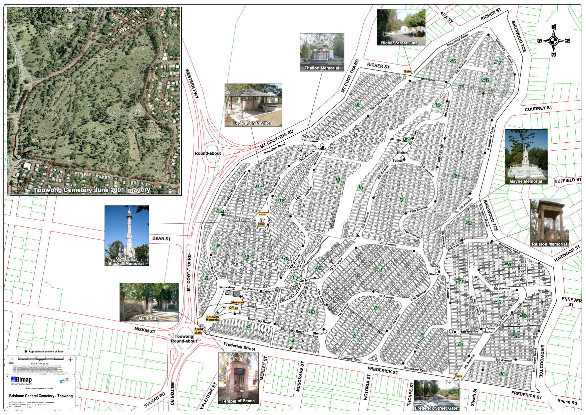

 
# Labor Luminaries 

A walk recognising people involved in the Labor Movement.

## Map
<!-- Map -->
[][map]
<figcaption>[Toowong Cemetery](https://graves.brisbane.qld.gov.au) © Brisbane City Council 2016, used under [CC BY 4.0][map-cc-by]. Highlights added. Note: Old Road names shown.</figcaption>
<!-- Map links -->
[map]: ../assets/toowong-cemetery-map.png "Click to expand the map. Use Back to return to this page"
[map-cc-by]: https://creativecommons.org/licenses/by/4.0/  "Creative Commons Attribution 4.0 Licence"

[Download a brochure of this walk](http://www.fotc.org.au/subset/laborluminaries.pdf).

???+ Example "Directions" 

    - Start behind Canon Garland Place in Emma Miller Avenue. 
    - Walk North towards William Brown Avenue (previously 14th Avenue).
    - At the end of the second row back from Emma Miller Avenue, you'll find Emma Miller's memorial stone.  
    
     { width="100" }

--8<-- "snippets/emma-miller.md"

??? Example "Directions" 

    - :fontawesome-solid-walking:{ .deep-purple } Walk up the steep grass path that leads directly to the Governor Blackall Memorial, the largest monument at the top of the hill
    - :fontawesome-solid-car:{ .deep-purple } To avoid the steep walk, drive or walk up Walter Hill Drive. When you come to the Shelter Shed at the top of the hill, take a sharp right turn into Federation Avenue and park on the edge of the road at the turning circle at the end.
    - Walk back down Federation Avenue (previously 15th Avenue), on your immediately on your left about 4 rows after the end of the turning circle, you'll find Thomas Glassey and his wife Margaret. 

    { width="100" }
    
--8<-- "snippets/thomas-glassey.md"

??? Example "Directions" 

    - Continue to walk down 15th Avenue to and  stop at 11‑51‑3, on your left, where you'll find the 3 graves close to each other. 
    
      { width="100" } { width="100" } { width="100" } 

--8<-- "snippets/william-henry-browne.md"

--8<-- "snippets/john-gordon-smith.md"

--8<-- "snippets/anderson-dawson.md"

??? Example "Directions" 

    - Continue to walk down 15th Avenue. Three rows before the Shelter Shed, on your left, stop at 11‑76‑12/13. 

    { width="100" }  
    

## David Bowman <small>(11‑76‑12/13)</small>

[Bowman](https://adb.anu.edu.au/biography/bowman-david-5315) was born on the 4 August 1860 in Bendigo, Victoria, son of miner, Archibald Bowman and Isabella. He arrived in Queensland in 1887 and established his own bootmaking business in New Farm. He married in 1885, Elizabeth Jane Smith, who bore him two sons and two daughters. He entered politics and held various seats in the Queensland Legislative Assembly from 1899 until his death on the 25 February 1916 at Brisbane. Bowman was an organiser for the Australian Workers Union and leader of the Queensland Labor Party from 1907 to 1912.

??? Example "Directions" 

    - Continue past the Shelter Shed, walking North West along Dr. Lillian Cooper Drive (Boundary Road), on your left, stop at the Forgan-Smith grave, 8‑25‑20/21.
    - On the opposite side of the road you'll find the Gillies grave, 18‑106‑20.
    
    { width="100" }  { width="100" } 
    
## William Forgan Smith <small>(8‑25‑20/21)</small>

[Smith](https://adb.anu.edu.au/biography/smith-william-forgan-bill-8489) was born in April 1887 in Invergowrie, Scotland, son of George, a landscape gardener and Mary Forgan. He married Euphemia Wilson in 1913 in Mackay and had two sons. In a varied career, he was a housepainter in Mackay, had business interests and was chairman of the Central Sugar Cane Prices Board. Smith was a member of the Trades and Labor Council, Australian Workers’ Union and on the Central Executive of the Australian Labour Council. Smith was the long‑serving MLA for Mackay from 1915 to 1942, serving as Premier for 10 years from 1932. He received and Honorary LL.D from the University of Queensland. He died in Sydney on Sugar Board business on 25 September 1953.    
    
## William Neal Gillies <small>(18‑106‑20)</small>

[Gillies](https://adb.anu.edu.au/biography/gillies-william-neil-6388) was born 28 Oct 1868 on the Hunter River, New South Wales, the son of farmer, Dugald Gillies and Ann. He was a sugar grower on the Tweed Heads and president of the NSW Sugar Growers Defence League. Gillies married Margaret Smith in 1900 and had a son and a daughter. He entered politics in 1912 as the MLA for Eacham, a seat he held until 1925 when he briefly switched to Federal politics, holding the seat of Herbert. Gillies was Premier, Chief Secretary and Treasurer from February to October 1925. He died at Toowong on 9 February 1928.

??? Example "Directions" 

    - :fontawesome-solid-walking:{ .deep-purple } Walk down the row, across the gully, and across 8th Avenue to the Shelter Shed.
    - :fontawesome-solid-car:{ .deep-purple } To avoid the steep walk down the hill, return to your car and drive down Federation Avenue back to the Shelter Shed, then contine on Dr. Lillian Cooper Drive. Turn right into 9th Avenue, then right into Pat Hill Drive and park near the Shelter Shed. 
    - Walk towards O'Doherty Avenue (previously 11th Avenue) and four graves along you'll find Ned Hanlon. Six graves on you'll find the Hoolan family.

    { width="100" }  { width="100" } 

## Edward Michael Hanlon <small>(7A‑38‑19/21)</small>

[Hanlon](https://adb.anu.edu.au/biography/hanlon-edward-michael-ned-10411) was born on 1 Oct 1887 in Brisbane, son of Michael and Mary Ann Byrne. He was educated Petrie Terrace State School and the Brisbane Technical College before joining the Queensland Railways in 1908. After 1912, he became a grocer and was active in the Shop Assistants’ Union. Hanlon served in the 9th Battalion AIF from 1915 to 1919. Hanlon married Elizabeth Carver in 1922. He fathered a son and three daughters. He was an MLA for Ithaca from May 1926 until his death on 15 Jan 1952. Hanlon was Minister for Health from 1935 to 1944 and Premier and Chief Secretary from 1946 to 1952. His statue overlooks the old Royal Women’s Hospital and the multilevel Ned Hanlon Building.

## John ‘Plumper’ Hoolan <small>(7A‑34‑2)</small>

[Hoolan](https://adb.anu.edu.au/biography/hoolan-john-6727) was born in 1842 in Tipperary, son of James Hoolan and Margaret Kennedy. He married Ellen Lawler in 1871 in King’s County, Ireland and had two sons and two daughters. In a varied career, he was a carpenter in Bathurst, a miner in Charters Towers, a newspaper proprietor in Georgetown and leased a farm in North Queensland in 1896. Hoolan was the MLA for Burke from 1890 to 1894 and again from 1896 to 1899. He died in the Diamantina region on the 15 June 1911.
A guided walk recognising a small number of people involved in the Labor Movement

??? Example "Directions" 

    - Walk back to the Shelter Shed, turn left into Charles Heaphey Drive (previously 8th Avenue). 
    - Before you get to Elizabeth Dale Walk, on your right, and almost to the row, near the gully, you'll find Albert Whitford.

    { width="100" }  

## Albert Edward Victor Whitford <small>(15‑6‑40)</small>

Whitford was born in 1877 in Woolwich, England, son of Charles Whitford and Dora Kelly. He married Ethel Scott in Sydney and had two sons and two daughters. Arriving in Queensland in 1910, he worked as a tailor in Childers. Whitford was the MLA for Burrum from March 1918 to October 1920. He was murdered in Albert Square on 29 Jan 1924 by returned serviceman, James William Laydon. Smith was shot in front of his wife after a night at the Tivoli Theatre. He was 46.

??? Example "Directions" 

    - Continue along Charles Heaphey Drive and veer left to return to the starting point. 

## Further Reading and Acknowledgements

Waterson, D. B. *Biographical Register of the Queensland Parliament*, Australian National University Press, 1972

Research on Albert Whitford provided by Shelley Steel.

Compiled by Hilda Maclean. 
<!-- Hilda Maclean https://social-science.uq.edu.au/profile/603/hilda-maclean h.maclean@uq.edu.au -->
