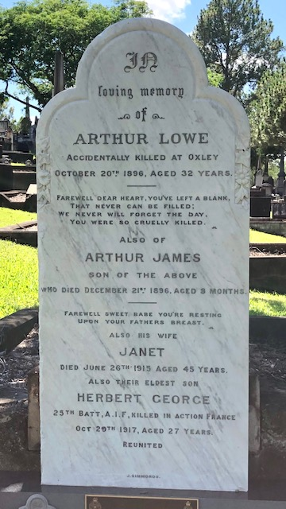

# Men of the Royal Navy

<!--
???+ directions "Directions" 

    Start at …and follow these walking directions to arrive at the grave of...
    
    { width="15%" } 
-->

--8<-- "snippets/joseph-watters.md"

<!--
??? directions "Directions" 

    Walking directions...

    { width="15%" } 
-->

--8<-- "snippets/watkin-llewellyn-whitaker.md"

<!--
??? directions "Directions" 

    Walking directions...

    { width="15%" } 
-->

--8<-- "snippets/james-kirk.md"

<!--
??? directions "Directions" 

    Walking directions...

    { width="15%" } 
-->

--8<-- "snippets/thomas-lodge-murray-prior.md"

<!--
??? directions "Directions" 

    Walking directions...

    { width="15%" } 
-->

--8<-- "snippets/john-stephen-ferriter.md"

<!--
??? directions "Directions" 

    Walking directions...

    { width="15%" } 
-->

--8<-- "snippets/william-leworthy-goode-drew.md"

<!--
??? directions "Directions" 

    Walking directions...

    { width="15%" } 
-->

<!--

--8<-- "snippets/john-vivian-williams.md"

??? directions "Directions" 

    Walking directions...

    { width="15%" } 
-->

--8<-- "snippets/john-forrest-haymen.md"

<!--
??? directions "Directions" 

    Walking directions...

    { width="15%" } 
-->

--8<-- "snippets/william-henry-browne.md"

<!--
??? directions "Directions" 

    Walking directions...

    { width="15%" } 
-->

--8<-- "snippets/ian-chesborough-rose-macdonald.md"

<!--
??? directions "Directions" 

    Walking directions...

    { width="15%" } 
-->

--8<-- "snippets/arthur-lowe.md"

{ width="32%" }

<!--
??? directions "Directions" 

    Walking directions...

    { width="15%" } 
-->

--8<-- "snippets/john-cornish-pentecost.md"

<!--
??? directions "Directions" 

    Walking directions...

    { width="15%" } 
-->

--8<-- "snippets/alexander-hastings-gruer.md"

<!--
??? directions "Directions" 

    Retrace your steps back to the starting point.
-->

## Sources

- ‘BDM Queensland Index Search’, The State of Queensland (Department of Justice and Attorney-General), 1995-2013
- Trove, Digitised Newspapers and more (2016) 
- ancestry.com.
- Royal Navy records UK
- Peter Collins CGMM

## Acknowledgements

Authors: Darcy and Lyn Maddock

## Brochure

**[Download this walk](../assets/guides/men-of-the-royal-navy.pdf)** - designed to be printed and folded in half to make an A5 brochure.

<!-- include site-wide abbreviations -->

--8<-- "snippets/abbreviations.md"
