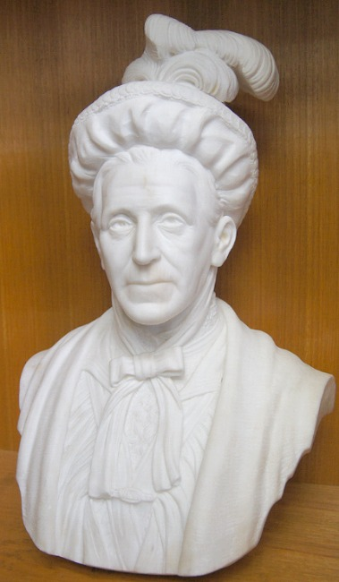

---
hide:
  - navigation
---

# Notable Women  

**Women who shaped Queensland**

## Mary Douglas <small>(9‑34‑5)</small>

Born Mary Ann Simpson, c. 1828, she was the third daughter of the Reverend William West Simpson M.A., a Church of England minister, who immigrated to New South Wales in 1840. In November 1848, aged twenty‑one she married Henry Callander, the eldest son of Randall W. Callander of Stirlingshire, Scotland. In 1852 Callander died aged 31 and Mary married William Howe and bore a daughter, Mary West Howe, in 1857. This second union ended with Howe’s death, and it was as twice‑widowed in Sydney, that she met and married the distinguished bachelor, John Douglas, in 1861. Douglas was the nephew of the Marquis of Queensbury, a former pupil of Rugby School, and graduate of Durham University. He represented Camden, NSW at the time.

Mary Douglas moved into the spotlight of Queensland public life when on June 22, 1865 the Hospital Committee noted that ‘a letter from Mrs Douglas relating to nursing of children. She was the leader of the ladies’ committee, a reflection of the confidence and respect in which she was held by the Hospital committee. An offer of Mary Douglas and the ladies’ committee was to be the beginning of institutional care for orphaned, destitute and neglected children in Queensland. By the end of 1865 the child‑rescue institution at the Fever Hospital had become a busy centre for the increasing number of children unable to be cared for in the southeast of the colony and it was fast becoming a place of placement of any destitute child. The Fever Hospital was not strictly speaking an orphanage: parents who could persuade the orphanage committee of their need stood a good chance of having their application accepted and their child admitted.

In 1869 a marked change occurred in management when John and Mary Douglas departed for London where John took up the position of Queensland Agent‑General. Around this time Governor Blackall made a public presentation of a silver salver to Mary Douglas and the Ladies’ Committee, in the presence of a veritable ‘Who’s Who’ of Brisbane society gathered at the Diamantina Orphanage. On her return Mary held a prominent and influential position in the child‑saving movement in Brisbane. However, in 1875 and 1876 during her endeavour to assert more direct managerial control over the orphan school – a model almost unheard of during this time.

In November 1876, Mary Douglas was travelling in her pony‑drawn gig from her home in Bonnie Avenue, Clayfield to Brisbane when she was involved in an accident close to Newstead House gates, Breakfast Creek. Her pony shied at an approaching dray and her vehicle ran up a steep bank and overturned throwing Mary out. She died twelve hours later from severe injuries.^1^

## Florence Griffiths Buchanan <small>(11‑33‑4)</small>

A missionary and teacher, Florence was born on 16 September 1861 at Canterbury, Kent, daughter of Captain Neil Griffiths Buchanan of the 93^rd^ Highlanders and his wife Elizabeth Jane, née Griffiths. Orphaned when young, Florence became the ward of a relation at Torquay, Devon. Despite her extremely delicate constitution and near‑blindness, she devoted herself as a young woman to both practical charity and prayer. After a physical breakdown in 1887, she accompanied her two brothers to Bundaberg, Queensland, where they purchased Oakwood, a substantial cane‑farm. Seriously injured in a riding accident in 1888, she was left permanently crippled. After teaching her Melanesian servants English and Bible stories, she later assumed responsibility for the non‑denominational South Seas Evangelical Mission (also known as the Queensland Kanaka Mission). In addition she served as Queensland secretary of both the International Scripture Union and the Young Women's Christian Association, and maintained at her own expense a hostel for English migrant girls.

After Oakwood was destroyed in the 1893 floods, Florence Buchanan lived at Townsville and competently helped Bishop C. G. Barlow to administer his diocese. Two years later she worked among the multi‑racial communities of divers on Thursday Island. Forced to go to London for surgery, on her return she met Kashiwagi Taira, an educated storekeeper who introduced her into the usually closed Japanese community. Though only modestly successful in proselytizing them, she was revered and respected by everybody on the island for her generous hospitality, friendliness, humour and compassion. In 1906 Miss Buchanan was engaged first as a teacher and later as acting headmistress of the famed Singapore Chinese Girls' School; she also taught the orphans at St Mary's Home in Singapore. In 1907 she again underwent major surgery in London and, upon recovery, returned to Thursday Island and was ordained a deaconess in January 1908. In May she went to Moa Island and conducted the Anglican mission, taught school, and tried to inculcate skills necessary for economic self‑sufficiency.

Florence Buchanan resigned her charge of the mission in 1911 because of deteriorating health, but she stayed on as a teacher. September she performed her last public function when she spoke on 'The mission field as a vocation for women' at the annual congress of the Church of England in Brisbane. She died of tuberculosis in St Helen's Methodist Hospital on 30 December. She was profoundly mourned throughout the Torres Strait.^2^

## Elizabeth Jane Kingsbury <small>(12‑42‑12/13)</small>

Mrs. John James Kingsbury was a Victorian, a daughter of Mr. David Ham. She was possessed of unusual gifts, a fine presence, a wide, clear outlook, and eloquence that gave her a great advantage in pleading the cause in which she was interested. She came by force of her gifts prominently when any movement especially concerning the welfare of women and children was involved. She had a keen sense of humour, and her speeches were characterised by humour and brilliance. She was in demand whenever a new project was started for the betterment of the State, and although her invariable answer was, *“I’m working to the pin of my collar,”* still there was always fitted in either another pin or an extra little stretch was given to the collar. 

Few women have left so clear a track successfully blazed in the history of Queensland. Mrs. Kingsbury was for years on the committee of the Sick Children’s Hospital. Then when the claims of a woman’s hospital were urged by Lady Lamington, Mrs. Kingsbury became one of the first members of the committee, relinquishing her guiding hand only when success had come to the institution. She became president of the Industrial Home for Women at Normanby Hill, and at a still later date the first president of the Queen Alexandra Home for orphans, neglected, or poor children, under the control of the Methodist Church. 

Still more presently, when war work was what mattered most in women’s lives, Mrs. Kingsbury practically illustrated the doctrine of keeping the home fires burning by strengthening existing activities and at the same time, as president of the National Council of Women, she took an active part in “Six o’clock closing,” the establishment of a bureau for the registration and classification of women for national work, the foundation of the British Australian League for the encouragement of Australian goods first, and those of the Empire next. She was elected president of the Women’s Mutual Service club, and, with her committee, brightened with kindly sympathy the many weary hours of sorrow and anxiety of soldiers’ relatives. Mrs. Kingsbury, for eight years, occupied the position of president of the National Council of Women, a federation of 44 societies, all interested in great national questions, especially in those affecting the welfare of women and children. On the occasion of the International Congress held in Rome in June, 1914, Mrs. Kingsbury represented the Queensland Council, and on her return familiarised the women of Brisbane with the representative women of other countries.^3^ Elizabeth was also an accomplished artist and wood carver. She died in 1919 aged 61.

{ width="25%" }

*<small>[Mrs J. J. Kingsbury](http://onesearch.slq.qld.gov.au/permalink/f/1upgmng/slq_alma21218947160002061) - State Library of Queensland </small>*

## Jessie Philp <small>(14‑23‑10)</small>

Jessie Bannister, the eldest daughter of James and Isabella Campbell, died on 21 November 1890 at Baroona. She was the 34‑year‑old wife of politician Robert Philp (MLA for Townsville) and mother of seven surviving children. Jessie and Robert married at Ballymore in February 1878 before setting sail for Townsville, where most of her nine children were born. Her youngest child was just two weeks old when Jessie, weakened from recent childbirth, succumbed to the scarlet fever for which she was nursing two of her older children.^4^

{ width="25%" }

*<small>[Portrait of Jessie Bannister Philp, ca. 1878](http://onesearch.slq.qld.gov.au/permalink/f/1upgmng/slq_alma21220205850002061) - State Library of Queensland </small>*

## Emma Miller <small>(13‑6‑5/6)</small>

Emma was born Emma Holmes in Chesterfield, Derbyshire, in June 1839. On 15 September 1857 at Chesterfield Register Office she married Jabez Mycroft Silcock, a bookkeeper with whom she had eloped. He died in 1870 leaving her with four small children to support. Emma was a gentlemen’s shirtmaker and she began to take in piecework, working twelve hours per day, six days per week. 

Emma remarried on 30 August 1874 at Salford, Lancashire, William Calderwood, a stonemason. They arrived in Brisbane in March 1879. He died just over a year later. Widowed again, Emma was forced to make her living by needlework. 

Emma was in the vanguard of the formation of women’s unions, the women’s suffrage movement, and the Labor Party. She actively supported strikers during the 1880s, and worked to alleviate the plight of the unemployed. 

Her third husband was Andrew Miller (d.1897), a widower whom she married at Brisbane Registry Office on 21 October 1886. 

She campaigned tirelessly for freedom from conscription. Through these activities, she was known and admired throughout the country, and given the affectionate title ‘Mother of the Australian Labor Party’. 

On 'Black Friday' of the 1912 strike, Emma led a large contingent of women to Parliament House, braving the batons of foot and mounted police. She reputedly stuck a hatpin into the horse of Police Commissioner Cahill who was thrown and injured. 

{ width="54%" }

*<small>[Brisbane strikes, 1912](http://onesearch.slq.qld.gov.au/permalink/f/1upgmng/slq_digitool112004) - State Library of Queensland. </small>*

Emma died in 1917. On 22 October 1922 a publicly funded marble bust of her was unveiled in the Trades Hall.^5^

{ width="28%" }  { width="25%" }

*<small>[Portrait of Mrs. Emma Miller](http://onesearch.slq.qld.gov.au/permalink/f/1c7c5vg/slq_alma21220238260002061) - State Library of Queensland.  </small>*  
*<small>[Marble Bust of Emma Miller held at Queensland Council of Unions by sculptor James Laurence Watts](https://en.wikipedia.org/wiki/File:Marble_Bust_of_Emma_Miller_held_at_Queensland_Council_of_Unions.jpg) by Alphi123, used under [CC BY-SA 4.0][cc-by-sa].  </small>*

{ width="54%" }

*<small>[Arthur Hoey Davis -Steele Rudd, Charles Lilley and Emma Miller statues located in King George Square in Brisbane, Australia. Artist: Artbusters Materials: Bronze Installation date: 1993](https://en.wikipedia.org/wiki/File:A._Davis,_C._Lilley_and_E._Miller_statues_in_Brisbane_01.JPG) by [Kgbo](https://commons.wikimedia.org/wiki/User:Kgbo), used under [CC BY-SA 4.0][cc-by-sa].  </small>*

## Sources 

1: Savage, A. Mary Douglas: Founder and Administrator of the Diamantina Orphan School, Brisbane between 1865 and 1876 Unpublished Essay. Picture JOL img. no. 159746

2: Saunders, K. 'Buchanan, Florence Griffiths (1861 - 1913)', Australian Dictionary of Biography, Volume 7, Melbourne University Press, 1979, p. 471.

3: Condensed from the Brisbane Courier, 10 March 1919 Death of Mrs. J. J. Kingsbury.

4: Kindly provided by descendants.

5: Young, P. 'Miller, Emma (1839 - 1917)', Australian Dictionary of Biography, Volume 10, Melbourne University Press, 1986, pp 509-510.

## Brochure

**[Download this walk](../assets/guides/notable-women.pdf)** - designed to be printed and folded in half to make an A5 brochure.

<!-- Links -->

[cc-by-sa]: https://creativecommons.org/licenses/by-sa/4.0/  "Creative Commons Attribution ShareAlike 4.0 Licence"
