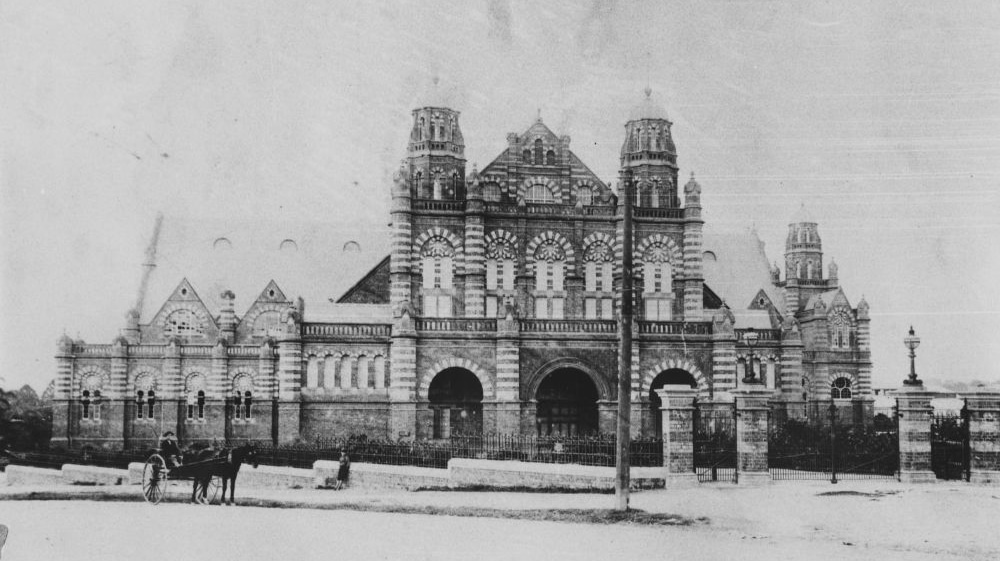
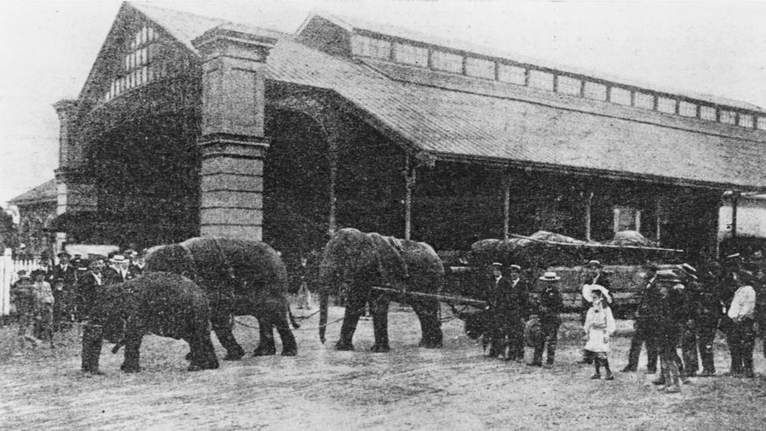
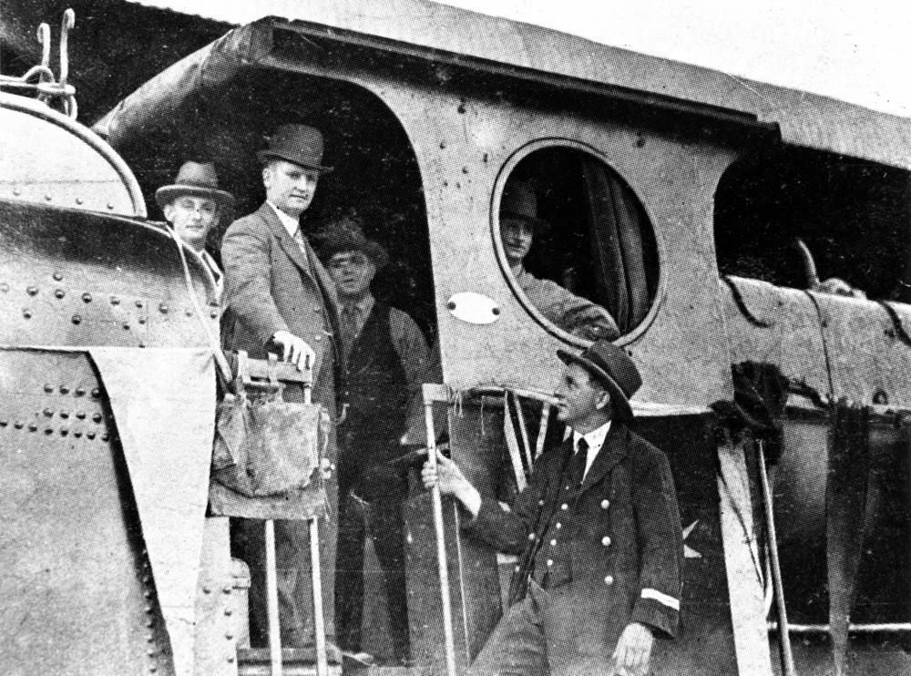
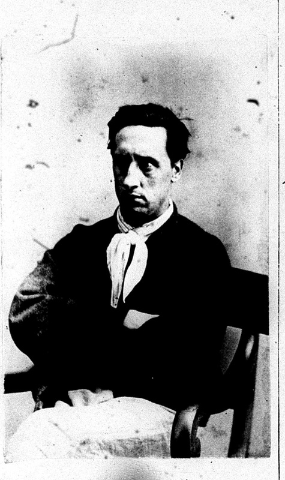

# A wander through Portions 15 and 16  

<!--
--8<-- "snippets/originally-a-guided-tour.md"
-->

<!--
Introduction

???+ directions "Directions" 

    Starting point
    Walking directions to first headstone... is the grave of...
    
    { width="15%" }
-->

## Chief P.O. Instructor Alexander Mountford <small>(16‑18‑30)</small>

Mountford was born in North Leith, Scotland on 10 February 1898.After a long career in the British Navy, he was transferred to the Royal Australian Navy in 1927. In May 1934 he was appointed instructor in wireless telegraphy at Brisbane. He died in Rosemount Repatriation Hospital on 15 September 1936 following a short illness.

<!--
??? directions "Directions" 

    Walking directions to next headstone... is the grave of...
    
    { width="15%" }
-->

## Charles Walter de Vis <small>(16‑22‑18)</small>

Born in Birmingham England on 9 May 1829, [Charles de Vis](https://adb.anu.edu.au/biography/de-vis-charles-walter-3406) was a clergyman and then museum curator before immigrating to Queensland in 1870. He became curator of the Queensland Museum in 1882 and director of that institution in 1901 adding much to the extent of the collections, their classification and display.

{ width="70%" }

*<small>[Exhibition Hall, Brisbane, ca. 1897](http://onesearch.slq.qld.gov.au/permalink/f/1upgmng/slq_alma21219199540002061). Originally built as an Exhibition Hall and Concert Hall, the building is located on the site of an earlier building which burned down in 1888. In the late 1890s the Exhibition Hall was converted to accommodate the Queensland Museum which transferred to the building in 1899. State Library of Queensland.</small>*

## Olive May Heathorn <small>(16‑24‑14)</small>

Olive was born in Great Malvern Worcester in 1890. During World War 1 she married 2^nd^ Lieutenant George Douglas Heathorn of the Royal Flying Corp. After the war George and Olive became dairy farmers at Woolner's Arm outside of Casino in NSW. Olive died in a Brisbane hospital on 7 June 1936.

## Charles Frederick Augustus Garland <small>(15‑11‑26/27)</small>

Born in Roma Qld in 1862, Charles Garland was apprenticed a [printer's devil](https://en.wikipedia.org/wiki/Printer%27s_devil) to the proprietor of the Western Star and Roma Advertiser. He later obtained a position on the composing staff of the Brisbane Courier where he served for 52 years.

{ width="70%" }

*<small>[Staff working at the Brisbane Courier, ca. 1902](http://onesearch.slq.qld.gov.au/permalink/f/1upgmng/slq_alma21220275530002061) - State Library of Queensland.</small>*

## Richard Belford <small>(15‑11‑6)</small>

Richard Belford died on 28 April 1865 and was interred in the North Brisbane Burial Ground at Paddington before his remains and headstone were transferred to Toowong in 1913. Richard was for many years connected with the colonial press in New South Wales, Victoria and Queensland.

## James Edwin Ramsbotham <small>(15‑16‑17)</small>

James Ramsbotham was born on 4 November 1856 in Ipswich Qld where his parents were well known residents. He entered the Posts & Telegraphs Service and was stationed at St Lawrence. Later he moved to Brisbane. In 1901 following Federation he was appointed to the position of telegraphist at Roma Street Railway Station.

{ width="70%" }

*<small>[Wirth Brothers' elephants drawing the circus properties from Roma Street Railway Station, 1905](http://onesearch.slq.qld.gov.au/permalink/f/1upgmng/slq_digitool88516) - State Library of Queensland.</small>*

## Toppin Family <small>(15‑16‑40/41)</small>

The Toppin siblings, Jack, Leo and Madonna were well known child entertainers during WW1 and afterward. Leo became manager of some well known Brisbane theatrical venues in the years leading up to WW2.

## Francis Malachy McKeon <small>(15‑17‑7)</small>

Francis McKeon was a member of the Brisbane team of railway staff who competed for, and won, the Queensland Railways Ambulance Challenge Shield in 1920. He died in the Mater Hospital on 17 November 1925 after a few days' illness.

## John and Ellen Forde <small>(15‑19‑27/28)</small>

Irish immigrants, John and Ellen Forde were the parents of [Francis Michael Forde](https://adb.anu.edu.au/biography/forde-francis-michael-frank-12504) better known as Frank Forde, the 15^th^ Prime Minister of Australia.

{ width="70%" }

*<small>[Frank Forde pilots a train into Brisbane, 1930](http://onesearch.slq.qld.gov.au/permalink/f/1upgmng/slq_digitool42043) - State Library of Queensland.</small>*

## Hugh Glackin <small>(15‑22‑20/21)</small>

[Hugh Glackin](https://trove.nla.gov.au/newspaper/article/219446603) was born in Newtown Cunningham in County Donegal on 8 March 1844. After coming to Queensland, he joined the police force as a constable in 1870 and [famously arrested Captain Starlight](https://trove.nla.gov.au/newspaper/article/181459438) in April 1887. 

{ width="30%" }

*<small>Frank Pearson (Captain Starlight) - State Archives of NSW</small>*

## Burton Family <small>(15‑22‑11/12)</small>

The Burton family were hoteliers, operating some of Brisbane's landmark hotels in the 19th and 20th centuries.

## Frederick Augustus Garland <small>(15‑24‑22)</small>

[Frederick Augustus (Gus) Garland](https://trove.nla.gov.au/newspaper/article/181193037) was the second son of Charles Frederick Augustus and Sarah Jane Garland of New Farm. He was a public servant and prominent in Catholic choirs in Brisbane prior to his death at the age of 38 years.

## John Galligan <small>(15‑26‑12)</small>

John Galligan was born in County Cavan, Ireland in 1857. He landed in Sydney in 1873 when he was 16 and later came to Queensland where he joined the police force in 1882. He escaped death a number of times during his police career during his postings in Brisbane and Bundaberg.

## Acknowledgements

Compiled and presented by Darcy and Lyn Maddock

## Sources

- [Trove](https://trove.nla.gov.au) - National Library of Australia
- UK, Royal Navy Registers of Seamen's Services, 1853-1928 
- [HMS Ganges](https://www.bbc.co.uk/suffolk/content/articles/2009/08/17/hms_ganges_campaign_lw_feature.shtml) - BBC
- [HMS Impregnable](http://www.battleships-cruisers.co.uk/hms_impregnable.htm) - Battleships-Cruisers.co.uk
- [de Vis, Charles Walter (1829–1915)](http://adb.anu.edu.au/biography/de-vis-charles-walter-3406) - Australian Dictionary of Biography
- [www.actonhistory.co.uk](http://www.actonhistory.co.uk) 
- [Index of /pdf/](https://www.railwayfirstaidvolunteers.org.au/pdf) - Railway First Aid Volunteers 
- [Frank Pearson](https://en.wikipedia.org/wiki/Frank_Pearson) - Wikipedia
- [Captain Starlight](http://bushrangersau.blogspot.com.au/2011/02/captain-starlight.html) - Bushrangers
- [Museum](https://www.police.qld.gov.au/museum) - Queensland Police Service

## Brochure

**[Download this walk](../assets/guides/portion5-part2.pdf)** - designed to be printed and folded in half to make an A5 brochure.

