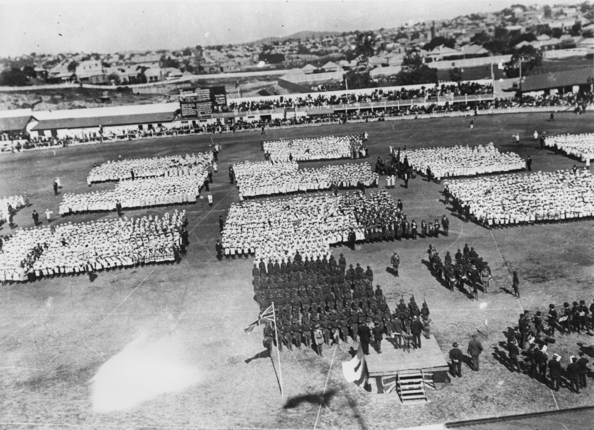
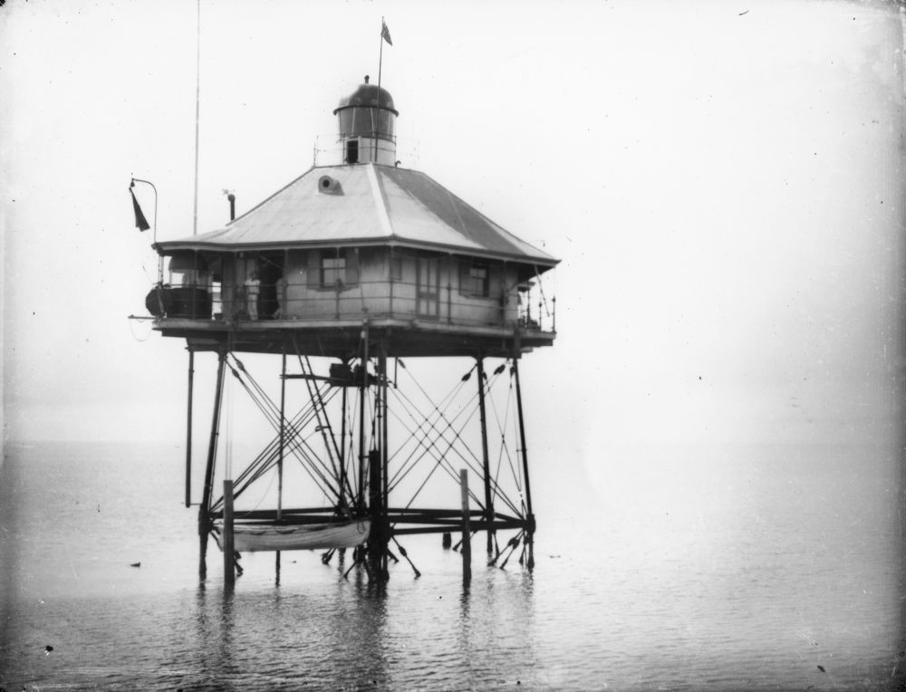
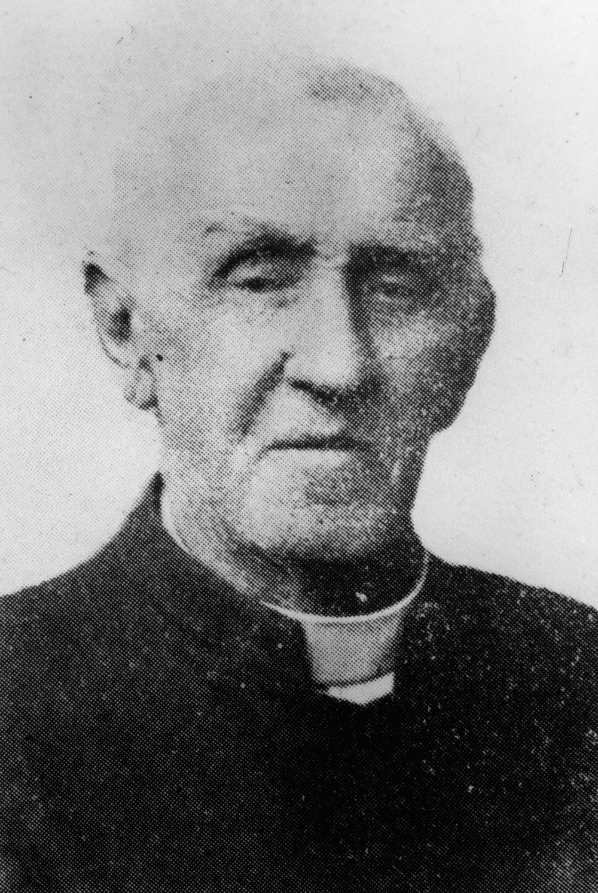
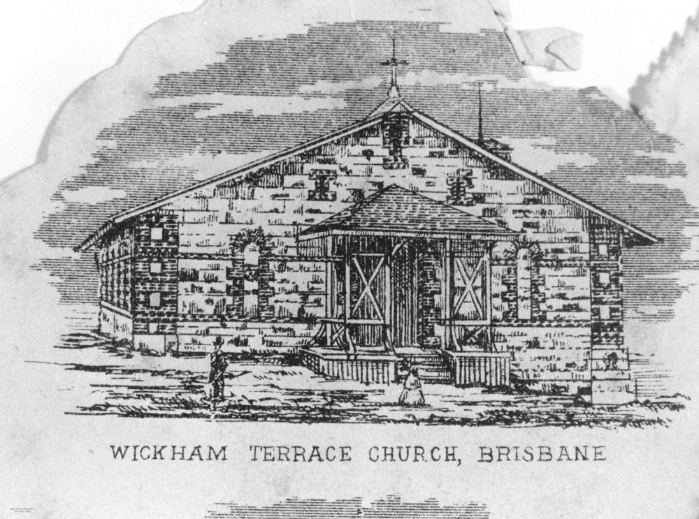
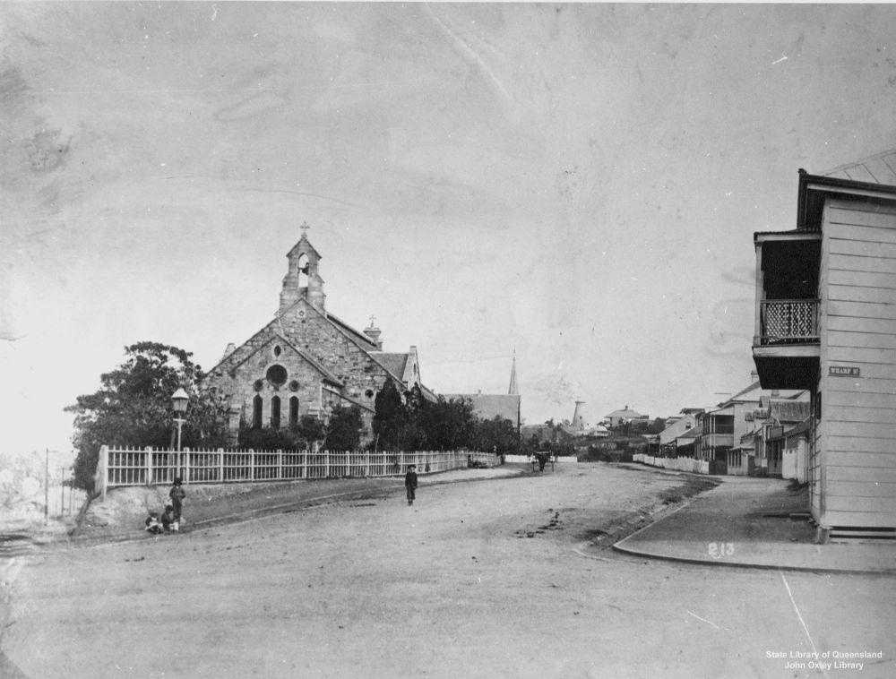
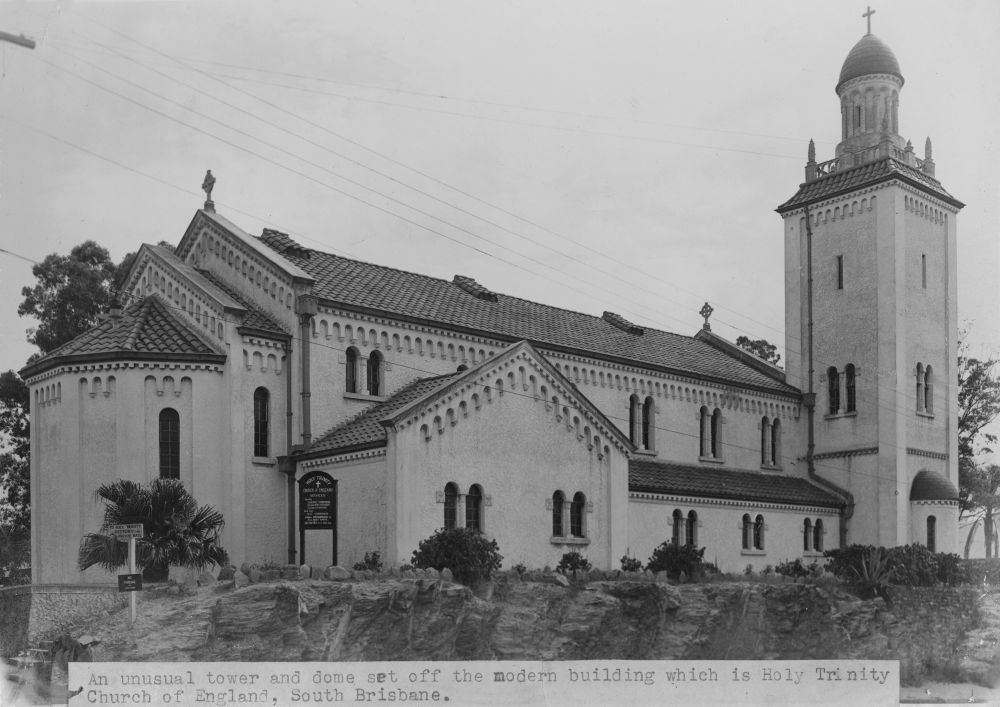

# A walk through Portions 6 and 24  

!!! question "Volunteer opportunity"

    How embarrassing! We can't find all the electronic files for our walks. We're slowly re-keying the words from the Brochure pdf files. You can help by typing some and sending them to us. 
    
    Why have we published an incomplete page like this? So the people can be discovered in the search and their stories read in the Brochure.

<!--
Introduction

???+ directions "Directions" 

    Starting point
    Walking directions to first headstone... is the grave of...
    
    { width="15%" }
-->

## Captain George and Jane Simpson <small>(24‑13‑16)</small>

==to do==

{ width="70%" }  

*<small>[Reviewing the troops in Brisbane during World War I](http://onesearch.slq.qld.gov.au/permalink/f/1upgmng/slq_alma21220035150002061) 1914 to 1918. The review of the armed forces probably took place in the Parade ring at the Exhibition Grounds, Brisbane. Dignitaries are stood on the reviewing stand facing the assembled members of the forces. — State Library of Queensland.</small>*

<!--
??? directions "Directions" 

    Walking directions to next headstone... is the grave of...
    
    { width="15%" }
-->

## John Robert and Emma Wilkinson <small>(24‑7‑13/14)</small>

==to do==

## James Edward and Emily Jane Halliday <small>(24‑1‑8)</small>

==to do==

{ width="70%" }  

*<small>[Early view of the Pile Lights in Moreton Bay, ca. 1895](http://onesearch.slq.qld.gov.au/permalink/f/1upgmng/slq_alma21220381070002061). Operational from 1882 and destroyed after collision with 'Wave Protector' in October 1949. — State Library of Queensland.</small>*

## Canon Thomas Jones <small>(6‑3‑8/9)</small>

==to do==

{ width="30%" }  

*<small>[Reverend Cannon Thomas Jones, All Saints Church](http://onesearch.slq.qld.gov.au/permalink/f/1upgmng/slq_alma21220132750002061) 1865 — State Library of Queensland.</small>*

{ width="49.5%" } { width="48%" }  

*<small>[Original All Saints Church, Brisbane, ca. 1868](http://onesearch.slq.qld.gov.au/permalink/f/1upgmng/slq_alma21220196940002061) This image is taken from an engraving of W. Buxton. It depicts the original All Saints Church, designed by Benjamin Backhouse and constructed on Wickham Terrace in 1861-1862, opening on 23 February, 1862. It was replaced by a new church in 1869 — State Library of Queensland.</small>*  
*<small>[Some children in front of All Saint's Church in Wickham Terrace, Brisbane, ca. 1885](http://onesearch.slq.qld.gov.au/permalink/f/1upgmng/slq_alma21219373780002061) Photograph taken at the corner of Wharf Street and Wickham Terrace, Brisbane, looking along the latter street towards the Observatory. All Saint's Church (1869) is at left, whilst the original St Andrew's Presbyterian Church (1864) is in the middle distance — State Library of Queensland.</small>*

## Canon Walter and Mary Lorna Thompson <small>(6‑3‑11)</small>

==to do==

<!--
{ width="70%" }  

*<small>[Holy Trinity Church of England at Woolloongabba, 1949](http://onesearch.slq.qld.gov.au/permalink/f/1upgmng/slq_alma21219189770002061) — State Library of Queensland.</small>*
-->

## Charles and Harriott Eleanor Highfield <small>(6‑11‑15/15a)</small>

==to do==

## Thomas, Fanny and Jessie McWatters <small>(6‑12‑20/21)</small>

==to do==

## William John Dunstan <small>(6‑12‑15)</small>

==to do==

## Rev Theodore Osborne <small>(6‑27‑17)</small>

==to do==

<!--
{ width="70%" }  

*<small>[Devoy residence in Ashgrove, Brisbane, ca. 1908](http://onesearch.slq.qld.gov.au/permalink/f/1upgmng/slq_alma21218171470002061). The Devoy residence was in Three Mile Scrub Road (now Ashgrove Avenue), off Waterworks Road. John Devoy was the manager of Castlemaine Perkins. — State Library of Queensland.</small>*

-->

## Acknowledgements

Compiled and presented by Lyn Maddock

## Sources

==to do==

- [Australian Dictionary of Biography](https://adb.anu.edu.au) - Australian National University
- [Grave Location Search](http://graves.brisbane.qld.gov.au) - Brisbane City Council
- [Family History Research](https://www.familyhistory.bdm.qld.gov.au) - The State of Queensland
- [Search the Records](https://www.qld.gov.au/recreation/arts/heritage/archives/search-the-records) - The State of Queensland (Queensland State Archives)
- [Trove](https://trove.nla.gov.au) - National Library of Australia

## Brochure

**[Download this walk](../assets/guides/portion5-part2.pdf)** - designed to be printed and folded in half to make an A5 brochure.

