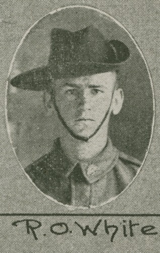
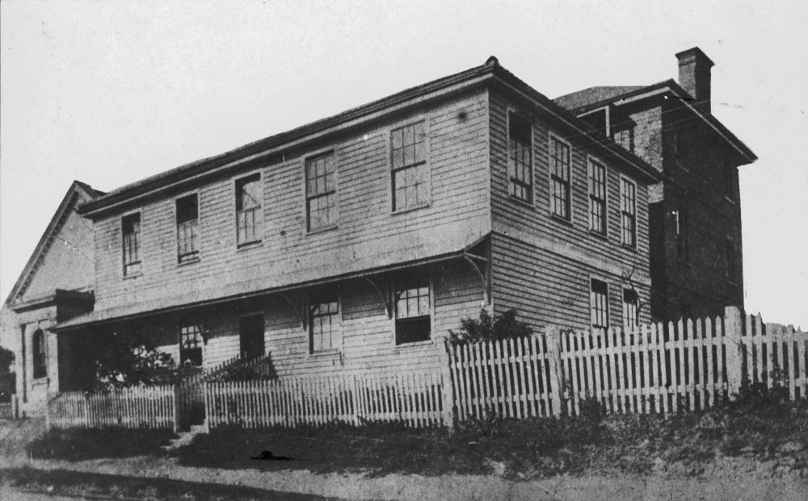

---
hide:
  - navigation
  
---

# More Print Media Identities of Early Brisbane  

## Richard Oldfield White <small>(10‑57‑1)</small>

Richard joined the Brisbane Newspaper Company as a cadet journalist in July 1915. On turning seventeen, he enlisted in WW1 on 2 August 1916. During training after arriving in England on *HMAT Marathon*, he was hospitalised with mumps. After recovering, he was assigned to the 7/52^nd^ Battalion and transferred to France where he saw service until March 1918 when he was sent back to England for treatment for trench foot. While there he was diagnosed with nephritis and invalided home to Australia. After his discharge from the AIF, he resumed his duties on the reporting staff of the *Brisbane Courier* until ill health forced him to enter Rosemount Repatriation Hospital where he died at the age of 27 on 22 October 1926.

{ width="22%" }  { width="71.15%" }

<small>[R.O. White, one of the soldiers photographed in The Queenslander Pictorial, supplement to The Queenslander, 1916](http://onesearch.slq.qld.gov.au/permalink/f/1upgmng/slq_digitool1001932) - State Library of Queensland</small>  
<small>[Marathon (ship)](http://onesearch.slq.qld.gov.au/permalink/f/1upgmng/slq_alma21218385960002061). Built in 1904 and weighing 7, 827 tons, the 'Marathon' belonged to the Aberdeen Line - State Library of Queensland</small>

## William Henry Warman <small>(2A‑25‑27/28)</small>

William was a compositor who worked on various newspapers and at the Queensland Government Printing Office. The name 'the father of Australian compositors' was bestowed on him by the Queensland Government Printer in 1909 on his 80^th^ birthday when he was still an employee of that Office. He had left the printing trade in 1864 to take up the licence for a hotel in Petrie Terrace which he named the Caxton, after the first English printer, [William Caxton](https://en.wikipedia.org/wiki/William_Caxton). He also gave the name to the street where it was located. He returned to his old trade in 1893 and died at his home in Petrie Terrace on 31 October 1912.

{ width="48.9%" }  { width="44.5%" }

<small>[Employees on the steps of the Government Printing Office in William Street, Brisbane, ca. 1895](http://onesearch.slq.qld.gov.au/permalink/f/1upgmng/slq_alma21218936910002061) - State Library of Queensland</small>  
<small>[Staff gathered outside the Government Printing Office in Brisbane, ca. 1900](http://onesearch.slq.qld.gov.au/permalink/f/1oppkg1/slq_alma21218936760002061) - State Library of Queensland</small> 

## Sylvester Doig <small>(1‑22‑9)</small>

One of the early newspaper editors in Moreton Bay, Scottish-born Sylvester came to the colony soon after it was opened to free settlers in 1842. In 1853-54 he edited the *Moreton Bay Free Press* and took an active part in community life in the early years of the colony. He also wrote a column for the *Sydney Morning Herald* in which he dismissed the call for separation from NSW as '[ridiculously premature](https://trove.nla.gov.au/newspaper/article/12952567?searchTerm=%22ridiculously%20premature%22)'. He died on 25 September 1884 while living in Leichhardt Street, Spring Hill. Unfortunately he destroyed most of his personal papers a couple of years before his death.

{ width="30%" }

<small>[The Moreton Bay Courier (Brisbane, Qld. : 1846 - 1861) 1 January 1853](http://nla.gov.au/nla.news-page542214) - National Library of Australia</small>

## Charles Mills <small>(1‑21‑4)</small>

Charles was the printer of the very first issue of *The Telegraph* newspaper in Brisbane on 1 October 1872 and continued in that role for 22 years. He was born on 18 August 1834 in Longford, Ireland, the son of John Mills and Dorothea née Huggins. He arrived in Sydney as a teenager and, after serving his apprenticeship, he was employed on Sir Henry Parkes' *Empire* newspaper before moving to Brisbane in 1863 to take up a position as sub-overseer on the *Queensland Daily Guardian* until 1868. After a short period of employment at the Government Printing Office, Charles started a job printing office in 1870. [He died on 23 August 1894](https://trove.nla.gov.au/newspaper/article/20719727).

{ width="70%" }

<small>[River views across to the Brisbane Museum and Government Printing Office](http://onesearch.slq.qld.gov.au/permalink/f/1upgmng/slq_alma21272136670002061), 1887 - State Library of Queensland</small>

## William Augustine O'Carroll <small>(7‑54‑9)</small>

William was born ca. 1831 in Cork, Ireland, the son of William O'Carroll, a sea captain. He brought his family to Brisbane in 1862 on the ship *Chatsworth* and was offered a job at the *Queensland Daily Guardian* after writing a series of letters to the editor of that newspaper. He rose to the position of editor of the *Guardian* before it was absorbed into the *Courier* in 1868. During his career he edited other newspapers including the *Brisbane Courier* and the *Observer* until [his death on 16 May 1885](https://trove.nla.gov.au/newspaper/article/83676398) from complications from a cold.

## James Charles Beal <small>(7‑41‑18)</small>

James Beal was born in 1833 in Sydney where he served his apprenticeship at the *Sydney Morning Herald*. He came to Brisbane in 1862 to take up the position of Superintendent at the Government Printing Office where he was promoted to the position of Government Printer in 1867 and held that position until his retirement at the end of 1893. Outdoor exercise was recommended for printers for health reasons and James was involved in various sporting circles. He died on 24 August 1904 following a bout of influenza.

{ width="47.4%" }
{ width="45%" }

<small>[Queensland's first Government Printing Office, Brisbane, ca. 1869](http://onesearch.slq.qld.gov.au/permalink/f/1upgmng/slq_alma21218169560002061) - State Library of Queensland</small>  
<small>[Government Printing Office, Brisbane, ca. 1883](http://onesearch.slq.qld.gov.au/permalink/f/1upgmng/slq_alma21271316800002061) - State Library of Queensland</small>

## Richard Belford <small>(15‑11‑6)</small>

For many years Richard was connected with the colonial press in NSW, Victoria and Queensland. He was a native of Newtown, Limavady, in the county of Londonderry, Northern Ireland and came to NSW in 1838 with his parents, Richard (Snr) and Ann (née Linton). 

He was a partner in starting the *Ballarat Star* but after the partnership collapsed, moved to Brisbane and then to Ipswich where he took charge of the *North Australian* newspaper. Richard followed when that newspaper moved to Brisbane and died at the age of 42 from consumption on 28 April 1865. He was originally interred in the Roman Catholic burial ground at Milton but his remains and headstone were relocated to Toowong Cemetery in 1913.

{ width="70%" }

*<small>[View of the Brisbane suburb of Milton, ca. 1870](http://onesearch.slq.qld.gov.au/permalink/f/1upgmng/slq_alma21219311070002061) Photograph taken in the vicinity of Caxton Street, Petrie Terrace, looking due west across the intersection of Judge and Hale Streets and across the Milton Cemetery — State Library of Queensland.</small>*

## Septimus Price <small>(9‑33‑3)</small>

Septimus was born in Lambeth Surry ca. 1837. His occupation before immigrating to Queensland was clerk to a law stationer. In April 1862 he arrived in Moreton Bay on the *Clifton* and became a publishing assistant with the *Queensland Daily Guardian*. A short time after his arrival he married Louisa Kemp on 25 October 1862. After the closure of the *Guardian*, he joined the staff of the Government Printing Office as a publisher. Septimus died on 28 December 1902. 

## Thomas Dowse <small>(13‑58‑22)</small>

In September 1824 15-year-old Thomas was tried for theft at the Old Bailey and sentenced to death, later commuted to transportation for life. Initially incarcerated on the prison hulks *Bellerophon* and *Euryalus*, he embarked on the convict ship *Florentia* bringing him to Port Jackson arriving in January 1828. He served eight years before receiving a ticket of leave in 1836 and a conditional pardon in 1839. 

He came to Moreton Bay in 1842 when it was opened to free settlers and was the anonymous Brisbane correspondent to the *Sydney Morning Herald*. He was a prolific writer with columns in the *Moreton Bay Courier*, *Brisbane Courier* and *The Queenslander* written under the pseudonym '[Old Tom](https://trove.nla.gov.au/search/category/newspapers?keyword=%22Old%20Tom%22%20%22OLD%20TIMES.%20THE%20SETTLEMENT%22&l-state=Queensland&l-title=42&l-decade=186&l-year=1869&sortBy=dateAsc&startPos=0)'.

{ width="40%" }

*<small>[Thomas Dowse](http://onesearch.slq.qld.gov.au/permalink/f/1upgmng/slq_alma21218687340002061) Brisbane Town Clerk 1862-1868 — State Library of Queensland.</small>*

## Thomas Woodward Hill <small>(13‑42‑22)</small>

Thomas Woodward Hill, born in Bedford, England on 31 December 1816 to Joseph Hill (printer) & Susanna (née Woodward), was already a compositor when he embarked for Australia aboard the *Mary* in 1839. He worked on newspapers in Sydney, Melbourne and Nelson, New Zealand, before arriving in Queensland on 23 December 1859. Thomas became father to three children when he married widow Agnes Caroline Rains in the Wharf Street Baptist Church, Brisbane on 29 November 1861.

In 1867 Thomas became the official printer and publisher of *The Brisbane Courier* and *The Queenslander*. In 1884 Thomas was charged with libelling members of the Legislative Assembly. He won this landmark court case for freedom of the press. Ill health caused Thomas’ retirement on his 74^th^ birthday. He died in his Petrie Terrace home on 31 January 1892.

## Acknowledgements

- Compiled and presented by Lyn Maddock
- Information on Thomas Woodward Hill provided by Jenny Davidson, Thomas Woodward Hill's wife's great-great-granddaughter

## Sources

- [Family history research service](https://www.familyhistory.bdm.qld.gov.au), The State of Queensland 
- [Trove](https://trove.nla.gov.au) - National Library of Australia 
- [Ancestry](https://www.ancestry.com.au)
- [Tales from Colonial Queensland](https://talesfromcolonialqueensland.blogspot.com)
- [Dowse, Thomas (1809–1885)](https://adb.anu.edu.au/biography/dowse-thomas-3440) - Australian Dictionary of Biography
- [Thomas Dowse](https://convictrecords.com.au/convicts/dowse/thomas/89523) - Convict Records
- [Telegraph (Brisbane)](https://www.austlit.edu.au/austlit/page/9547711) - AustLit

<!-- fix margins 

## Brochure

**[Download this walk](../assets/guides/more-printers.pdf)** - designed to be printed and folded in half to make an A5 brochure.

-->
