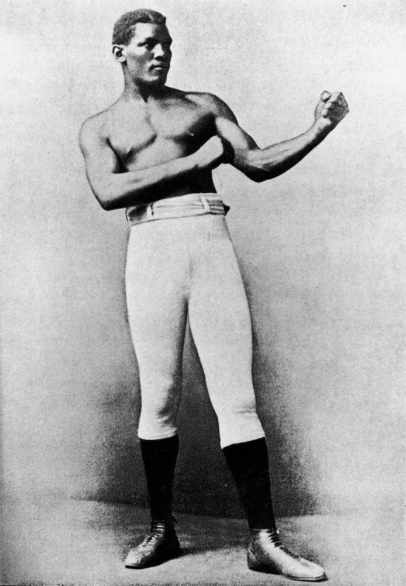

# Famous Sporting Personalities  

!!! question "Volunteer opportunity"

    How embarrassing! We can't find all the electronic files for our walks. We're slowly re-keying the words from the Brochure pdf files. You can help by typing some and sending them to us. 
    
    Why have we published an incomplete page like this? So the people can be discovered in the search and their stories read in the Brochure.

## Peter Morgan 1916–1953 <small>(1‑88‑4)</small>

==to do==

## Amos Roy Goddard 1910–1933 <small>(7‑77‑26)</small>

==to do==

## William Cowley Goulbourne Stone  1870–1892 <small>(7‑77‑11)</small>

==to do==

## Frank Thorne 1883–1931 <small>(21‑20‑16)</small>

==to do==

## Peter Jackson 1861–1901 <small>(5‑28‑1)</small>

==to do==

{ width="40%" }

*<small>[Boxer Peter Jackson who came to live in Queensland from the West Indies, ca. 1880s](http://onesearch.slq.qld.gov.au/permalink/f/1upgmng/slq_digitool116252) - State Library of Queensland </small>*

## John (Jack) Dowridge 1848–1922 <small>(5‑28‑14)</small>

==to do==

## Brickwood Colley 1849–1896 <small>(2‑51‑2)</small>

==to do==

{ width="70%" }

*<small>[Funeral procession of the famous jockey, Brickwood Colley, in Brisbane, 1896](http://onesearch.slq.qld.gov.au/permalink/f/1upgmng/slq_alma21218250330002061) - State Library of Queensland </small>*

## Brochure

**[Download this walk](../assets/guides/sporting-personalities.pdf)** - designed to be printed and folded in half to make an A5 brochure.

