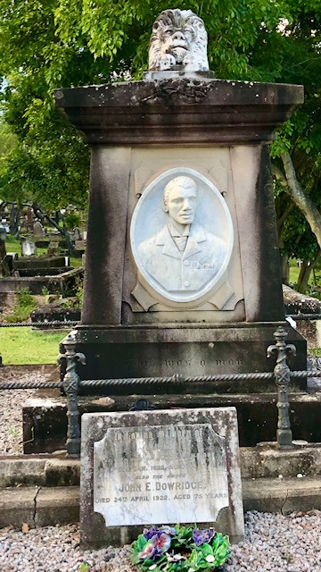

# Famous Sporting Personalities  

## Peter Morgan <small>(1‑88‑4)</small>

1916 – 1953

Peter was an extremely capable rider. According to those who knew him he was as good as George Moore, Neville Sellwood, Russ Maddock and Digger McGrowdie. All Queenslanders like him. He was well regarded by all in the racing game. He had one failing though and that was his lack of confidence in himself. There were many occasions when he rode a horse trackwork and prepared it for a major race but declined to ride the horse in a major event for fear of making a mistake. He never faltered in minor events but would rather sit on the fence when it came to the big races. That is not to say he did not ride in some big races and with success. 

<!-- He had an unusual death for a jockey and that will be explained now. -->

{ width="70%" }

*<small>[Two jockeys having a friendly chat, 1941](http://onesearch.slq.qld.gov.au/permalink/f/1upgmng/slq_alma21220068470002061). Left to right, jockeys Peter Morgan and Tom Spencer pose for the camera. Tragically Peter Morgan drowned in Schultz Canal at Hendra/Toombul in approximately 1952. - State Library of Queensland </small>*

## Amos Roy Goddard <small>(7‑77‑26)</small>

1910 – 1933 

A future champion jockey whose [career ended](https://trove.nla.gov.au/newspaper/article/70555868) much too soon but his saddle lived on to travel the world and win the Irish Derby 39 years later. 

## William Cowley Goulbourne Stone <small>(7‑77‑11)</small>

1870 – 1892 

"Willie" was making a name for himself when he was killed riding a horse home from Eagle Farm after morning trackwork. He was leading one horse whilst riding another. A common sight even today around Doomben. He crossed Hamilton Road and his horse shied.

Those who saw [the funeral of "Willie" Stone](https://trove.nla.gov.au/newspaper/article/173495181) claim it as the longest ever seen. It stretched the length of Queen St and was the equal of another famous jockey's funeral. All the jockeys of the time rode racehorses behind the hearse. They were in colours and silks and wore wreaths over their shoulders and travelled from Hamilton to Toowong along with many carriages.

The two champion horses from Stone's stable, King Olaf and Kildare were led directly without riders. These horses were the last the late jockey had ridden, the former at Eagle Farm and the latter at the "Creek".

## Frank Thorne <small>(21‑20‑16)</small>

1883 – 1931 

Born at Gawler South Australia in 1883. He apprenticed as a Jockey, weighing at that time 6st 9lb. As a recreation Thorn used to indulge in sparring, and later learnt the leads and stops from ex-heavyweight champion Bill Doherty, and from the famous Prank Dooley. Subsequently Thorn drifted to [Kalgoorlie](https://trove.nla.gov.au/newspaper/article/95278367), where he took to the boxing profession. His first contest was a bare knuckle, fight-to-a-finish affair with Alf. M'Coy in 1898, which he won in 32 rounds. He then had a remarkable run of success, winning some 35 bouts, including 25 through the agency of a knock-out, until he lost on points to Tom Dunn at Kalgoorlie. 

By 1905 Thorn was right in the front rank, and between then and 1909 won three Australian championships, feather, light, and welter. Among the men he defeated were such knights of the padded glove as Bob Greenshields, Hughie Mchegan, Charlie Frost, Charlie Griffin, Hock Keys, Sid Sullivan. Kid M'Coy. Bob Turner. Dick Cullen, Arthur Douglas, and Budholf Unholz (welterweight champion).

In 1912 Thorn came to Brisbane. He took part in many contests at the Brisbane Stadium, defeating among others, Joe Russell, George Taylor, Alf. Morey, Marcel Denis, Joe Brooks, Jimmy Hill, Jack Clune, Wave Oelkle, Jack Humphries, Jerry Sullivan, and Jack  Finney. After several years' retirement from the ring he attempted a "come-back" at the Stadium but was stopped by Herb. Ackworth. 

Thorn's career was remarkable by the fact that, although only a featherweight, besides fighting In his own class, he fought the leading light-weights and welters, earning the title of "The Grand Old Man of the Ring". Thorn had conducted a physical culture and boxing academy in Brisbane for some years, teaching personally.

{ width="40%" }

<!-- Suicide https://trove.nla.gov.au/newspaper/article/54702384?searchTerm=%22Frank%20Thorne%22 -->

--8<-- "snippets/peter-jackson.md"

## John (Jack) Dowridge <small>(5‑28‑14)</small>

1848 – 1922

Mr Jack Dowridge, one of the pioneers of boxing in Brisbane, and familiarly known as the "Black Diamond," He was born in Barbados Island in 1848, but at the age of 12 years he drifted to London. It was here that he first picked up the rudiments of boxing. The arena attracted him, and he secured employment with Nat Langham, the retired champion of England, who was then keeping the Mitre Tavern, in St. Martin's Lane. In the year 1862 this tavern was a rendezvous of all the great fistic exponents of that time, such as Joe Cross, Boie Brotties, Jim Mace, Tom King, Coburn, Bob Travers, Ned Donnelly, Professor Johns, Bat Mullins, Heenan, Jerry and Billy Ox. It was here that Jack Dowridge made the acquaintance of Tom Sayers, whom Langham first defeated, and in whose favour he subsequently retired. "Jack" became one of Langham's best pupils, and developed the straight style of the old school of boxing. 

In 1872 Dowridge came to Australia. He secured premises in Queen Street, known as the "Hole in the Wall," which had just been vacated by Larry Foley. He opened a tobacconist saloon and a small select boxing school, but he did not stay long. He returned to England, but the climate soon drove him back to Queensland. He secured premises opposite the Normal School, and after a few years he opened a restaurant and taught boxing at Petrie's Bight, where Quinlan Gray's warehouse later stood. He later removed to Roma Street and then to the corner of Turbot and George streets. His school was the resort of all the young sporting men of the day. Dowridge was one of the best promoters of that time, and under his care were Peter Jackson, Jack M'Gowan and innumerable others.

When Peter Jackson died a public subscription was the means of providing the stone which was placed at the head of the grave, but it was [Jack Dowridge who provided for the purchase](https://trove.nla.gov.au/newspaper/article/71056665) of the land at Toowong cemetery and to pay the funeral expenses.

{ width="40%" }

## Brickwood Colley <small>(2‑51‑2)</small>

1849 – 1896
 
"Brickie", as he was known by all, was in the second half of the 1800s as well known in Australia as any of our top jockeys today. In a period when travel to Sydney and Melbourne was measured in weeks rather than day, he rode with success in all three states. He was 47 when he died of a heart attack in the Post Office Hotel, Queens Street here in Brisbane in 1896. He had only arrived back from Sydney the previous week. He is one of only three jockeys that have had poems written about them; others being Willie Stone and Fred Archer, who is buried down south.

His funeral procession travelled from the the Brisbane General Hospital into the city, down Queen Street and along Coronation Drive, then Sylvan Road, and finally to Toowong Cemetery. Every jockey in the Brisbane area attended in full silks and colours riding a race horse. There was also a large number of carriages. The procession stretched the entire length of Queen Street. 

{ width="70%" }

*<small>[Funeral procession of the famous jockey, Brickwood Colley, in Brisbane, 1896](http://onesearch.slq.qld.gov.au/permalink/f/1upgmng/slq_alma21218250330002061) - State Library of Queensland </small>*

## Brochure

**[Download this walk](../assets/guides/sporting-personalities.pdf)** - designed to be printed and folded in half to make an A5 brochure.

