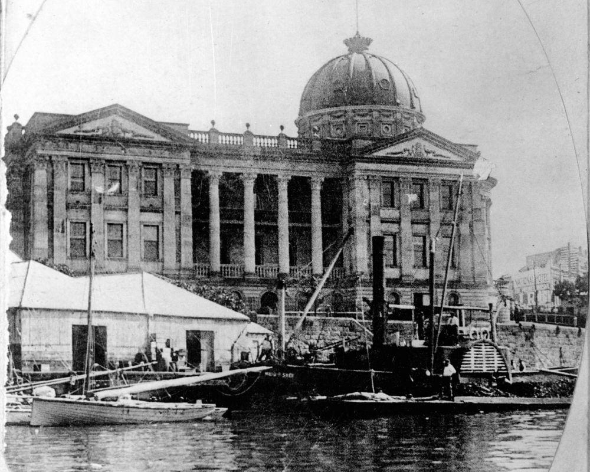
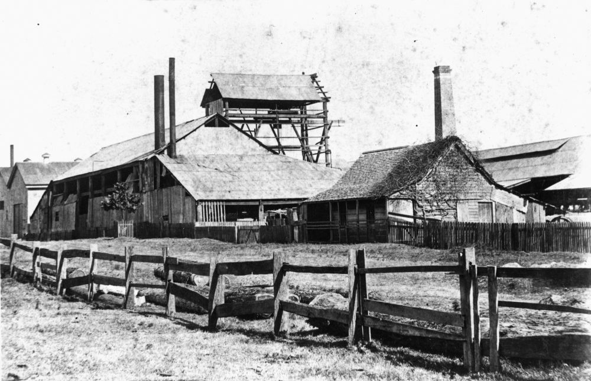
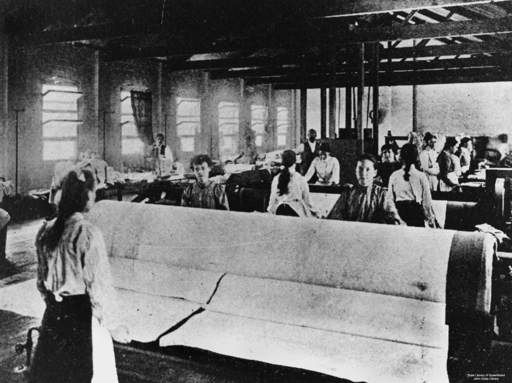
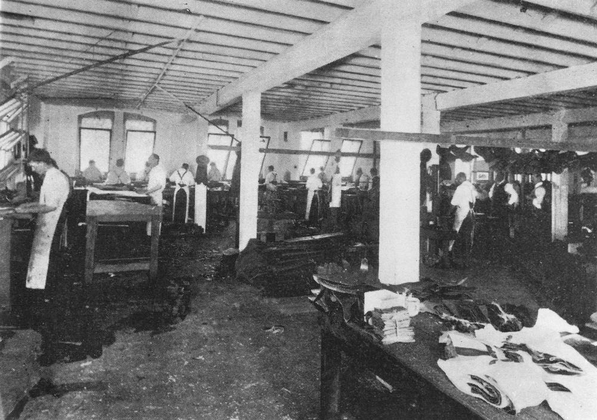
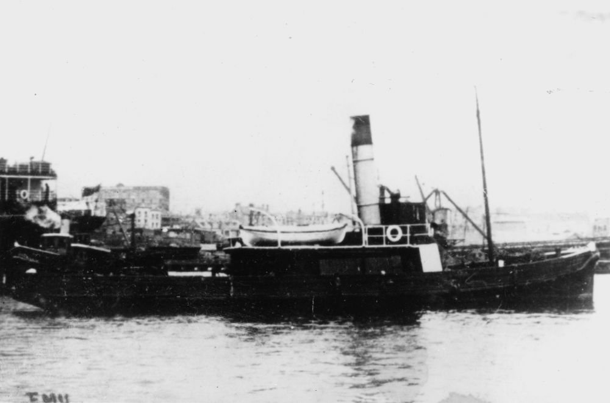

# Steam 

!!! question "Volunteer opportunity"

    How embarrassing! We can't find all the electronic files for our walks. We're slowly re-keying the words from the Brochure pdf files. You can help by typing some and sending them to us. 
    
    Why have we published an incomplete page like this? So the people can be discovered in the search and their stories read in the Brochure.

<!-- 

???+ Example "Directions" 

    Starting point
    Walking directions to first headstone... is the grave of...
    
    { width="15%" }

-->

## Captain Edmund Mellon <small>(9‑38‑4)</small>

Captain Mellon, an early immigrant to Moreton Bay, arrived in the colony in January 1849 on the sailing ship *Fortitude*. In the days when the river trade was the 'lifeline' between Brisbane and Ipswich, he became owner of the river steamers *Bremer* and *Settler*. The *Louisa*, the first iron steamboat ever constructed in the colony of Queensland was built by R.R. Smellie & Co to the order of Captain Mellor. After Mellor's death on 26 September 1872 at the age of 59, the *Louisa* was used on the Logan-Brisbane run. 

<!--

??? Example "Directions" 

    Walking directions to next headstone... is the grave of...
    
    { width="15%" }

-->

## George Hiron  <small>(13‑20‑9)</small>

==to do==

## Joseph William Sutton <small>(13‑7‑13/14)</small>

Joseph, who established the shipbuilding firm J W Sutton & Co at Kangaroo Point , was recognised as one of the leading engineers of his day. Early vessels built by J W Sutton & Co include the iron steamer, *Lady Musgrave*, the iron paddle steamer, *Maid of Sker*, and the first ferry boat used on the Brisbane River, the *Transit*. The home of Joseph and his wife, Mary was one of the first private residences in Brisbane to be lit up by electricity. Joseph died on 21 February 1914. 

{ width="70%" }  

*<small>[Ship 'Maid of Sker' anchored in the Brisbane River outside of the Customs House, Queensland](http://onesearch.slq.qld.gov.au/permalink/f/1upgmng/slq_alma21256762780002061). Cropped. — State Library of Queensland.</small>*

## George Davidson <small>(13‑7‑1)</small>

George was, for many years, superintendent engineer of the Australasian Steam Navigation Company at Pyrmont in Sydney. In 1886 he moved to Brisbane to join the firm of J W Sutton & Co as manager. George was born in Glasgow on 13 April 1841 to Archibald Davidson, an engine fitter, and Janet (née Fyfe). He died on 29 February 1888 after suffering an apoplectic fit.

{ width="70%" }  

*<small>[Sutton and Co. Foundry on Main Street, Kangaroo Point, Brisbane, ca.1890](http://onesearch.slq.qld.gov.au/permalink/f/1upgmng/slq_alma21220296230002061) — State Library of Queensland.</small>*

## George Fish <small>(12‑1‑11)</small>

The Brisbane Steam Laundry at South Brisbane first opened in January 1881 but was taken over by George Fish two years later. The laundry was situated in an alley extending from Stanley to Grey Street. The alley became known as Soda Water Lane. Despite hardships, the business expanded under his ownership. After repairs from damage during the 1893 floods, the laundry reopened with a new name, Fish Stream Laundry. George entered local government politics in 1894. Fish Stream Laundry moved to Ann Street, Fortitude Valley in 1902. Soda Water Lane was renamed Fish Lane in 1904. George died on 23 September 1925, aged 74. 

{ width="70%" }  

*<small>[Ironing department of the Fish Steam Laundry, Brisbane, 1902](http://onesearch.slq.qld.gov.au/permalink/f/1upgmng/slq_alma21220102730002061). Female employees working with large rollers in the ironing department of the Fish Steam Laundry — State Library of Queensland.</small>*

Today [Fish Lane](https://explorefishlane.com.au) is a vibrant Arts Precinct.

## Remains from SS Gothenberg  <small>(16‑1‑3)</small>

==to do==

The steamship *Gothenberg* contracted for the Adelaide to Port Darwin run in 1874, was regarded as fast and dependable. On 17 February 1875 the ship left Port Darwin carrying approximately 100 passengers and 34 crew. As the ship sailed down the North Queensland coast, cyclonic weather conditions were encountered. During the evening of 24 February, the *Gothenberg*  struck the southern edge of Detached Reef

## Benjamin Harris Babbidge <small>(1‑44‑9)</small>

==to do==

## Henry Lewis Neighbour <small>(2‑44‑19)</small>

Henry was a native of Bethnal Green in London's East End, the son of a silk weaver. His family arrived in Brisbane on the *Whirlwind* in September 1862 when Henry was aged five. After finishing school, Henry entered the boot trade as a 'clicker' cutting the leather uppers and later became foreman at his brother's boot factory in Fortitude Valley. After the business closed, he joined the firm of Davey Halliday Company Ltd. boot manufacturers in Ann Street near the corner with Albert Street. Davey Halliday installed the most modern equipment, driven by a steam engine in their basement, and manufactured all classes of men's, women's children's and infant's footwear. Henry died on 4 August 1942. 

{ width="70%" }  

*<small>[Clicker's department at Davey Halliday & Co, 1904](http://onesearch.slq.qld.gov.au/permalink/f/1upgmng/slq_digitool430702)  — State Library of Queensland.</small>*

{ width="70%" }  

*<small>[Davey Halliday Company Ltd. on Ann Street](http://onesearch.slq.qld.gov.au/permalink/f/1upgmng/slq_alma21220086350002061). Carriages outside the Davey Halliday Boot Co. The building was near the corner of Albert Street and Ann Street. This is presently the site of King George Square. Erected 1904 and later part of Albert House. (Information taken from The Queenslander, 14 May 1904) — State Library of Queensland.</small>*

## Andrew Fullerton <small>(2A‑11‑19)</small>

==to do==

{ width="70%" }  

*<small>[Emu (ship)](http://onesearch.slq.qld.gov.au/permalink/f/1upgmng/slq_alma21220199170002061) — State Library of Queensland.</small>*

## James Trackson <small>(7‑101‑1/2)</small>

==to do==

## Acknowledgements

Compiled and presented by Lyn Maddock

## Sources

- Ancestory.com.au
- [Australian Dictionary of Biography](https://adb.anu.edu.au) - Australian National University
- BDM Queensland Index Search, The State of Queensland (Department of Justice and Attorney-General), 1995-2013
- [Grave Location Search](http://graves.brisbane.qld.gov.au) - Brisbane City Council
- [Family History Research](https://www.familyhistory.bdm.qld.gov.au) - The State of Queensland
- [Search the Records](https://www.qld.gov.au/recreation/arts/heritage/archives/search-the-records) - The State of Queensland (Queensland State Archives)
- [Trove](https://trove.nla.gov.au) - National Library of Australia
- A History of Fish Lane, part 3: The Fish Steam Library — State Library of Queensland 
- James Trackson's tracks: Queensland's first motorist — State Library of Queensland
- ==THE 18366==
- ==Javis Finger==
- ==sydney==
- ==Col Dunn==
- ==adb==
- ==family-tree.co.uk==

## Brochure

**[Download this walk](../assets/guides/printers.pdf)** - designed to be printed and folded in half to make an A5 brochure.

