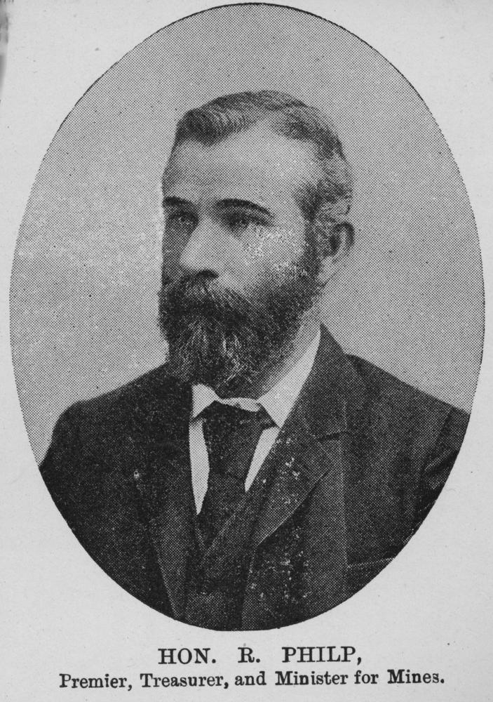
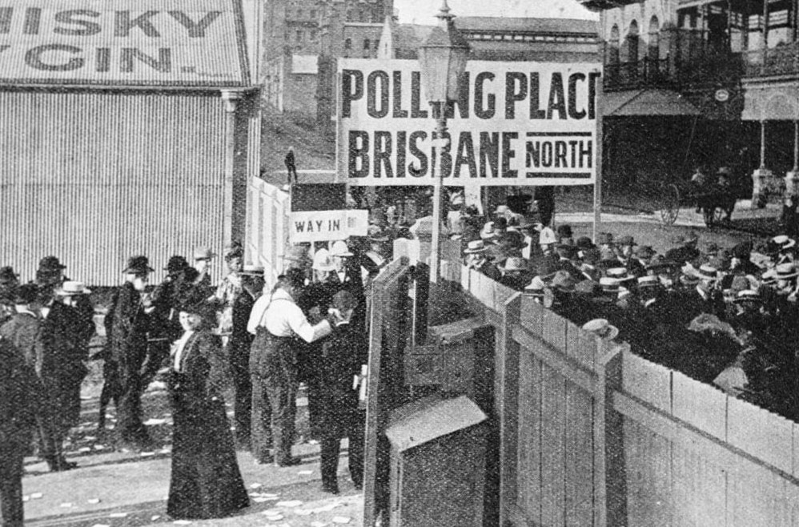

# One Adult, One Vote

**Queensland's own suffrage story** 

<!--
???+ directions "Directions" 

    Starting point
    Walking directions to first headstone... is the grave of...
    
    { width="15%" }
-->

--8<-- "snippets/leontine-cooper.md"

<!--
??? directions "Directions" 

    Walking directions to next headstone... is the grave of...
    
    { width="15%" }
-->

## Justin Fox Greenlaw Foxton <small>(1‑114‑7/8)</small>

Justin Fox Greenlaw Foxton, was born on 24 September 1849 in Melbourne, son of Captain John Greenlaw Foxton and his wife Isabel Elizabeth, née Potts. In 1864 he moved to Queensland where he was articled to James Malbon Thompson in Ipswich and admitted to the Bar in 1871. 

Foxton held the Legislative Assembly seat of Carnarvon from 1883 until 1904 when he refused to support the Morgan coalition. As Home Secretary under the Philp government, Foxton introduced the Adult Suffrage Bill in 1901. Foxton died of cerebro-vascular disease at South Brisbane on 23 June 1916.

## Emma Miller <small>(13‑6‑5/6)</small>

Emma was born in June 1839 in Chesterfield, Derbyshire. Her parents were Daniel Holmes a Chartist, and Martha (née Hollingworth). Emma arrived in Brisbane in 1879. She led the campaign for women's suffrage in Queensland as well as being at the forefront of the struggle for better working conditions for women workers. She was a foundation member of the Australian Labor Party. She campaigned tirelessly for freedom from conscription. Emma was president of the Women's Equal Franchise Association for the whole period of its existence, from 1894 to 1905 when white women in Queensland won the right to vote in state elections. Emma Miller died of cancer on 22 January 1917, two days after making her last speech to the Toowoomba Anti‑conscription League.

{ width="40%" }  

*<small>[Portrait of Emma Miller](http://onesearch.slq.qld.gov.au/permalink/f/1upgmng/slq_alma21218036320002061) — State Library of Queensland.</small>*

## Elizabeth Edwards <small>(14‑23‑14)</small>

Elizabeth Munro Edwards (née Gibson) was born in Scotland on 11 May 1840 and came to Australia with her parents, Thomas Gibson and Christina Thompson in 1864. Three years later she married Richard Edwards who subsequently became the member for Oxley division in Federal Parliament. 

Elizabeth was the first president of The Queensland Women's Suffrage League which was formed at a meeting at her home on 4 February 1889. Elizabeth [died](https://trove.nla.gov.au/newspaper/article/19994589) early on Saturday 7 November 1914 and the funeral took place the same afternoon. 

## Sir Robert Philp <small>(14‑23‑10)</small>

Sir Robert Philp was born on 28 December 1851 at Glasgow, Scotland, son of John Philp, lime kiln operator, and his wife Mary Ann (née Wylie). The family settled in Brisbane in 1862. After leaving school, young Robert joined the business of Sir James Burns at the northern goldfields port of Townsville in 1874, becoming a partner in the business in 1876. The Burns Philp partership flourished. 

Philp entered politics on 5 January 1876 by winning the seat of Musgrave, but transferred to the seat of Townsville on 12 May 1888 and held it until his defeat in 1915. On 7 December 1899, Philp became a reluctant Premier following the defeat of Anderson Dawson's short-lived Labor ministry. In 1901 the Philp Government presented an Adult Suffrage Bill, later shelved, that not only discriminated against women, it also discriminated against many males. 

Sir Robert died after an operation on 17 June 1922 in Holyrood Private Hospital, Brisbane, and was buried in Toowong Cemetery two days later. 

{ width="40%" }  

*<small>[Sir Robert Philp](http://onesearch.slq.qld.gov.au/permalink/f/1upgmng/slq_digitool194435), 1901 — State Library of Queensland.</small>*

## Sir Horace Tozer <small>(12‑11‑8)</small>

Sir Horace Tozer was born on 23 April 1844 at Port Macquarie, New South Wales, son of Horatio Thomas Norris Tozer, chemist, and his wife Charlotte Winifred Amelia (née Croft). He was articled to James Malbon Thompson in Brisbane in 1862 and admitted as a solicitor of the Supreme Court of Queensland on 7 December 1867. 

He was an alderman in the first Gympie Municipal Council and in 1888 was elected to the Legislative Assembly as the member for Wide Bay and held that seat until 1898. Tozer was totally against universal adult suffrage, not only opposing the women's vote but also manhood suffrage. 

He [died](https://trove.nla.gov.au/newspaper/article/187224133) on 20 August 1916 at his South Brisbane home and was buried in Toowong Cemetery where a private funeral was conducted at his request. 

{ width="40%" }  

*<small>[Politician Sir Horace Tozer, Brisbane, 1890](http://onesearch.slq.qld.gov.au/permalink/f/1upgmng/slq_alma21218036320002061) — State Library of Queensland.</small>*

## Sir Charles Lilley <small>(12‑15‑15)</small>

Sir Charles Lilley, politician and judge was born on 27 August 1827 at Newcastle upon Tyn, son of Thomas Lilley and his wife Jane (née Shipley). He arrived in Sydney on 6 July 1856 and moved immediately to Brisbane where he was articled to Robert Little. Lilley became the first solicitor to be admitted to practice by the Supreme Court at Moreton Bay. 

In May 1860 he was elected to Queensland's first Legislative Assembly. From 25 November 1868 to 3 May 1870 he was Premier of Queensland. During a debate on electoral reform in Queensland Parliament in 1870, he put forward the idea of women's suffrage, the first to do so. His government fell the same year but he remained a staunch supporter of women's franchise until his death on 20 August 1897. 

{ width="49%" }  { width="46.35%" } 

*<small>[Sir Charles Lilley](http://onesearch.slq.qld.gov.au/permalink/f/1upgmng/slq_alma21218197120002061) on his wedding day. He married Sarah Jane Jeays in 1858. — State Library of Queensland.</small>*  
*<small>[Sarah Jane Jeays](http://onesearch.slq.qld.gov.au/permalink/f/1upgmng/slq_alma21218235890002061) — State Library of Queensland.</small>*

## Boyd Dunlop Morehead <small>(12‑49‑6)</small>

Boyd Dunlop Morehead was Queensland Premier from 30 November 1888 to 12 August 1890. He was born in Sydney on 24 August 1843, son of Robert Archibald Alison Morehead and his wife Helen Buchanan (née Dunlop). Morehead was MLA for the Queensland electoral district of Mitchell from September 1871 to December 1880 and represented Balonne from October 1883 to April 1896. Morehead succeeded Sir Thomas McIlwraith as Premier in November 1888. Morehead was a significant opponent of women's suffrage. He died from a cerebral haemorrhage on Monday 30 October 1905 at the age of 62 years.

{ width="40%" }  

*<small>[Boyd Dunlop Morehead](http://onesearch.slq.qld.gov.au/permalink/f/1upgmng/slq_alma21218973050002061) ca. 1890 — State Library of Queensland.</small>*

## David Hay Dalrymple <small>(12‑53‑2)</small>

David Hay Dalrymple was born on 14 December 1840 at Newbury, Berkshire, England, son of James Dalrymple and his wife Georgina (née Hay). Dalrymple reached Melbourne in 1862; He bought land in Mackay at the first sales, opened the town's first chemist shop and began pastoral investments. He was the town's first mayor in 1869-71, continuing to serve in local government until 1888 when he became a member for Mackay in the Legislative Assembly. In 1895-1903 Dalrymple served in ministries under Sir Hugh Nelson, T J Byrnes, Sir James Dickson and Sir Robert Philp, holding varied portfolios. He was one of the most strident masculinist voices in opposition to female suffrage. Dalrymple lost his seat in August 1904 and lived in retirement at Hamilton where he [died](https://trove.nla.gov.au/newspaper/article/19851385) on 1 September 1912.

{ width="33.7%" } { width="40%" }  

*<small>[David Hay Dalrymple](http://onesearch.slq.qld.gov.au/permalink/f/1upgmng/slq_digitool15986) 6 April, 1895 — State Library of Queensland.</small>*  
*<small>[Effie Dalrymple, Christmas 1900](http://onesearch.slq.qld.gov.au/permalink/f/1upgmng/slq_alma21218791890002061) Married David Hay Dalrymple at Mackay on 23 December 1880. They had four children. — State Library of Queensland.</small>*

## Sir Arthur Morgan <small>(12‑15‑12)</small>

Sir Arthur Morgan was born on 19 September 1856 at Rosenthal station, Warwick, Queensland, son of James Morgan and his wife Kate (née Barton), both Irish born. Arthur Morgan entered politics in 1885 when elected to the Warwick Municipal Council, serving as mayor in 1886-90 and 1898. 

On July 1887 he was first elected to the Legislative Assembly for Warwick. He regained Warwick on 2 October 1898. In 1903 he became Premier under the Morgan-Browne coalition ministry. Morgan made good on a promise that he would introduce an electoral reform Bill to give women the vote and abolish plural voting. This was introduced to the Legislative Assembly in September 1904 but it was not until 25 January 1905 that the Election Act Amendment Act received Royal Assent. 

Morgan died at his residence at Upper Paddington, on 20 December 1916 after a long illness; he was buried in Toowong Cemetery following a state funeral and service at St John's Anglican Cathedral.

{ width="40.8%" }  { width="36%" }  

*<small>[Sir Arthur Morgan](http://onesearch.slq.qld.gov.au/permalink/f/1upgmng/slq_alma21219359220002061) 1903 — State Library of Queensland.</small>*  
*<small>[Modern Romeo : suffragette movement in Queensland](http://onesearch.slq.qld.gov.au/permalink/f/1upgmng/slq_digitool190519) On 5 January 1905, two years after the formation of the Queensland Women's Electoral League, the Electoral Franchise Bill was introduced into the Legislative Assembly to give the women of Queensland the right to vote. The Elections Acts Amendment Bill, provide the necessary machinery, was introduced at the same time. Despite some misgivings about abolishing the plural vote, and difficulty with postal voting, these issues were overcome and the legislation giving the women of Queensland the right to vote was finally passed. It was assented to by the Lieutenant‑Governor on 26 January 1905 — State Library of Queensland.</small>*

{ width="70%" }  

*<small>[Women inside the gate of the city polling station, voting for the first time in a Queensland state election, May 1907](http://onesearch.slq.qld.gov.au/permalink/f/1upgmng/slq_digitool72579) — State Library of Queensland.</small>*

## Acknowledgements

Compiled and presented by Lyn Maddock

## Sources

- [Australian Dictionary of Biography](https://adb.anu.edu.au) - Australian National University
- [Trove](https://trove.nla.gov.au) - National Library of Australia
- [Queensland Premiers](https://www.qld.gov.au/about/about-queensland/history/premiers) - The State of Queensland
- [Leading lights Leontine Cooper](https://womenssuffragepetitions.wordpress.com/2014/03/31/leading-lights-leontine-cooper/) - Women's Suffrage Petitions – Queensland
- Young, P, 2002: Emma Miller and the Campaign for Women's Suffrage in Queensland, 1984-1905. Memoirs of the Queensland Cultural Series 2(2): 223-230, Brisbane. ISSN 1440-4788
- [Sir Charles Lilley QC](https://www.sclqld.org.au/judicial-papers/judicial-profiles/profiles/clilley) - Supreme Court Library Queensland

<!-- https://hecate.communications-arts.uq.edu.au/files/4639/Centenary%20of%20Women%27s%20Suffrage%20in%20Queensland.pdf -->

## Brochure

**[Download this walk](../assets/guides/sufferage.pdf)** - designed to be printed and folded in half to make an A5 brochure.

