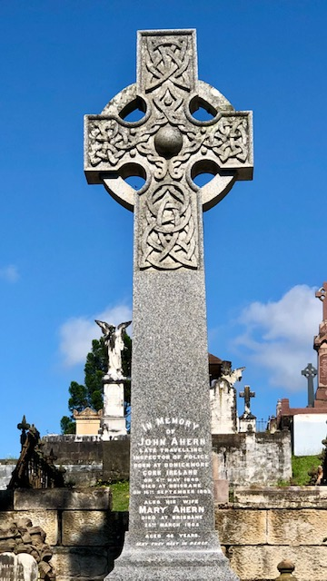

# The Thin Blue Line  

**Queensland Colonial Policing**

## Christopher Francis <small>(2‑37‑31/32)</small> 

**c1840‑1915**

Sydney‑born Francis entered public service in Queensland in 1872 after a career which included journalism. After serving in various capacities in several parts of the colony, he was appointed Police Magistrate at Cunnamulla in 1881. He afterwards went to Townsville and later to Rockhampton. Francis retired in 1910 while serving as Police Magistrate at Maryborough. He died just short of his 75^th^ birthday at St Helen’s Hospital, South Brisbane on the 10th of November 1915 and was buried the next day.^1^

## Henry Bloomfield Gough <small>(2‑44‑21)</small>

**c1845‑1896**

Gough, who until the beginning of 1895 occupied the position of Police Magistrate at Warwick, died in the St. Clair private hospital, Brisbane, on 29 January 1896. Gough was an officer of the Native Police in the early days, and saw many years of active frontier life. Subsequently he was appointed Police Magistrate at Isisford, in the Barcoo country, and in that position did good service for the colony. About the beginning of 1892 he was transferred to Ingham where he spent a couple of years. The climate did not agree with him, and he was strong in the opinion that it was while he resided at Ingham he contracted the complaint which claimed his life. From Ingham he was promoted to Warwick. His health, already impaired, gradually declined, and in February 1895 he obtained leave of absence for six months and paid a visit to the hot springs in New Zealand. He derived no benefit from the change, however, and returning to Queensland, entered the private hospital in Brisbane where he died. Gough was 51 years of age.^2^

## Octavius Armstrong <small>(2‑45‑16/17)</small>  

Armstrong died at his home, Sorrento, South Brisbane, on 23 January 1917, aged 83. His wife, Jessie, predeceased him by only three days. Armstrong was born in Adare, County Limerick, Ireland in 1833. His first appointment to the public service was to the position of a looker in the Customs Department at Brisbane, in April 1873. A year later he was appointed police magistrate at Mount Perry, then known as Tenningering. He remained in that position until October 1880, when he was transferred to Goondiwindi. There he stayed until August 1890, when he was appointed a relieving police magistrate. On 30 June 1904, Armstrong retired from the service, but at various times thereafter he acted as a relieving police magistrate in the Brisbane district.^3^

## Robert Arthur Johnstone <small>(5‑36‑15/16)</small> 

Born in Tasmania in 1843, Johnstone was educated in Scotland before coming to Queensland in 1865 to work in the cattle industry. In 1868, he switched to sugar growing, managing plantations in the Cardwell region. Appointed sub‑inspector of native police in 1871, Johnstone’s patrols took him into unexplored areas. In 1873, he accompanied G. E. Dalrymple to explore the northern coastline to Cooktown. The Johnstone River is named after him. His police duties took him to Winton, Bundaberg, Maryborough and Beenleigh before settling at Serenata, Toowong where he died on 16 January 1905, aged 63, probably of asthma.^4^

## Ernest Eglinton <small>(2A‑31‑22)</small> 

The death of Eglinton, ex‑police magistrate, occurred on 1 October 1921. He was born in Berkshire, England in 1848 and came to Australia in 1870 with his father, the Rev. William Eglinton, who had charge of a number of Australian parishes. Eglinton became part owner of a station, and in the early 1870s, with the intention of forming another station; he set out with his younger brother from Mitchell Downs towards Cooper's Creek with a mob of cattle, travelling over unknown country for many months. Shortly afterwards he became a police officer obtaining the rank of Sub‑inspector Second Class in January 1878, and was eventually appointed the first resident police magistrate at Boulia in 1884. He was subsequently mineral warden and police magistrate at Charters Towers, Gympie, and Brisbane. His eventful and strenuous life had told on his health, and in his later years he had suffered from asthma and bronchitis. He succeeded in preparing a number of papers concerning his experiences in the early days.^5^

## William Maguire <small>(5‑105‑14)</small> 

1859‑1917

Irish‑born Sub‑inspector Maguire died on 25 April 1917 at his residence in Franklin Street, West End after a severe illness. Prior to joining the police in 1886, Maguire had been a soldier. He rose steadily through the ranks serving in Brisbane, Allora and Gympie before he was appointed to the Police Depot on Petrie Terrace but he was transferred soon afterwards to Charleville to relieve Sub‑inspector King but owing to ill health he came back to Brisbane. He spent some time in the Victoria Private Hospital but returned to his home when it became obvious he wasn’t going to recover. He was 56 years of age. General regret was expressed throughout the Police Force at his death.^6^

## Thomas Hinch <small>(20‑18‑23)</small>  

Born in Kiltegan, County Wicklow, Ireland, Hinch in 1855, Thomas served ten years in the Imperial Army before joining the Queensland Police on 1881. He served in various Brisbane stations reaching the rank of Sergeant in 1900. He was superannuated on the 1^st^ of July 1903. He died aged 69, on 11 May 1924.

## William Ferguson <small>(20‑21‑9/10)</small>  

Ferguson was born in Athlone, County Roscommon, Ireland in 1862. He was a Constable at the Brisbane Police Depot in 1886 and rose steadily through the ranks reaching that of Inspector First‑class in November 1919, seeing service in Toowoomba, Beenleigh, Allora and various Brisbane stations. He was superannuated in February 1921 and enjoyed more than twenty years of retirement until he died of a heart attack on 22 May 1945 aged 82.

## John Hanly <small>(7A‑104‑27)</small>

c1857‑1935

Hanly was a member of the Royal Irish Constabulary for five years before joining the Queensland Police aged 25. After initial service in Brisbane and Ipswich, Hanly spent the rest of his career in northern and western Queensland. In February 1907, Senior Constable Hanly received a 10/6 reward for prompt action at a fire in Charters Towers. He was promoted to Sergeant within the year and superannuated in October 1913. He received Imperial Service Medal from the Lieutenant‑Governor, Sir Arthur Morgan, in December 1914. Hanly died on 6 October 1935 aged 76.

## John Ahern <small>(7‑51‑4)</small>  

Ahern was born at Donickmore, County Cork, Ireland in 1840. He was a farmer prior to joining the Queensland Police Force in September 1864. Ahern was sent to Springsure in October and promoted to Senior Constable/Acting Sergeant in July 1868. He became Inspector of Slaughterhouses in the Mitchell district in February 1870 and received the substantial reward of £15 in September 1872 for *‘energetic perseverance in suppressing cattle‑stealers in the Barcoo and Walgett districts’*. Ahern was promoted to Senior Sergeant in January 1874 and Sub‑Inspector 2^nd^ class in 1877. He served at Blackall in 1880 where he became Sub‑Inspector 1^st^ class. By 1890, he had been promoted to Inspector 1^st^ class in charge of all brands throughout the colony. Ahern was a most respected and energetic policeman. John Ahern died in 1893.^7^

{ width="32%" }

## William Harold Ryan <small>(7A‑116‑44)</small>  

1873‑1954

Ryan started his career as Constable in 1893 and ended it as Commissioner in 1934. He saw service the length and breadth of Queensland. He was awarded the Royal Humane Society’s Medal for rescuing a party of women from drowning in the Sarina Inlet in 1901. The following year he was seriously injured on duty in Ravenswood when three men came to the rescue of their mate who Ryan was arresting and beat him senseless. He was eventually transferred to Brisbane when promoted to Senior Inspector in 1921 and became Commissioner in 1925. Soon afterwards, as a means of reducing crime in the suburbs, Ryan introduced bicycle patrols. He also sanctioned the recruitment of the first policewomen, who were stationed at Roma Street in 1931. Ryan died as a result of injuries received when he was struck by a taxi outside his home on Sherwood Road, Toowong on 16 July 1954. He was 81.

## Henry Marjoribanks Chester <small>(7‑59‑11)</small>  

Chester was born in London in 1832, where he was educated. He entered the service of the Indian navy in 1849, and remained an officer in it until its abolition in 1862 when he migrated to Queensland. He entered the public service in January 1866. At first in the Lands Department he was responsible for surveying the town sites of Charleville and Cunnamulla, and then became government land agent at Gladstone in 1867 and Gympie in 1868. In January 1869 he was appointed police magistrate at Somerset, on the northern tip of Cape York Peninsula, but resigned in August 1870 and left the service for five years. From 1875 to 1903 Chester served continually as a police magistrate. He was often appointed to remote and difficult communities in north Queensland. 

He returned to Somerset in September 1875 and on his advice the Queensland government transferred his headquarters in 1877 to a more central location at Thursday Island. There he kept order for eight years. He is probably best remembered for an incident in March 1883. Sir Thomas McIlwraith, put out by Britain's reluctance to annex a promising settlement in Papua, sent orders to Chester to go immediately to Port Moresby and take possession of the unoccupied eastern half of New Guinea. Sailing north in the Pearl, Chester planted the Union Jack at Port Moresby on 4 April 1883 and, as befitted an old naval officer, shelled a warlike party of Motu who were thought to threaten the security of the port. This act of occupation was later disowned by the British government. 

In April 1885 Chester was transferred to Cairns, where he promoted the formation of a Volunteer Defence Corps, one of several formed in Queensland through fear of the Russians, and served as lieutenant. But he was not popular with the local residents. In June 1887 the Griffith government was moved to transfer him to Cloncurry. Rather than accept demotion to such a remote post, Chester tendered his resignation, but in November the government appointed him police magistrate at the new Croydon goldfield. There he gave satisfaction and was transferred in 1891 to Cooktown and in 1898 to Clermont where he remained until transferred in 1902 to Gladstone. He retired in 1903 and died on 3 October 1914.^8^

## Patrick Clancy <small>(7‑53‑20)</small>  

1837‑1899 

A native of Limerick, Ireland, Clancy had a military career before being recommended by the first Commissioner of Police, David Thomas Seymour to join the force in May 1867. Stationed at the Police Depot in Brisbane, Clancy was involved in the instruction of sword drill and mounted exercise. Eventually promoted to Senior Constable in June 1882, he was then superannuated in March 1888 on medical grounds having suffered for many years from bronchitis. He was awarded a pension of £94, 13 shillings and four pence. He died on 12 January 1899 aged 62.

## Matthew Collopy <small>(7‑5‑3)</small> 

c1844‑1880

Sub‑Inspector 1^st^ Class Collopy, joined the Queensland Police Force in 1865 and received promotion for his services rendered at Gympie, Ravenswood, and other parts of the colony. In 1870, Collopy was awarded £10 for the arrest of William Bond for highway robbery. He was in failing health for the last few months, and it was thought his transfer from Rockhampton to Brisbane would have a beneficial effect, but unfortunately it proved otherwise. The numerous friends of Collopy regretted hearing of his death aged just 36. The deceased left a widow and one child.^9^

## Joseph Kelly <small>(7‑9‑24)</small> 

Joseph Kelly was born in 1858. Constable Kelly was only twenty when he died of typhoid at the Brisbane Hospital on 2 April 1878. He had been admitted a month earlier and his family and fellow officers were hopeful of his recovery.

## Thomas Slattery <small>(7‑9‑4)</small> 

Slattery was born at Ballaglass, County Tipperary, Ireland, c1824. After emigrating, he served some seven years as a police officer in New Zealand and Victoria. In his first year on the Queensland force (1866), Constable Slattery was awarded £5 for his zeal and ability in the apprehension of John Mulrooney. He was promoted to First Class Detective in 1867 and again promoted to the Inspector of Detectives in July 1876. His death, aged 54, on 5 February 1878 still came as a shock even though Slattery had been indisposed for some time with acute rheumatism. Over 80 police officers attended his burial and his headstone was erected through the contributions made by 136 members of the Police Force.^10^

## Acknowledgements

Police career information supplied by the [Queensland Police Museum](https://www.police.qld.gov.au/museum)

## Sources

1: Morning Bulletin (Rockhampton) 11 Nov 1915 p.7

2: Warwick Argus 1 February 1896 p.2

3: Morning Bulletin (Rockhampton) 29 Jan 1917 p.3

4: Brisbane Courier 17 January 1905 p.4

5: Brisbane Courier 3 October 19121 p.11

6: Brisbane Courier 26 April 1917 p.11

7: Western Champion & General Advertiser (Barcaldine) 19 Sep 1893 p.5 

8: Brisbane Courier 5 October 1914 p.6

9: Morning Bulletin (Rockhampton) 3 Feb 1880 p.2

10: Brisbane Courier 6 February 1878 p.2

## Brochure

[Download the PDF of this walk](../assets/guides/thin-blue-line.pdf), print it, and fold it in half to make an A5 booklet. 

