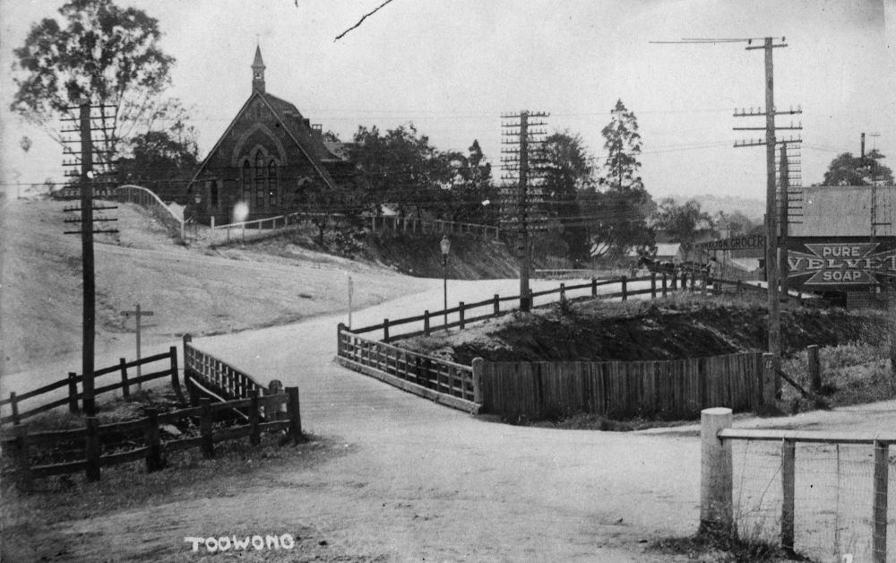

# Toowong Identities Heritage Walk 1 

**A Heritage Walk to commemorate the centenary of the Proclamation of the Town of Toowong in 1903.**

On 19 August 1903, the Shire of Toowong was proclaimed a town. At the time, the population numbered about 4700. The town grew rapidly, reaching 10,000 residents by 1922. Three years later the Toowong Town Council was absorbed into the Brisbane City Council.^1^ In August 2003, community celebrations were held to mark the centenary. 

This heritage walk was conceived as part of commemorative activities. It features only a small number of those former Toowong residents and associates who contributed in some way to Toowong’s social history. 

[{ width="40%" }](../assets/toowong-identities-1-map@2x.png)

???+ Example "Directions" 

    Commencing at the flagpole, walk behind the Amenities Block and cross Emma Miller Avenue. Head the path which separates Portions 9 and 13. In the second row to the right, behind the large white Petrie Family grave is the grey granite obelisk of...

## Andrew Lang Petrie <small>(13‑10)</small>

The first member of his family born in Australia in 1854, Andrew Lang Petrie relocated the family’s stonemason’s yard from the corner of Queen and Wharf Street to the Toowong Cemetery gates in 1882. The site is now occupied by Toowong Mitsubishi.

--8<-- "snippets/john-petrie-and-sons-advertisement.md"

??? Example "Directions" 

    Immediately behind the is the family grave of...

## George Harpur Jones <small>(13‑15‑7)</small>

George and family migrated from Croyde, Devon in 1880 and made their residence at Jonesville, Norwood St, Toowong. Formerly, George had been a sea captain, but supported his family by being a grave digger at Toowong Cemetery. He and his family were active members of the Brethren Church.

??? Example "Directions" 

    Proceed one section further up and to the left a few graves in is the ornate white marble monument of the...

## Munce Family <small>(9‑43‑11)</small>

Irishman William John Munce died at his Toowong home Caltura in 1892 aged 77. Caltura, believed to be located at 82 Jephson Street, was named after the Ceylonese birthplace of his wife, Elizabeth who died at Sandgate in 1901. One of their daughters, Ada Kate, never married and died at Cultura in 1944 aged 78.

??? Example "Directions" 

    Diagonally across the path on the right is the grave of ...

## Charles Patterson <small>(13‑30‑10)</small>

Charles Patterson was the first Mayor of the Shire of Toowong. Born in Aberdeen, Scotland, Charles arrived in Queensland in 1871. He was a member of the Toowong Council until 1925, elected Mayor numerous times in this period. He proposed the construction of the median strip in High Street, now locally known as ‘Patterson’s Folly’, as he envisaged a divided highway ultimately leading to Ipswich. His Bon Accord sawmill was one of the first industries in Toowong, opening on the site of the present Toowong Tower in 1881. The Patterson family lived at Kinellar, still standing on the corner of Sherwood Road and Little Maryvale Street. They were members of the Presbyterian Congregation. Charles died in January 1926.

{ width="100%" }

*<small>[High Street, Toowong, Brisbane, Queensland, ca. 1917](http://onesearch.slq.qld.gov.au/permalink/f/1upgmng/slq_alma21220078440002061) - State Library of Queensland </small>*

??? Example "Directions" 

    Continue straight up the path passing eight rows of graves until you come to, on the left, the obelisk marking the grave of ...

## Robert Cribb <small>(9‑37‑6)</small>

Robert came to the Colony of Queensland aboard the Fortitude in January 1849. He bought land in 1852 and built Lang Farm which stretched from the hilly part of Indooroopilly Road towards Jack Cook Park and down to the River. He cleared the pine trees and vines growing along Toowong Creek, growing oranges, cabbages, grapes, mulberries and olives. Land Farm was bought by Richard Gailey, who built his mansion Glen Olive on the riverbank. Robert was appointed to the first Toowong Shire Council in 1880. He died on 16 April 1893 aged 88.

??? Example "Directions" 

    Continuing left along the same row you will come to ...

## Henry Howard Payne <small>(9‑11‑15/16)</small>

Henry landed in Brisbane aboard the Waterloo on 7 January 1850. He farmed maize, lucerne and fruit on land stretching west from the Regatta Hotel. Henry was appointed to the first Toowong Shire Council in 1880. He died on 18 February 1903 aged 82.

??? Example "Directions" 

    Directly ahead of the Payne grave is ...

## John Melville <small>(9‑10‑4)</small>

John Melville, the first overseer, devoted most of his life to Toowong Cemetery. He was born in Hertfordshire in 1834 and in 1848 came to Queensland with his parents under the guidance of Dr John Dunmore Lang aboard the Fortitude. In 1851 when the gold diggings broke out in Victoria, Melville went, to try his luck but returned to Brisbane at Christmas 1854 to visit his family. He then met Augustus Gregory and was asked to join his Great Northern exploration party for the purpose of exploring the Victoria and Albert Rivers, an invitation which he accepted. 

After returning from the expedition Melville was engaged in survey work until 1871 when he acted as chainman to George Phillips, who had been engaged to survey part of the present cemetery at Toowong and in 1873 he was appointed overseer of the cemetery by the Trustees which position he held for 38 years. He was succeeded in his position by his son J. L. Melville. 

The Melvilles lived in a house, later demolished, on part of the cemetery reserve where the bus depot is now. John died aged 77 on 8 March 1912.

??? Example "Directions" 

    Return to the main path. Look across to the right towards the centre of portion 13.

## Henry and Hannah Sleath <small>(13‑43‑18)</small>

Henry was a musician and violin maker who established a music business in George Street in the City around 1866. The family lived in a residence above the shop. Nine children were born to Henry and Hannah there. Some time later, the family moved to Glen Road. Henry was elected to the Toowong Shire Council in February 1881. One of their sons, Alfred, carried on the business as H. Sleath and Son. Henry was buried on 22 March 1918. Sleath Street, near the Cemetery, off Frederick Street, was named after Henry.

??? Example "Directions" 

    Also in the centre of portion 13 is ...

## James Valentine <small>(13‑59‑16/17)</small>

James was elected to the Toowong Shire Council in 1885. He was described by contemporary J. B. Fewings as *“an intelligent and shrewd man of business”*. A street which runs off Milton Road is named after him. He died on 17 January 1904 aged 51.

??? Example "Directions" 

    Continuing up the path until you come to the small sandstone obelisk of ...

## Francis Drummond Grenville Stanley <small>(9‑32‑6)</small>

A noted colonial architect, F.D.G. Stanley designed many of Toowong’s grand houses, including Sidney House, demolished to make way for the ABC Studios, Ardencraig, which stood on Golding St and Easton Gray (1869) the residence of Sir Arthur Palmer. He also designed St Thomas Anglican Church on High Street, Toowong.

{ width="100%" }

*<small>[St. Thomas' Church Toowong, looking from Burns Road, Brisbane, Queensland, ca. 1917](http://onesearch.slq.qld.gov.au/permalink/f/1upgmng/slq_alma21220179080002061) - State Library of Queensland </small>*

??? Example "Directions" 

    Continuing up the hill until the path splits, turn left and a few graves down is the grave of...

## John Fewings <small>(9‑30‑22/23)</small>

Fewings’ memoirs Arcadian Simplicity, written in 1892, described life in Toowong from the 1860s. He lived at Karslake, on Sherwood Road, near Dovercourt. He was headmaster of the Petrie Terrace School for nearly 30 years before moving to the headship of the Fortitude Valley School, which he held until his retirement in 1903.

??? Example "Directions" 

    Cross straight across the path and head in two sections until you reach the sarcophagus‑style monument to...

## Thomas Finney <small>(13‑81‑6)</small>

The Finney family lived in Sidney House (on the site of the former ABC Studios in Toowong) from 1882, one of the grandest houses in Toowong, surrounded by gardens and an orchard. He is buried next to his business partner James Isles with whom he established Finney Isles & Co. in 1864.

{ width="100%" }

*<small>[Sidney House in Toowong, viewed from the street, March, 1890](http://onesearch.slq.qld.gov.au/permalink/f/1upgmng/slq_digitool127391) - State Library of Queensland </small>*

<!--
Sidney House, Toowong
Journal of the Royal Historical Society of Queensland volume 5 issue 2: pp. 942-946
Slaughter, Leslie E. (Leslie Edgar). Brisbane, Qld. Royal Historical Society of Queensland, 1954

assets/sidney-house-toowong.pdf

-->

??? Example "Directions" 

    Head straight up the hill until you reach cross‑mounted headstone of...

## Sir Arthur Palmer <small>(13‑88)</small>

Arthur arrived from Ireland in 1838 aged 19, spending his early years on properties in New England before moving to Queensland in 1861. Entering the Legislative Assembly in 1866, achieving Ministerial Positions in Lands, Works, Public Instruction becoming Colonial Secretary and Premier from 1870—1874. From 1881—1898 he was President of the Legislative Council. Palmer was a proprietor of the Brisbane Courier and a Trustee of the Queensland Museum. The Palmer family lived at Easton Gray on Stanley Terrace.

??? Example "Directions" 

    Pass the Blackall Monument until you reach, on the left, the wreath‑mounted obelisk of...

## William Richer <small>(11‑7‑28)</small>

William, a member of the Jireh Baptist Church, Fortitude Valley, was the first minister of the Toowong Baptist Church and was elected to the Toowong Shire Council in 1881. He designed and constructed the Baptist Church on the corner of Jephson Street and Sylvan Road and later became President of the Baptist Union.

Richer Street, on the North West boundary of Toowong Cemetery, is named after William Richer.

??? Example "Directions" 

    Cross the road and head down the slope until you come across the broken column marking the grave of ...

## Charles Siemon <small>(12‑21‑5)</small>

The Siemon family, which included six children, lived at Ravensfield on Coronation Drive and ran a dairy farm, grazing their cows on land near the Regatta Hotel until the 1930s. In 1904, the Charles bought [Milton House](https://apps.des.qld.gov.au/heritage-register/detail/?id=600253) which they subsequently sold to the Presbyterian Church. Charles owned extensive warehouses, factories and businesses in Brisbane and was a Toowong Town Councillor.

{ width="100%" }

*<small>[Ravensfield, home of the Siemon family, in River Road now Coronation Drive, Toowong, 1911](http://onesearch.slq.qld.gov.au/permalink/f/1upgmng/slq_alma21220239800002061) - State Library of Queensland </small>*

??? Example "Directions" 

    Head one section back towards the Blackall Monument and one section down the slope. The Watson Family headstone has been laid down. 

## Archibald Watson <small>(12‑13)</small>

Archibald was the Chairman of the Toowong Fire Brigade, which had built a fire station in Jephson Street in 1919. He was the last Mayor of Toowong in 1925 and went on to serve as an Alderman on the Brisbane City Council between 1926 and 1931. He was Deputy Mayor from 1926 to 1931 and was Lord Mayor from February to May 1931.

??? Example "Directions" 

    Head to the lower end of the section and follow the row of trees towards Frederick Street. Turn right into the row which contains the large, white, ornate monument of...

## Sir Robert and Jessie Philp <small>(14‑23‑10)</small>

Jessie Philp, née Campbell was buried here in 1890. She was a 34‑year‑old politician’s wife and mother of seven. Her youngest child was just two weeks old when Jessie, weakened from recent childbirth, succumbed to the scarlet fever for which she was nursing two older children. Apart from her children, she was survived by her husband Robert (the Member for Townsville) and her parents and siblings. 

The next two burials here were of infant grandchildren of Robert and Jessie. In 1916, Jessie Ruth Henderson (known as Ruth) died from an unknown illness at the age of two. Twelve months later, an unnamed stillborn Henderson baby was also buried here. 

In 1922, when Robert Philp – by then Sir Robert – died, he was buried beside Jessie, although he had married for a second time in 1898. He had a long and distinguished parliamentary career, including twice being Premier of Queensland. He was also a well‑known businessman and co‑founder of Burns, Philp and Company. He lived at Mallow in Kensington Terrace, Toowong – now the site of the Brisbane Boys’ College boarding houses and dining room. 

The last burial in this grave took place in 1962 when Robert and Jessie’s eldest daughter Isabella Mary (known as May) died. She was 83 and had never married, though she had been engaged to Campbell Cowley from another Toowong family. From the age of 11, when her mother died, May looked after her younger brothers and sisters and later their children and grandchildren. She had a great interest in education, and was a benefactor to institutions like the University as well as providing books and cultural experiences for her extended family. Country nieces stayed with “Aunty May” to attend high school in Brisbane. She lived at Mallow until her death, and left the home and remaining grounds to BBC.

??? Example "Directions" 

    Continue up the same row until you see on the right the sarcophagus of...

## Sir Augustus Charles Gregory <small>(14‑22‑14)</small>

The well‑known explorer Gregory became the first President of the Toowong Shire Council in 1881. With his brother, Francis, Augustus was attached to the survey department of Western Australia and later joined the Survey Department in Queensland rising to the position of Surveyor General in 1859.

??? Example "Directions" 

    Return to the main path which separates Portions 13 and 14 and head down the hill to the bottom. As you curve around to the right, in the front row of potion 13 is the grave of...

## Alfred Roberts <small>(13‑1‑2)</small>

Alfred was born in 1837 in Putney, London and arrived in Queensland in 1860. In 1872 he began a horse‑drawn omnibus line which operated between Eagle Street in the city and the present site of the Taringa Shopping Centre, where the Roberts’ home was. The fare to the city was one shilling or one shilling and sixpence return. Alfred would announce his arrival with a bugle call. The business was lost when the stables burned down about 1893. The Roberts family took up farming in Moggill.

## Acknowledgements

Sponsored by Judy Magub, Councillor for Toowong, 1994—2007

{ width="15%" }

## Sources 

1: Leggett, S. and Grant, R. (eds) Toowong: A community’s history, Toowong, West Toowong Community Association Inc., 2003

## Brochure

**[Download this walk](../assets/guides/toowong-identities-1.pdf)** - designed to be printed and folded in half to make an A5 brochure.

