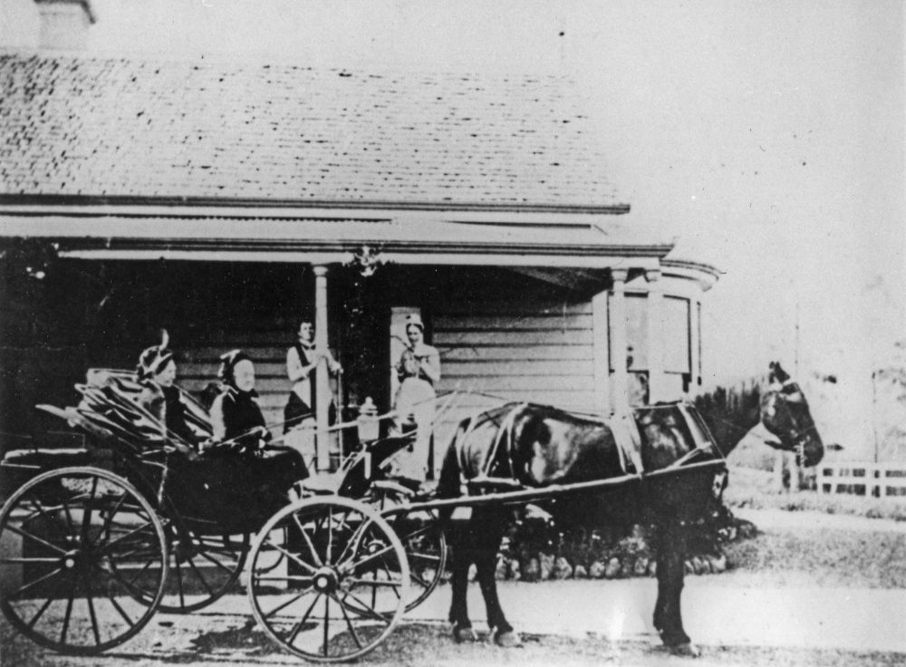
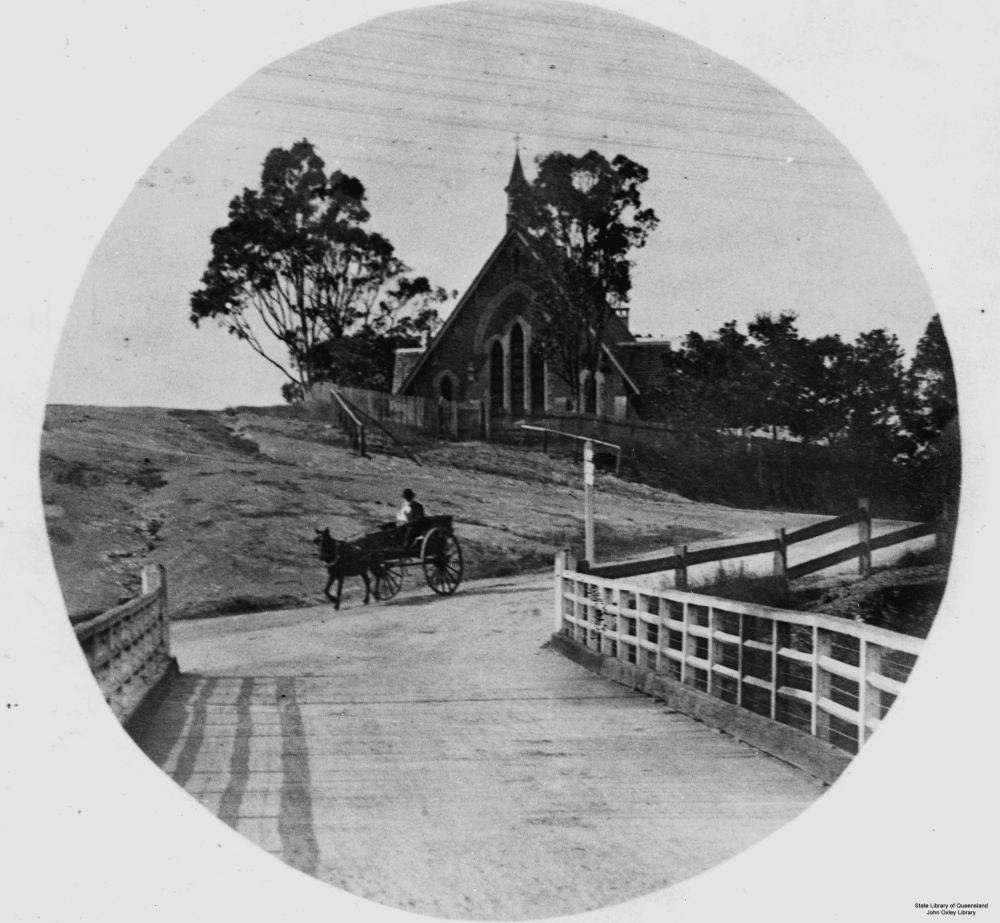
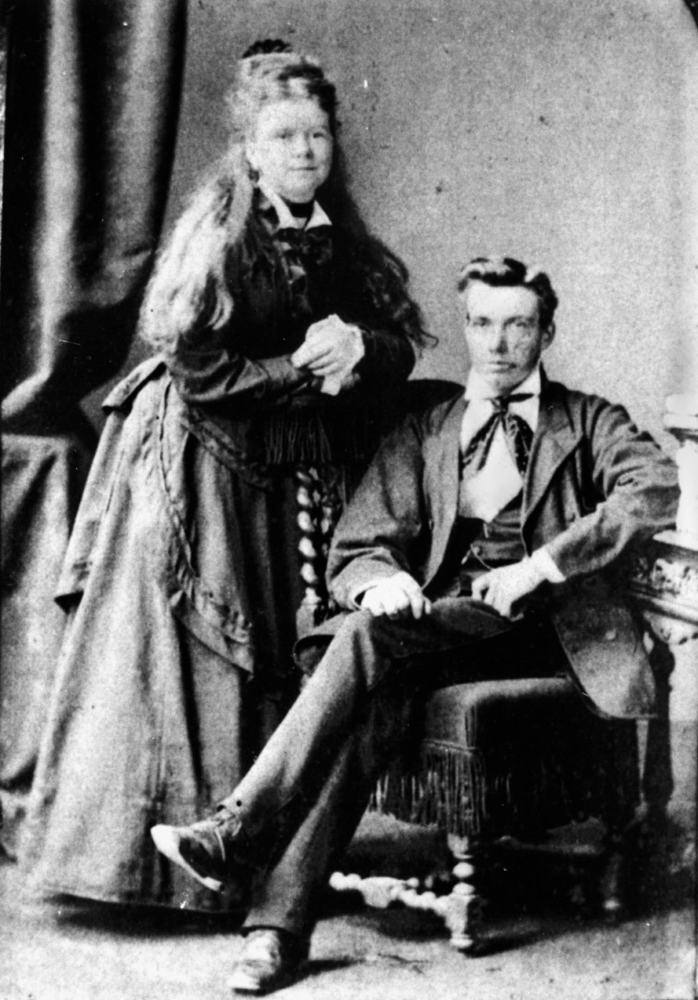
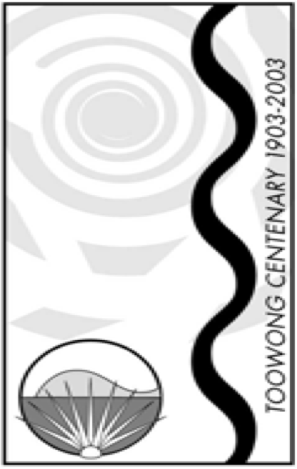

# Toowong Identities Two

**A Heritage Walk to commemorate the centenary of the Proclamation of the Town of Toowong in 1903.**

On 19 August 1903, the Shire of Toowong was proclaimed a town. At the time, the population numbered about 4700. The town grew rapidly, reaching 10,000 residents by 1922. Three years later the Toowong Town Council was absorbed into the Brisbane City Council.^1^ In August 2003, community celebrations were held to mark the centenary. 

This heritage walk was conceived as part of commemorative activities. It features only a small number of those former Toowong residents and associates who contributed in some way to Toowong’s social history. 

<!--
[{ width="40%" }](../assets/toowong-identities-2-map@2x.png)
-->

???+ directions "Directions"

    From the flag pole head to the rear of the ‘Temple of Peace’, near the front gate. Behind the temple is the Temple is the grave of...

## Edmund Curd <small>(4‑37‑14)</small>

Edmund was the first principal of the Toowong State School which opened in January 1880. He died in December 1922 aged 78.

??? directions "Directions" 

    Walk to the Caskey monument and turn left. You should come across the polished red granite grave of the McGregor‑Lowndes family...

## Victor and Jean McGregor‑Lowndes <small>(4‑16)</small>

Born in 1884, Victor was a Justice of the Peace and a Mason. He died at his home, *Craig‑Royston*, Toowong on 21 July 1951. His wife, Jean, was also a JP and a prominent citizen, honoured as a Member of the British Empire. Jean died in June 1976, aged 89.

??? directions "Directions" 

    Return to the road and walk along it until you reach a tap on the right hand side. Nearby are...

## Mary Elizabeth Weedon <!-- (4‑3‑20)--> and Annie Griffiths <small>(4‑3-2)</small>

Mary Weedon was the first head nurse of the Brisbane Hospital, holding the position for five years from 1885. She and her friend, Annie Griffiths, shared a house called *Garton* in Terrace Street, Toowong for many years. They were also members of the congregation of St Thomas Anglican Church. They died within eighteen months of each other; Mary in March 1942 and Annie in July 1943.

??? directions "Directions" 

    Immediately to the right is the grave of...

## William Busby <small>(4‑3‑22)</small>

William was a stonemason who had a workshop and house in Sylvan Road. He arrived from Oxford in 1882. He made many headstones at Toowong Cemetery including the Caskey Monument and continued working until his death in 1928.

??? directions "Directions" 

    Continue along the road until you come to the Jewish Section. All of these headstones face west. Three rows in is the grave of...

## Sali Mendelsohn <small>(3‑6‑7)</small>

In 1890, Sali published his most enduring ballad *The Drover* otherwise known as *[Brisbane Ladies](https://en.wikipedia.org/wiki/Brisbane_Ladies)* which features the line, *"Farewell and adieu to the girls of Toowong"*. The ballad is about the drovers returning west to their cattle stations having sold their at market. The route taken passed through Toowong on the way to Moggill Road.^2^

??? directions "Directions" 

    Continue along the road until you reach the shed. Turn left and proceed until you reach a fork in the road. Taking the right branch, 1^st^ Avenue, pass eight double rows of graves on the left until you come to...

## Harriet and William Johnson <small>(1‑37)</small>

The Johnsons lived in a house called *Castle Rawe*, Toowong. Harriet died in 1914, aged 63. Her husband, William, outlived her by twenty‑five years, dying aged 79.

??? directions "Directions" 

    Immediately behind the Johnson grave is the grey granite monument to...

## William Webster <small>(1‑36)</small>
<!-- perhaps 1-37-6? -->

A Scottish merchant, William died at his home *Arley*, Toowong, aged 66 in 1895. William purchased *Arley*, opposite the railway station after its previous owner, bank manager Alexander Archer, drowned in the *Quetta* shipwreck in 1890.

{ width="70%" }

*<small>[Horse and carriage outside the Archer family residence, Arley, Toowong, ca. 1882](http://onesearch.slq.qld.gov.au/permalink/f/1upgmng/slq_alma21220551310002061) - State Library of Queensland </small>*

??? directions "Directions" 

    Continue up 1^st^ Avenue until you reach a tap on the left. This is immediately adjacent to...

## Walter Horatio Wilson (1‑84‑22) and Walter Frederick Wilson (1‑85‑8)

W. H. Wilson was a member of the Queensland Legislative Council, Minister of Justice, Secretary of Public Instruction, and Postmaster‑General in a varied political career. He was a founding member of the Anglican Church in Toowong in 1866 and found time to be elected to the Toowong Shire Council in 1884. He was also a Companion of the Order of St Michael and St George. He died at his Toowong home, Sherwood Grove, in February 1902, aged 62. 

Walter F. Wilson, Master of Arts, was elected to the Toowong Shire Council in 1886. A member of the Lands Court, Walter F. Wilson died at his home, *[Dovercourt](https://heritage.brisbane.qld.gov.au/heritage-places/1709)*, which still stands, aged 48 in 1911.

??? directions "Directions" 

    Continue around 1^st^ Avenue until it intersects with 2^nd^ Avenue. Turn right and head along Second Avenue. Five Sections down is the Gothic style headstone of...

## Richard Langler Drew <small>(5‑43-22)</small>

Described by contemporary J. B. Fewings as *“the father of Toowong”*, Richard bought large blocks of land bordering Toowong Creek in 1861. He ascertained from the local Aborigines that Toowong was a suitable name for the area and posted the first sign as such. He and his wife Anne were founding members of the Anglican Church. In 1866, he donated part of his land in Curlew Street to build the first St Thomas Anglican Church.

{ width="50%" }

*<small>[View of Burns Road, Toowong, Brisbane at the intersection of High Street](http://onesearch.slq.qld.gov.au/permalink/f/1upgmng/slq_alma21220116110002061) ca 1910. The second St. Thomas' Anglican Church is in the background. It replaced an 1865 timber building on another site. - State Library of Queensland </small>*

## Hercules Smith <small>(5‑40‑9)</small>

Hercules was the second principal of the Toowong State School, a position he held for 27 years from January 1882 until retirement in March 1909.

{ width="40%" }

*<small>[Anne and Hercules Smith](http://onesearch.slq.qld.gov.au/permalink/f/1upgmng/slq_alma21218860780002061) - State Library of Queensland </small>*

??? directions "Directions" 

    Proceed down 2^nd^ Avenue until you come to a tap on the right. On the left, close to the road is the grave of ...

## Robert and Maria Johnstone <small>(5‑36‑15/16)</small>

Born in Tasmania in 1843, Robert was educated in Scotland before coming to Queensland in 1865 to work in the cattle industry. In 1868, he switched to sugar growing, managing plantations in the Cardwell region. Appointed sub‑inspector of native police in 1871, Robert’s patrols took him into unexplored areas. In 1873, he accompanied G. E. Dalrymple to explore the northern coastline to Cooktown. The Johnstone River is named after him.^3^ He married Maria who bore nine children. Robert’s police duties took him to Winton, Bundaberg, Maryborough and Beenleigh before settling at *Serenata*, Toowong. Robert died in January 1905, aged 63 and Maria died aged 76 in September 1923.

## Letitia Jephson <small>(5‑34‑17)</small>

Letitia was widowed and had lost two young sons while still in her early forties. She became a businesswoman managing boarding houses in the city and at Kangaroo Point. The Longreach Private Boarding House which she leased in 1879 was a highly sucessfully operation. Letitia bought *Cabury* on Kensington Terrace which she renamed *Mallow* after her birthplace in Ireland. In 1899 she sold Mallow to Sir Robert Philp. When Letitia died in 1908, she left a substantial estate including shares in banks and breweries. Church Street was renamed Jephson Street after her.

??? directions "Directions" 

    Close to the tap on the right side of the Avenue is the grave of Samuel Kaye. There is no headstone.

## Samuel Kaye <small>(2‑42‑26)</small>

[Kaye’s Rocks](https://heritage.brisbane.qld.gov.au/heritage-places/1693) at Toowong were named after Samuel. He was a government appointee to the Toowong Shire Council in 1880. A member of the Toowong Philharmonic Orchestra, Samuel operated a museum for musical instruments, importing pianos, organs and harmoniums. He taught music for many years from his home on the north side of the rocks which now bear his name.

??? directions "Directions" 

    Continue down 2^nd^ Avenue until just before you reach the end of portion 5 on the left. Close to the road is the grave of...

## Robert Harrison Smith <small>(5‑31‑10)</small>

Robert was the Member of the Legislative Council for Bowen. When he retired, he took up property in the South Toowong area, dying at *Mobolon* in 1911.

## Acknowledgements

Sponsored by Judy Magub, Councillor for Toowong, 1994—2007

{ width="15%" }

## Sources and Further Reading

1: Leggett, S. and Grant, R. (eds) Toowong: A community’s history, Toowong, West Toowong Community Association Inc., 2003

2: Ochert, M. “Sali Mendelsohn” Australian Jewish Historical Society Journal

3: Maclean, H. (ed.) [Extraordinary Lives of Ordinary People](../about/extraordinary-stories.md), Toowong, Friends of Toowong Cemetery Association Inc. 1999

## Brochure

**[Download this walk](../assets/guides/toowong-identities-2.pdf)** - designed to be printed and folded in half to make an A5 brochure.

