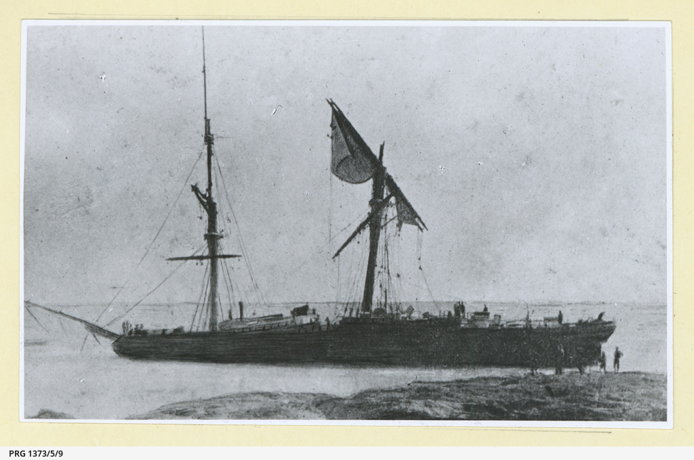

---
hide:
  - navigation
---

# At the mercy of the weather

{ width="70%" }  

*<small>[The 'Young Australia' wrecked at Moreton Island, Queensland](https://collections.slsa.sa.gov.au/resource/PRG+1373/5/9) — State Library of South Australia  - PRG 1373/5/9</small>*

<!--
[{ width="40%" }](../assets/toowong-identities-1-map-sml.jpg)

???+ directions "Directions" 

    Commencing at ...

--> 

--8<-- "snippets/no-spoilers.md"

--8<-- "snippets/robert-bulcock.md"

<!--
??? directions "Directions" 

    Proceed to...
-->

--8<-- "snippets/thomas-illidge.md"

<!--
??? directions "Directions" 

    Proceed to...
-->

--8<-- "snippets/joseph-bancroft.md"

<!--
??? directions "Directions" 

    Proceed to...
-->

--8<-- "snippets/james-brayden.md"

<!--
??? directions "Directions" 

    Proceed to...
-->

--8<-- "snippets/richard-henry-sholl.md"

<!--
??? directions "Directions" 

    Proceed to...
-->

--8<-- "snippets/daniel-rowntree-somerset.md"

<!--
??? directions "Directions" 

    Proceed to...
-->

--8<-- "snippets/james-clark.md"

<!--
??? directions "Directions" 

    Proceed to...
-->

--8<-- "snippets/charles-le-brocq.md"

<!--
??? directions "Directions" 

    Proceed to...
-->

--8<-- "snippets/edmund-macdonnell.md"

<!--
??? directions "Directions" 

    Proceed to...
-->

--8<-- "snippets/james-walker-cutten.md"

<!--
??? directions "Directions" 

    Proceed to...
-->

## Acknowledgements

Compiled and presented by Lyn Maddock

## Sources 

- Trove, Digitised Newspapers and More (2015) 
- ‘BDM Queensland Index Search’, The State of Queensland (Department of Justice and Attorney-General), 2015
- http://adb.anu.edu.au/biography/bancroft-thomas-lane-5120
- http://adb.anu.edu.au/biography/bancroft-joseph-2927
- http://deceptionbayheritage.com/dr-joseph-bancrofts-house-deception-bay/
- http://deceptionbayheritage.com/bancroft-exhibition-horticulture/
- https://blogs.archives.qld.gov.au/2016/04/12/shining-a-light-on-queenslands-lighthouses/
- https://environment.ehp.qld.gov.au/heritage-register/detail/?id=600257
- http://hardenup.org/umbraco/customContent/media/639_ButhurstBay_Cyclone_1899.pdf
- http://www.goldcoast.qld.gov.au/documents/bf/storms-east-coast-1770-2008.pdf
- http://jculibrarynews.blogspot.com.au/2012/12/special-collections-fossickings-16.html
- http://adb.anu.edu.au/biography/clark-james-5664
- https://www.neradatea.com.au/the-nerada-story
- https://www.weekendnotes.com/100-year-anniversary-of-innisfail-cyclone-innisfail-historical-society/
- http://blogs.slq.qld.gov.au/jol/2012/07/03/the-coffee-barons-of-bingil-bay-and-their-legacy-of-tea/

<!--

## Brochure

**[Download this walk](../assets/guides/at-the-mercy-of-the-weather.pdf)** - designed to be printed and folded in half to make an A5 brochure.

-->
